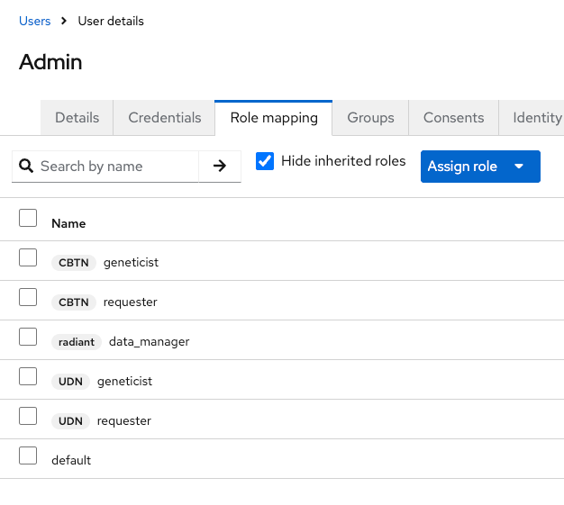

# Radiant Portal

[](https://opensource.org/license/apache-2-0)

Radiant Data Platform 

# Backend

## Getting Started

These instructions will get you a copy of the project up and running on your local machine for development and testing purposes.

### Install swag
Before using `make doc` command:

```
go get github.com/swaggo/swag/v2@v2.0.0-rc4
go install github.com/swaggo/swag/v2/cmd/swag@v2.0.0-rc4
```

### Install OpenFGA CLI

https://github.com/openfga/cli?tab=readme-ov-file#installation

### Create keycloak User

Realm settings are imported at start, still a user needs to be created manually in the UI `http://localhost:8080`.

Once created, assign the role `api` and a password in`credentials` tab.

## MakeFile

Install all dependencies
```bash
make install
```

Run build make command with tests
```bash
make all
```

Build the application
```bash
make build
```

Run the application
```bash
make run
```
Create DB container
```bash
make docker-run
```

Shutdown DB Container
```bash
make docker-down
```

DB Integrations Test:
```bash
make itest
```

Live reload the application:
```bash
make watch
```

Run the test suite:
```bash
make test
```

Generate OpenAPI v3.1 documentation:
```bash
make doc
```

Clean up binary from the last build:
```bash
make clean
```
# Frontend

## Generate the CLI

To install the CLI: https://github.com/OpenAPITools/openapi-generator?tab=readme-ov-file#1---installation    

(If the `openapi-generator-cli version` doesn't match the current version used by the repo, you can set it manually using `openapi-generator-cli version-manager set <version>`.)

```bash 
openapi-generator-cli generate -i ./backend/docs/swagger.yaml -g typescript-axios -o ./frontend/api
```

# Dev local

## Prerequisites

- Docker in recent version (28.1.1 for instance)
- Docker compose in recent version (v2.36.0 for instance)

## Run backend stack

```bash
docker compose up
```

## Creating a user in Keycloak with OpenFGA authorization

(Note: **This section applies only if you are running the API with OpenFGA enabled.**)

OpenFGA creates contextual tuples using the claims in a JWT token generate by Keycloak.
To make this work, you need to create a user in Keycloak and assign them roles that correspond to the OpenFGA model.

Test clients were created to simulate project scopes with specific roles for each.


The only difference is for the KeyCloak client specified in the `azp` claim of the JWT token (in this case `radiant` client).
It will be treated as the `application` level in the OpenFGA model.

In the example below, `radiant` is `application` scope (because it's client used to generate the JWT) and `CBTN` and `UDN` are `project` scopes.



## Run frontend

Then use this .env in front-end
```
export KEYCLOAK_REALM=CQDG;
export KEYCLOAK_HOST=http://localhost:8080;
export KEYCLOAK_CLIENT=radiant;
export KEYCLOAK_CLIENT_SECRET=ShutThisIsASecret!;
export SESSION_SECRET=secret_session;
export PORTAL_HOST=http://localhost:3000;
export API_HOST=http://localhost:8090;
export PORT=3000;
```

## Play 

Start the radiant portal and open your browser on http://localhost:3000

Click on Register to create a user, then you're all set