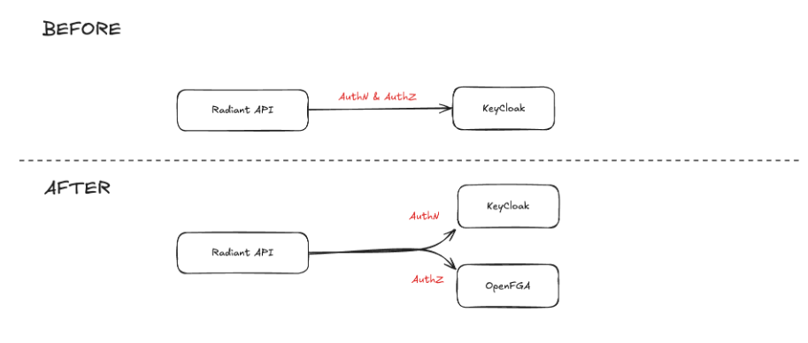
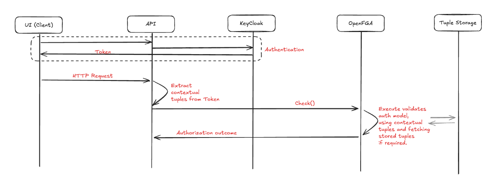

# SJRA-748: API Authorization with OpenFGA

## 1. Overview

This document defines how OpenFGA is to be integrated within the current Portal API stack. Meaning how it will interact with the Rest API itself and with KeyCloak (current Authentication mechanism).

---

## 2. Problem Statement

The problem statement was defined in the OpenFGA decision in https://github.com/radiant-network/architecture/blob/main/decisions/0008-openfga-authorization.md

The current document presents the implementation details.

---

## 3. Context and Background

- Currently, the Radiant API relies on KeyCloak for both AuthN and AuthZ
- The goal is to use OpenFGA for AuthZ (justification in the ADR linked above)



---

## 4. Proposed Design

Proposition: **Use OpenFGA's Hybrid approach (no need to data sync between KeyCloak and OpenFGA)**

This design is based on one of the common use cases highlighted by OpenFGA for contextual tuples: https://openfga.dev/docs/interacting/contextual-tuples#common-use-cases

(Recopied from the website)

> 1. When you want to avoid synchronizing data to OpenFGA. This is a powerful use case, as it allows using OpenFGA in a hybrid mode, with some data written to the database and other data obtained before making an authorization query. A good example is using user group memberships [from an identity token issued by an identity provider](https://openfga.dev/docs/modeling/token-claims-contextual-tuples). Note that while it's possible to provide all data using contextual tuples without storing any data, this approach wouldn't leverage the main benefit of the Zanzibar approach: avoiding the need to look up all data required for authorization decisions.

In this scenario, we have the following management for tuples:

- User related tuples are extracted from authentication tokens (identity, roles, etc...).
- Clinical related tuples (projects, cases, etc...) are stored in OpenFGA's database.
- Roles could still be managed through the KeyCloak UI, but permissions would be managed through OpenFGA modelling.



### 4.1 Sequence of operations for common use cases

#### 4.1.1 Calling an endpoint

1. Authentication using KeyCloak to generate an access token.
2. Access token to be decoded in the Radiant API and contextual tuples generated from the token claims in Golang code.
3. Using the contextual tuples, perform the OpenFGA `check` using the embedded OpenFGA model for that specific endpoint.

#### 4.1.2 Clinical data management

1. Performs 4.1.1 sequence.
2. When creating cases using the clinical data API, the same process will handle tuple creation to OpenFGA.

### 4.2 Extracting contextual tuples from token

Using the token claim, here's an example of the contextual tuples we can generate using the token claims:

```
{  
	user: 'user:254c0f3d-1c3f-4d4f-aaa3-793ba1260b10',  # Using `sub` claim
	relation: 'offline_access',   # Using `realm_access.roles` claim
	object: 'radiant:radiant'  # Using `resource_access` claim
}
```

From the currently used JWT structure:

```
{
  "exp": 1759891606,
  "iat": 1759862806,
  "jti": "e002a5be-6d72-4060-9be0-381090a014cc",
  "iss": "https://auth.qa.juno.cqdg.ferlab.bio/realms/CQDG",
  "aud": "account",
  "sub": "254c0f3d-1c3f-4d4f-aaa3-793ba1260b10",
  "typ": "Bearer",
  "azp": "radiant",
  "session_state": "0721351b-0f34-4852-a07e-9c74a09d85ce",
  "acr": "1",
  "allowed-origins": [
    "*"
  ],
  "realm_access": {
    "roles": [
      "offline_access",
      "uma_authorization",
      "default-roles-cqdg"
    ]
  },
  "resource_access": {
    "radiant": {
      "roles": [
        "radiant"
      ]
    },
    "account": {
      "roles": [
        "manage-account",
        "manage-account-links",
        "view-profile"
      ]
    }
  },
  "scope": "profile email",
  "sid": "0721351b-0f34-4852-a07e-9c74a09d85ce",
  "email_verified": true,
  "name": "User Name",
  "preferred_username": "email@test.com",
  "given_name": "User",
  "family_name": "Name",
  "email": "email@test.com"
}
```

---

## 5. Design Alternatives and Trade-offs
List alternative solutions considered and explain why the chosen approach was selected.

| **Option**                                                | **Pros**                                                                                                                   | **Cons**                                                                                                                                                                        | **Decision** |
| --------------------------------------------------------- | -------------------------------------------------------------------------------------------------------------------------- | ------------------------------------------------------------------------------------------------------------------------------------------------------------------------------- | ------------ |
| Option 1:<br>Hybrid approach                              | - Simple integration<br>- Allows user role management with KeyCloak UI<br>- KeyCloak updates are available instantaneously | - Potential for split-brain problem (conflicting information between KeyCloak & OpenFGA)<br>- More coupling between KeyCloak & API & OpenFGA to generate tuples.                | **Chosen**   |
| Option 2: <br>Event-driven OpenFGA <br>data consolidation | - Highly scalable<br>- Changes are propagated very quickly to KeyCloak<br>- Removes coupling between API & KeyCloak        | - Most complex setup (requires streaming infrastructure & event listener)<br>- No UI for user role management                                                                   | Rejected     |
| Option 3:<br>Periodic batch OpenFGA<br>data consolidation | - Highly scalable<br>- Removes coupling between API & KeyCloak                                                             | - Complex setup (requires scheduling for periodic batch consolidation)<br>- Introduces delay between role updates and authorization results<br>- No UI for user role management | Rejected     |


**Note**:
> It's implied that all the options listed above introduces coupling between OpenFGA and the API since there is currently no industry standard protocol (like Oauth2) for authorization.

---

## 6. Next step

The following changes will need to be implemented.

### 6.1 OpenFGA

- Implement infrastructure-as-code to deploy OpenFGA in the same environment as the Radiant API.
- Configure Radiant API's environment will OpenFGA connection config.

### 6.2 Radiant API

- Create the OpenFGA model & migration scripts (similar to clinical model)
- Implement contextual tuple building
- Implement authorization check for protected endpoints

### 6.3 Radiant Sandbox

- Add K8s deployment for OpenFGA

**Note**:
> Since the clinical data API doesn't exist, the list above doesn't cover the OpenFGA tuple management for clinical data (projects, cases, etc...).
> This will need to be addressed as well in the future.

---
## 7. References

- ADR 0008: https://github.com/radiant-network/architecture/blob/main/decisions/0008-openfga-authorization.md
- Contextual tuples: https://openfga.dev/docs/interacting/contextual-tuples
