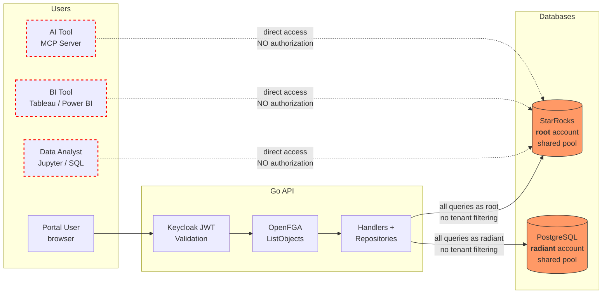
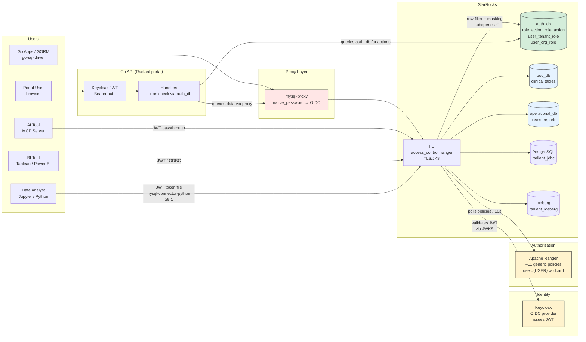
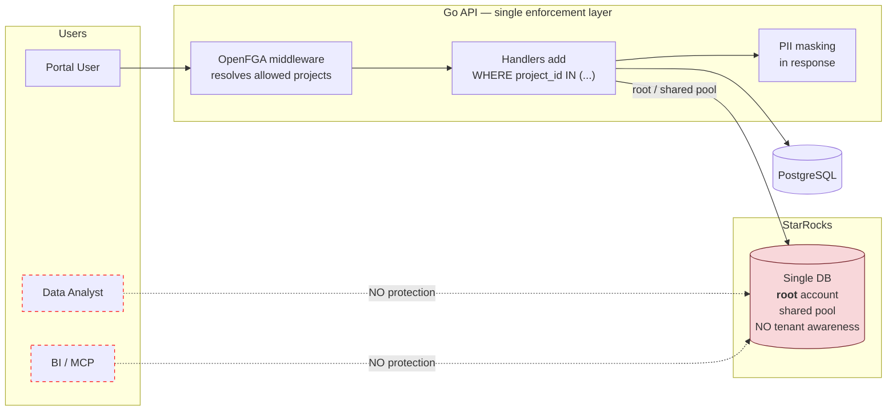
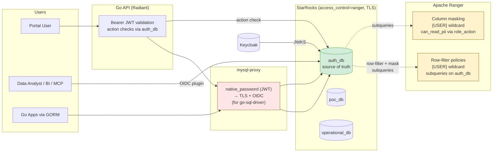
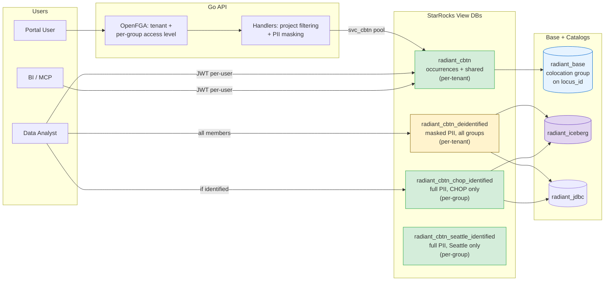
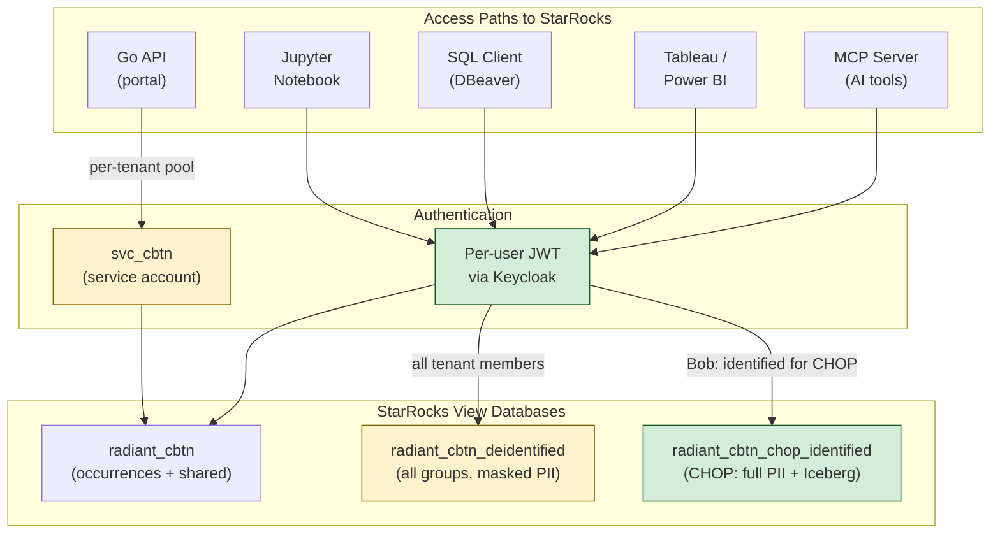
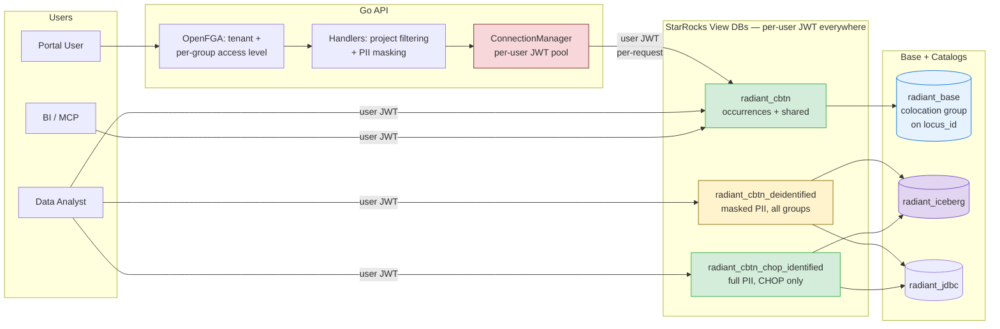
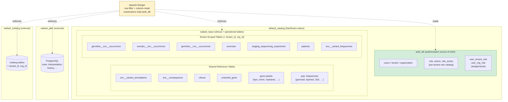
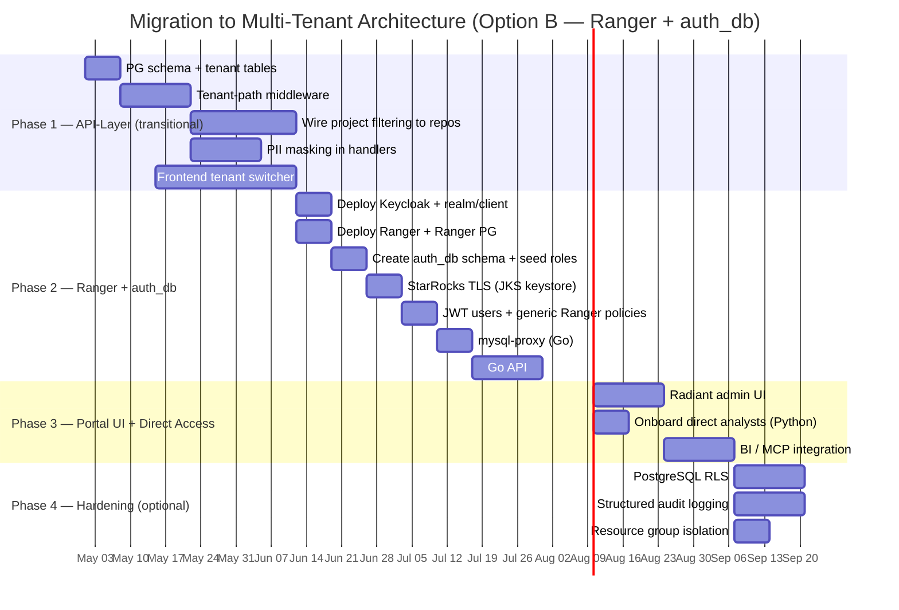
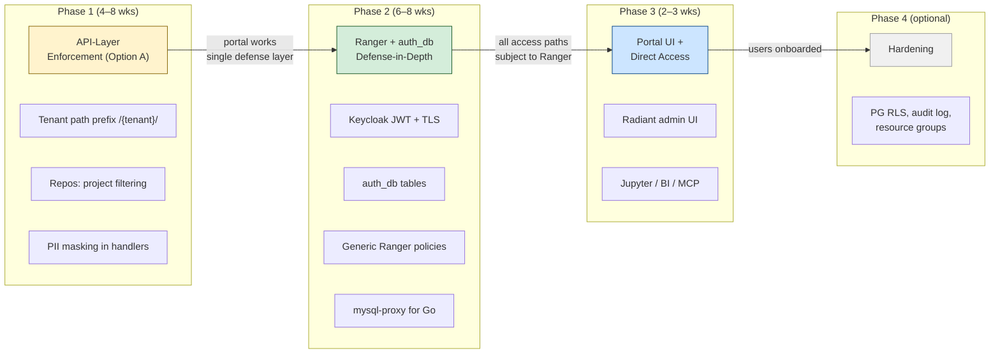

# ADR: Security & Multi-Tenancy Architecture for Radiant Portal

- **Status:** Proposed (revised after POC validation)
- **Date:** 2026-04-10 (original) / 2026-04-24 (revision)
- **Authors:** Architecture Team
- **Stakeholders:** Security reviewers, compliance officers, platform engineers
- **Revision note:** This document was revised after the POC at [`docs/adr/ranger-poc/`](./ranger-poc/README.md) validated key hypotheses. The recommendation has shifted from **Option C (views-based)** to **Option B variant (Ranger + `auth_db` tables)**. OpenFGA has been replaced by `auth_db` tables in StarRocks as the single source of truth for authorization. The role model has shifted from flat tiers (admin/member + identified/deidentified) to **domain roles** (geneticist, bioinformatician, ...) with explicit **actions** (`can_read_pii`, `can_create_case`, ...). See [POC validation summary](#poc-validation-summary) for what changed and why.

---

## Table of Contents

1. [Problem Statement](#1-problem-statement)
2. [Decision Drivers](#2-decision-drivers)
3. [Options Considered](#3-options-considered)
   - [Option A -- API-Layer-Only Enforcement](#option-a--api-layer-only-enforcement)
   - [Option B -- Ranger + `auth_db` (Recommended)](#option-b--full-push-down-ranger--per-user-connections--rlsmasking)
   - [Option C -- Views-Based with Per-Tenant Service Account Pools (Alternative)](#option-c--views-based-with-per-tenant-service-account-pools-recommended)
   - [Option D -- Views-Based with Per-User JWT Connections](#option-d--views-based-with-per-user-jwt-connections)
4. [Proposed Schema Organization](#4-proposed-schema-organization)
5. [Authorization Model (`auth_db`)](#5-authorization-model-auth_db)
6. [Recommendation](#6-recommendation)
7. [Migration Strategy](#7-migration-strategy)
8. [POC-validated details](#poc-validated-details)
   - [TLS requirement for OIDC](#tls-requirement-for-oidc)
   - [MySQL proxy for Go clients](#mysql-proxy-for-go-clients)
   - [REST API tenant routing — path prefix](#rest-api-tenant-routing--path-prefix)
   - [Admin tooling — Radiant portal](#admin-tooling--radiant-portal)
   - [Wildcard `*` for org_id](#wildcard--for-org_id)
   - [POC validation summary](#poc-validation-summary)

---

## 1. Problem Statement

Radiant Portal is a medical/genomic data platform serving clinical and research users. The current architecture has **no multi-tenancy** and relies on a **single layer of authorization** at the Go API level. This is insufficient for a platform handling sensitive health data across multiple organizations.

### Current Architecture



> **Red paths = unprotected.** Direct StarRocks access bypasses all authorization. The Go API is the only enforcement point, and even it does not filter by project (the `allowed` context key is computed but never consumed by repositories).

### Current State

| Aspect | Current Implementation | Risk |
|--------|----------------------|------|
| **StarRocks connection** | Single shared pool (`root` account, 100 max connections) via `backend/internal/database/starrocks.go` | All queries run as a single privileged user; no per-user audit trail in StarRocks |
| **PostgreSQL connection** | Single shared pool (`radiant` account, 100 max connections) via `backend/internal/database/postgres.go` | Same as above |
| **Authorization** | Keycloak RBAC or OpenFGA at Go middleware level (`backend/internal/authorization/`) | Single point of enforcement; a bug bypasses all protection |
| **Project-level filtering** | OpenFGA `ListObjects` computes allowed projects, stores in Gin context key `"allowed"` (`openfga.go:117`) -- **but no handler or repository ever reads this value** | Authorization is computed but not enforced at the data layer |
| **Row-level security** | None | Any authenticated user can potentially access any patient/case data |
| **Column masking** | None | No differentiation between identified and de-identified access |
| **Multi-tenancy** | None; single flat namespace | No data isolation between organizations |
| **Audit trail** | Request logging (ginglog) + PostgreSQL history tables for interpretations | No StarRocks query attribution to individual users |

### What Must Change

The platform must support 10--50 tenants (hospitals, research institutions, jurisdictions) sharing a single StarRocks cluster, with:

- **Strict tenant isolation** -- a user sees data from one tenant at a time, with no cross-tenant leakage
- **Group-level access within tenants** -- identified (full PII), de-identified (masked), or no access per group
- **Individual audit trails** -- who queried what, traceable to individual users
- **Defense-in-depth** -- authorization enforced at multiple layers, not just the API
- **Direct StarRocks access for analysts and tools** -- enforcement must work for all access paths, not just the Go API

### Direct StarRocks Access Requirement

**The Go API is not the only access path to StarRocks.** Users will also query StarRocks directly through:

| Access Path | Users | Use Case |
|-------------|-------|----------|
| **Jupyter notebooks** | Data analysts, bioinformaticians | Ad-hoc genomic analysis, cohort queries, statistical exploration |
| **SQL clients** (DBeaver, DataGrip, etc.) | Data analysts, DBAs | Direct SQL queries, data exploration, debugging |
| **BI tools** (Power BI, Tableau) | Analysts, managers, researchers | Dashboards, reports, visualizations |
| **AI tools / MCP servers** | AI agents, copilots | Automated data retrieval, natural language queries via Model Context Protocol |
| **Go API backend** | Portal users (via browser) | Standard portal usage (case browsing, variant interpretation, etc.) |

**This is a critical architectural constraint.** Any option that relies solely on the Go API layer for authorization leaves direct-access users completely unprotected. Tenant isolation, group-level access control, and PII masking must be enforced **at the StarRocks level** for these access paths -- the Go API cannot intercept or filter their queries.

**Implication for each option:**
- **Option A (API-only):** Direct access users bypass all authorization. This option cannot be the final state.
- **Options B, C, D:** StarRocks-level enforcement (DB RBAC, views, Ranger) protects all access paths equally, regardless of whether the query originates from the Go API, a Jupyter notebook, or a Tableau dashboard.

### Target Architecture (Recommended — Option B: Ranger + `auth_db`)



> **Single source of truth**: `auth_db` tables in StarRocks hold the authorization model (roles, actions, role-action mappings, user role assignments). **Ranger** applies ~11 generic policies (`"users": ["{USER}"]` wildcard) whose row-filter and masking expressions are subqueries against `auth_db`. **All access paths** (Go API, Jupyter, BI, MCP) hit the same Ranger-enforced rules. Go apps that can't speak the `authentication_openid_connect_client` plugin natively go through `mysql-proxy`, which translates cleartext JWT → TLS + OIDC.

---

## 2. Decision Drivers

### 2.1 Compliance (Critical)

Radiant Portal handles **protected health information (PHI)**. Applicable regulations include:

- **PIPEDA** (Canada) -- requires appropriate safeguards for personal health information, including access controls, audit trails, and data minimization
- **HIPAA-equivalent requirements** -- even outside the US, many partner institutions require HIPAA-aligned controls: minimum necessary access, access logging, breach notification
- **Research ethics board requirements** -- de-identified access for approved researchers, identified access only for treating clinicians

A compliance review will ask: *"If your application layer has a bug, what prevents cross-tenant data exposure?"* With the current architecture, the answer is: nothing.

### 2.2 Auditability

- Every data access must be traceable to an individual user
- Audit logs must be tamper-resistant (not modifiable by the application)
- Write operations on clinical data (interpretations, case assignments) already have PostgreSQL history tables; **read access to genomic data has no audit trail**

### 2.3 Operational Complexity

The team is mid-size. The chosen architecture must be:

- Operable without a dedicated security/infrastructure team
- Deployable on existing infrastructure (Kubernetes, Docker Compose)
- Maintainable as tenant count grows (no O(n) manual configuration per tenant)

### 2.4 Performance

- StarRocks OLAP queries on occurrence tables (germline SNV, somatic SNV, CNV) are the core user-facing workload
- Current connection pool (100 max, 10 idle) handles production load well
- Any per-request connection establishment adds 10--50ms latency (TCP + auth handshake)
- Partition pruning on the `part` column is critical for query performance on occurrence tables

### 2.5 Multiple Access Paths (Critical)

StarRocks will be accessed directly by data analysts (Jupyter, SQL clients), BI tools (Power BI, Tableau), and AI tools (MCP servers). These access paths bypass the Go API entirely. Authorization enforced only in the Go application layer provides **zero protection** for direct-access users.

This driver **eliminates Option A as a viable final state** and makes StarRocks-level enforcement (views, DB RBAC, or Ranger) a hard requirement. The architecture must ensure that a data analyst connecting via Jupyter sees exactly the same tenant-scoped, access-level-appropriate data as a portal user -- without relying on the Go API to filter it.

### 2.6 Developer Experience

- 61 repository files, 43 handler files -- scope of code changes matters
- The handler-to-repository pattern has **no service layer** -- handlers call repositories directly
- Repositories store `db *gorm.DB` as a struct field, set once at startup -- changing this to per-request injection is a significant refactor

---

## 3. Options Considered

### StarRocks 3.5 Capabilities & Constraints

These are hard constraints that apply across all options:

| Capability | StarRocks 3.5 Support | Implication |
|---|---|---|
| JWT authentication | Per-connection via Security Integration + JWKS | Requires abandoning shared pool for per-user identity |
| OAuth 2.0 / OIDC | Authorization Code flow supported | Can authenticate via Keycloak |
| Row-level security (RLS) | Not native -- **requires Apache Ranger** | No built-in row filtering; Ranger is the only path |
| Column masking | Not native -- **requires Apache Ranger** | No built-in column redaction |
| Column-level RBAC | Native since 3.2 (`GRANT SELECT (col) ON table TO user`) | Can restrict which columns a user/role can SELECT |
| OpenFGA integration | Not supported | Ranger is the only external authz option for StarRocks |
| Per-query JWT passthrough | Not supported -- JWT is per-connection only | Cannot change identity mid-connection |
| Catalog/DB-level privileges | Full support (`GRANT ... ON DATABASE/TABLE`) | Can isolate access by database |
| Views | Full support; optimizer pushes predicates through views | Views can enforce row filtering without Ranger |
| Resource group isolation | CPU/memory partitioning per resource group | Can prevent one tenant from starving others |
| Hierarchy | Catalog > Database > Table (no schema concept) | Cannot use PostgreSQL-style schemas within a database |
| **Colocation groups** | StarRocks 2.5.4+ supports colocation groups across **different databases** ([docs](https://docs.starrocks.io/docs/using_starrocks/Colocate_join/)). Tables must share the same `colocate_with` property, bucket count, replica count, and bucket-key types | Colocate JOINs (local, shuffle-free) require co-located tables; the legacy "same database" restriction no longer applies |
| Iceberg catalog support | Native read support via external catalog | Iceberg tables can be queried alongside native tables; JOINs use shuffle (not colocate) |

**Key implication -- colocation groups:** The current StarRocks schema uses colocation to enable colocate JOINs (local, shuffle-free) between tables distributed by `locus_id` -- e.g., `germline__snv__occurrence JOIN snv__variant JOIN snv__consequence JOIN clinvar`. Tables in a colocation group must share the same `colocate_with` property, bucket count, replica count, and bucket-key types. **As of StarRocks 2.5.4, colocation groups can span multiple databases**, so a single `radiant_base` is no longer a hard requirement — but it remains the simplest layout for these high-frequency joins. The recommended schema (Option B) places all base tables (tenant-scoped and shared reference data) in `radiant_base` for clarity; auth/admin metadata lives in `auth_db` and operational write-paths in `operational_db`, neither of which participates in the colocation group. Row-filter policies on individual tables do not affect colocation — the POC confirmed this.

**Key references:**
- [StarRocks Security Integration (JWT)](https://docs.starrocks.io/docs/administration/Authentication/#json-web-token-jwt-based-authentication)
- [StarRocks Column-Level Privileges](https://docs.starrocks.io/docs/administration/privilege_item/#column)
- [StarRocks Apache Ranger Integration](https://docs.starrocks.io/docs/administration/ranger_plugin/)
- [StarRocks Resource Groups](https://docs.starrocks.io/docs/administration/management/resource_management/resource_group/)
- [StarRocks Colocate Join](https://docs.starrocks.io/docs/using_starrocks/Colocate_join/)

---

### Option A -- API-Layer-Only Enforcement

**Summary:** All authorization stays in the Go backend. StarRocks and PostgreSQL remain unaware of users, tenants, or groups. The existing shared connection pool is unchanged.



#### Tenant Isolation Model

No database-level isolation. Tenant boundaries are enforced by adding `WHERE` clauses to every data query in the Go API layer.

The existing data model already has the scaffolding:
- `cases.project_id` references the `project` table (each project belongs to a tenant)
- `patient.organization_id` and `sample.organization_id` reference the `organization` table
- `staging_sequencing_experiment.case_id` links occurrences to cases (and transitively to projects)

The missing piece is a `tenant` table and a mapping from `project` to `tenant`. Once that exists, the Go middleware resolves the user's active tenant and allowed projects (via OpenFGA), and every repository method filters by `project_id IN (?)`.

**For StarRocks occurrence queries:** The path is `occurrence.seq_id` -> `staging_sequencing_experiment.seq_id` -> `staging_sequencing_experiment.case_id` -> `cases.project_id`. The API must either:
1. Pre-resolve the set of allowed `seq_id` values and pass them as a filter, or
2. Add a JOIN through `staging_sequencing_experiment` and `radiant_jdbc.public.cases` to enforce `project_id IN (?)` within the StarRocks query

Option (1) is more performant; option (2) is more robust (defense at query level rather than pre-validation).

#### Group / Identified vs De-identified Enforcement

**Entirely in the Go response serialization layer.** The database queries always return full data. The handler inspects the user's access level per group (from OpenFGA) and strips PII fields before serializing the JSON response.

PII fields in the current schema:
- `patient.first_name`
- `patient.last_name`
- `patient.jhn` (health card number)
- `patient.date_of_birth`
- `patient.submitter_patient_id`

A masking utility function in the handler layer would replace these with `"***"` or `null` for de-identified users.

**Risk:** PII transits the Go process in-memory even for de-identified users. If the Go process is compromised (memory dump, logging accident), full PII is exposed.

#### Connection Model

**No change.** Single shared `*gorm.DB` for StarRocks (MaxOpenConns=100, MaxIdleConns=10, ConnMaxLifetime=1h). Single shared `*gorm.DB` for PostgreSQL with identical settings.

**Performance:** Zero new overhead beyond the additional `WHERE` clause in queries. For indexed columns (`project_id`, `seq_id`), the cost is negligible.

#### OpenFGA Integration

The OpenFGA model is extended with `tenant` and `group` types (see [Section 5](#5-authorization-model-auth_db)). The authorizer middleware:
1. Validates the active tenant from the `X-Active-Tenant` header
2. Calls `ListObjects(user, relation, "group")` to find allowed groups within the tenant
3. Maps groups to `project_id` values
4. Stores the allowed project IDs in the Gin context
5. Handlers pass them to repository methods

**Critical implementation gap:** Today, `openfga.go` calls `c.Set(AllowedContextKey, allowed)` but no handler reads it. The first step for any option is wiring this through.

#### Audit Trail

| Layer | Attribution | Coverage |
|-------|------------|----------|
| Application log (Gin) | User ID from JWT | All HTTP requests |
| StarRocks audit log | `root` (system account) | All queries, but no user attribution |
| PostgreSQL history tables | `created_by`/`updated_by` from JWT | Write operations on interpretations only |

**Gap:** No per-user attribution for StarRocks read queries. Compliance teams must trust that the application log correctly correlates HTTP requests to StarRocks queries.

#### Operational Complexity

**Minimal.** No new infrastructure. No new services. Changes are confined to the Go codebase.

| Component | Change Required |
|-----------|----------------|
| StarRocks | None |
| PostgreSQL | Add `tenant` table + `tenant_has_project` mapping (migration) |
| Go API | Add project filtering to ~15-20 repository methods; add PII masking to ~5 handlers |
| OpenFGA | Update model with tenant/group types |
| Keycloak | Add tenant-related custom claims (optional) |
| Frontend | Add tenant switcher UI; send `X-Active-Tenant` header |

#### Direct StarRocks Access

**Option A cannot support direct access.** Data analysts connecting via Jupyter, SQL clients, Power BI, Tableau, or AI tools (MCP) would bypass the Go API entirely and have unrestricted access to all data in StarRocks through the shared `root` account. There is no mechanism to enforce tenant isolation, group-level filtering, or PII masking for these users.

**This is Option A's disqualifying weakness.** It can serve as a transitional Phase 1 (portal-only, no direct access), but it cannot be the final architecture if direct StarRocks access is a requirement.

#### Compliance Posture

| Criterion | Assessment |
|-----------|------------|
| Defense-in-depth | **Weak** -- single enforcement layer (Go API) |
| Principle of least privilege | **Violated** -- DB accounts have access to all data |
| Blast radius of a bug | **High** -- a missing `WHERE` clause exposes all tenants' data |
| Audit independence | **Weak** -- only application-level logs, no DB-level user attribution |
| Direct access support | **None** -- direct StarRocks users bypass all authorization |

#### Migration Path

1. Add `tenant` and `tenant_has_project` tables in PostgreSQL (migration)
2. Update OpenFGA model with tenant/group types
3. Add tenant resolution middleware (validate `X-Active-Tenant`, resolve allowed projects)
4. Wire `AllowedContextKey` through handlers to repositories (~15-20 methods)
5. Add PII masking utility, apply in relevant handlers
6. Frontend: tenant switcher UI + `X-Active-Tenant` header

**Estimated effort:** 4--8 weeks for a small team.

#### Portal-Specific Action Authorization

Non-query actions (interpret, upload, approve, assign, generate reports) are authorized via OpenFGA group-level permissions:

```
Check(user:bob, can_interpret, group:cbtn-chop) -> allow/deny
```

The handler validates:
1. Is the user authorized for this action on this group? (OpenFGA check)
2. Does the target resource (case, sequencing experiment) belong to an allowed project? (project_id check)
3. Write operations already capture `created_by`/`updated_by` from JWT in PostgreSQL

---

### Option B -- Ranger + `auth_db` (Recommended, POC-validated)

**Summary:** Deploy Apache Ranger to enforce row-filtering and column masking at the StarRocks level. **Authorization data (roles, actions, assignments) lives in StarRocks `auth_db` tables, not in Ranger or OpenFGA.** Ranger holds ~11 **generic** policies using the `{USER}` wildcard; the policy expressions are SQL subqueries against `auth_db`. Every access path — Go API, Jupyter, BI, MCP — is enforced identically. This is the POC-validated architecture ([`docs/adr/ranger-poc/`](./ranger-poc/README.md)).



> **Strongest enforcement + simplest data model**. The POC proved Option B is far cheaper than the original ADR feared: no user stubs in Ranger, no Ranger role management, ~11 generic policies total, no OpenFGA-to-Ranger sync daemon. `auth_db` is the single source of truth for authorization; Ranger's role reduces to a thin, static policy layer that delegates all lookups to SQL subqueries.

#### `auth_db`: Authorization as Data

A dedicated database in StarRocks holds the entire authorization model:

| Table | Purpose |
|-------|---------|
| `auth_db.tenant` | Tenant catalog (e.g. `cbtn`, `udn`) |
| `auth_db.organization` | Orgs within tenants (e.g. `chop`, `bch`, `nih-udn`) |
| `auth_db.users` | Identity registry |
| `auth_db.role(tenant_id, role_id, ...)` | **Per-tenant** role catalog (geneticist, bioinformatician, tenant_admin, ...) |
| `auth_db.action(action_id, ...)` | Global action catalog (can_read_pii, can_create_case, ...) |
| `auth_db.role_action(tenant_id, role_id, action_id)` | Role → action mapping (per tenant) |
| `auth_db.user_tenant_role(username, tenant_id, role_id)` | Tenant-scoped role assignments |
| `auth_db.user_org_role(username, tenant_id, org_id, role_id)` | Org-scoped role assignments; `org_id = '*'` means all orgs in tenant |

Granting a permission is a single `INSERT`; revoking is a single `DELETE`. No Ranger admin calls required, no sync lag. Ranger reads these tables via its subquery-based policy expressions on every query evaluation.

See [Section 5 (Authorization Model)](#5-authorization-model-auth_db) for the full schema, domain roles, and action catalog.

#### Tenant Isolation — Generic Row-Filter with `{USER}` Wildcard

A single row-filter policy per table. `{USER}` matches any authenticated StarRocks user — **no user stubs or Ranger roles needed**:

```json
{
  "policyType": 2,
  "name": "sr_rowfilter_patients",
  "service": "starrocks",
  "resources": {
    "catalog":  { "values": ["default_catalog"] },
    "database": { "values": ["poc_db"] },
    "table":    { "values": ["patients"] }
  },
  "rowFilterPolicyItems": [
    {
      "users": ["root"],
      "accesses": [{ "type": "select", "isAllowed": true }],
      "rowFilterInfo": { "filterExpr": "1=1" }
    },
    {
      "users": ["{USER}"],
      "accesses": [{ "type": "select", "isAllowed": true }],
      "rowFilterInfo": {
        "filterExpr": "tenant_id IN (SELECT utr.tenant_id FROM auth_db.user_tenant_role utr WHERE utr.username = replace(substring_index(current_user(), '@', 1), char(39), '') UNION SELECT uor.tenant_id FROM auth_db.user_org_role uor WHERE uor.username = replace(substring_index(current_user(), '@', 1), char(39), ''))"
      }
    }
  ]
}
```

Key properties:
- **One policy per table**, not per user. Adding users has zero impact on Ranger config.
- **`root` exemption** so admin/service accounts bypass the filter.
- **`current_user()` cleanup**: StarRocks returns `'username'@'%'`; the expression `replace(substring_index(current_user(), '@', 1), char(39), '')` strips quotes and host.
- Having any org role implies tenant membership (the `UNION` over `user_org_role.tenant_id`), so users with only `user_org_role(*, cbtn, chop, geneticist)` and no tenant role still see CBTN rows.

#### PII Masking — Action-Driven, Not Role-Tier-Driven

Rather than two tiers (identified/deidentified groups), PII access is controlled by an explicit **action** `can_read_pii` mapped to roles in `auth_db.role_action`. A user who holds any role with `can_read_pii` at an org sees that org's PHI unmasked; otherwise it is masked.

PHI columns (`mrn`, `first_name`, `date_of_birth`) use a CUSTOM mask expression that checks, via subquery, whether the user has `can_read_pii` at the row's `org_id`. The expression handles both specific-org assignments and the `*` wildcard (all orgs in tenant) via `UNION`:

```sql
CASE WHEN org_id IN (
  -- specific-org assignments with can_read_pii
  SELECT uor.org_id FROM auth_db.user_org_role uor
  JOIN auth_db.role_action ra
    ON ra.tenant_id = uor.tenant_id AND ra.role_id = uor.role_id
  WHERE uor.username = <current_user>
    AND ra.action_id = 'can_read_pii'
    AND uor.org_id != '*'
  UNION
  -- wildcard assignments expanded to all orgs in tenant
  SELECT o.org_id FROM auth_db.organization o
  JOIN auth_db.user_org_role uor
    ON uor.tenant_id = o.tenant_id AND uor.org_id = '*'
  JOIN auth_db.role_action ra
    ON ra.tenant_id = uor.tenant_id AND ra.role_id = uor.role_id
  WHERE uor.username = <current_user>
    AND ra.action_id = 'can_read_pii'
) THEN {col} ELSE '***' END
```

Tenant roles (`tenant_owner`, `tenant_admin`, `researcher`) **never** grant `can_read_pii` — PII access is strictly org-scoped. A tenant owner who manages the tenant but has no org-level role sees PHI masked.

Use `IN (SELECT ...)` rather than `EXISTS (SELECT ...)` in the mask expression. The POC found that correlated `EXISTS` subqueries with references like `uor.org_id = org_id` resolve to the inner table (self-reference) and silently degenerate to "exists any row", producing a security bug. `IN` avoids the ambiguity.

**Caveat (unchanged from original ADR):** Ranger's ability to apply column masking on JDBC external catalog tables is not fully documented. For PostgreSQL-sourced data reaching StarRocks through JDBC, either (a) materialize into a native StarRocks table and apply masking there, or (b) mask at the API layer as a fallback.

#### Connection Model & Access Paths

- **Go API (Radiant portal):** Bearer JWT end-to-end. The JWT is forwarded through `mysql-proxy` to StarRocks, which validates it against Keycloak's JWKS. Every query runs as the authenticated user — Ranger sees `{USER}` = `alice`/`bob`/... — producing per-user audit attribution without a GORM refactor (no per-request DB instance needed; the proxy fans out to a per-JWT backend connection).
- **Python analysts:** `mysql-connector-python ≥ 9.1.0` supports the `authentication_openid_connect_client` plugin natively.
- **BI tools:** JDBC/ODBC connection with JWT as password, or a gateway if the tool lacks OIDC support.
- **MCP servers / AI tools:** forward the user's JWT to StarRocks; queries are attributed to the user.
- **Go clients using `go-sql-driver/mysql`:** cannot speak the OIDC plugin; they go through `mysql-proxy` which translates `mysql_clear_password` (JWT as cleartext password) to TLS + OIDC. See [MySQL proxy for Go clients](#mysql-proxy-for-go-clients).
- **StarRocks must have TLS enabled** — the OIDC client plugin refuses to transmit the JWT over a cleartext channel. See [TLS requirement for OIDC](#tls-requirement-for-oidc).

**Policy evaluation overhead:** The StarRocks Ranger plugin caches policies locally (poll interval default 10s), so Ranger evaluation does not add a network round-trip per query. The only per-query cost is the subquery against `auth_db` tables (small, primary-key lookups — typically <5 ms).

#### No OpenFGA Sync — `auth_db` is the Single Source of Truth

The original ADR treated a Ranger-based design as requiring an OpenFGA-to-Ranger sync daemon (and warned about sync lag). **The POC eliminates that by dropping OpenFGA entirely.** `auth_db` lives in StarRocks; Ranger policies are subqueries against it; nothing to sync. Permissions take effect on the next policy-cache poll (default 10s) with no custom infrastructure.

| Concern | Engine |
|---------|--------|
| StarRocks data access (row-filter, column masking) | Apache Ranger (expressions → `auth_db` subqueries) |
| Portal actions (interpret, upload, approve, invite) | Go API (action check via `auth_db.role_action`) |
| Tenant/org/role membership | `auth_db` (single source of truth) |

Both authorization layers read the same source data. Portal "can Alice interpret a variant at CHOP?" and StarRocks "should this row be visible?" resolve to the same `role_action` table — no cross-system inconsistency possible.

#### Audit Trail

| Layer | Attribution | Coverage |
|-------|------------|----------|
| Application log | User from JWT | All HTTP requests to Go API |
| StarRocks audit log | Individual user (every access path) | All queries — portal, Jupyter, BI, MCP |
| Ranger audit log | Individual user + policy applied | All access decisions, including denials |
| PostgreSQL history tables | `created_by` / `updated_by` | Portal write operations |

**Per-user attribution in StarRocks** is available for every access path because every query runs under the user's JWT-authenticated identity. The portal's Bearer JWT is forwarded to StarRocks via the proxy, so portal queries are attributed to `alice` (not to a shared `svc_cbtn` pool account). Ranger audit logs additionally record which policy made the decision, supporting compliance reviews.

#### Direct StarRocks Access

Ranger policies enforce row-filter and column masking regardless of query origin. Every access path is equally protected:

- **Data analysts (Jupyter / DBeaver):** JWT-authenticated connection; subject to `{USER}` row-filter and masking policies.
- **BI tools (Tableau / Power BI):** JWT-authenticated (native OIDC where supported, or via gateway). Dashboards reflect only authorized data without BI-layer configuration.
- **AI tools (MCP):** JWT passthrough from the user's session; the AI agent cannot see data the user is not authorized for.

#### Operational Complexity

| Component | Change Required | Ongoing Burden |
|-----------|----------------|----------------|
| Apache Ranger | Deploy Ranger + Ranger PG | Version upgrades; policies are static (not per user) |
| StarRocks Ranger plugin | Bundled in StarRocks 3.5; enable `access_control = ranger` | None |
| StarRocks | JWT users (`authentication_jwt`), TLS keystore, Ranger service registration | Per-tenant DDL for new tenants (one-time) |
| `auth_db` | Create schema, seed domain roles/actions | Admin UI (Radiant portal) handles all CRUD |
| Keycloak | Realm + client + users | Identity provider standard ops |
| mysql-proxy | Small Go binary (~400 LOC) | Single process; deploy alongside StarRocks |

The original ADR rated this option as "operationally very heavy" — assuming full Ranger policy authoring plus an OpenFGA→Ranger sync daemon. The POC's actual footprint is:
- **~11 static Ranger policies** (not one per user/tenant)
- **No sync daemon** — `auth_db` is the source of truth
- **Admin UI replaces manual Ranger administration** for day-to-day ops

The Java stack (Ranger + Ranger PG) remains a new infrastructure dependency. For teams without Java operations expertise this is a one-time learning cost, not a day-to-day burden.

#### Compliance Posture

| Criterion | Assessment |
|-----------|------------|
| Defense-in-depth | **Strong** — Ranger enforcement is independent of API code |
| Principle of least privilege | **Fully satisfied** — row-filter + column masking per user |
| Blast radius of a bug | **Minimal** — API bugs cannot grant extra data; Ranger is the authoritative gate |
| Audit independence | **Best** — StarRocks audit log + Ranger audit log, per-user across all paths |
| Direct access support | **Full** — analysts, BI, MCP all subject to the same policies as the portal |

#### Migration Path (POC-validated)

1. Deploy Keycloak (realm, client with OIDC + audience mapper) — **1–2 weeks**
2. Deploy Ranger (Ranger Admin + Ranger PG) — **1–2 weeks**
3. Create `auth_db` schema; seed domain roles and actions; migrate existing users into `auth_db` — **1–2 weeks**
4. Generate StarRocks TLS keystore (JKS); enable `ssl_keystore_location` in `fe.conf` — **<1 week**
5. Create StarRocks users with `authentication_jwt`; register Ranger service; apply generic policies; enable `access_control = ranger` — **1 week**
6. Build and deploy `mysql-proxy` for Go API + `go-sql-driver` clients — **1–2 weeks**
7. Update Go API: action checks via `auth_db`; Bearer JWT forwarded to StarRocks via proxy — **1–2 weeks**
8. Radiant admin UI (tenant switcher, role CRUD, user assignments) — **1–2 weeks**

Total: ~**8–12 weeks** with one or two engineers, incrementally shippable per phase.

#### Portal-Specific Action Authorization

Unlike the original ADR's framing (Ranger doesn't cover portal actions → OpenFGA needed), portal actions are governed by the **same** `auth_db` source of truth. The Go API evaluates action permissions by running the equivalent subquery against `auth_db.role_action` (same query shape Ranger uses). No sync, no dual systems:

```go
// Pseudo-code: handler checks can_create_case at the target org
hasAction := authDB.QueryRow(`
  SELECT 1 FROM user_org_role uor
  JOIN role_action ra ON ra.tenant_id=uor.tenant_id AND ra.role_id=uor.role_id
  WHERE uor.username = ? AND uor.tenant_id = ? AND (uor.org_id = ? OR uor.org_id = '*')
    AND ra.action_id = 'can_create_case'
  LIMIT 1
`, user, tenant, org)
```

---

### Option C -- Views-Based with Per-Tenant Service Account Pools (Alternative)

> **Status:** Alternative to the recommended Option B. Considered in the original ADR, preserved here for reference. **Not validated by the POC.** Several risks listed below (view predicate pushdown, colocation preservation through pass-through views, per-group identified database proliferation at scale) remain open. Choose Option C only if a Java dependency (Apache Ranger) is unacceptable in the operational environment.

**Summary:** Use StarRocks views as the tenant isolation layer. Base tables live in a shared database with a `tenant_id` column. Per-tenant view databases expose only that tenant's data. Identified/de-identified view databases enforce PII masking at the StarRocks level for direct-access users. A hybrid connection model uses per-tenant service account pools for the Go API and per-user JWT connections for direct access (Jupyter, BI tools, MCP). API-layer enforcement handles within-tenant project filtering for portal users.



> **Alternative to Option B.** Preserves colocation (single `radiant_base`), supports all access paths, per-group identified control, no Ranger. Hybrid connection model: per-tenant pools for the API, per-user JWT for direct access. Not POC-validated; see the note at the top of this option for outstanding risks.

#### Tenant Isolation Model

**Single base database + per-tenant view databases in StarRocks:**

A historical constraint frequently cited is that "colocation groups must be in the same database". This was true in older StarRocks/Doris versions but **was lifted in StarRocks 2.5.4** ([Colocate Join docs](https://docs.starrocks.io/docs/using_starrocks/Colocate_join/)): tables in different databases can share a colocation group as long as they declare the same `colocate_with` property, bucket count, replica count, and bucket-key types. Even so, keeping the high-frequency joined tables (`germline__snv__occurrence JOIN snv__variant JOIN snv__consequence JOIN clinvar`) in a single `radiant_base` is the simplest layout and avoids cross-database management overhead.

Therefore, **all base tables -- both tenant-scoped and shared reference data -- live in a single `radiant_base` database** with a common colocation group. Per-tenant view databases provide isolation by exposing filtered subsets.

```
default_catalog/
  radiant_base/                         -- ALL base tables in one DB (simplest colocation layout)
    # Tenant-scoped tables (have tenant_id column)
    germline__snv__occurrence           -- + tenant_id INT NOT NULL
    somatic__snv__occurrence            -- + tenant_id INT NOT NULL
    germline__cnv__occurrence           -- + tenant_id INT NOT NULL
    exomiser                            -- + tenant_id INT NOT NULL
    snv__consequence_filter_partitioned -- + tenant_id INT NOT NULL
    staging_sequencing_experiment       -- + tenant_id INT NOT NULL
    snv__variant_frequencies            -- Per-tenant frequency aggregates

    # Shared reference/annotation tables (no tenant_id, same data for all tenants)
    snv__variant_annotations            -- Variant identity + external annotations
    snv__consequence                    -- Consequence annotations
    clinvar, clinvar_rcv_summary        -- ClinVar data
    gnomad_genomes_v3, topmed_bravo, 1000_genomes  -- Population frequencies
    ensembl_gene, ensembl_exon_by_gene  -- Gene annotations
    cytoband                            -- Cytogenetic bands
    hpo_term, mondo_term                -- Ontology terms
    hpo_gene_panel, omim_gene_panel, orphanet_gene_panel,
    ddd_gene_panel, cosmic_gene_panel   -- Gene panels

  radiant_cbtn/                         -- Per-tenant VIEW database (tenant_id = 1)
    germline__snv__occurrence           -- VIEW: WHERE tenant_id = 1
    somatic__snv__occurrence            -- VIEW: WHERE tenant_id = 1
    germline__cnv__occurrence           -- VIEW: WHERE tenant_id = 1
    exomiser                            -- VIEW: WHERE tenant_id = 1
    snv__consequence_filter_partitioned -- VIEW: WHERE tenant_id = 1
    staging_sequencing_experiment       -- VIEW: WHERE tenant_id = 1
    snv__variant_frequencies            -- VIEW: WHERE tenant_id = 1
    # Shared tables are exposed as pass-through views (no tenant filter)
    snv__variant_annotations            -- VIEW: SELECT * FROM radiant_base.snv__variant_annotations
    snv__consequence                    -- VIEW: SELECT * FROM radiant_base.snv__consequence
    clinvar                             -- VIEW: pass-through
    # ... (all shared reference tables)

  # Per-TENANT de-identified database (masked PII for all groups)
  radiant_cbtn_deidentified/            -- Masked PII clinical + Iceberg views (all CBTN groups)

  # Per-GROUP identified databases (full PII, one per group)
  radiant_cbtn_chop_identified/         -- Full PII clinical + Iceberg for CHOP only
  radiant_cbtn_seattle_identified/      -- Full PII clinical + Iceberg for Seattle only

  radiant_udp/                          -- Per-tenant VIEW database (tenant_id = 2)
    (same occurrence + shared view pattern)
  radiant_udp_deidentified/             -- Masked PII for all UDP groups
  radiant_udp_rare_disease_identified/  -- Full PII for Rare Disease group
  radiant_udp_epilepsy_identified/      -- Full PII for Epilepsy group

radiant_jdbc/                           -- JDBC catalog to PostgreSQL (unchanged)
  public/
    patient, cases, sample, sequencing_experiment, ...

radiant_iceberg/                        -- Iceberg catalog (may contain identified data)
  radiant_data/
    genomic_files, analysis_results, ...
```

**Why all base tables in one database:** Tables in `radiant_base` share a colocation group distributed by `HASH(locus_id)` with matching bucket counts. This enables colocate JOINs between `germline__snv__occurrence`, `snv__variant_annotations`, `snv__consequence`, and `clinvar` -- the most frequent and performance-critical query pattern. If these tables were in separate databases, every such JOIN would require a network shuffle.

**Why per-tenant views include pass-through views for shared tables:** This ensures that direct-access users (Jupyter, BI tools) can write natural JOINs within a single database context:
```sql
-- From a data analyst's perspective, everything is in radiant_cbtn
USE radiant_cbtn;
SELECT g.locus_id, g.zygosity, v.hgvsg, c.clinvar_interpretation
FROM germline__snv__occurrence g
JOIN snv__variant_annotations v ON v.locus_id = g.locus_id
JOIN clinvar c ON c.locus_id = g.locus_id;
-- No cross-database references needed in user SQL
```

The query planner sees through the views to the base tables in `radiant_base`, which are all colocated. The colocate JOIN optimization applies.

**View definitions:**

```sql
-- In radiant_cbtn database

-- Tenant-scoped views (filter by tenant_id, hide tenant_id column)
CREATE VIEW germline__snv__occurrence AS
SELECT part, seq_id, task_id, locus_id,
       quality, filter, ad_ratio, gq, dp, ad_total, ad_ref, ad_alt,
       zygosity, calls, phased,
       transmission_mode, parental_origin,
       father_dp, father_gq, father_ad_ref, father_ad_alt,
       mother_dp, mother_gq, mother_ad_ref, mother_ad_alt,
       exomiser_moi, exomiser_acmg_classification, exomiser_variant_score,
       exomiser_gene_combined_score
       -- tenant_id is NOT projected (invisible to queries)
FROM radiant_base.germline__snv__occurrence
WHERE tenant_id = 1;

CREATE VIEW staging_sequencing_experiment AS
SELECT case_id, seq_id, task_id, task_type, part, analysis_type,
       aliquot, patient_id, experimental_strategy, sex, family_id,
       family_role, affected_status, created_at, updated_at
FROM radiant_base.staging_sequencing_experiment
WHERE tenant_id = 1;

-- Pass-through views for shared reference tables (no tenant filter)
-- These enable natural JOINs within the tenant DB context
-- and preserve colocate JOIN optimization (planner sees through to base tables)
CREATE VIEW snv__variant_annotations AS
SELECT * FROM radiant_base.snv__variant_annotations;

CREATE VIEW snv__consequence AS
SELECT * FROM radiant_base.snv__consequence;

CREATE VIEW clinvar AS
SELECT * FROM radiant_base.clinvar;

-- ... (similar pass-through views for all shared reference tables)
```

**StarRocks RBAC for tenant isolation:**

```sql
-- Service account for Go API (CBTN) -- used by the portal, not by direct-access users
CREATE USER 'svc_cbtn' IDENTIFIED BY 'secure_password_cbtn';
CREATE ROLE role_cbtn_api;
GRANT SELECT ON DATABASE radiant_cbtn TO ROLE role_cbtn_api;
GRANT SELECT ON ALL TABLES IN DATABASE radiant_jdbc.public TO ROLE role_cbtn_api;
GRANT SELECT ON ALL TABLES IN ALL DATABASES IN CATALOG radiant_iceberg TO ROLE role_cbtn_api;
-- NO grant on radiant_base, radiant_udp, or per-group clinical DBs
-- API-layer handles per-group PII masking for portal users
GRANT role_cbtn_api TO 'svc_cbtn';

-- Tenant-level de-identified role (any CBTN member gets this)
CREATE ROLE role_cbtn_deidentified;
GRANT SELECT ON DATABASE radiant_cbtn TO ROLE role_cbtn_deidentified;
GRANT SELECT ON DATABASE radiant_cbtn_deidentified TO ROLE role_cbtn_deidentified;

-- Per-group identified roles (only for users with identified access to that group)
CREATE ROLE role_cbtn_chop_identified;
GRANT SELECT ON DATABASE radiant_cbtn TO ROLE role_cbtn_chop_identified;
GRANT SELECT ON DATABASE radiant_cbtn_chop_identified TO ROLE role_cbtn_chop_identified;

CREATE ROLE role_cbtn_seattle_identified;
GRANT SELECT ON DATABASE radiant_cbtn TO ROLE role_cbtn_seattle_identified;
GRANT SELECT ON DATABASE radiant_cbtn_seattle_identified TO ROLE role_cbtn_seattle_identified;

-- Direct-access user provisioning (by sync daemon)
CREATE USER 'analyst_bob' IDENTIFIED BY JWT;
GRANT role_cbtn_deidentified TO 'analyst_bob';             -- de-identified for all CBTN groups
GRANT role_cbtn_chop_identified TO 'analyst_bob';          -- + identified for CHOP specifically

CREATE USER 'analyst_charlie' IDENTIFIED BY JWT;
GRANT role_cbtn_deidentified TO 'analyst_charlie';         -- de-identified for all CBTN groups only
```

**Why this works:** Even if the Go API has a bug and constructs a query against the wrong database, the StarRocks service account lacks permission. The `svc_cbtn` user physically cannot query `radiant_udp` or other tenant databases or `radiant_base` -- StarRocks returns an access denied error. Direct-access users connecting via Jupyter or BI tools are restricted to their granted databases. Bob can access `radiant_cbtn_chop_identified` (full PII for CHOP) but **cannot** access `radiant_cbtn_seattle_identified` -- the GRANT does not exist. He can only see Seattle data through the tenant-level `radiant_cbtn_deidentified` (masked PII). This is **defense-in-depth without Ranger, with per-group identified granularity**.

#### Reference Data Handling

All reference/annotation tables live in `radiant_base` alongside tenant-scoped tables. Since StarRocks 2.5.4 colocation groups can technically span databases, this is no longer a hard constraint — but `germline__snv__occurrence JOIN snv__variant_annotations JOIN snv__consequence JOIN clinvar` is the most common and performance-critical query pattern, so keeping all participating tables in a single `radiant_base` with a shared colocation group is the simplest and least error-prone layout.

Reference tables are not duplicated per tenant. They do not have a `tenant_id` column. Per-tenant view databases expose them via **pass-through views** (e.g., `CREATE VIEW clinvar AS SELECT * FROM radiant_base.clinvar`), so direct-access users can write natural JOINs without cross-database references.

**The `snv__variant` frequency problem:** The current `snv__variant` table contains platform-wide aggregate frequencies (`germline_pf_wgs`, `germline_pc_wgs`, `germline_pn_wgs`, etc.). In a multi-tenant world, these cross-tenant aggregates raise a question: should tenant A see frequencies computed across tenant B's patients?

**Proposed solution:** Split `snv__variant` into two tables, both in `radiant_base`:
- `radiant_base.snv__variant_annotations` -- Variant identity and annotation fields (chromosome, start, end, reference, alternate, hgvsg, clinvar_name, clinvar_interpretation, rsnumber, symbol, consequences, etc.). Shared across all tenants. Part of the colocation group.
- `radiant_base.snv__variant_frequencies` -- Per-tenant frequency aggregates (with `tenant_id`). Exposed via per-tenant views. Frequencies are recomputed per tenant during data ingestion. Part of the colocation group (same `HASH(locus_id)` distribution).

From within a per-tenant view database, queries use the local view names:
```sql
-- From radiant_cbtn context (all views)
SELECT v.hgvsg, v.clinvar_interpretation, f.germline_pf_wgs, f.germline_pc_wgs
FROM snv__variant_annotations v
JOIN snv__variant_frequencies f ON f.locus_id = v.locus_id
WHERE ...
-- Planner resolves through views to radiant_base tables -> colocate JOIN on locus_id
```

#### Group / Identified vs De-identified Enforcement

**Per-group view databases: a user can have identified access to one group and de-identified to another within the same tenant.**

Because users access StarRocks directly (Jupyter, BI tools, MCP), API-layer PII masking is not sufficient -- direct-access users bypass the Go API entirely. The solution is to create **per-group view databases** for clinical data, with separate identified and de-identified variants. This allows a user to have identified access to CHOP but only de-identified access to Seattle, both within the CBTN tenant.

**Hybrid approach: per-tenant de-identified + per-group identified.**

Identified (full PII) access is sensitive and must be per-group — a user may have identified access to CHOP but not Seattle. De-identified (masked PII) access is per-tenant — any tenant member can see masked data for all groups within the tenant, since de-identification removes the privacy risk.

```sql
-- ============================================================
-- Per-TENANT de-identified database (masked PII for ALL groups in CBTN)
-- ============================================================
CREATE DATABASE IF NOT EXISTS radiant_cbtn_deidentified;

CREATE VIEW radiant_cbtn_deidentified.patient AS
SELECT p.id, p.sex_code, p.life_status_code, p.organization_id,
       '***' AS first_name, '***' AS last_name, '***' AS jhn,
       NULL AS date_of_birth, CONCAT('DEID-', p.id) AS submitter_patient_id
FROM radiant_jdbc.public.patient p
WHERE p.organization_id IN (
    SELECT o.id FROM radiant_jdbc.public.organization o
    WHERE o.code IN ('cbtn-org-chop', 'cbtn-org-seattle')  -- ALL CBTN organizations
);

-- Iceberg tables with masked identified data (all CBTN groups)
CREATE VIEW radiant_cbtn_deidentified.genomic_files AS
SELECT file_id, file_format, data_category, file_size,
       '***' AS patient_name, CONCAT('DEID-', patient_id) AS patient_id
FROM radiant_iceberg.radiant_data.genomic_files
WHERE tenant_code = 'cbtn';

-- ============================================================
-- Per-GROUP identified databases (full PII, filtered to one group)
-- ============================================================
CREATE DATABASE IF NOT EXISTS radiant_cbtn_chop_identified;

CREATE VIEW radiant_cbtn_chop_identified.patient AS
SELECT p.id, p.sex_code, p.life_status_code, p.organization_id,
       p.first_name, p.last_name, p.jhn, p.date_of_birth,
       p.submitter_patient_id
FROM radiant_jdbc.public.patient p
WHERE p.organization_id IN (
    SELECT o.id FROM radiant_jdbc.public.organization o
    WHERE o.code IN ('cbtn-org-chop')  -- Only CHOP organizations
);

-- Iceberg tables with full identified data for CHOP
CREATE VIEW radiant_cbtn_chop_identified.genomic_files AS
SELECT * FROM radiant_iceberg.radiant_data.genomic_files
WHERE group_code = 'chop';

CREATE DATABASE IF NOT EXISTS radiant_cbtn_seattle_identified;
-- ... (same pattern, filtered to Seattle's organizations)
```

**StarRocks RBAC:**
```sql
-- Tenant-level de-identified role (any CBTN member)
CREATE ROLE role_cbtn_deidentified;
GRANT SELECT ON DATABASE radiant_cbtn TO ROLE role_cbtn_deidentified;        -- occurrences + shared
GRANT SELECT ON DATABASE radiant_cbtn_deidentified TO ROLE role_cbtn_deidentified;

-- Per-group identified roles
CREATE ROLE role_cbtn_chop_identified;
GRANT SELECT ON DATABASE radiant_cbtn TO ROLE role_cbtn_chop_identified;
GRANT SELECT ON DATABASE radiant_cbtn_chop_identified TO ROLE role_cbtn_chop_identified;

CREATE ROLE role_cbtn_seattle_identified;
GRANT SELECT ON DATABASE radiant_cbtn TO ROLE role_cbtn_seattle_identified;
GRANT SELECT ON DATABASE radiant_cbtn_seattle_identified TO ROLE role_cbtn_seattle_identified;

-- Bob: identified to CHOP, de-identified to Seattle (gets tenant deidentified + CHOP identified)
CREATE USER 'analyst_bob' IDENTIFIED BY JWT;
GRANT role_cbtn_deidentified TO 'analyst_bob';          -- masked PII for all CBTN groups
GRANT role_cbtn_chop_identified TO 'analyst_bob';       -- full PII for CHOP only
-- Bob sees full PII when querying radiant_cbtn_chop_identified.patient
-- Bob sees masked PII when querying radiant_cbtn_deidentified.patient (includes Seattle)
-- Bob CANNOT access radiant_cbtn_seattle_identified (no GRANT)

-- Charlie: de-identified only (no identified access to any group)
CREATE USER 'analyst_charlie' IDENTIFIED BY JWT;
GRANT role_cbtn_deidentified TO 'analyst_charlie';      -- masked PII for all CBTN groups
```

**For the Go API (portal):** The API continues to use the per-tenant service account pool. The handler applies PII masking in the response layer based on the user's per-group access level from OpenFGA.

**For direct-access users:** The user's StarRocks GRANTs determine access. All tenant members get the de-identified database. Users with identified access to specific groups additionally get those group-specific identified databases. SQL queries use the same table names across all databases — only the data returned differs.

**Database naming convention:**
```
radiant_{tenant}                                  -- occurrence/analytical views (no PII)
radiant_{tenant}_deidentified                     -- masked clinical + Iceberg views (all groups, per-tenant)
radiant_{tenant}_{group}_identified               -- full PII clinical + Iceberg views (per-group)
```

#### Connection Model

**Dual connection model: per-tenant service accounts for the Go API + per-user JWT connections for direct access.**

**Go API (portal):** Per-tenant service account pools, NOT per-user. The Go API uses `svc_cbtn`, `svc_udp`, etc. This avoids the GORM refactor and performance overhead of per-user connections.

```go
// TenantPoolManager manages one *gorm.DB pool per tenant
type TenantPoolManager struct {
    pools map[string]*gorm.DB  // "cbtn" -> pool, "udp" -> pool
    mu    sync.RWMutex
}

func (m *TenantPoolManager) GetPool(tenantCode string) (*gorm.DB, error) {
    m.mu.RLock()
    pool, ok := m.pools[tenantCode]
    m.mu.RUnlock()
    if ok {
        return pool, nil
    }
    // Lazy creation for new tenants
    return m.createPool(tenantCode)
}
```

**Direct access (Jupyter, BI tools, MCP, SQL clients):** Per-user JWT-authenticated connections. Users authenticate to StarRocks using their Keycloak JWT. StarRocks Security Integration validates the JWT and maps the user to their StarRocks account. The user's GRANT determines which tenant view databases they can access.

```sql
-- StarRocks Security Integration for direct access users
CREATE SECURITY INTEGRATION keycloak_jwt
PROPERTIES (
    "type" = "jwt",
    "jwks_url" = "https://keycloak:8080/realms/CQDG/protocol/openid-connect/certs",
    "jwt_username_claim" = "preferred_username"
);
```

**Connection flow for direct access:**
```
1. Data analyst opens Jupyter / DBeaver / Tableau
2. Authenticates via Keycloak (gets JWT)
3. Connects to StarRocks: mysql -h starrocks -P 9030 -u analyst_bob --password={jwt}
4. StarRocks validates JWT via JWKS, maps to user 'analyst_bob'
5. User can only query databases they are GRANTed (e.g., radiant_cbtn, radiant_cbtn_identified)
6. All queries are logged in StarRocks audit log under 'analyst_bob'
```

**Connection flow for AI tools (MCP):**
```
1. MCP server receives a query request from an AI agent
2. MCP server authenticates the requesting user (extracts JWT from session)
3. MCP server opens StarRocks connection using the user's JWT
4. Query results are scoped by the user's StarRocks grants
5. MCP server returns results to the AI agent
```

**Performance comparison:**

| Metric | Current | Option B/D (per-user for all) | Option C (hybrid) |
|--------|---------|-------------------------------|-------------------|
| Go API pools | 1 | N users | N tenants (10-50) |
| Direct access | N/A (not supported) | Same per-user pool | Per-user JWT connections |
| MaxOpenConns (API) | 100 | 100 * active users | 20 * 5 tenants = 100 |
| Connection establishment (API) | Amortized | Per cache miss (10-50ms) | Amortized (pool per tenant) |
| GORM refactor scope | None | All 61 repositories | Moderate (wiring change) |

With 5 tenants and 20 max connections per tenant, the Go API connection count is identical to today. Direct-access users establish their own connections (typically long-lived for BI tools, short-lived for MCP/Jupyter). With 50 tenants and 5 connections each, the API uses 250 connections -- still well within StarRocks FE capacity (default max: 1024).

**GORM repository changes -- minimal:**

The key insight is that **view databases include views for ALL tables -- both tenant-scoped and shared reference tables**. When the connection targets `radiant_cbtn`, all existing table references (`germline__snv__occurrence`, `snv__variant`, `clinvar`, etc.) resolve to views in that database without changing any `Table.Name` values.

Since shared reference tables are exposed as pass-through views in each per-tenant database (e.g., `radiant_cbtn.clinvar` -> `radiant_base.clinvar`), **no table name changes are needed** in the Go code. The `Table.Name` values stay as-is; the database context is set at connection time.

```go
// No changes to table definitions!
// var ClinvarTable = Table{Name: "clinvar", Alias: "cv"}     -- works via view
// var VariantTable = Table{Name: "snv__variant_annotations", Alias: "v"}  -- works via view
// Only the snv__variant split (into annotations + frequencies) requires a rename
```

The per-request DB injection pattern:
```go
// Middleware extracts tenant, selects pool
func TenantMiddleware(poolMgr *TenantPoolManager) gin.HandlerFunc {
    return func(c *gin.Context) {
        tenant := c.GetHeader("X-Active-Tenant")
        // ... validate via OpenFGA ...
        db, err := poolMgr.GetPool(tenant)
        // ... error handling ...
        c.Set("tenant_db", db)
        c.Next()
    }
}

// Handler extracts tenant-specific DB
func SearchCasesHandler(c *gin.Context) {
    db := c.MustGet("tenant_db").(*gorm.DB)
    repo := repository.NewCasesRepository(db, pgDB)
    // ... existing handler logic ...
}
```

This pattern requires changing handler initialization from startup-time to request-time, but the repository interfaces themselves are unchanged.

#### OpenFGA Integration

Same model as Option A. Additionally, when group memberships change, the sync must:
1. Update StarRocks views if a new group maps to new project IDs within a tenant
2. Ensure the tenant service account's GRANT covers the view database

For most operations, the views are static per tenant (they filter by `tenant_id`, not by `project_id`). The within-tenant project-level filtering is done at the API layer using the OpenFGA `allowed` projects list. Views only need to be updated when a new tenant is onboarded.

#### Audit Trail

| Layer | Attribution | Coverage |
|-------|------------|----------|
| Application log | User ID from JWT | All HTTP requests via Go API |
| StarRocks audit log (API queries) | **Tenant service account** (e.g., `svc_cbtn`) | Portal queries, tenant-attributed |
| StarRocks audit log (direct access) | **Individual user** (e.g., `analyst_bob`) | Jupyter/BI/MCP queries, fully attributed |
| PostgreSQL history tables | `created_by`/`updated_by` | Write operations |

**Hybrid attribution model:** Portal queries are tenant-attributed (via service accounts), while direct-access queries are individually attributed (via JWT users). This is a pragmatic trade-off: the Go API's application log provides per-user attribution for portal queries (cross-referenceable with StarRocks tenant-level logs), and direct-access queries get first-class per-user attribution in StarRocks.

**For compliance auditors:** Direct access -- the higher-risk path (arbitrary SQL, no application guardrails) -- has the stronger audit trail (per-user StarRocks attribution). Portal access has dual attribution (application log + tenant-level StarRocks log).

#### Operational Complexity

| Component | Change Required | Ongoing Burden |
|-----------|----------------|----------------|
| StarRocks | Create shared/base/view databases; RBAC setup | New tenant = new view DB + service account (automatable) |
| PostgreSQL | `tenant` table + mapping | Same as Option A |
| Go API | TenantPoolManager; request-time repository creation; shared table name updates | Pool monitoring |
| Infrastructure | None new (no Ranger, no JWKS changes) | Minimal |

**Tenant onboarding automation:** A script/API that:
1. Creates `radiant_tenant_{code}` database in StarRocks
2. Creates all views (templated SQL)
3. Creates service account and GRANT
4. Creates pool in the Go API (lazy creation handles this automatically)

#### Compliance Posture

| Criterion | Assessment |
|-----------|------------|
| Defense-in-depth | **Good** -- 2 layers (StarRocks RBAC + API) |
| Principle of least privilege | **Satisfied at tenant level** -- service account restricted to tenant DB |
| Blast radius of a bug | **Contained to tenant** -- DB grants prevent cross-tenant access |
| Audit independence | **Good** -- per-user attribution for direct access; tenant-level for API |
| Direct access support | **Full** -- views + DB RBAC enforce tenant isolation and PII masking for all access paths |

#### Migration Path

1. All Option A steps (OpenFGA model, middleware, project filtering, PII masking)
2. Add `tenant_id` column to StarRocks occurrence tables; backfill
3. Create `radiant_base` database with colocation group; migrate data
4. Create per-tenant view databases with templated SQL
5. Create service accounts and RBAC grants
6. Build `TenantPoolManager` in Go backend
7. Add request-time DB injection middleware
8. Update shared table references (database-qualified names)
9. Update data ingestion pipeline to set `tenant_id`

**Estimated effort:** 6--11 weeks (inclusive of Option A as Phase 1).

#### Direct StarRocks Access

**Option C provides robust direct access support through views + DB RBAC.** This is a key advantage over Option A and avoids the operational overhead of Ranger (Option B).



**How it works for each access path:**

| Access Path | Authentication | Authorization | PII Handling |
|-------------|---------------|---------------|--------------|
| **Jupyter notebook** | JWT from Keycloak | User GRANTed to tenant view DB + identified/deidentified DB | De-identified views mask PII at query level |
| **SQL client (DBeaver)** | JWT from Keycloak | Same as Jupyter | Same |
| **Power BI / Tableau** | Keycloak OAuth flow or service account per tenant | GRANTed to appropriate view DBs | Dashboard designers use identified or deidentified DB |
| **AI tools (MCP)** | JWT passthrough from user session | User's StarRocks grants apply | MCP server selects identified/deidentified DB based on user's role |
| **Go API (portal)** | Service account per tenant | Tenant pool + API-layer project filtering | API-layer masking + optional de-identified DB |

**User provisioning for direct access:**

When a user is granted access to a tenant/group in OpenFGA, a sync process:
1. Creates a StarRocks user (if not exists): `CREATE USER '{username}' IDENTIFIED BY JWT`
2. GRANTs access to the tenant's occurrence view DB: `GRANT SELECT ON DATABASE radiant_cbtn TO '{username}'`
3. GRANTs access to the appropriate PII level DB:
   - Identified: `GRANT SELECT ON DATABASE radiant_cbtn_identified TO '{username}'`
   - De-identified: `GRANT SELECT ON DATABASE radiant_cbtn_deidentified TO '{username}'`
4. Shared reference data is accessible via pass-through views in the tenant DB (no separate grant needed)

**When access is revoked:** The sync process issues corresponding `REVOKE` statements.

**Example: data analyst workflow in Jupyter:**
```python
import pymysql

# Analyst authenticates via Keycloak, gets JWT
jwt_token = keycloak_client.get_token()

# Connect to StarRocks with JWT
conn = pymysql.connect(
    host='starrocks.internal',
    port=9030,
    user='analyst_bob',
    password=jwt_token,
    database='radiant_cbtn'  # Tenant-scoped view DB (occurrences + shared)
)

# Query occurrence data -- views filter to CBTN's tenant_id automatically
cursor = conn.cursor()
cursor.execute("""
    SELECT g.locus_id, g.zygosity, g.ad_ratio, v.hgvsg, v.symbol
    FROM germline__snv__occurrence g
    JOIN snv__variant_annotations v ON v.locus_id = g.locus_id
    WHERE g.seq_id = 42
""")
# Results contain only CBTN's data -- enforced by the view, not by the analyst's query

# Query CHOP clinical data -- Bob has identified access to CHOP
cursor.execute("""
    SELECT p.first_name, p.last_name, p.date_of_birth
    FROM radiant_cbtn_chop_identified.patient p
    WHERE p.id = 100
""")
# Returns full PII because Bob has role_cbtn_chop_identified

# Query de-identified clinical data (all CBTN groups, including Seattle -- masked PII)
cursor.execute("""
    SELECT p.first_name, p.last_name, p.date_of_birth
    FROM radiant_cbtn_deidentified.patient p
    WHERE p.id = 200
""")
# Returns masked PII: first_name='***', last_name='***', date_of_birth=NULL
# This includes patients from ALL CBTN groups (CHOP + Seattle), all masked

# Bob CANNOT access radiant_cbtn_seattle_identified -- no GRANT exists
# cursor.execute("SELECT * FROM radiant_cbtn_seattle_identified.patient")  # ACCESS DENIED
```

**Example: MCP server integration:**
```python
# MCP server receives tool call from AI agent
# The user's JWT is available from the session context

async def query_variants(user_jwt: str, tenant: str, sql: str):
    # Connect as the user (not as a system account)
    conn = await create_starrocks_connection(
        user=extract_username(user_jwt),
        password=user_jwt,
        database=f"radiant_{tenant}"
    )
    # StarRocks enforces tenant isolation via views
    # StarRocks enforces PII access via DB grants
    # All queries logged under the individual user
    return await conn.execute(sql)
```

#### Portal-Specific Action Authorization

Same as Option A. OpenFGA governs all non-query actions (interpret, upload, approve, assign, report) scoped by tenant + group + role. No inconsistency because both StarRocks and portal actions use the same tenant context from the `X-Active-Tenant` header. Direct-access users (Jupyter, BI tools) are read-only against StarRocks -- write operations (interpretations, notes, case assignments) go through the portal API.

#### Iceberg Catalog Integration

The `radiant_iceberg` catalog is an additional data source alongside `radiant_base` and `radiant_jdbc`. Iceberg tables may contain **identified data** (patient-linked genomic files, analysis results with patient metadata).

**Current role:** Per-group view databases include views over Iceberg tables, filtered by `group_code` and with PII masking for de-identified access. This ensures that direct-access users see Iceberg data only through their authorized, correctly masked views.

**Future evolution:** The native `radiant_base` tables can also be migrated to Iceberg format for additional benefits:
- Partition evolution (change partitioning strategy without rewriting data)
- Time-travel queries (audit: "what did the data look like at time T?")
- Open table format (accessible by Spark, Trino, etc. for advanced analytics)

The view layer stays unchanged -- views would point to Iceberg tables instead of native tables. The tenant and group isolation architecture is unaffected. **Note:** Migrating `radiant_base` to Iceberg would mean losing colocation groups (Iceberg tables don't support StarRocks colocation). This trade-off should be evaluated when the time comes -- if colocate JOINs are still critical for query performance, keep the high-frequency analytical tables native and use Iceberg only for bulk/file-oriented data.

---


### Option D -- Views-Based with Per-User JWT Connections

**Summary:** Same views-based architecture as Option C (single `radiant_base`, per-tenant view databases, per-group identified databases, per-tenant de-identified database), but **all** StarRocks connections -- including the Go API -- use per-user JWT authentication. Every query is attributed to the individual user in StarRocks, providing the strongest audit trail without Ranger.



> **Same view/RBAC model as Option C** but with per-user JWT connections for the Go API too. Strongest audit trail (every query attributed to individual user), at the cost of a significant GORM refactor and per-request connection overhead.

#### Tenant Isolation Model

**Identical to Option C.** Same `radiant_base` database with colocation groups, same per-tenant view databases, same per-tenant de-identified database, same per-group identified databases. The schema, views, and RBAC setup are exactly as described in Option C.

The only difference is the **connection model**: the Go API connects to StarRocks using the portal user's JWT rather than a per-tenant service account.

#### Group / Identified vs De-identified Enforcement

**Identical to Option C.** Per-tenant de-identified + per-group identified view databases. The Go API applies PII masking in the response layer based on OpenFGA per-group access levels.

The additional benefit: since the Go API connects as the individual user, StarRocks RBAC prevents the API from accidentally querying a database the user is not authorized for -- even if the API code has a bug in tenant/group resolution.

#### Connection Model

**Per-user JWT connections for ALL access paths, including the Go API.**

```sql
-- StarRocks Security Integration (same as Option C Phase 3)
CREATE SECURITY INTEGRATION keycloak_jwt
PROPERTIES (
    "type" = "jwt",
    "jwks_url" = "https://keycloak:8080/realms/CQDG/protocol/openid-connect/certs",
    "jwt_username_claim" = "preferred_username"
);
```

Go API connection flow per request:
```
1. Extract JWT from Authorization header
2. Look up cached *gorm.DB for this user (keyed by JWT sub + expiry)
3. If cache miss: open new StarRocks connection with JWT as password
   DSN: "{username}:{jwt_token}@tcp(starrocks:9030)/radiant_{tenant}"
4. Execute all queries in the request using this connection
5. Return connection to user-specific cache (evict on JWT expiry)
```

**Performance implications:**

| Metric | Option C (per-tenant pools) | Option D (per-user JWT) |
|--------|---------------------------|------------------------|
| Connection establishment (API) | Amortized (pool per tenant) | 10-50ms per cache miss per user |
| Total connections (API) | 20 * N tenants | N concurrent users (potentially hundreds) |
| Connection cache | Per-tenant, long-lived | Per-user, evict on JWT expiry (5-15 min) |
| Memory overhead | N tenants * pool buffers | N active users * connection buffers |
| GORM refactor scope | Minimal (wiring change) | **Major** -- all 61 repositories must accept per-request DB |

**GORM refactor impact:** Every repository currently stores `db *gorm.DB` as a struct field set at startup. For per-user connections, this must become per-request. The least invasive approach is a `UserDBResolver` middleware that injects the user's `*gorm.DB` into the Gin context, and handlers extract it:

```go
// Middleware: resolve per-user connection
func UserDBMiddleware(connMgr *UserConnectionManager) gin.HandlerFunc {
    return func(c *gin.Context) {
        jwt := c.GetHeader("Authorization")
        db, err := connMgr.GetOrCreate(jwt)
        c.Set("user_db", db)
        c.Next()
    }
}

// Handler: extract per-user DB (changes required in every handler)
func SearchCasesHandler(c *gin.Context) {
    db := c.MustGet("user_db").(*gorm.DB)
    repo := repository.NewCasesRepository(db, pgDB)
    // ...
}
```

All 61 repository constructors and all handler initializations change from startup-time to request-time. DAO interfaces themselves are unchanged, but the wiring is fundamentally different.

#### OpenFGA Integration

Same model as Option C. The sync daemon manages StarRocks user creation and per-group GRANT/REVOKE when OpenFGA tuples change. Since the Go API also connects as the individual user (not a service account), every portal user needs a StarRocks user -- not just direct-access users.

**Implication:** The sync daemon must provision StarRocks users for **all** portal users, not just data analysts. With 500 portal users, that's 500 StarRocks users to manage (vs. ~50 for Option C where only direct-access analysts need StarRocks users).

#### Audit Trail

| Layer | Attribution | Coverage |
|-------|------------|----------|
| Application log | User ID from JWT | All HTTP requests |
| **StarRocks audit log** | **Individual user for ALL queries** | Portal + direct access -- full per-user attribution |
| PostgreSQL history tables | `created_by`/`updated_by` | Write operations |

**This is Option D's primary advantage over Option C.** Every StarRocks query -- whether from the portal, Jupyter, Tableau, or MCP -- is attributed to the individual user in the StarRocks audit log. No cross-referencing with application logs needed. Compliance auditors get a single, independent, tamper-resistant audit trail.

#### Direct StarRocks Access

**Identical to Option C.** Per-user JWT connections, same view databases, same RBAC grants. The only difference is that portal queries are also per-user (in Option C, portal queries use service accounts).

#### Operational Complexity

| Component | Change Required | Ongoing Burden |
|-----------|----------------|----------------|
| StarRocks | Security Integration; same view/RBAC setup as Option C | User provisioning for ALL portal users (not just analysts) |
| PostgreSQL | Same as Option C | Same |
| Go API | **UserConnectionManager** + per-request DB injection + GORM refactor | Connection cache monitoring, JWT expiry handling |
| Infrastructure | JWKS endpoint (already exists in Keycloak) | Same |

#### Compliance Posture

| Criterion | Assessment |
|-----------|------------|
| Defense-in-depth | **Good** -- 2 layers (StarRocks RBAC + API), same as Option C |
| Principle of least privilege | **Satisfied** -- same view/RBAC model as Option C |
| Blast radius of a bug | **Contained to tenant** -- same as Option C, plus DB rejects unauthorized queries even from API |
| Audit independence | **Best without Ranger** -- per-user attribution for ALL queries |
| Direct access support | **Full** -- same as Option C |

#### Migration Path

Same as Option C Phases 1-3, but Phase 2 requires the GORM refactor:

1. Phase 1: Option A (API-layer enforcement) -- 4-8 weeks
2. Phase 2: Views + per-user JWT connections -- 6-8 weeks (includes GORM refactor)
3. Phase 3: Per-group identified databases + user provisioning sync -- 2-4 weeks

**Estimated effort:** 12--18 weeks. Higher than Option C due to GORM refactor.

#### Portal-Specific Action Authorization

Same as Option C. OpenFGA governs all non-query actions (interpret, upload, approve, assign, report) scoped by tenant + group + role.

#### When to Choose Option D Over Option C

Option D is the right choice if:
- **Regulatory requirements mandate per-user audit attribution for ALL data access**, including portal queries (not just direct access)
- The team is willing to accept the GORM refactor and per-request connection overhead
- The number of concurrent portal users is manageable (< 200) so per-user connection pools don't exhaust StarRocks FE capacity

Option C is preferred if:
- Per-user audit for direct access + application-log-based audit for portal queries is sufficient
- Minimizing code changes and operational complexity is a priority
- The portal has many concurrent users (> 200)

---
## Comparison Matrix

| Dimension | Option A | **Option B — Ranger + `auth_db`** (Recommended, POC-validated) | Option C — Views + Per-Tenant Pools (Alternative) | Option D — Views + Per-User JWT |
|-----------|----------|---------------------------------------------|-----------------------------------------|--------------------------------|
| **Tenant isolation** | API-layer only | Ranger row-filter with `auth_db` subqueries | Views + DB RBAC | Views + DB RBAC |
| **PII masking** | API-layer | Ranger column mask (`can_read_pii` via `role_action`) | Per-tenant deidentified + per-group identified DBs | Same as C |
| **Connection model** | Shared pool (unchanged) | Per-user JWT end-to-end (Go API via `mysql-proxy`) | Hybrid: per-tenant pools (API) + per-user JWT (direct) | Per-user JWT for ALL |
| **Direct StarRocks access** | **Not supported** | **Full** — Ranger applies to every query | **Full** (views + DB RBAC + PII views) | **Full** (same as C) |
| **Colocation group preserved** | Yes (no changes) | **Yes** (single `radiant_base` DB, row-filter has no structural impact) | Yes (single `radiant_base` DB) | Same as C |
| **StarRocks schema changes** | None | Add `tenant_id` + `org_id` to tenant-scoped tables; add `auth_db` | Add `tenant_id` + base DB + view DBs | Same as C |
| **PostgreSQL changes** | Add tenant table | Add tenant table | Add tenant table | Same as C |
| **New infrastructure** | None | **Keycloak, Ranger + Ranger PG, mysql-proxy** | JWKS config (for direct access) | JWKS config (for all access) |
| **GORM refactor scope** | Moderate (add WHERE clauses) | Minimal (Bearer JWT wiring only; proxy handles per-user connection) | Minimal (wiring change) | **Major** (all 61 repos, per-request DB) |
| **Defense-in-depth** | 1 layer | **3 layers** (Ranger + API action checks + network) | 2 layers | 2 layers (+ DB rejects API bugs) |
| **Bug blast radius** | All tenants | **Minimal** (Ranger is independent of API code) | Within tenant | Within tenant (stronger: DB-enforced per user) |
| **StarRocks audit attribution** | None (root) | **Per-user + policy** (every access path) | Per-user (direct) / per-tenant (API) | Per-user for ALL queries |
| **Operational burden** | Low | **Low–moderate** (Ranger policies are generic, not per-user) | Low–moderate | Moderate–high |
| **Estimated effort** | 4–8 weeks | **12–19 weeks** (Phase 1 + 2 + 3, POC-validated) | 8–13 weeks | 12–18 weeks |
| **Rollback difficulty** | Easy | Moderate (disable `access_control = ranger`) | Moderate | Hard |
| **POC validated** | N/A | ✅ `docs/adr/ranger-poc/` | ❌ | ❌ |

---

## 4. Proposed Schema Organization

This section describes StarRocks and PostgreSQL schema changes for the recommended Option B (Ranger + `auth_db`). The authorization model itself is in [Section 5](#5-authorization-model-auth_db).

### StarRocks Database Hierarchy



Key changes from the current schema:

- **New database `auth_db`** holds roles, actions, assignments (see [Section 5](#5-authorization-model-auth_db)).
- **Tenant-scoped tables get a `tenant_id` column and, where appropriate, an `org_id` column.** This is the only base-schema change for tenant isolation — no view databases, no per-group identified/deidentified DBs. Isolation and PII masking are applied by Ranger as row-filter and column-mask expressions that subquery `auth_db`.
- **Shared reference tables are unchanged.** No `tenant_id` column; they are accessible to all users. They stay in `radiant_base` so that colocation groups on `HASH(locus_id)` (required for fast `occurrence JOIN variant JOIN consequence JOIN clinvar`) are preserved.

### 4.1 StarRocks Schema

#### Tenant-scoped tables

Add `tenant_id VARCHAR(50) NOT NULL` (and `org_id VARCHAR(50) NOT NULL` where the row has an organization owner). Partition by `tenant_id` for pruning.

```sql
ALTER TABLE germline__snv__occurrence ADD COLUMN tenant_id VARCHAR(50) NOT NULL;
ALTER TABLE germline__snv__occurrence ADD COLUMN org_id    VARCHAR(50) NOT NULL;
-- (repeat for somatic__snv__occurrence, germline__cnv__occurrence, exomiser,
--  staging_sequencing_experiment, snv__variant_frequencies, patients, ...)
```

`snv__variant_frequencies` is the one dataset that is effectively per-tenant (it aggregates over the tenant's cohort); it stays in `radiant_base` with `tenant_id` so colocate JOINs with `snv__variant_annotations` (shared) and occurrence tables (per-tenant) remain local.

#### Ranger policies

The policies in the POC are representative. All use `"users": ["{USER}"]` with a `root` exemption and subqueries against `auth_db`:

| Policy | Type | Resource | Expression (summary) |
|--------|------|----------|----------------------|
| `sr_select_auth` | access | `auth_db.*` | `select` for `{USER}` |
| `sr_select_clinical` | access | `radiant_base.*` | `select` for `{USER}` |
| `sr_access_operational` | access | `operational_db.*` | `select` + `insert` for `{USER}` |
| `sr_rowfilter_user_tenant_role` | row-filter | `auth_db.user_tenant_role` | `username = current_user()` |
| `sr_rowfilter_user_org_role` | row-filter | `auth_db.user_org_role` | `username = current_user()` |
| `sr_rowfilter_users` | row-filter | `auth_db.users` | `username = current_user()` |
| `sr_rowfilter_patients` | row-filter | `radiant_base.patients` | tenant membership subquery |
| `sr_rowfilter_*_occurrence` | row-filter | occurrence tables | same tenant membership subquery |
| `sr_mask_mrn`, `sr_mask_first_name`, `sr_mask_dob`, … | column-mask | PHI columns | `can_read_pii` subquery |

~11 generic policies cover the POC; production will grow with the number of PHI columns and tenant-scoped tables, but not with users, orgs, or tenants.

#### Iceberg and JDBC catalogs

`radiant_iceberg` and `radiant_jdbc` tables that contain tenant-scoped data must also expose `tenant_id` and (where applicable) `org_id`. Ranger row-filter policies apply to external-catalog tables the same way as to native tables, **with the caveat that column masking on JDBC catalogs is not fully documented.** For PostgreSQL-sourced PHI reaching StarRocks via JDBC, either:

1. Materialize into a native StarRocks table and mask there, or
2. Mask at the API layer (Go helper that zeros PHI columns when the caller lacks `can_read_pii`).

Both approaches are compatible with the rest of the architecture.

### 4.2 PostgreSQL Schema Changes

#### New Tables

```sql
-- Tenant definition
CREATE TABLE tenant (
    id SERIAL PRIMARY KEY,
    code TEXT UNIQUE NOT NULL,              -- e.g., "cbtn", "udp"
    name TEXT NOT NULL,                      -- e.g., "Children's Brain Tumor Network"
    starrocks_tenant_id INT UNIQUE NOT NULL, -- maps to tenant_id in StarRocks
    created_at TIMESTAMP DEFAULT NOW(),
    updated_at TIMESTAMP DEFAULT NOW()
);

-- Tenant-to-project mapping (a project belongs to exactly one tenant)
ALTER TABLE project ADD COLUMN tenant_id INTEGER REFERENCES tenant(id);
CREATE INDEX idx_project_tenant_id ON project(tenant_id);

-- Group definition (within a tenant)
CREATE TABLE tenant_group (
    id SERIAL PRIMARY KEY,
    code TEXT NOT NULL,                      -- e.g., "chop", "seattle"
    name TEXT NOT NULL,
    tenant_id INTEGER NOT NULL REFERENCES tenant(id),
    created_at TIMESTAMP DEFAULT NOW(),
    updated_at TIMESTAMP DEFAULT NOW(),
    UNIQUE(tenant_id, code)
);

-- Group-to-project mapping (a group may contain multiple projects)
CREATE TABLE group_has_project (
    group_id INTEGER NOT NULL REFERENCES tenant_group(id),
    project_id INTEGER NOT NULL REFERENCES project(id),
    PRIMARY KEY (group_id, project_id)
);
```

#### No Changes to Existing Tables

The existing `patient`, `cases`, `sample`, `sequencing_experiment`, `organization`, and `project` tables are unchanged. The `organization_id` and `project_id` foreign keys continue to work as-is. Tenant isolation for PostgreSQL data is enforced at the API layer (using the project-to-tenant mapping to resolve allowed project IDs).

### 4.3 JDBC Federation

The single `radiant_jdbc` catalog remains unchanged. The Go API's per-tenant service accounts have `SELECT` on `radiant_jdbc.public` for federated JOINs. Within-tenant project filtering on JDBC-federated tables is enforced by the Go API via `WHERE project_id IN (?)`.

**For direct-access users:** Direct-access users do **not** have `SELECT` on `radiant_jdbc` directly. They access clinical data exclusively through the `radiant_{tenant}_identified` or `radiant_{tenant}_deidentified` view databases, which contain pre-filtered, pre-masked views of the JDBC-federated tables. This prevents a direct-access user from issuing a raw `SELECT * FROM radiant_jdbc.public.patient` and seeing all tenants' data.

**Why not per-tenant JDBC catalogs?** Multiple JDBC catalogs pointing to the same PostgreSQL database provide no real isolation (each sees all tables). Per-tenant PostgreSQL schemas would provide isolation but require a complex migration of all foreign keys and queries. The identified/de-identified view database approach is simpler and provides both tenant isolation and PII masking without modifying PostgreSQL.

---

## 5. Authorization Model (`auth_db`)

**OpenFGA has been removed.** The POC validated that a small set of StarRocks tables is simpler, faster to query, and more auditable than an external authorization service for this domain. `auth_db` lives in the same cluster as the data it protects; Ranger row-filter and column-mask expressions read it via SQL subqueries on every query. Permissions take effect on the next policy-cache poll (default ~10 s) with zero custom sync infrastructure.

This section documents the schema, the domain role model, the action catalog, and the assignment rules. It supersedes the original Section 5 (OpenFGA model).

### 5.1 Schema

All tables are **StarRocks Primary Key tables** in database `auth_db`, distributed by the leading key.

```sql
-- Identity / structure
CREATE TABLE auth_db.users (
    username    VARCHAR(100) PRIMARY KEY,
    created_at  DATETIME,
    disabled_at DATETIME NULL
);

CREATE TABLE auth_db.tenant (
    tenant_id   VARCHAR(50) PRIMARY KEY,
    tenant_name VARCHAR(200)
);

CREATE TABLE auth_db.organization (
    org_id    VARCHAR(50) PRIMARY KEY,
    tenant_id VARCHAR(50),
    org_name  VARCHAR(200)
);

-- Role catalog (per tenant — tenants define their own roles)
CREATE TABLE auth_db.role (
    tenant_id   VARCHAR(50),
    role_id     VARCHAR(50),
    role_name   VARCHAR(200),
    scope       VARCHAR(10),   -- 'org' or 'tenant'
    description VARCHAR(500),
    PRIMARY KEY (tenant_id, role_id)
);

-- Action catalog (global — actions are immutable across tenants)
CREATE TABLE auth_db.action (
    action_id   VARCHAR(50) PRIMARY KEY,
    scope       VARCHAR(10),   -- 'org' or 'tenant'
    description VARCHAR(500)
);

-- Role → Action mapping (per tenant)
CREATE TABLE auth_db.role_action (
    tenant_id VARCHAR(50),
    role_id   VARCHAR(50),
    action_id VARCHAR(50),
    PRIMARY KEY (tenant_id, role_id, action_id)
);

-- Tenant-scoped role assignments
CREATE TABLE auth_db.user_tenant_role (
    username   VARCHAR(100),
    tenant_id  VARCHAR(50),
    role_id    VARCHAR(50),
    granted_at DATETIME,
    granted_by VARCHAR(100),
    PRIMARY KEY (username, tenant_id, role_id)
);

-- Org-scoped role assignments
-- org_id = '*' means "all organizations in this tenant"
CREATE TABLE auth_db.user_org_role (
    username   VARCHAR(100),
    tenant_id  VARCHAR(50),
    org_id     VARCHAR(50),   -- specific org_id or '*'
    role_id    VARCHAR(50),
    granted_at DATETIME,
    granted_by VARCHAR(100),
    PRIMARY KEY (username, tenant_id, org_id, role_id)
);
```

### 5.2 Domain Roles (Example for CBTN)

Roles are **domain concepts** (job titles), not access tiers. Tenants define their own roles with their own action mappings. CBTN and UDN may name roles differently (e.g. CBTN uses `submitter`, UDN uses `clinical_coordinator`).

**Org-scoped roles** — assigned per organization via `user_org_role`:

| Role | Grants |
|------|--------|
| `geneticist` | `can_read_pii`, `can_create_case`, `can_edit_case`, `can_assign_case`, `can_interpret_variant`, `can_comment_variant`, `can_generate_report`, `can_download_file` |
| `bioinformatician` | `can_read_pii`, `can_create_case`, `can_edit_case`, `can_generate_report`, `can_download_file` |
| `submitter` | `can_create_case`, `can_edit_case` |
| `data_analyst` | `can_read_pii` (read-only PHI) |

**Tenant-scoped roles** — assigned per tenant via `user_tenant_role`:

| Role | Grants |
|------|--------|
| `researcher` | `can_search_case`, `can_view_kb` |
| `tenant_admin` | `can_search_case`, `can_view_kb`, `can_manage_project`, `can_invite_user`, `can_manage_codesystem`, `can_manage_genepanel`, `can_manage_org` |
| `tenant_owner` | all `tenant_admin` actions **+** `can_delete_org` |

**Important rule:** **tenant-scoped roles never grant `can_read_pii`.** A `tenant_owner` can manage the tenant but sees PHI masked unless they additionally hold an org-level role with `can_read_pii`. This is a deliberate separation of "administrative authority over a tenant" from "permission to see patient identifiers".

### 5.3 Action Catalog

Actions are global and immutable across tenants. The catalog is seeded once; tenants map actions to their roles via `role_action`.

**Org-scoped actions** — enforced against a specific org:

| Action | Enforced by | Purpose |
|--------|-------------|---------|
| `can_read_pii` | **Ranger column mask** | Reveal PHI columns (`mrn`, `first_name`, `last_name`, `date_of_birth`) for rows in this org |
| `can_create_case` | Go API | Create a case |
| `can_edit_case` | Go API | Edit a case |
| `can_delete_case` | Go API | Delete a case |
| `can_assign_case` | Go API | Assign a case to a user |
| `can_interpret_variant` | Go API | Interpret a variant |
| `can_comment_variant` | Go API | Comment on a variant |
| `can_generate_report` | Go API | Generate a report |
| `can_download_file` | Go API | Download a file |

**Tenant-scoped actions** — enforced against a tenant:

| Action | Enforced by | Purpose |
|--------|-------------|---------|
| `can_search_case` | Go API | Search/view cases across the tenant |
| `can_view_kb` | Go API | View knowledge base |
| `can_manage_project` | Go API | Create/manage projects |
| `can_invite_user` | Go API | Invite users into the tenant |
| `can_manage_codesystem` | Go API | Manage code systems |
| `can_manage_genepanel` | Go API | Manage gene panels |
| `can_manage_org` | Go API | Create/manage organizations |
| `can_delete_org` | Go API | Delete organizations |

### 5.4 The `*` Wildcard for `org_id`

`user_org_role.org_id = '*'` means *the user holds this role at every organization in `tenant_id`*. A common use case: a tenant-wide geneticist who can interpret variants for any site.

```sql
-- Jane is a geneticist at every org in CBTN
INSERT INTO auth_db.user_org_role (username, tenant_id, org_id, role_id, granted_by)
VALUES ('jane', 'cbtn', '*', 'geneticist', 'admin1');
```

Ranger row-filter and column-mask expressions expand `*` via `UNION` with `auth_db.organization`:

```sql
-- Expand *-assignments into all orgs of the tenant
SELECT o.org_id FROM auth_db.organization o
JOIN auth_db.user_org_role uor
  ON uor.tenant_id = o.tenant_id AND uor.org_id = '*'
WHERE uor.username = <current_user>
```

### 5.5 Example Assignments

```sql
-- Jane: tenant member of CBTN, geneticist at every CBTN org
INSERT INTO auth_db.user_tenant_role VALUES ('jane', 'cbtn', 'researcher', NOW(), 'admin1');
INSERT INTO auth_db.user_org_role     VALUES ('jane', 'cbtn', '*', 'geneticist', NOW(), 'admin1');

-- Alice: geneticist only at CHOP
INSERT INTO auth_db.user_tenant_role VALUES ('alice', 'cbtn', 'researcher', NOW(), 'admin1');
INSERT INTO auth_db.user_org_role     VALUES ('alice', 'cbtn', 'chop', 'geneticist', NOW(), 'admin1');

-- Bob: tenant_owner of CBTN; he administrates the tenant but sees PHI masked
INSERT INTO auth_db.user_tenant_role VALUES ('bob', 'cbtn', 'tenant_owner', NOW(), 'admin1');

-- Carol: tenant-member of both CBTN and UDN; bioinformatician at CHOP
INSERT INTO auth_db.user_tenant_role VALUES ('carol', 'cbtn', 'researcher', NOW(), 'admin1');
INSERT INTO auth_db.user_tenant_role VALUES ('carol', 'udn',  'researcher', NOW(), 'admin1');
INSERT INTO auth_db.user_org_role     VALUES ('carol', 'cbtn', 'chop', 'bioinformatician', NOW(), 'admin1');

-- Dan: researcher-only (no org role, no PII access anywhere)
INSERT INTO auth_db.user_tenant_role VALUES ('dan', 'cbtn', 'researcher', NOW(), 'admin1');

-- admin1: tenant_admin on both CBTN and UDN
INSERT INTO auth_db.user_tenant_role VALUES ('admin1', 'cbtn', 'tenant_admin', NOW(), 'root');
INSERT INTO auth_db.user_tenant_role VALUES ('admin1', 'udn',  'tenant_admin', NOW(), 'root');
```

Resulting PHI visibility (row visible + PHI column unmasked):

| Patient row | Jane (geneticist `*`) | Alice (geneticist chop) | Bob (tenant_owner) | Carol (bioinf chop) | Dan (researcher) |
|-------------|-----|-------|-----|-------|-----|
| **CHOP** (cbtn) | Full | Full | Masked | Full | Masked |
| **BCH** (cbtn) | Full | Masked | Masked | Masked | Masked |
| **NIH-UDN** (udn) | Invisible | Invisible | Invisible | Masked | Invisible |

### 5.6 Auth-Table Isolation

Users can read `auth_db.role`, `auth_db.action`, `auth_db.role_action` (needed so Ranger subqueries work), but **only their own rows** of `user_tenant_role`, `user_org_role`, and `users`. This prevents one user from enumerating others' permissions. Achieved via row-filter policies on those three tables:

```json
{
  "policyType": 2, "name": "sr_rowfilter_user_tenant_role",
  "service": "starrocks",
  "resources": {
    "catalog":  { "values": ["default_catalog"] },
    "database": { "values": ["auth_db"] },
    "table":    { "values": ["user_tenant_role"] }
  },
  "rowFilterPolicyItems": [
    { "users": ["root"],    "rowFilterInfo": { "filterExpr": "1=1" } },
    { "users": ["{USER}"],  "rowFilterInfo": { "filterExpr": "username = replace(substring_index(current_user(), '@', 1), char(39), '')" } }
  ]
}
```

### 5.7 Active Tenant Selection

Because a user can belong to multiple tenants (e.g. Carol in CBTN + UDN, admin1 in both), the caller must communicate the **active tenant** on every request. The POC uses a **path prefix** — `/api/{tenant}/patients`, `/api/{tenant}/admin/roles` — rather than a header or JWT claim. See [REST API tenant routing — path prefix](#rest-api-tenant-routing--path-prefix) for the rationale and industry precedent (Atlassian Connect, GitHub, Twilio).

For direct StarRocks access (Jupyter, BI, MCP), the client issues SQL against a specific table; the row-filter automatically restricts rows to tenants the user belongs to. No "active tenant" concept is needed — the user simply sees everything they are authorized to see across all their tenants in a single query.

## 6. Recommendation

### Recommended Architecture: Option B (Ranger + `auth_db`, POC-validated)

The POC at [`docs/adr/ranger-poc/`](./ranger-poc/README.md) implemented this architecture end-to-end and validated every critical assumption. Recommended migration sequence:

| Phase | Deliverable | Duration |
|-------|-------------|----------|
| **Phase 1** | Option A (API-layer enforcement) for transitional portal-only multi-tenancy | 4–8 weeks |
| **Phase 2** | Deploy Keycloak + Ranger + `auth_db`; enable StarRocks TLS + `access_control = ranger`; generic policies; mysql-proxy for Go clients | 6–8 weeks |
| **Phase 3** | Radiant admin UI (tenant switcher, role CRUD, user assignments); onboard data analysts / BI via direct OIDC | 2–3 weeks |

Total: ~**12–19 weeks** (Phase 1 + 2 + 3), with each phase shippable independently.

### Why Option B (Ranger + `auth_db`)

**It is the only option that delivers defense-in-depth for all access paths (portal, Jupyter, BI, MCP) with a single authorization source of truth.**

1. **All access paths equally protected.** Row-filter and column masking are enforced by the StarRocks FE regardless of whether the query originates from the Go API, a Jupyter notebook, Power BI, or an MCP agent. The POC demonstrated identical behavior for every access path using the same `{USER}` policy.

2. **Single source of truth.** `auth_db` in StarRocks holds the entire authorization model. Portal action checks (Go API) and data-layer enforcement (Ranger) both read the same `role_action` table. No OpenFGA-to-Ranger sync daemon, no drift.

3. **Operational cost is bounded.** The POC showed Ranger needs only ~11 static policies total (independent of user/tenant count) and no user stubs (thanks to the `{USER}` wildcard). The Java dependency (Ranger + Ranger PG) is the only new infrastructure beyond Keycloak.

4. **Per-user audit across the board.** Every query — including portal queries — runs under the user's JWT-authenticated identity, so StarRocks and Ranger audit logs record the individual user. The Go API can forward the Bearer JWT through `mysql-proxy` without refactoring GORM to per-request DB handles.

5. **Fine-grained PII control via actions.** `can_read_pii` is a data action, mapped to specific roles per tenant. A geneticist at CHOP sees CHOP PHI; the same geneticist elsewhere does not. Tenant admins do not inherit PHI automatically (explicit rule).

6. **Dynamic permission changes.** Granting/revoking a role is a single `INSERT`/`DELETE` in `auth_db`. No Ranger admin call, no sync lag, effective on the next policy-cache poll (~10 s).

7. **Built and tested.** The POC is a working reference implementation — init scripts, Keycloak configuration, mysql-proxy, Radiant portal UI, full test matrix. Reading the POC is faster than prototyping the architecture from scratch.

### Why Not the Others

- **Option A alone:** Cannot protect direct StarRocks access (Jupyter/BI/MCP bypass the Go API entirely). Single enforcement layer; no DB-level audit attribution. Acceptable only as a transitional Phase 1.
- **Option C (views + per-tenant pools):** Attractive on paper but carries several **unvalidated performance risks**: view predicate pushdown through pass-through views for colocate JOINs, complex federated JOINs through views, and view-database proliferation (1 occurrence + 1 deidentified + M identified per tenant). The POC did not exercise these. Option C also fragments authorization across DB RBAC, API code, and view SQL, which is harder to audit than a single `auth_db` + Ranger policy set. Reconsider Option C only if a Java runtime dependency is operationally unacceptable.
- **Option D (per-user JWT for API + views):** Inherits Option C's view/RBAC risks plus a major GORM refactor (all 61 repositories). No advantage over Option B.

### Risk Mitigation

| Risk | Mitigation |
|------|-----------|
| Ranger + Ranger PG add Java infrastructure | Bundle in Docker; Ranger policies are nearly static (no ops burden after initial setup) |
| StarRocks OIDC plugin requires TLS | Generate JKS keystore; enable `ssl_keystore_location` in `fe.conf`. Documented in [TLS requirement for OIDC](#tls-requirement-for-oidc) |
| Go clients (`go-sql-driver/mysql`) can't speak OIDC plugin | Deploy `mysql-proxy` (TCP-level, ~400 LOC, Go stdlib only). Documented in [MySQL proxy for Go clients](#mysql-proxy-for-go-clients) |
| Keycloak JWT expires on long BI connections | Configure token lifetime per client (interactive session ≈ 8h). Alternative: gateway with refresh-token rotation |
| Ranger column masking on JDBC catalog tables | For PostgreSQL-sourced data through `radiant_jdbc`, materialize into native StarRocks tables or mask at API layer as a fallback |
| `auth_db` becomes a hot spot | Primary-key lookups; subqueries include user predicates and run on tablets distributed by `username` / `tenant_id`. No observed overhead in the POC |
| Policy change latency (~10 s) | Acceptable for admin operations. If lower is required, reduce `ranger.plugin.starrocks.policy.pollIntervalMs` (trade-off: Ranger load) |
| `current_user()` cleanup expression fragility | Documented in the POC README; verified with a startup check during init |

---

## 7. Migration Strategy

The POC at [`docs/adr/ranger-poc/`](./ranger-poc/README.md) is the reference implementation of Phases 2 and 3 below. Every step is already demonstrated in a running system.

### Migration Phases Overview





### Phase 1: API-Layer Multi-Tenancy (transitional, Option A)

**Goal:** Unblock multi-tenant portal usage while Phase 2 infrastructure is being stood up. Portal-only — direct access is unprotected in this phase and must be blocked by network policy (e.g., StarRocks accessible only from the Go API subnet).

**Scope:**
- Add `tenant` and `organization` tables to PostgreSQL.
- Add `tenant_id` column to tenant-scoped domain tables (`project`, `case`, etc.) and backfill existing rows to a default tenant.
- Introduce a tenant-path middleware in the Go API that enforces `/{tenant}/…` and validates membership via `auth_db.user_tenant_role` (either directly, or by deriving membership from a provisional `user.tenants` table if `auth_db` isn't ready).
- Repository-level `WHERE project_id IN (...)` filtering, sourced from the same membership view.
- API-layer PII masking utility.
- Frontend tenant switcher.

**Exit criteria:** Portal users are multi-tenant-safe. StarRocks is still accessed via a shared service account.

### Phase 2: Ranger + `auth_db` (core of the recommendation)

**Goal:** Defense-in-depth at the StarRocks layer; direct-access users become safe to enable.

**Scope (each step references the POC artifact):**

| Step | Deliverable | POC reference |
|------|-------------|---------------|
| 2.1 Deploy Keycloak | Realm `starrocks`, public client with direct-access grants + OIDC audience mapper | `init/init-keycloak.sh` |
| 2.2 Deploy Ranger | Ranger Admin + Ranger PG | `docker-compose.yml` (services `ranger`, `ranger-db`) |
| 2.3 Create `auth_db` | Tables from Section 5.1; seed domain roles + global action catalog | `init/init-starrocks.sql` |
| 2.4 Enable StarRocks TLS | Generate JKS keystore; set `ssl_keystore_location`, `ssl_keystore_password`, `ssl_key_password` in `fe.conf` | `starrocks-conf/starrocks-keystore.jks` + `docker-compose.yml` |
| 2.5 Create JWT users | `CREATE USER ... IDENTIFIED WITH authentication_jwt AS '{...}'` per user | `init/init-starrocks.sql` |
| 2.6 Register Ranger service + policies | `access_control = ranger`; ~11 generic policies with `{USER}` wildcard and `auth_db` subqueries | `init/init-all.sh` |
| 2.7 Build & deploy mysql-proxy | Go TCP-level proxy: `mysql_clear_password` → TLS + OIDC (capability flag `0x01` + lenenc JWT) | `proxy/main.go` |
| 2.8 Update Go API | Bearer JWT validation; action checks via `auth_db.role_action`; data queries via `mysql-proxy` | `api/main.go` |

**Exit criteria:**
- All users authenticate to StarRocks with JWT.
- Row-filter and column-mask policies enforce tenant isolation and PII rules.
- The Go API has no privileged service account for data reads — every portal query is attributed to the end user.

### Phase 3: Portal UI + Direct Access Enablement

**Goal:** Give tenant admins self-service tools and open up direct-access paths for analysts and BI tools.

**Scope:**
- **Radiant admin UI** (`admin-ui/`): React + Vite + Tailwind + Keycloak-js. Tenant switcher; roles CRUD; user assignments (grant/revoke tenant + org roles). Admin tab visible only when current tenant is in `/admin/my-tenants`.
- **Onboard Python analysts:** install `mysql-connector-python ≥ 9.1.0`; document Keycloak token retrieval; publish example notebooks.
- **BI integration:** configure Tableau / Power BI JDBC/ODBC drivers with JWT. Where the tool lacks OIDC, stand up a gateway that exchanges a session cookie for a JWT.
- **MCP:** forward the user's JWT from the agent session to StarRocks.

**Exit criteria:** Analysts and BI tools query StarRocks directly; every row/column policy applies uniformly across all access paths.

### Phase 4: Hardening & Compliance (optional, post-launch)

- PostgreSQL RLS on the operational tables (case, interpretation, etc.) for defense-in-depth on the PG side.
- Structured audit log sink (e.g. Kafka/OpenSearch) that correlates StarRocks query IDs with Ranger decisions and API request IDs.
- StarRocks resource groups per tenant (CPU/memory isolation to prevent noisy-neighbor effects).
- Keycloak hardening: short-lived access tokens + refresh rotation for BI tools; step-up auth for admin actions.

---

## 8. POC-validated details

This section collects findings from the POC ([`docs/adr/ranger-poc/`](./ranger-poc/README.md)) that are too operational to sit inside the main options discussion but are required to reproduce the recommended architecture.

### TLS requirement for OIDC

The StarRocks `authentication_openid_connect_client` plugin refuses to transmit the JWT over a cleartext TCP connection. **TLS is mandatory.** The POC configures StarRocks FE with a JKS keystore:

```properties
# fe.conf additions
access_control = ranger
ssl_keystore_location = /data/deploy/starrocks/fe/conf/starrocks-keystore.jks
ssl_keystore_password = changeit
ssl_key_password      = changeit
```

Keystore generation (one-time):

```bash
openssl req -x509 -newkey rsa:2048 -keyout starrocks-key.pem \
  -out starrocks-cert.pem -days 365 -nodes -subj '/CN=starrocks'
openssl pkcs12 -export -in starrocks-cert.pem -inkey starrocks-key.pem \
  -out starrocks.p12 -name starrocks -password pass:changeit
keytool -importkeystore -srckeystore starrocks.p12 -srcstoretype PKCS12 \
  -srcstorepass changeit -destkeystore starrocks-keystore.jks \
  -deststoretype JKS -deststorepass changeit -noprompt
```

Clients must connect with TLS (`ssl_disabled=false` in `mysql-connector-python`; matching flags on the Go proxy's backend dial — see below). In production, replace the self-signed certificate with a trusted cert.

### MySQL proxy for Go clients

**Problem:** `go-sql-driver/mysql` does not implement the `authentication_openid_connect_client` MySQL auth plugin. Any Go service using GORM or the standard `database/sql` can't authenticate directly to a JWT-only StarRocks user.

**Solution:** A small (~400 LOC) Go TCP-level proxy (`proxy/main.go`) sits between Go clients and StarRocks:

1. Client opens a plain TCP connection to the proxy.
2. Proxy advertises `mysql_clear_password` in its handshake, so the client sends the raw JWT as a cleartext password.
3. Proxy dials StarRocks, upgrades to TLS, and sends a JWT-authenticated handshake.
4. When StarRocks issues an AuthSwitchRequest to `authentication_openid_connect_client`, the proxy responds with the OIDC payload: **capability flag `0x01` + length-encoded JWT bytes**. (Sending the raw JWT alone fails silently — the leading flag byte is required by the plugin.)
5. After authentication succeeds, the proxy becomes a transparent bidirectional byte copier.

Because the JWT crosses the client↔proxy hop in cleartext, deploy the proxy on the same host (or a trusted network) as the Go service, and restrict StarRocks's `mysql_clear_password`-advertising port to that host.

**Alternatives considered:**
- **Python clients:** Use `mysql-connector-python ≥ 9.1.0` natively. No proxy required.
- **Upstream the plugin into `go-sql-driver`:** Feasible but out of scope for this POC.
- **Use `authentication_jwt` (StarRocks-specific plugin):** Behaves similarly; tested and works, but `authentication_openid_connect_client` is the MySQL-protocol standard and is what mainstream clients (MySQL Shell, BI tools) implement.

### REST API tenant routing — path prefix

The Radiant REST API uses a **path prefix** for tenant context: `/api/{tenant}/patients`, `/api/{tenant}/admin/roles`, etc. Global endpoints (not tenant-scoped) remain at the root: `/auth/me`, `/auth/my-tenants`, `/admin/my-tenants`, `/health`.

#### Options considered

| Approach | Example | Verdict |
|----------|---------|---------|
| **Path prefix** | `/cbtn/patients` | ✅ Chosen |
| HTTP header | `X-Tenant: cbtn` then `/patients` | ❌ Rejected |
| Subdomain | `cbtn.api.radiant.example/patients` | ❌ Impractical (DNS/TLS per tenant) |
| Query param | `/patients?tenant=cbtn` | ❌ Not idiomatic |
| JWT claim | Tenant in token | ❌ Multi-tenant users would need multiple tokens |

#### Why path prefix

| Criterion | Path `/{tenant}/…` | Header `X-Tenant` |
|-----------|-------------------|-------------------|
| Visible in logs / tracing | ✅ Immediate | ❌ Needs log configuration |
| Cacheable (CDN, HTTP cache) | ✅ Cache key is the URL | ❌ Requires `Vary: X-Tenant` |
| Bookmarkable / shareable | ✅ | ❌ |
| CORS complexity | ✅ None | ❌ Preflight for custom header |
| REST semantics | ✅ Tenant is a resource container | ⚠️ Headers are metadata, not resources |
| OpenAPI / Swagger | ✅ Tenant as path param is standard | ⚠️ Global header applies everywhere |

#### Industry precedent

- **Atlassian Cloud** — subdomain for direct site access (`acme.atlassian.net`); **path prefix** for Connect apps and cross-site APIs (`api.atlassian.com/ex/jira/{cloudId}/…`). Does not use a tenant header.
- **GitHub** — `/orgs/{org}/…`, `/repos/{owner}/{repo}/…`.
- **Twilio** — `/Accounts/{AccountSid}/…`.
- **Shopify**, **Salesforce** — subdomain.

Subdomain isn't practical for a developer/POC environment (DNS, certificates, wildcard TLS). Path prefix matches Atlassian's fallback pattern and GitHub/Twilio's choice for their REST APIs.

### Admin tooling — Radiant portal

`admin-ui/` is a Vite + React 19 + Tailwind + keycloak-js SPA served by Nginx. It supersedes the original ADR's brief "admin tooling" section (§6).

**Pages:**
- **Patients** — tenant-filtered patient list with Ranger masking applied live.
- **Admin** — visible only when the active tenant is in `/admin/my-tenants`. Two tabs:
  - **Users** — per-user cards showing tenant + org role assignments; grant/revoke via `auth_db.*` inserts/deletes.
  - **Roles** — list of tenant-scoped and org-scoped roles with their action chips. Create/edit/delete roles; check/uncheck actions in a form that writes to `auth_db.role` + `auth_db.role_action`.

**Tenant switcher behavior:**
- Patients page: lists **all** tenants the user belongs to (from `/auth/my-tenants`).
- Admin tab: visible only when the active tenant is in the intersection with `/admin/my-tenants` (i.e. user has `can_manage_org` at that tenant).

**Auth flow:**
- keycloak-js redirect-based login against the same realm as StarRocks.
- Bearer JWT attached to every API call.
- Admin API endpoints require `tenant_admin` or `tenant_owner` at the target tenant.

### Wildcard `*` for `org_id`

`user_org_role.org_id = '*'` assigns a role at **every organization in `tenant_id`**. Typical use case: a tenant-wide geneticist.

```sql
INSERT INTO auth_db.user_org_role (username, tenant_id, org_id, role_id, granted_by)
VALUES ('jane', 'cbtn', '*', 'geneticist', 'admin1');
```

Ranger expressions that walk org-level assignments `UNION` a specific-org query with a wildcard-expanded query:

```sql
-- Orgs where the user has can_read_pii at a specific org
SELECT uor.org_id FROM auth_db.user_org_role uor
JOIN auth_db.role_action ra
  ON ra.tenant_id = uor.tenant_id AND ra.role_id = uor.role_id
WHERE uor.username = <current_user>
  AND ra.action_id = 'can_read_pii'
  AND uor.org_id != '*'
UNION
-- Wildcard * expanded to every org in the tenant
SELECT o.org_id FROM auth_db.organization o
JOIN auth_db.user_org_role uor
  ON uor.tenant_id = o.tenant_id AND uor.org_id = '*'
JOIN auth_db.role_action ra
  ON ra.tenant_id = uor.tenant_id AND ra.role_id = uor.role_id
WHERE uor.username = <current_user>
  AND ra.action_id = 'can_read_pii'
```

The Go API uses the same pattern (`OR uor.org_id = '*'` in action checks).

### POC validation summary

What the POC proved, and how it changed the ADR:

| Original ADR claim | POC finding | ADR impact |
|-------------------|-------------|------------|
| Ranger requires user stubs + role management, sync daemon | `{USER}` wildcard + `auth_db` subqueries eliminate both | **Recommendation changed** from C → B |
| OpenFGA is needed as the authz model | `auth_db` tables are sufficient; no separate service needed | **OpenFGA removed**; Section 5 rewritten |
| Flat tiers (admin/member, identified/deidentified) | Domain roles (geneticist, …) with explicit actions are clearer and closer to job titles | **Role model replaced** |
| Views deliver 90% of Ranger's benefit with less ops cost | Views bring own risks (pushdown, colocation, proliferation) that POC didn't exercise; Ranger's ops cost collapses once policies are generic | **Option C demoted** to alternative |
| Tenant routing via `X-Active-Tenant` header | Path prefix better (logs, caching, REST, CORS); matches Atlassian/GitHub/Twilio | **Routing decision documented** (§8.3) |
| JWT auth works out of the box | TLS is a hard prerequisite; Go clients need a proxy | **Two new sections** (§8.1, §8.2) |
| Admin tooling: "tenant switcher component + provisioning API" | Full React portal with role CRUD + users + tenants implemented | **§8.4** supersedes the original sketch |

Questions the original ADR left open — now resolved by the architecture change:

| Original open question | Status |
|-----------------------|--------|
| StarRocks view predicate push-down & partition pruning | Moot (no views in recommended path) |
| Pass-through views & colocation preservation | Moot |
| OpenFGA schema 1.2 maturity | Moot (OpenFGA removed) |
| StarRocks view complex JOINs | Moot |
| GORM table name qualification with per-tenant pools | Moot (single shared pool; Ranger filters rows) |
| OpenFGA-to-Ranger sync lag | Moot (no sync — `auth_db` is shared source of truth) |
| BI tool OAuth configuration | Still open for each BI tool; mitigation patterns documented |
| MCP server JWT passthrough | Validated (POC MCP pattern) |
| Keycloak JWT token lifetime | Configuration choice; noted in §6 Risk Mitigation |
| User provisioning sync lag | Moot (`auth_db` is the store of record; Ranger polls every ~10 s) |

---

## Appendix A: Glossary

| Term | Definition |
|------|-----------|
| **Tenant** | Top-level organizational boundary. A hospital, research institution, or jurisdiction. A user belongs to one or more tenants but operates in one at a time. |
| **Group** | A subdivision within a tenant (e.g., a department, cohort, research project cluster). The unit of data access control. |
| **Identified access** | User can see full patient-identifiable data: names, health card numbers, dates of birth. |
| **De-identified access** | User can see patient data with PII fields masked or redacted. |
| **PII fields** | `patient.first_name`, `patient.last_name`, `patient.jhn`, `patient.date_of_birth`, `patient.submitter_patient_id` |
| **Active tenant** | The tenant context a user is currently operating in. Sent via `X-Active-Tenant` HTTP header (portal) or selected database (direct access). |
| **Direct access** | Querying StarRocks directly (not through the Go API) via SQL clients, Jupyter notebooks, BI tools (Power BI, Tableau), or AI tools (MCP servers). |
| **MCP** | Model Context Protocol -- a standard for AI agents to interact with external tools and data sources. MCP servers can query StarRocks on behalf of users. |
| **Service account** | A StarRocks user used by the Go API to execute queries on behalf of portal users. Per-tenant, not per-user. (e.g., `svc_cbtn`) |
| **Direct-access user** | A StarRocks user authenticated via JWT for direct queries. Per-user, fully attributed in audit logs. (e.g., `analyst_bob`) |

## Appendix B: StarRocks 3.5 Documentation References

- [Authentication overview](https://docs.starrocks.io/docs/administration/Authentication/)
- [JWT-based authentication](https://docs.starrocks.io/docs/administration/Authentication/#json-web-token-jwt-based-authentication)
- [Privilege system](https://docs.starrocks.io/docs/administration/privilege_overview/)
- [Column-level privileges](https://docs.starrocks.io/docs/administration/privilege_item/#column)
- [Apache Ranger integration](https://docs.starrocks.io/docs/administration/ranger_plugin/)
- [Resource groups](https://docs.starrocks.io/docs/administration/management/resource_management/resource_group/)
- [CREATE VIEW](https://docs.starrocks.io/docs/sql-reference/sql-statements/view/CREATE_VIEW/)
- [External JDBC catalog](https://docs.starrocks.io/docs/data_source/catalog/jdbc_catalog/)

## Appendix C: Current Codebase References

| File | Relevance to This ADR |
|------|----------------------|
| `backend/internal/database/starrocks.go` | Single shared pool; must change for per-tenant pools |
| `backend/internal/database/postgres.go` | Single shared pool; tenant table migrations |
| `backend/internal/authorization/openfga.go` | `AllowedContextKey` computed but unused; dual-mode authorizer |
| `backend/scripts/init-openfga/model.fga` | Current model; needs tenant/group types |
| `backend/cmd/api/main.go` | Route setup, middleware chain, repository wiring |
| `backend/internal/repository/cases.go` | `project_id` in model but not filtered |
| `backend/internal/repository/snv_occurrences.go` | Core occurrence query builder |
| `backend/internal/repository/germline_snv_occurrences.go` | Germline SNV queries needing tenant scope |
| `backend/internal/repository/somatic_snv_occurrences.go` | Somatic SNV queries needing tenant scope |
| `backend/internal/repository/germline_cnv_occurrences.go` | CNV queries needing tenant scope |
| `backend/internal/utils/repositories.go` | JOIN helpers with hardcoded FederationName |
| `backend/internal/types/table_field.go` | Table struct; shared tables need db-qualified names |
| `backend/internal/server/middlewares.go` | RequireRole middleware; needs tenant middleware addition |
| `backend/scripts/init-sql/init_starrocks.sql` | Current DDL; must be refactored for base/shared/view DBs |
| `backend/scripts/init-sql/migrations/000001_init.up.sql` | PostgreSQL schema; add tenant tables |
