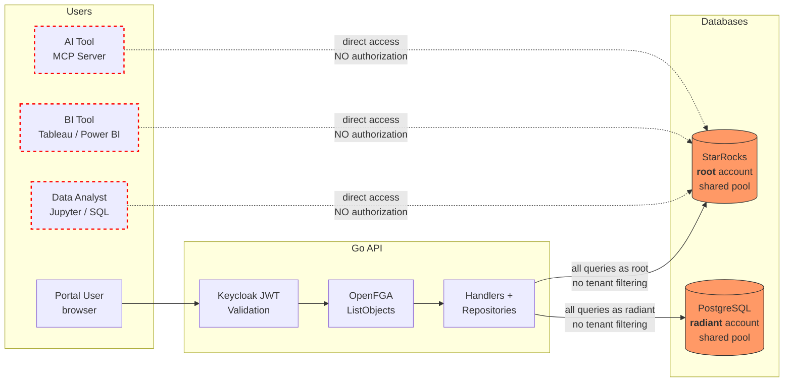
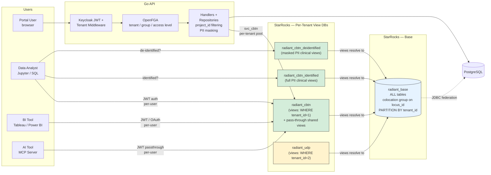
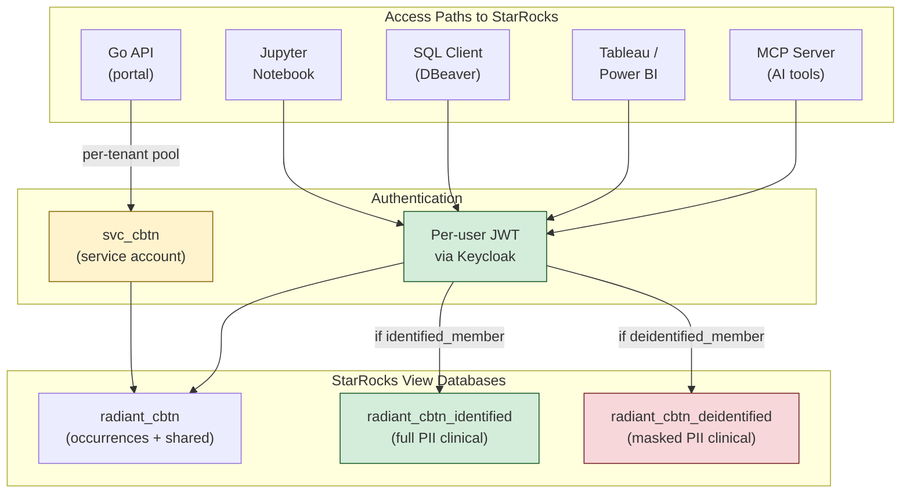
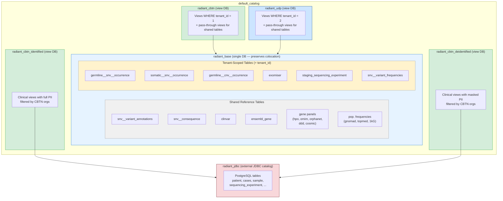
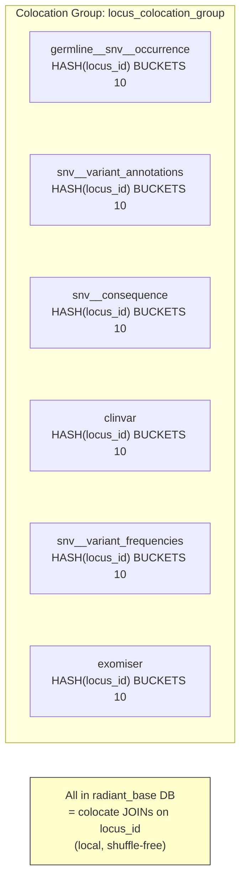
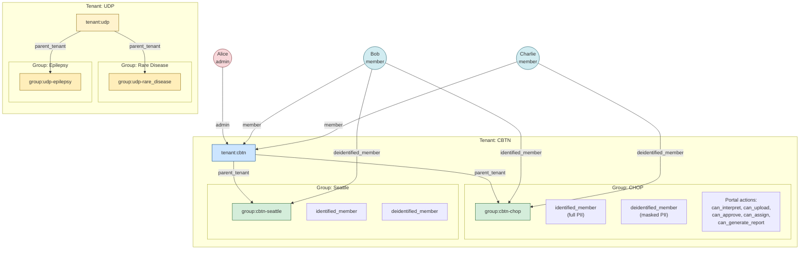
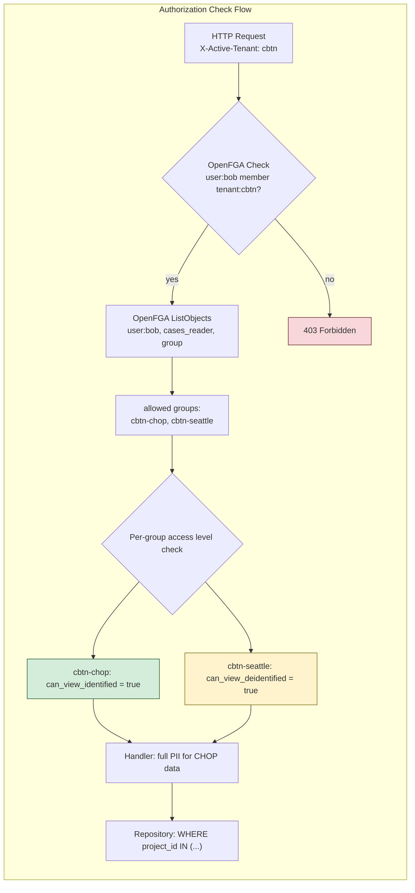
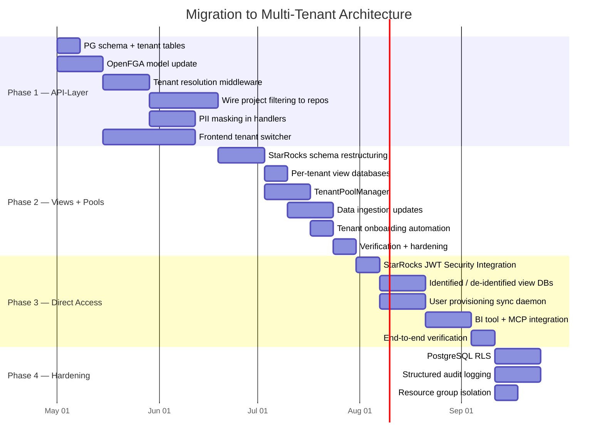
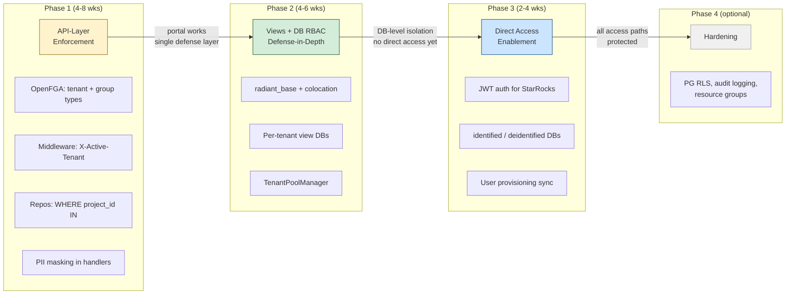

# ADR: Security & Multi-Tenancy Architecture for Radiant Portal

- **Status:** Proposed
- **Date:** 2026-04-10
- **Authors:** Architecture Team
- **Stakeholders:** Security reviewers, compliance officers, platform engineers

---

## Table of Contents

1. [Problem Statement](#1-problem-statement)
2. [Decision Drivers](#2-decision-drivers)
3. [Options Considered](#3-options-considered)
   - [Option A -- API-Layer-Only Enforcement](#option-a--api-layer-only-enforcement)
   - [Option B -- Hybrid: Per-User StarRocks Connections + DB/Catalog Isolation](#option-b--hybrid-per-user-starrocks-connections--dbcatalog-isolation)
   - [Option C -- Full Push-Down: Ranger + Per-User Connections + RLS/Masking](#option-c--full-push-down-ranger--per-user-connections--rlsmasking)
   - [Option D -- Views-Based with Per-Tenant Service Account Pools](#option-d--views-based-with-per-tenant-service-account-pools)
4. [Proposed Schema Organization](#4-proposed-schema-organization)
5. [OpenFGA Authorization Model](#5-openfga-authorization-model)
6. [Recommendation](#6-recommendation)
7. [Migration Strategy](#7-migration-strategy)

---

## 1. Problem Statement

Radiant Portal is a medical/genomic data platform serving clinical and research users. The current architecture has **no multi-tenancy** and relies on a **single layer of authorization** at the Go API level. This is insufficient for a platform handling sensitive health data across multiple organizations.

### Current Architecture



> **Red paths = unprotected.** Direct StarRocks access bypasses all authorization. The Go API is the only enforcement point, and even it does not filter by project (the `allowed` context key is computed but never consumed by repositories).

### Current State

| Aspect | Current Implementation | Risk |
|--------|----------------------|------|
| **StarRocks connection** | Single shared pool (`root` account, 100 max connections) via `backend/internal/database/starrocks.go` | All queries run as a single privileged user; no per-user audit trail in StarRocks |
| **PostgreSQL connection** | Single shared pool (`radiant` account, 100 max connections) via `backend/internal/database/postgres.go` | Same as above |
| **Authorization** | Keycloak RBAC or OpenFGA at Go middleware level (`backend/internal/authorization/`) | Single point of enforcement; a bug bypasses all protection |
| **Project-level filtering** | OpenFGA `ListObjects` computes allowed projects, stores in Gin context key `"allowed"` (`openfga.go:117`) -- **but no handler or repository ever reads this value** | Authorization is computed but not enforced at the data layer |
| **Row-level security** | None | Any authenticated user can potentially access any patient/case data |
| **Column masking** | None | No differentiation between identified and de-identified access |
| **Multi-tenancy** | None; single flat namespace | No data isolation between organizations |
| **Audit trail** | Request logging (ginglog) + PostgreSQL history tables for interpretations | No StarRocks query attribution to individual users |

### What Must Change

The platform must support 10--50 tenants (hospitals, research institutions, jurisdictions) sharing a single StarRocks cluster, with:

- **Strict tenant isolation** -- a user sees data from one tenant at a time, with no cross-tenant leakage
- **Group-level access within tenants** -- identified (full PII), de-identified (masked), or no access per group
- **Individual audit trails** -- who queried what, traceable to individual users
- **Defense-in-depth** -- authorization enforced at multiple layers, not just the API
- **Direct StarRocks access for analysts and tools** -- enforcement must work for all access paths, not just the Go API

### Direct StarRocks Access Requirement

**The Go API is not the only access path to StarRocks.** Users will also query StarRocks directly through:

| Access Path | Users | Use Case |
|-------------|-------|----------|
| **Jupyter notebooks** | Data analysts, bioinformaticians | Ad-hoc genomic analysis, cohort queries, statistical exploration |
| **SQL clients** (DBeaver, DataGrip, etc.) | Data analysts, DBAs | Direct SQL queries, data exploration, debugging |
| **BI tools** (Power BI, Tableau) | Analysts, managers, researchers | Dashboards, reports, visualizations |
| **AI tools / MCP servers** | AI agents, copilots | Automated data retrieval, natural language queries via Model Context Protocol |
| **Go API backend** | Portal users (via browser) | Standard portal usage (case browsing, variant interpretation, etc.) |

**This is a critical architectural constraint.** Any option that relies solely on the Go API layer for authorization leaves direct-access users completely unprotected. Tenant isolation, group-level access control, and PII masking must be enforced **at the StarRocks level** for these access paths -- the Go API cannot intercept or filter their queries.

**Implication for each option:**
- **Option A (API-only):** Direct access users bypass all authorization. This option cannot be the final state.
- **Options B, C, D:** StarRocks-level enforcement (DB RBAC, views, Ranger) protects all access paths equally, regardless of whether the query originates from the Go API, a Jupyter notebook, or a Tableau dashboard.

### Target Architecture (Option D -- Recommended)



> All access paths -- portal, Jupyter, BI tools, AI/MCP -- are protected by StarRocks DB RBAC. No user can access `radiant_base` directly. Views enforce tenant isolation and PII masking at the database level.

---

## 2. Decision Drivers

### 2.1 Compliance (Critical)

Radiant Portal handles **protected health information (PHI)**. Applicable regulations include:

- **PIPEDA** (Canada) -- requires appropriate safeguards for personal health information, including access controls, audit trails, and data minimization
- **HIPAA-equivalent requirements** -- even outside the US, many partner institutions require HIPAA-aligned controls: minimum necessary access, access logging, breach notification
- **Research ethics board requirements** -- de-identified access for approved researchers, identified access only for treating clinicians

A compliance review will ask: *"If your application layer has a bug, what prevents cross-tenant data exposure?"* With the current architecture, the answer is: nothing.

### 2.2 Auditability

- Every data access must be traceable to an individual user
- Audit logs must be tamper-resistant (not modifiable by the application)
- Write operations on clinical data (interpretations, case assignments) already have PostgreSQL history tables; **read access to genomic data has no audit trail**

### 2.3 Operational Complexity

The team is mid-size. The chosen architecture must be:

- Operable without a dedicated security/infrastructure team
- Deployable on existing infrastructure (Kubernetes, Docker Compose)
- Maintainable as tenant count grows (no O(n) manual configuration per tenant)

### 2.4 Performance

- StarRocks OLAP queries on occurrence tables (germline SNV, somatic SNV, CNV) are the core user-facing workload
- Current connection pool (100 max, 10 idle) handles production load well
- Any per-request connection establishment adds 10--50ms latency (TCP + auth handshake)
- Partition pruning on the `part` column is critical for query performance on occurrence tables

### 2.5 Multiple Access Paths (Critical)

StarRocks will be accessed directly by data analysts (Jupyter, SQL clients), BI tools (Power BI, Tableau), and AI tools (MCP servers). These access paths bypass the Go API entirely. Authorization enforced only in the Go application layer provides **zero protection** for direct-access users.

This driver **eliminates Option A as a viable final state** and makes StarRocks-level enforcement (views, DB RBAC, or Ranger) a hard requirement. The architecture must ensure that a data analyst connecting via Jupyter sees exactly the same tenant-scoped, access-level-appropriate data as a portal user -- without relying on the Go API to filter it.

### 2.6 Developer Experience

- 61 repository files, 43 handler files -- scope of code changes matters
- The handler-to-repository pattern has **no service layer** -- handlers call repositories directly
- Repositories store `db *gorm.DB` as a struct field, set once at startup -- changing this to per-request injection is a significant refactor

---

## 3. Options Considered

### StarRocks 3.5 Capabilities & Constraints

These are hard constraints that apply across all options:

| Capability | StarRocks 3.5 Support | Implication |
|---|---|---|
| JWT authentication | Per-connection via Security Integration + JWKS | Requires abandoning shared pool for per-user identity |
| OAuth 2.0 / OIDC | Authorization Code flow supported | Can authenticate via Keycloak |
| Row-level security (RLS) | Not native -- **requires Apache Ranger** | No built-in row filtering; Ranger is the only path |
| Column masking | Not native -- **requires Apache Ranger** | No built-in column redaction |
| Column-level RBAC | Native since 3.2 (`GRANT SELECT (col) ON table TO user`) | Can restrict which columns a user/role can SELECT |
| OpenFGA integration | Not supported | Ranger is the only external authz option for StarRocks |
| Per-query JWT passthrough | Not supported -- JWT is per-connection only | Cannot change identity mid-connection |
| Catalog/DB-level privileges | Full support (`GRANT ... ON DATABASE/TABLE`) | Can isolate access by database |
| Views | Full support; optimizer pushes predicates through views | Views can enforce row filtering without Ranger |
| Resource group isolation | CPU/memory partitioning per resource group | Can prevent one tenant from starving others |
| Hierarchy | Catalog > Database > Table (no schema concept) | Cannot use PostgreSQL-style schemas within a database |
| **Colocation groups** | Tables must be in the **same database** to share a colocation group | Colocate JOINs (local, shuffle-free) require co-located tables; splitting tables across databases breaks colocation |

**Key implication -- colocation groups:** The current StarRocks schema uses colocation to enable colocate JOINs (local, shuffle-free) between tables distributed by `locus_id` -- e.g., `germline__snv__occurrence JOIN snv__variant JOIN snv__consequence JOIN clinvar`. Colocation groups **must be in the same database**. This means **all tables that participate in colocate JOINs must remain in one database**. Any schema design that splits occurrence tables and variant/annotation tables across databases will break colocate JOINs and cause expensive network shuffles on every query. The recommended schema (Option D) addresses this by placing all base tables -- both tenant-scoped and shared reference data -- in a single `radiant_base` database.

**Key references:**
- [StarRocks Security Integration (JWT)](https://docs.starrocks.io/docs/administration/Authentication/#json-web-token-jwt-based-authentication)
- [StarRocks Column-Level Privileges](https://docs.starrocks.io/docs/administration/privilege_item/#column)
- [StarRocks Apache Ranger Integration](https://docs.starrocks.io/docs/administration/ranger_plugin/)
- [StarRocks Resource Groups](https://docs.starrocks.io/docs/administration/management/resource_management/resource_group/)
- [StarRocks Colocate Join](https://docs.starrocks.io/docs/using_starrocks/Colocate_join/)

---

### Option A -- API-Layer-Only Enforcement

**Summary:** All authorization stays in the Go backend. StarRocks and PostgreSQL remain unaware of users, tenants, or groups. The existing shared connection pool is unchanged.

#### Tenant Isolation Model

No database-level isolation. Tenant boundaries are enforced by adding `WHERE` clauses to every data query in the Go API layer.

The existing data model already has the scaffolding:
- `cases.project_id` references the `project` table (each project belongs to a tenant)
- `patient.organization_id` and `sample.organization_id` reference the `organization` table
- `staging_sequencing_experiment.case_id` links occurrences to cases (and transitively to projects)

The missing piece is a `tenant` table and a mapping from `project` to `tenant`. Once that exists, the Go middleware resolves the user's active tenant and allowed projects (via OpenFGA), and every repository method filters by `project_id IN (?)`.

**For StarRocks occurrence queries:** The path is `occurrence.seq_id` -> `staging_sequencing_experiment.seq_id` -> `staging_sequencing_experiment.case_id` -> `cases.project_id`. The API must either:
1. Pre-resolve the set of allowed `seq_id` values and pass them as a filter, or
2. Add a JOIN through `staging_sequencing_experiment` and `radiant_jdbc.public.cases` to enforce `project_id IN (?)` within the StarRocks query

Option (1) is more performant; option (2) is more robust (defense at query level rather than pre-validation).

#### Group / Identified vs De-identified Enforcement

**Entirely in the Go response serialization layer.** The database queries always return full data. The handler inspects the user's access level per group (from OpenFGA) and strips PII fields before serializing the JSON response.

PII fields in the current schema:
- `patient.first_name`
- `patient.last_name`
- `patient.jhn` (health card number)
- `patient.date_of_birth`
- `patient.submitter_patient_id`

A masking utility function in the handler layer would replace these with `"***"` or `null` for de-identified users.

**Risk:** PII transits the Go process in-memory even for de-identified users. If the Go process is compromised (memory dump, logging accident), full PII is exposed.

#### Connection Model

**No change.** Single shared `*gorm.DB` for StarRocks (MaxOpenConns=100, MaxIdleConns=10, ConnMaxLifetime=1h). Single shared `*gorm.DB` for PostgreSQL with identical settings.

**Performance:** Zero new overhead beyond the additional `WHERE` clause in queries. For indexed columns (`project_id`, `seq_id`), the cost is negligible.

#### OpenFGA Integration

The OpenFGA model is extended with `tenant` and `group` types (see [Section 5](#5-openfga-authorization-model)). The authorizer middleware:
1. Validates the active tenant from the `X-Active-Tenant` header
2. Calls `ListObjects(user, relation, "group")` to find allowed groups within the tenant
3. Maps groups to `project_id` values
4. Stores the allowed project IDs in the Gin context
5. Handlers pass them to repository methods

**Critical implementation gap:** Today, `openfga.go` calls `c.Set(AllowedContextKey, allowed)` but no handler reads it. The first step for any option is wiring this through.

#### Audit Trail

| Layer | Attribution | Coverage |
|-------|------------|----------|
| Application log (Gin) | User ID from JWT | All HTTP requests |
| StarRocks audit log | `root` (system account) | All queries, but no user attribution |
| PostgreSQL history tables | `created_by`/`updated_by` from JWT | Write operations on interpretations only |

**Gap:** No per-user attribution for StarRocks read queries. Compliance teams must trust that the application log correctly correlates HTTP requests to StarRocks queries.

#### Operational Complexity

**Minimal.** No new infrastructure. No new services. Changes are confined to the Go codebase.

| Component | Change Required |
|-----------|----------------|
| StarRocks | None |
| PostgreSQL | Add `tenant` table + `tenant_has_project` mapping (migration) |
| Go API | Add project filtering to ~15-20 repository methods; add PII masking to ~5 handlers |
| OpenFGA | Update model with tenant/group types |
| Keycloak | Add tenant-related custom claims (optional) |
| Frontend | Add tenant switcher UI; send `X-Active-Tenant` header |

#### Direct StarRocks Access

**Option A cannot support direct access.** Data analysts connecting via Jupyter, SQL clients, Power BI, Tableau, or AI tools (MCP) would bypass the Go API entirely and have unrestricted access to all data in StarRocks through the shared `root` account. There is no mechanism to enforce tenant isolation, group-level filtering, or PII masking for these users.

**This is Option A's disqualifying weakness.** It can serve as a transitional Phase 1 (portal-only, no direct access), but it cannot be the final architecture if direct StarRocks access is a requirement.

#### Compliance Posture

| Criterion | Assessment |
|-----------|------------|
| Defense-in-depth | **Weak** -- single enforcement layer (Go API) |
| Principle of least privilege | **Violated** -- DB accounts have access to all data |
| Blast radius of a bug | **High** -- a missing `WHERE` clause exposes all tenants' data |
| Audit independence | **Weak** -- only application-level logs, no DB-level user attribution |
| Direct access support | **None** -- direct StarRocks users bypass all authorization |

#### Migration Path

1. Add `tenant` and `tenant_has_project` tables in PostgreSQL (migration)
2. Update OpenFGA model with tenant/group types
3. Add tenant resolution middleware (validate `X-Active-Tenant`, resolve allowed projects)
4. Wire `AllowedContextKey` through handlers to repositories (~15-20 methods)
5. Add PII masking utility, apply in relevant handlers
6. Frontend: tenant switcher UI + `X-Active-Tenant` header

**Estimated effort:** 4--8 weeks for a small team.

#### Portal-Specific Action Authorization

Non-query actions (interpret, upload, approve, assign, generate reports) are authorized via OpenFGA group-level permissions:

```
Check(user:bob, can_interpret, group:cbtn-chop) -> allow/deny
```

The handler validates:
1. Is the user authorized for this action on this group? (OpenFGA check)
2. Does the target resource (case, sequencing experiment) belong to an allowed project? (project_id check)
3. Write operations already capture `created_by`/`updated_by` from JWT in PostgreSQL

---

### Option B -- Hybrid: Per-User StarRocks Connections + DB/Catalog Isolation

**Summary:** Push tenant isolation and user identity into StarRocks via JWT-authenticated connections and per-tenant databases. Keep row/column masking in the Go API layer.

#### Tenant Isolation Model

**Database-per-tenant in StarRocks.** Each tenant gets its own database containing duplicated table schemas for occurrence/analytical data:

```
default_catalog/
  radiant_shared/                    -- Shared reference/annotation data
    clinvar
    clinvar_rcv_summary
    snv__consequence
    snv__variant                     -- Shared annotation columns only
    gnomad_genomes_v3
    topmed_bravo
    1000_genomes
    ensembl_gene
    ensembl_exon_by_gene
    cytoband
    hpo_term, mondo_term
    hpo_gene_panel, omim_gene_panel, orphanet_gene_panel, ddd_gene_panel, cosmic_gene_panel

  radiant_tenant_cbtn/               -- Tenant: CBTN
    germline__snv__occurrence
    somatic__snv__occurrence
    germline__cnv__occurrence
    exomiser
    snv__consequence_filter_partitioned
    staging_sequencing_experiment
    snv__variant_frequencies          -- Tenant-scoped frequency data

  radiant_tenant_udp/              -- Tenant: UDP
    (same table set)
```

StarRocks RBAC enforces database-level isolation:

```sql
CREATE USER 'user_alice' IDENTIFIED BY JWT;
GRANT SELECT ON DATABASE radiant_tenant_cbtn TO 'user_alice';
GRANT SELECT ON DATABASE radiant_cbtn TO 'user_alice';  -- includes pass-through views for shared tables
-- No grant on radiant_tenant_udp -> access denied
```

#### JDBC Federation for PostgreSQL

**Problem:** The current `radiant_jdbc` catalog points to a single PostgreSQL database (`radiant`). All tenants' clinical data is in the same PostgreSQL `public` schema.

**Two sub-approaches:**

**(B1) Per-tenant PostgreSQL schemas:**
```sql
-- In PostgreSQL
CREATE SCHEMA cbtn;
CREATE SCHEMA udp;
-- Move tenant-specific tables into schemas
ALTER TABLE patient SET SCHEMA cbtn;  -- for CBTN patients
-- Shared value-set tables stay in public
```

StarRocks accesses them as `radiant_jdbc.cbtn.patient`, `radiant_jdbc.udp.patient`.

**(B2) Single JDBC catalog, API-layer filtering:**
Keep one `radiant_jdbc` catalog. The API adds `WHERE organization_id IN (?)` for all federated queries. Simpler but weaker isolation.

**Recommendation: B2 for initial implementation,** because per-tenant PG schemas require migrating all foreign keys and is a complex operation.

#### Group / Identified vs De-identified Enforcement

Same as Option A: API-layer PII masking. StarRocks column-level RBAC (`GRANT SELECT (col)`) could theoretically restrict PII columns, but this is difficult to apply to JDBC federation catalog tables (column grants on external catalog tables may not be supported -- needs verification).

#### Connection Model

**Per-user JWT-authenticated connections.**

StarRocks Security Integration setup:
```sql
CREATE SECURITY INTEGRATION keycloak_jwt
PROPERTIES (
    "type" = "jwt",
    "jwks_url" = "https://keycloak:8080/realms/CQDG/protocol/openid-connect/certs",
    "jwt_username_claim" = "preferred_username"
);
```

Go API connection flow per request:
```
1. Extract JWT from Authorization header
2. Look up cached *gorm.DB for this user (keyed by JWT sub + tenant)
3. If cache miss: open new StarRocks connection with JWT as password
   DSN: "{username}:{jwt_token}@tcp(starrocks:9030)/radiant_tenant_{tenant}"
4. Execute queries using this connection
5. Return connection to per-user pool (or close after request)
```

**Performance implications:**

| Metric | Current (shared pool) | Per-user connections |
|--------|----------------------|---------------------|
| Connection establishment | Amortized (pool) | 10-50ms per cache miss |
| Concurrent connections | 100 max, shared | N users * M concurrent requests |
| Connection cache | N/A | Must cache by user+tenant, evict on JWT expiry |
| Memory overhead | 1 pool | 1 pool per active user (file descriptors, buffers) |
| GORM repository refactor | None | **All 61 repository files** must accept per-request DB |

**GORM refactor impact:** Every repository currently stores `db *gorm.DB` as a struct field. For per-user connections, this must become per-request. Options:
1. Pass `*gorm.DB` as a method parameter -- changes all DAO interfaces and all handler calls
2. Create repositories per-request -- changes `main.go` wiring entirely
3. Use a `TenantDBResolver` middleware that injects the correct DB into context -- handlers extract it

Option 3 is the least invasive but still requires changing how handlers obtain the DB reference.

#### OpenFGA Integration

Same model as Option A. OpenFGA determines which tenant the user can access. The Go API uses this to select the correct tenant database.

**Sync to StarRocks:** When a user's tenant membership changes in OpenFGA, the corresponding StarRocks `GRANT` must be updated. This requires a sync daemon:
```
On OpenFGA tuple change:
  1. Read user's tenant memberships
  2. For each tenant: GRANT SELECT ON DATABASE radiant_tenant_{tenant} TO user
  3. For removed memberships: REVOKE
```

#### Audit Trail

| Layer | Attribution | Coverage |
|-------|------------|----------|
| Application log | User ID from JWT | All HTTP requests |
| **StarRocks audit log** | **Individual user** (JWT identity) | **All StarRocks queries** |
| PostgreSQL history tables | `created_by`/`updated_by` | Write operations |

**Significant improvement** over Option A: StarRocks audit log now attributes queries to individual users. Two independent audit trails can be cross-referenced.

#### Direct StarRocks Access

**Option B natively supports direct access.** Each user authenticates to StarRocks with their own JWT. A data analyst connecting via Jupyter or DBeaver uses the same JWT-based authentication and receives the same DB-level grants as when accessing through the Go API.

**Per-user identity works well here:** The same StarRocks user account used by the Go API proxy is used by Jupyter/Tableau/MCP tools. Database-level GRANT/REVOKE controls which tenant databases the user can see. Each direct query is attributed to the individual user in the StarRocks audit log.

**Limitation:** RLS/column masking are still API-layer only. A direct-access user connecting to `radiant_tenant_cbtn` sees all data within that tenant, including PII. Group-level and identified/de-identified filtering is not enforced for direct access paths. This would require either Ranger (Option C) or de-identified views within the tenant database.

#### Operational Complexity

| Component | Change Required |
|-----------|----------------|
| StarRocks | Security Integration config; per-tenant databases; per-user RBAC grants |
| PostgreSQL | `tenant` table + mapping (same as Option A) |
| Go API | Connection manager; per-request DB injection; all Option A changes |
| Infrastructure | JWKS endpoint exposure (already exists in Keycloak) |
| Ongoing | User provisioning in StarRocks when new users join; sync daemon |

#### Compliance Posture

| Criterion | Assessment |
|-----------|------------|
| Defense-in-depth | **Moderate** -- API + DB-level identity and grants |
| Principle of least privilege | **Partial** -- user can only access granted tenant DB |
| Blast radius of a bug | **Contained to tenant** -- DB grants prevent cross-tenant access |
| Audit independence | **Strong** -- StarRocks audit log independently attributable |
| Direct access support | **Tenant-level** -- DB isolation works; PII masking not enforced for direct users |

#### Migration Path

1. Configure StarRocks Security Integration for JWT auth
2. Create per-tenant databases; migrate data
3. Build connection manager in Go backend
4. Refactor repository layer for per-request DB
5. All Option A steps (OpenFGA model, middleware, project filtering)
6. Build sync daemon for RBAC grants

**Estimated effort:** 8--14 weeks. High risk due to GORM refactor scope.

#### Portal-Specific Action Authorization

Same as Option A for non-query actions (OpenFGA checks). **Inconsistency:** StarRocks has per-user identity, but PostgreSQL still uses a shared connection. Write operations to PostgreSQL (interpretations, notes) are not DB-level isolated. This creates an asymmetric trust model.

---

### Option C -- Full Push-Down: Ranger + Per-User Connections + RLS/Masking

**Summary:** Deploy Apache Ranger to manage all data access policies. Row-level security and column masking are enforced at the StarRocks level. The Go API becomes a thin query proxy.

#### Tenant Isolation Model

**Single shared database with Ranger row-filtering policies.** Unlike Option B, tables are not duplicated per tenant. Instead, a `tenant_id` column is added to all tenant-scoped tables, and Ranger policies filter rows based on the authenticated user's tenant membership.

```sql
-- Add tenant_id to occurrence tables
ALTER TABLE germline__snv__occurrence ADD COLUMN tenant_id INT NOT NULL;
ALTER TABLE somatic__snv__occurrence ADD COLUMN tenant_id INT NOT NULL;
ALTER TABLE germline__cnv__occurrence ADD COLUMN tenant_id INT NOT NULL;
ALTER TABLE exomiser ADD COLUMN tenant_id INT NOT NULL;
ALTER TABLE staging_sequencing_experiment ADD COLUMN tenant_id INT NOT NULL;
```

Ranger row-filter policy:
```json
{
  "policyType": 2,
  "name": "tenant_isolation_snv_occurrences",
  "resources": {
    "database": { "values": ["radiant_db"] },
    "table": { "values": ["germline__snv__occurrence"] }
  },
  "rowFilterPolicyItems": [
    {
      "accesses": [{ "type": "select" }],
      "users": ["alice", "bob"],
      "rowFilterInfo": {
        "filterExpr": "tenant_id = 1"
      }
    },
    {
      "accesses": [{ "type": "select" }],
      "users": ["charlie"],
      "rowFilterInfo": {
        "filterExpr": "tenant_id = 2"
      }
    }
  ]
}
```

#### Group / Identified vs De-identified Enforcement

**Ranger column masking policies.** This is where Option C uniquely excels:

```json
{
  "policyType": 1,
  "name": "patient_pii_masking",
  "resources": {
    "database": { "values": ["radiant_db"] },
    "table": { "values": ["patient"] },
    "column": { "values": ["first_name", "last_name", "jhn", "date_of_birth"] }
  },
  "dataMaskPolicyItems": [
    {
      "accesses": [{ "type": "select" }],
      "groups": ["deidentified_users"],
      "dataMaskInfo": {
        "dataMaskType": "MASK_SHOW_LAST_4"
      }
    }
  ]
}
```

When a de-identified user queries `patient.first_name`, Ranger transparently returns the masked value. The Go API does not need to implement any masking logic for StarRocks queries.

**Caveat:** Ranger's ability to apply column masking and row-filtering on **JDBC external catalog tables** (as opposed to native StarRocks tables) is not well-documented. If Ranger cannot mask JDBC catalog columns, PII masking for PostgreSQL-sourced data still falls to the API layer.

#### Connection Model

Same per-user JWT connection model as Option B, with all the same performance and GORM refactor implications. Additionally, each StarRocks query passes through the Ranger plugin for policy evaluation.

**Additional overhead:** Ranger policy evaluation adds 1--5ms per query (the StarRocks Ranger plugin caches policies locally).

#### OpenFGA Integration

**Dual authorization system.** This is a significant drawback:

| Concern | Engine |
|---------|--------|
| StarRocks data access (RLS, column masking) | Apache Ranger |
| Portal actions (interpret, upload, approve) | OpenFGA |
| Tenant/group membership | OpenFGA (source of truth) |

A sync service must translate OpenFGA state to Ranger policies:
```
OpenFGA tuple:                          -> Ranger policy:
  user:bob identified_member group:X    -> Row filter (tenant_id=1) + no column mask
  user:charlie deidentified_member group:X -> Row filter (tenant_id=1) + column mask on PII
  user:dave member tenant:Y             -> Row filter (tenant_id=2)
```

**Consistency risk:** If the sync lags, OpenFGA may grant access that Ranger denies (or vice versa). This creates confusing failure modes.

#### Audit Trail

| Layer | Attribution | Coverage |
|-------|------------|----------|
| Application log | User ID from JWT | All HTTP requests |
| StarRocks audit log | Individual user | All StarRocks queries |
| **Ranger audit log** | Individual user + **policy applied** | All access decisions, including denials |

**Best-in-class audit posture.** Three independent, cross-referenceable audit trails. Ranger audit logs are particularly valuable because they record not just what was accessed, but which policy governed the decision.

#### Direct StarRocks Access

**Option C provides the strongest direct access story.** Ranger policies enforce row-level and column-level restrictions regardless of whether the query comes from the Go API, a Jupyter notebook, Power BI, or an MCP-connected AI tool. Every access path is equally protected.

**For data analysts:** A bioinformatician connecting via DBeaver with their JWT sees only their tenant's rows (Ranger RLS), with PII columns masked if they have de-identified access (Ranger column masking). They can write arbitrary SQL and the results are always scoped correctly -- no application-layer cooperation needed.

**For BI tools:** Tableau/Power BI connect with the user's credentials. Ranger transparently filters data. Dashboards reflect only authorized data without any BI-layer configuration.

**For AI tools (MCP):** An MCP server connecting to StarRocks on behalf of a user inherits that user's Ranger policies. The AI agent cannot see data the user is not authorized for.

**This is Option C's primary advantage.** If the organization requires unrestricted direct SQL access with full tenant isolation, group-level RLS, and PII masking for all access paths, Ranger is the most comprehensive solution.

#### Operational Complexity

| Component | Change Required | Ongoing Burden |
|-----------|----------------|----------------|
| **Apache Ranger** | Deploy Ranger server (Java), MySQL/PG for Ranger metadata, admin UI | Version upgrades, policy management, monitoring |
| **StarRocks Ranger plugin** | Compile and deploy to all FE nodes | Plugin compatibility with StarRocks upgrades |
| StarRocks | Security Integration + `tenant_id` columns | Per-user provisioning |
| Go API | Connection manager; simplified handlers (remove authz logic) | Maintain sync service |
| **OpenFGA-to-Ranger sync** | Build custom sync service | Monitor sync lag, handle failures |

**For a mid-size team, Ranger is operationally heavy.** It is enterprise-grade software designed for organizations with dedicated security teams. The Java stack (Ranger server + Solr/Elasticsearch for audit) adds infrastructure diversity to an otherwise Go/TypeScript/Python stack.

#### Compliance Posture

| Criterion | Assessment |
|-----------|------------|
| Defense-in-depth | **Strong** -- 3 independent enforcement layers |
| Principle of least privilege | **Fully satisfied** -- Ranger enforces row + column restrictions |
| Blast radius of a bug | **Minimal** -- Ranger prevents access regardless of API bugs |
| Audit independence | **Best** -- 3 independent audit trails with policy attribution |
| Direct access support | **Full** -- Ranger enforces RLS + column masking for all access paths |

#### Migration Path

1. Deploy Apache Ranger infrastructure (2--4 weeks)
2. Install StarRocks Ranger plugin on all FE nodes
3. Add `tenant_id` to StarRocks tables; backfill (requires data pipeline changes)
4. Author Ranger policies for all tables (RLS + column masking)
5. Build OpenFGA-to-Ranger sync service
6. Connection manager + GORM refactor (same as Option B)
7. Simplify Go API handlers (remove authz logic pushed to Ranger)

**Estimated effort:** 12--20 weeks, with significant ongoing operational overhead.

#### Portal-Specific Action Authorization

**Ranger does not cover portal actions.** Actions like interpreting a case, uploading files, approving variants, and assigning cases write to PostgreSQL, not StarRocks. These remain governed by OpenFGA.

This means the team must maintain **two authorization policy systems** (Ranger + OpenFGA) with a sync layer between them. Policy changes must be coordinated across both systems.

---

### Option D -- Views-Based with Per-Tenant Service Account Pools

**Summary:** Use StarRocks views as the tenant isolation layer. Base tables live in a shared database with a `tenant_id` column. Per-tenant view databases expose only that tenant's data. Identified/de-identified view databases enforce PII masking at the StarRocks level for direct-access users. A hybrid connection model uses per-tenant service account pools for the Go API and per-user JWT connections for direct access (Jupyter, BI tools, MCP). API-layer enforcement handles within-tenant project filtering for portal users.

#### Tenant Isolation Model

**Single base database + per-tenant view databases in StarRocks:**

A critical constraint is that **colocation groups must be in the same database**. The current schema uses colocation to enable colocate JOINs (local, shuffle-free) between tables distributed by `locus_id` -- e.g., `germline__snv__occurrence JOIN snv__variant JOIN snv__consequence JOIN clinvar`. Splitting these tables across databases would break colocation and cause expensive network shuffles.

Therefore, **all base tables -- both tenant-scoped and shared reference data -- live in a single `radiant_base` database** with a common colocation group. Per-tenant view databases provide isolation by exposing filtered subsets.

```
default_catalog/
  radiant_base/                         -- ALL base tables (single DB preserves colocation)
    # Tenant-scoped tables (have tenant_id column)
    germline__snv__occurrence           -- + tenant_id INT NOT NULL
    somatic__snv__occurrence            -- + tenant_id INT NOT NULL
    germline__cnv__occurrence           -- + tenant_id INT NOT NULL
    exomiser                            -- + tenant_id INT NOT NULL
    snv__consequence_filter_partitioned -- + tenant_id INT NOT NULL
    staging_sequencing_experiment       -- + tenant_id INT NOT NULL
    snv__variant_frequencies            -- Per-tenant frequency aggregates

    # Shared reference/annotation tables (no tenant_id, same data for all tenants)
    snv__variant_annotations            -- Variant identity + external annotations
    snv__consequence                    -- Consequence annotations
    clinvar, clinvar_rcv_summary        -- ClinVar data
    gnomad_genomes_v3, topmed_bravo, 1000_genomes  -- Population frequencies
    ensembl_gene, ensembl_exon_by_gene  -- Gene annotations
    cytoband                            -- Cytogenetic bands
    hpo_term, mondo_term                -- Ontology terms
    hpo_gene_panel, omim_gene_panel, orphanet_gene_panel,
    ddd_gene_panel, cosmic_gene_panel   -- Gene panels

  radiant_cbtn/                         -- Per-tenant VIEW database (tenant_id = 1)
    germline__snv__occurrence           -- VIEW: WHERE tenant_id = 1
    somatic__snv__occurrence            -- VIEW: WHERE tenant_id = 1
    germline__cnv__occurrence           -- VIEW: WHERE tenant_id = 1
    exomiser                            -- VIEW: WHERE tenant_id = 1
    snv__consequence_filter_partitioned -- VIEW: WHERE tenant_id = 1
    staging_sequencing_experiment       -- VIEW: WHERE tenant_id = 1
    snv__variant_frequencies            -- VIEW: WHERE tenant_id = 1
    # Shared tables are exposed as pass-through views (no tenant filter)
    snv__variant_annotations            -- VIEW: SELECT * FROM radiant_base.snv__variant_annotations
    snv__consequence                    -- VIEW: SELECT * FROM radiant_base.snv__consequence
    clinvar                             -- VIEW: pass-through
    # ... (all shared reference tables)

  radiant_udp/                        -- Per-tenant VIEW database (tenant_id = 2)
    (same view pattern)

radiant_jdbc/                           -- Single JDBC catalog to PostgreSQL (unchanged)
  public/
    patient, cases, sample, sequencing_experiment, ...
```

**Why all base tables in one database:** Tables in `radiant_base` share a colocation group distributed by `HASH(locus_id)` with matching bucket counts. This enables colocate JOINs between `germline__snv__occurrence`, `snv__variant_annotations`, `snv__consequence`, and `clinvar` -- the most frequent and performance-critical query pattern. If these tables were in separate databases, every such JOIN would require a network shuffle.

**Why per-tenant views include pass-through views for shared tables:** This ensures that direct-access users (Jupyter, BI tools) can write natural JOINs within a single database context:
```sql
-- From a data analyst's perspective, everything is in radiant_cbtn
USE radiant_cbtn;
SELECT g.locus_id, g.zygosity, v.hgvsg, c.clinvar_interpretation
FROM germline__snv__occurrence g
JOIN snv__variant_annotations v ON v.locus_id = g.locus_id
JOIN clinvar c ON c.locus_id = g.locus_id;
-- No cross-database references needed in user SQL
```

The query planner sees through the views to the base tables in `radiant_base`, which are all colocated. The colocate JOIN optimization applies.

**View definitions:**

```sql
-- In radiant_cbtn database

-- Tenant-scoped views (filter by tenant_id, hide tenant_id column)
CREATE VIEW germline__snv__occurrence AS
SELECT part, seq_id, task_id, locus_id,
       quality, filter, ad_ratio, gq, dp, ad_total, ad_ref, ad_alt,
       zygosity, calls, phased,
       transmission_mode, parental_origin,
       father_dp, father_gq, father_ad_ref, father_ad_alt,
       mother_dp, mother_gq, mother_ad_ref, mother_ad_alt,
       exomiser_moi, exomiser_acmg_classification, exomiser_variant_score,
       exomiser_gene_combined_score
       -- tenant_id is NOT projected (invisible to queries)
FROM radiant_base.germline__snv__occurrence
WHERE tenant_id = 1;

CREATE VIEW staging_sequencing_experiment AS
SELECT case_id, seq_id, task_id, task_type, part, analysis_type,
       aliquot, patient_id, experimental_strategy, sex, family_id,
       family_role, affected_status, created_at, updated_at
FROM radiant_base.staging_sequencing_experiment
WHERE tenant_id = 1;

-- Pass-through views for shared reference tables (no tenant filter)
-- These enable natural JOINs within the tenant DB context
-- and preserve colocate JOIN optimization (planner sees through to base tables)
CREATE VIEW snv__variant_annotations AS
SELECT * FROM radiant_base.snv__variant_annotations;

CREATE VIEW snv__consequence AS
SELECT * FROM radiant_base.snv__consequence;

CREATE VIEW clinvar AS
SELECT * FROM radiant_base.clinvar;

-- ... (similar pass-through views for all shared reference tables)
```

**StarRocks RBAC for tenant isolation:**

```sql
-- Service account for Go API (CBTN)
CREATE USER 'svc_cbtn' IDENTIFIED BY 'secure_password_cbtn';
CREATE ROLE role_cbtn_api;
GRANT SELECT ON DATABASE radiant_cbtn TO ROLE role_cbtn_api;
GRANT SELECT ON ALL TABLES IN DATABASE radiant_jdbc.public TO ROLE role_cbtn_api;
-- NO grant on radiant_base (only views), radiant_udp, or PII-specific DBs
GRANT role_cbtn_api TO 'svc_cbtn';

-- Roles for direct-access users (per tenant + access level)
CREATE ROLE role_cbtn_identified;
GRANT SELECT ON DATABASE radiant_cbtn TO ROLE role_cbtn_identified;
GRANT SELECT ON DATABASE radiant_cbtn_identified TO ROLE role_cbtn_identified;

CREATE ROLE role_cbtn_deidentified;
GRANT SELECT ON DATABASE radiant_cbtn TO ROLE role_cbtn_deidentified;
GRANT SELECT ON DATABASE radiant_cbtn_deidentified TO ROLE role_cbtn_deidentified;

-- Direct-access user provisioning (by sync daemon)
CREATE USER 'analyst_bob' IDENTIFIED BY JWT;
GRANT role_cbtn_identified TO 'analyst_bob';      -- Bob has identified access to CBTN (CHOP group)

CREATE USER 'analyst_charlie' IDENTIFIED BY JWT;
GRANT role_cbtn_deidentified TO 'analyst_charlie'; -- Charlie has de-identified access to CBTN
```

**Why this works:** Even if the Go API has a bug and constructs a query against the wrong database, the StarRocks service account lacks permission. The `svc_cbtn` user physically cannot query `radiant_udp` or other tenant databases or `radiant_base` -- StarRocks returns an access denied error. Direct-access users connecting via Jupyter or BI tools are similarly restricted to their granted databases. A de-identified user **cannot** access `radiant_cbtn_identified` -- the GRANT does not exist. This is **defense-in-depth without Ranger**.

#### Reference Data Handling

All reference/annotation tables live in `radiant_base` alongside tenant-scoped tables. This is required by the **colocation group constraint** -- tables that participate in colocate JOINs must be in the same database. Since `germline__snv__occurrence JOIN snv__variant_annotations JOIN snv__consequence JOIN clinvar` is the most common and performance-critical query pattern, all of these must share a colocation group in `radiant_base`.

Reference tables are not duplicated per tenant. They do not have a `tenant_id` column. Per-tenant view databases expose them via **pass-through views** (e.g., `CREATE VIEW clinvar AS SELECT * FROM radiant_base.clinvar`), so direct-access users can write natural JOINs without cross-database references.

**The `snv__variant` frequency problem:** The current `snv__variant` table contains platform-wide aggregate frequencies (`germline_pf_wgs`, `germline_pc_wgs`, `germline_pn_wgs`, etc.). In a multi-tenant world, these cross-tenant aggregates raise a question: should tenant A see frequencies computed across tenant B's patients?

**Proposed solution:** Split `snv__variant` into two tables, both in `radiant_base`:
- `radiant_base.snv__variant_annotations` -- Variant identity and annotation fields (chromosome, start, end, reference, alternate, hgvsg, clinvar_name, clinvar_interpretation, rsnumber, symbol, consequences, etc.). Shared across all tenants. Part of the colocation group.
- `radiant_base.snv__variant_frequencies` -- Per-tenant frequency aggregates (with `tenant_id`). Exposed via per-tenant views. Frequencies are recomputed per tenant during data ingestion. Part of the colocation group (same `HASH(locus_id)` distribution).

From within a per-tenant view database, queries use the local view names:
```sql
-- From radiant_cbtn context (all views)
SELECT v.hgvsg, v.clinvar_interpretation, f.germline_pf_wgs, f.germline_pc_wgs
FROM snv__variant_annotations v
JOIN snv__variant_frequencies f ON f.locus_id = v.locus_id
WHERE ...
-- Planner resolves through views to radiant_base tables -> colocate JOIN on locus_id
```

#### Group / Identified vs De-identified Enforcement

**Two-tier approach: de-identified views for direct access + API-layer masking for the portal.**

Because users access StarRocks directly (Jupyter, BI tools, MCP), API-layer PII masking is not sufficient -- direct-access users bypass the Go API entirely. The solution is to create **two sets of views per tenant**: one identified (full PII) and one de-identified (masked PII).

**De-identified views for JDBC-federated clinical data:**
```sql
-- In radiant_cbtn_deidentified database
CREATE VIEW patient AS
SELECT p.id, p.sex_code, p.life_status_code, p.organization_id,
       '***' AS first_name, '***' AS last_name, '***' AS jhn,
       NULL AS date_of_birth, CONCAT('DEID-', p.id) AS submitter_patient_id
FROM radiant_jdbc.public.patient p
WHERE p.organization_id IN (
    SELECT o.id FROM radiant_jdbc.public.organization o
    WHERE o.code IN ('cbtn-org-chop', 'cbtn-org-seattle')
);

-- Identified view (full PII) in radiant_cbtn_identified database
CREATE VIEW patient AS
SELECT p.id, p.sex_code, p.life_status_code, p.organization_id,
       p.first_name, p.last_name, p.jhn, p.date_of_birth,
       p.submitter_patient_id
FROM radiant_jdbc.public.patient p
WHERE p.organization_id IN (
    SELECT o.id FROM radiant_jdbc.public.organization o
    WHERE o.code IN ('cbtn-org-chop', 'cbtn-org-seattle')
);
```

**StarRocks RBAC for identified vs de-identified:**
```sql
-- User with identified access to CBTN
CREATE USER 'analyst_bob' IDENTIFIED BY JWT;
GRANT SELECT ON DATABASE radiant_cbtn TO 'analyst_bob';              -- occurrence views
GRANT SELECT ON DATABASE radiant_cbtn_identified TO 'analyst_bob';   -- full PII clinical views
-- No separate radiant_shared grant needed; shared tables are exposed via pass-through views in radiant_cbtn

-- User with de-identified access to CBTN
CREATE USER 'analyst_charlie' IDENTIFIED BY JWT;
GRANT SELECT ON DATABASE radiant_cbtn TO 'analyst_charlie';            -- occurrence views (no PII)
GRANT SELECT ON DATABASE radiant_cbtn_deidentified TO 'analyst_charlie'; -- masked PII clinical views
-- No separate radiant_shared grant needed; shared tables accessible via pass-through views
-- NO grant on radiant_cbtn_identified
```

**For the Go API (portal):** The API continues to use the per-tenant service account pool. The handler applies PII masking in the response layer (same as Option A). The de-identified views are primarily for direct-access users.

**For direct-access users:** The user's StarRocks GRANT determines whether they connect to `radiant_cbtn_identified` or `radiant_cbtn_deidentified` for clinical data. Both databases use the same table names (`patient`, `cases`), so SQL queries work identically regardless of access level -- only the data returned differs.

#### Connection Model

**Dual connection model: per-tenant service accounts for the Go API + per-user JWT connections for direct access.**

**Go API (portal):** Per-tenant service account pools, NOT per-user. The Go API uses `svc_cbtn`, `svc_udp`, etc. This avoids the GORM refactor and performance overhead of per-user connections.

```go
// TenantPoolManager manages one *gorm.DB pool per tenant
type TenantPoolManager struct {
    pools map[string]*gorm.DB  // "cbtn" -> pool, "udp" -> pool
    mu    sync.RWMutex
}

func (m *TenantPoolManager) GetPool(tenantCode string) (*gorm.DB, error) {
    m.mu.RLock()
    pool, ok := m.pools[tenantCode]
    m.mu.RUnlock()
    if ok {
        return pool, nil
    }
    // Lazy creation for new tenants
    return m.createPool(tenantCode)
}
```

**Direct access (Jupyter, BI tools, MCP, SQL clients):** Per-user JWT-authenticated connections. Users authenticate to StarRocks using their Keycloak JWT. StarRocks Security Integration validates the JWT and maps the user to their StarRocks account. The user's GRANT determines which tenant view databases they can access.

```sql
-- StarRocks Security Integration for direct access users
CREATE SECURITY INTEGRATION keycloak_jwt
PROPERTIES (
    "type" = "jwt",
    "jwks_url" = "https://keycloak:8080/realms/CQDG/protocol/openid-connect/certs",
    "jwt_username_claim" = "preferred_username"
);
```

**Connection flow for direct access:**
```
1. Data analyst opens Jupyter / DBeaver / Tableau
2. Authenticates via Keycloak (gets JWT)
3. Connects to StarRocks: mysql -h starrocks -P 9030 -u analyst_bob --password={jwt}
4. StarRocks validates JWT via JWKS, maps to user 'analyst_bob'
5. User can only query databases they are GRANTed (e.g., radiant_cbtn, radiant_cbtn_identified)
6. All queries are logged in StarRocks audit log under 'analyst_bob'
```

**Connection flow for AI tools (MCP):**
```
1. MCP server receives a query request from an AI agent
2. MCP server authenticates the requesting user (extracts JWT from session)
3. MCP server opens StarRocks connection using the user's JWT
4. Query results are scoped by the user's StarRocks grants
5. MCP server returns results to the AI agent
```

**Performance comparison:**

| Metric | Current | Option B/C (per-user for all) | Option D (hybrid) |
|--------|---------|-------------------------------|-------------------|
| Go API pools | 1 | N users | N tenants (10-50) |
| Direct access | N/A (not supported) | Same per-user pool | Per-user JWT connections |
| MaxOpenConns (API) | 100 | 100 * active users | 20 * 5 tenants = 100 |
| Connection establishment (API) | Amortized | Per cache miss (10-50ms) | Amortized (pool per tenant) |
| GORM refactor scope | None | All 61 repositories | Moderate (wiring change) |

With 5 tenants and 20 max connections per tenant, the Go API connection count is identical to today. Direct-access users establish their own connections (typically long-lived for BI tools, short-lived for MCP/Jupyter). With 50 tenants and 5 connections each, the API uses 250 connections -- still well within StarRocks FE capacity (default max: 1024).

**GORM repository changes -- minimal:**

The key insight is that **view databases include views for ALL tables -- both tenant-scoped and shared reference tables**. When the connection targets `radiant_cbtn`, all existing table references (`germline__snv__occurrence`, `snv__variant`, `clinvar`, etc.) resolve to views in that database without changing any `Table.Name` values.

Since shared reference tables are exposed as pass-through views in each per-tenant database (e.g., `radiant_cbtn.clinvar` -> `radiant_base.clinvar`), **no table name changes are needed** in the Go code. The `Table.Name` values stay as-is; the database context is set at connection time.

```go
// No changes to table definitions!
// var ClinvarTable = Table{Name: "clinvar", Alias: "cv"}     -- works via view
// var VariantTable = Table{Name: "snv__variant_annotations", Alias: "v"}  -- works via view
// Only the snv__variant split (into annotations + frequencies) requires a rename
```

The per-request DB injection pattern:
```go
// Middleware extracts tenant, selects pool
func TenantMiddleware(poolMgr *TenantPoolManager) gin.HandlerFunc {
    return func(c *gin.Context) {
        tenant := c.GetHeader("X-Active-Tenant")
        // ... validate via OpenFGA ...
        db, err := poolMgr.GetPool(tenant)
        // ... error handling ...
        c.Set("tenant_db", db)
        c.Next()
    }
}

// Handler extracts tenant-specific DB
func SearchCasesHandler(c *gin.Context) {
    db := c.MustGet("tenant_db").(*gorm.DB)
    repo := repository.NewCasesRepository(db, pgDB)
    // ... existing handler logic ...
}
```

This pattern requires changing handler initialization from startup-time to request-time, but the repository interfaces themselves are unchanged.

#### OpenFGA Integration

Same model as Option A. Additionally, when group memberships change, the sync must:
1. Update StarRocks views if a new group maps to new project IDs within a tenant
2. Ensure the tenant service account's GRANT covers the view database

For most operations, the views are static per tenant (they filter by `tenant_id`, not by `project_id`). The within-tenant project-level filtering is done at the API layer using the OpenFGA `allowed` projects list. Views only need to be updated when a new tenant is onboarded.

#### Audit Trail

| Layer | Attribution | Coverage |
|-------|------------|----------|
| Application log | User ID from JWT | All HTTP requests via Go API |
| StarRocks audit log (API queries) | **Tenant service account** (e.g., `svc_cbtn`) | Portal queries, tenant-attributed |
| StarRocks audit log (direct access) | **Individual user** (e.g., `analyst_bob`) | Jupyter/BI/MCP queries, fully attributed |
| PostgreSQL history tables | `created_by`/`updated_by` | Write operations |

**Hybrid attribution model:** Portal queries are tenant-attributed (via service accounts), while direct-access queries are individually attributed (via JWT users). This is a pragmatic trade-off: the Go API's application log provides per-user attribution for portal queries (cross-referenceable with StarRocks tenant-level logs), and direct-access queries get first-class per-user attribution in StarRocks.

**For compliance auditors:** Direct access -- the higher-risk path (arbitrary SQL, no application guardrails) -- has the stronger audit trail (per-user StarRocks attribution). Portal access has dual attribution (application log + tenant-level StarRocks log).

#### Operational Complexity

| Component | Change Required | Ongoing Burden |
|-----------|----------------|----------------|
| StarRocks | Create shared/base/view databases; RBAC setup | New tenant = new view DB + service account (automatable) |
| PostgreSQL | `tenant` table + mapping | Same as Option A |
| Go API | TenantPoolManager; request-time repository creation; shared table name updates | Pool monitoring |
| Infrastructure | None new (no Ranger, no JWKS changes) | Minimal |

**Tenant onboarding automation:** A script/API that:
1. Creates `radiant_tenant_{code}` database in StarRocks
2. Creates all views (templated SQL)
3. Creates service account and GRANT
4. Creates pool in the Go API (lazy creation handles this automatically)

#### Compliance Posture

| Criterion | Assessment |
|-----------|------------|
| Defense-in-depth | **Good** -- 2 layers (StarRocks RBAC + API) |
| Principle of least privilege | **Satisfied at tenant level** -- service account restricted to tenant DB |
| Blast radius of a bug | **Contained to tenant** -- DB grants prevent cross-tenant access |
| Audit independence | **Good** -- per-user attribution for direct access; tenant-level for API |
| Direct access support | **Full** -- views + DB RBAC enforce tenant isolation and PII masking for all access paths |

#### Migration Path

1. All Option A steps (OpenFGA model, middleware, project filtering, PII masking)
2. Add `tenant_id` column to StarRocks occurrence tables; backfill
3. Create `radiant_base` database with colocation group; migrate data
4. Create per-tenant view databases with templated SQL
5. Create service accounts and RBAC grants
6. Build `TenantPoolManager` in Go backend
7. Add request-time DB injection middleware
8. Update shared table references (database-qualified names)
9. Update data ingestion pipeline to set `tenant_id`

**Estimated effort:** 6--11 weeks (inclusive of Option A as Phase 1).

#### Direct StarRocks Access

**Option D provides robust direct access support through views + DB RBAC.** This is a key advantage over Option A and avoids the operational overhead of Ranger (Option C).



**How it works for each access path:**

| Access Path | Authentication | Authorization | PII Handling |
|-------------|---------------|---------------|--------------|
| **Jupyter notebook** | JWT from Keycloak | User GRANTed to tenant view DB + identified/deidentified DB | De-identified views mask PII at query level |
| **SQL client (DBeaver)** | JWT from Keycloak | Same as Jupyter | Same |
| **Power BI / Tableau** | Keycloak OAuth flow or service account per tenant | GRANTed to appropriate view DBs | Dashboard designers use identified or deidentified DB |
| **AI tools (MCP)** | JWT passthrough from user session | User's StarRocks grants apply | MCP server selects identified/deidentified DB based on user's role |
| **Go API (portal)** | Service account per tenant | Tenant pool + API-layer project filtering | API-layer masking + optional de-identified DB |

**User provisioning for direct access:**

When a user is granted access to a tenant/group in OpenFGA, a sync process:
1. Creates a StarRocks user (if not exists): `CREATE USER '{username}' IDENTIFIED BY JWT`
2. GRANTs access to the tenant's occurrence view DB: `GRANT SELECT ON DATABASE radiant_cbtn TO '{username}'`
3. GRANTs access to the appropriate PII level DB:
   - Identified: `GRANT SELECT ON DATABASE radiant_cbtn_identified TO '{username}'`
   - De-identified: `GRANT SELECT ON DATABASE radiant_cbtn_deidentified TO '{username}'`
4. Shared reference data is accessible via pass-through views in the tenant DB (no separate grant needed)

**When access is revoked:** The sync process issues corresponding `REVOKE` statements.

**Example: data analyst workflow in Jupyter:**
```python
import pymysql

# Analyst authenticates via Keycloak, gets JWT
jwt_token = keycloak_client.get_token()

# Connect to StarRocks with JWT
conn = pymysql.connect(
    host='starrocks.internal',
    port=9030,
    user='analyst_bob',
    password=jwt_token,
    database='radiant_cbtn'  # Tenant-scoped view DB
)

# Query occurrence data -- views filter to CBTN's tenant_id automatically
cursor = conn.cursor()
cursor.execute("""
    SELECT g.locus_id, g.zygosity, g.ad_ratio, v.hgvsg, v.symbol
    FROM germline__snv__occurrence g
    JOIN snv__variant_annotations v ON v.locus_id = g.locus_id
    WHERE g.seq_id = 42
""")
# Results contain only CBTN's data -- enforced by the view, not by the analyst's query

# Query clinical data -- uses identified or deidentified DB based on grants
cursor.execute("""
    SELECT p.first_name, p.last_name, p.date_of_birth
    FROM radiant_cbtn_identified.patient p
    WHERE p.id = 100
""")
# If analyst_bob only has deidentified access, this query fails with ACCESS DENIED
# They must use radiant_cbtn_deidentified.patient instead (which returns masked values)
```

**Example: MCP server integration:**
```python
# MCP server receives tool call from AI agent
# The user's JWT is available from the session context

async def query_variants(user_jwt: str, tenant: str, sql: str):
    # Connect as the user (not as a system account)
    conn = await create_starrocks_connection(
        user=extract_username(user_jwt),
        password=user_jwt,
        database=f"radiant_{tenant}"
    )
    # StarRocks enforces tenant isolation via views
    # StarRocks enforces PII access via DB grants
    # All queries logged under the individual user
    return await conn.execute(sql)
```

#### Portal-Specific Action Authorization

Same as Option A. OpenFGA governs all non-query actions (interpret, upload, approve, assign, report) scoped by tenant + group + role. No inconsistency because both StarRocks and portal actions use the same tenant context from the `X-Active-Tenant` header. Direct-access users (Jupyter, BI tools) are read-only against StarRocks -- write operations (interpretations, notes, case assignments) go through the portal API.

#### Future Evolution: Iceberg Path

The `radiant_base` tables can later be migrated to Apache Iceberg format (StarRocks supports Iceberg catalogs natively). Benefits:
- Partition evolution (change partitioning strategy without rewriting data)
- Time-travel queries (audit: "what did the data look like at time T?")
- Open table format (accessible by Spark, Trino, etc. for advanced analytics)

The view layer stays unchanged -- views point to `iceberg_catalog.radiant_base.germline__snv__occurrence` instead of `default_catalog.radiant_base.germline__snv__occurrence`. The tenant isolation architecture is unaffected.

---

## Comparison Matrix

| Dimension | Option A | Option B | Option C | Option D |
|-----------|----------|----------|----------|----------|
| **Tenant isolation** | API-layer only | DB-per-tenant + user identity | Ranger RLS | Views + DB RBAC |
| **PII masking** | API-layer | API-layer (+ optional column RBAC) | Ranger column masking | Identified/de-identified view DBs |
| **Connection model** | Shared pool (unchanged) | Per-user JWT connections | Per-user JWT connections | Hybrid: per-tenant pools (API) + per-user JWT (direct) |
| **Direct StarRocks access** | **Not supported** | Tenant-level (no PII masking) | **Full** (RLS + column masking) | **Full** (views + DB RBAC + PII views) |
| **Colocation group preserved** | Yes (no changes) | **No** (tables duplicated per-tenant DB) | Yes (single DB) | **Yes** (single radiant_base DB) |
| **StarRocks schema changes** | None | Per-tenant databases + table duplication | Add `tenant_id` to tables | Add `tenant_id` + base DB + view DBs |
| **PostgreSQL changes** | Add tenant table | Add tenant table (+ optional per-tenant schemas) | Add tenant table + enable RLS | Add tenant table |
| **New infrastructure** | None | JWKS config | **Apache Ranger** (Java stack) | JWKS config (for direct access) |
| **GORM refactor scope** | Moderate (add WHERE clauses) | **Major** (all 61 repos) | **Major** (all 61 repos) | Minimal (wiring change; table names unchanged) |
| **Defense-in-depth** | 1 layer | 2 layers | 3 layers | 2 layers |
| **Bug blast radius** | All tenants | Within tenant | Minimal | Within tenant |
| **StarRocks audit attribution** | None (root) | Per-user | Per-user + policy | Per-user (direct) / per-tenant (API) |
| **Operational burden** | Low | High | **Very high** | Low-moderate |
| **Estimated effort** | 4-8 weeks | 8-14 weeks | 12-20 weeks | 8-13 weeks |
| **Rollback difficulty** | Easy | Hard | Very hard | Moderate |

---

## 4. Proposed Schema Organization

This section details the schema for the recommended approach (Option D, with Option A as the first phase).

### StarRocks Database Hierarchy





### 4.1 StarRocks Schema (Target State -- Option D)

#### radiant_base Database

**Single database containing ALL base tables** -- both tenant-scoped and shared reference data. This is required by the colocation group constraint: tables that participate in colocate JOINs (e.g., `germline__snv__occurrence JOIN snv__variant_annotations JOIN clinvar` on `locus_id`) must be in the same database to share a colocation group.

Not directly accessible by any tenant service account or direct-access user. All access goes through per-tenant view databases.

```sql
CREATE DATABASE IF NOT EXISTS radiant_base;

-- ============================================================
-- COLOCATION GROUP: All locus_id-distributed tables share this
-- group for colocate JOINs (local, shuffle-free).
-- All tables in this group MUST use:
--   DISTRIBUTED BY HASH(locus_id) BUCKETS 10
--   PROPERTIES ("colocate_with" = "locus_colocation_group")
-- ============================================================

-- Shared reference tables (no tenant_id, same data for all tenants)
-- These are in radiant_base to satisfy the colocation constraint.

CREATE TABLE radiant_base.snv__variant_annotations (
    locus_id BIGINT NOT NULL,
    chromosome VARCHAR(5) NOT NULL,
    start BIGINT NOT NULL,
    end BIGINT NOT NULL,
    reference VARCHAR(1000),
    alternate VARCHAR(1000),
    variant_class VARCHAR(50),
    rsnumber VARCHAR(50),
    hgvsg VARCHAR(500),
    clinvar_name VARCHAR(500),
    clinvar_interpretation ARRAY<VARCHAR(200)>,
    symbol VARCHAR(100),
    impact_score INT,
    consequences ARRAY<VARCHAR(100)>,
    vep_impact VARCHAR(50),
    is_mane_select BOOLEAN,
    is_mane_plus BOOLEAN,
    is_canonical BOOLEAN,
    mane_select VARCHAR(100),
    transcript_id VARCHAR(100),
    hgvsc VARCHAR(500),
    hgvsp VARCHAR(500),
    locus VARCHAR(500),
    dna_change VARCHAR(500),
    aa_change VARCHAR(500),
    omim_inheritance_code ARRAY<VARCHAR(50)>,
    gnomad_v3_af DOUBLE,
    topmed_af DOUBLE,
    tg_af DOUBLE
) ENGINE=OLAP
PRIMARY KEY (locus_id)
DISTRIBUTED BY HASH(locus_id) BUCKETS 10
PROPERTIES ("colocate_with" = "locus_colocation_group");

-- clinvar, snv__consequence, etc. also use:
-- DISTRIBUTED BY HASH(locus_id) BUCKETS 10
-- PROPERTIES ("colocate_with" = "locus_colocation_group")

-- Other shared reference tables NOT in colocation group (different keys):
-- ensembl_gene (DUPLICATE KEY gene_id, chromosome)
-- hpo_term, mondo_term (lookup tables)
-- gene panels (DUPLICATE KEY symbol, panel)
-- These do not participate in locus_id-based colocate JOINs.

-- ============================================================
-- Tenant-scoped tables (have tenant_id column)
-- ============================================================

-- Germline SNV occurrences with tenant_id
CREATE TABLE radiant_base.germline__snv__occurrence (
    tenant_id INT NOT NULL,
    part INT NOT NULL,
    seq_id INT NOT NULL,
    task_id INT NOT NULL,
    locus_id BIGINT NOT NULL,
    quality DOUBLE,
    filter VARCHAR(100),
    ad_ratio DOUBLE,
    gq INT,
    dp INT,
    ad_total INT,
    ad_ref INT,
    ad_alt INT,
    zygosity VARCHAR(50),
    calls ARRAY<INT>,
    phased BOOLEAN,
    info_qd DOUBLE,
    -- ... (all existing columns) ...
    transmission_mode VARCHAR(50),
    parental_origin VARCHAR(50),
    father_dp INT, father_gq INT, father_ad_ref INT, father_ad_alt INT,
    father_ad_total INT, father_ad_ratio DOUBLE, father_calls ARRAY<INT>, father_zygosity VARCHAR(50),
    mother_dp INT, mother_gq INT, mother_ad_ref INT, mother_ad_alt INT,
    mother_ad_total INT, mother_ad_ratio DOUBLE, mother_calls ARRAY<INT>, mother_zygosity VARCHAR(50),
    exomiser_moi VARCHAR(50),
    exomiser_acmg_classification VARCHAR(50),
    exomiser_acmg_evidence ARRAY<VARCHAR(50)>,
    exomiser_variant_score DOUBLE,
    exomiser_gene_combined_score DOUBLE
) ENGINE=OLAP
DUPLICATE KEY(tenant_id, part, seq_id, task_id, locus_id)
PARTITION BY (tenant_id)
DISTRIBUTED BY HASH(locus_id) BUCKETS 10
PROPERTIES ("colocate_with" = "locus_colocation_group");

-- Per-tenant internal frequency aggregates
CREATE TABLE radiant_base.snv__variant_frequencies (
    tenant_id INT NOT NULL,
    locus_id BIGINT NOT NULL,
    germline_pf_wgs DOUBLE,
    germline_pc_wgs INT,
    germline_pn_wgs INT,
    germline_pc_wgs_affected INT,
    germline_pn_wgs_affected INT,
    germline_pf_wgs_affected DOUBLE,
    germline_pc_wgs_not_affected INT,
    germline_pn_wgs_not_affected INT,
    germline_pf_wgs_not_affected DOUBLE,
    germline_pf_wxs DOUBLE,
    germline_pc_wxs INT,
    germline_pn_wxs INT,
    -- ... (all frequency columns) ...
    somatic_pf_tn_wgs DOUBLE,
    somatic_pc_tn_wgs INT,
    somatic_pn_tn_wgs INT,
    somatic_pf_tn_wxs DOUBLE,
    somatic_pc_tn_wxs INT,
    somatic_pn_tn_wxs INT
) ENGINE=OLAP
PRIMARY KEY (tenant_id, locus_id)
PARTITION BY (tenant_id)
DISTRIBUTED BY HASH(locus_id) BUCKETS 10
PROPERTIES ("colocate_with" = "locus_colocation_group");

-- Similar pattern for all tenant-scoped tables:
-- somatic__snv__occurrence (+ tenant_id, PARTITION BY tenant_id, colocate_with locus_colocation_group)
-- germline__cnv__occurrence (+ tenant_id, PARTITION BY tenant_id -- different distribution key, separate colocation group)
-- exomiser (+ tenant_id, PARTITION BY tenant_id, colocate_with locus_colocation_group)
-- snv__consequence_filter_partitioned (+ tenant_id, PARTITION BY tenant_id)
-- staging_sequencing_experiment (+ tenant_id, PARTITION BY tenant_id -- keyed by case_id/seq_id, not locus_id)
```

**Partition key design:** Using `PARTITION BY (tenant_id)` enables StarRocks to prune partitions when the view's `WHERE tenant_id = N` predicate is pushed down. A query against `radiant_cbtn.germline__snv__occurrence` only scans tenant 1's partition, giving excellent performance isolation.

#### Per-Tenant View Databases

Created from a template for each tenant:

```sql
-- Template (parameterized by tenant_code and tenant_id)
CREATE DATABASE IF NOT EXISTS radiant_{tenant_code};

CREATE VIEW radiant_{tenant_code}.germline__snv__occurrence AS
SELECT part, seq_id, task_id, locus_id,
       quality, filter, ad_ratio, gq, dp, ad_total, ad_ref, ad_alt,
       zygosity, calls, phased,
       info_qd,
       -- ... all columns except tenant_id ...
       transmission_mode, parental_origin,
       father_dp, father_gq, father_ad_ref, father_ad_alt,
       father_ad_total, father_ad_ratio, father_calls, father_zygosity,
       mother_dp, mother_gq, mother_ad_ref, mother_ad_alt,
       mother_ad_total, mother_ad_ratio, mother_calls, mother_zygosity,
       exomiser_moi, exomiser_acmg_classification,
       exomiser_acmg_evidence, exomiser_variant_score, exomiser_gene_combined_score
FROM radiant_base.germline__snv__occurrence
WHERE tenant_id = {tenant_id};

CREATE VIEW radiant_{tenant_code}.staging_sequencing_experiment AS
SELECT case_id, seq_id, task_id, task_type, part, analysis_type,
       aliquot, patient_id, experimental_strategy, sex, family_id,
       family_role, affected_status, histology_type,
       created_at, updated_at, ingested_at
FROM radiant_base.staging_sequencing_experiment
WHERE tenant_id = {tenant_id};

CREATE VIEW radiant_{tenant_code}.snv__variant_frequencies AS
SELECT locus_id,
       germline_pf_wgs, germline_pc_wgs, germline_pn_wgs,
       -- ... all frequency columns ...
       somatic_pf_tn_wxs, somatic_pc_tn_wxs, somatic_pn_tn_wxs
FROM radiant_base.snv__variant_frequencies
WHERE tenant_id = {tenant_id};

-- Pass-through views for shared reference tables
-- (enables natural JOINs within tenant DB; planner sees through to colocated base tables)
CREATE VIEW radiant_{tenant_code}.snv__variant_annotations AS
SELECT * FROM radiant_base.snv__variant_annotations;

CREATE VIEW radiant_{tenant_code}.snv__consequence AS
SELECT * FROM radiant_base.snv__consequence;

CREATE VIEW radiant_{tenant_code}.clinvar AS
SELECT * FROM radiant_base.clinvar;

CREATE VIEW radiant_{tenant_code}.clinvar_rcv_summary AS
SELECT * FROM radiant_base.clinvar_rcv_summary;

CREATE VIEW radiant_{tenant_code}.ensembl_gene AS
SELECT * FROM radiant_base.ensembl_gene;

-- ... (pass-through views for all remaining shared reference tables:
--      ensembl_exon_by_gene, cytoband, hpo_term, mondo_term,
--      gnomad_genomes_v3, topmed_bravo, 1000_genomes,
--      hpo_gene_panel, omim_gene_panel, orphanet_gene_panel,
--      ddd_gene_panel, cosmic_gene_panel)

-- ... views for all other tenant-scoped tables ...
```

#### RBAC Setup Per Tenant

```sql
CREATE USER 'svc_{tenant_code}' IDENTIFIED BY '{generated_password}';
CREATE ROLE role_{tenant_code};

-- Tenant-specific view database: full SELECT
GRANT SELECT ON DATABASE radiant_{tenant_code} TO ROLE role_{tenant_code};

-- Shared reference database: full SELECT
-- No radiant_shared grant needed; shared tables are pass-through views in radiant_{tenant_code}

-- JDBC catalog: SELECT for federated queries
-- (Within-tenant project filtering enforced at API layer)
GRANT SELECT ON ALL TABLES IN DATABASE radiant_jdbc.public TO ROLE role_{tenant_code};

-- Base database: NO access (views enforce filtering)
-- (No GRANT on radiant_base)

GRANT role_{tenant_code} TO 'svc_{tenant_code}';
```

#### Per-Tenant Identified/De-identified View Databases (Phase 3)

Created during Phase 3 (direct access enablement) to support data analysts, BI tools, and MCP:

```sql
-- Identified clinical data views (full PII, tenant-scoped)
CREATE DATABASE IF NOT EXISTS radiant_cbtn_identified;

CREATE VIEW radiant_cbtn_identified.patient AS
SELECT p.id, p.sex_code, p.life_status_code, p.organization_id,
       p.first_name, p.last_name, p.jhn, p.date_of_birth,
       p.submitter_patient_id
FROM radiant_jdbc.public.patient p
WHERE p.organization_id IN (
    SELECT o.id FROM radiant_jdbc.public.organization o
    WHERE o.code IN ('cbtn-org-chop', 'cbtn-org-seattle')  -- CBTN's organizations (CHOP + Seattle)
);

CREATE VIEW radiant_cbtn_identified.cases AS
SELECT c.* FROM radiant_jdbc.public.cases c
WHERE c.project_id IN (
    SELECT p.id FROM radiant_jdbc.public.project p
    WHERE p.code IN ('cbtn-proj-chop', 'cbtn-proj-seattle')  -- CBTN's projects (CHOP + Seattle groups)
);

-- De-identified clinical data views (masked PII, tenant-scoped)
CREATE DATABASE IF NOT EXISTS radiant_cbtn_deidentified;

CREATE VIEW radiant_cbtn_deidentified.patient AS
SELECT p.id, p.sex_code, p.life_status_code, p.organization_id,
       '***' AS first_name,
       '***' AS last_name,
       '***' AS jhn,
       NULL AS date_of_birth,
       CONCAT('DEID-', p.id) AS submitter_patient_id
FROM radiant_jdbc.public.patient p
WHERE p.organization_id IN (
    SELECT o.id FROM radiant_jdbc.public.organization o
    WHERE o.code IN ('cbtn-org-chop', 'cbtn-org-seattle')
);

CREATE VIEW radiant_cbtn_deidentified.cases AS
SELECT c.id, c.proband_id, c.project_id, c.analysis_catalog_id,
       c.ordering_organization_id, c.diagnosis_lab_id,
       c.status_code, c.priority_code, c.case_type_code,
       -- submitter_case_id may be identifying depending on convention
       CONCAT('DEID-CASE-', c.id) AS submitter_case_id,
       c.created_at, c.updated_at
FROM radiant_jdbc.public.cases c
WHERE c.project_id IN (
    SELECT p.id FROM radiant_jdbc.public.project p
    WHERE p.code IN ('cbtn-proj-chop', 'cbtn-proj-seattle')
);
```

**Complete database hierarchy per tenant (target state):**
```
radiant_cbtn/                  -- Occurrence/analytical views (no PII)
radiant_cbtn_identified/       -- Clinical data views with full PII (for identified users)
radiant_cbtn_deidentified/     -- Clinical data views with masked PII (for de-identified users)
```

All three include pass-through views for shared reference tables (annotations, gene panels, ontology terms) from `radiant_base`.

#### Resource Group Isolation (Optional)

For workload isolation between tenants:

```sql
CREATE RESOURCE GROUP rg_cbtn
PROPERTIES (
    "cpu_weight" = "20",
    "mem_limit" = "20%",
    "type" = "normal"
);

CREATE RESOURCE GROUP rg_udp
PROPERTIES (
    "cpu_weight" = "20",
    "mem_limit" = "20%",
    "type" = "normal"
);

-- Assign service accounts to resource groups
ALTER USER 'svc_cbtn' SET DEFAULT RESOURCE GROUP 'rg_cbtn';
ALTER USER 'svc_udp' SET DEFAULT RESOURCE GROUP 'rg_udp';
```

### 4.2 PostgreSQL Schema Changes

#### New Tables

```sql
-- Tenant definition
CREATE TABLE tenant (
    id SERIAL PRIMARY KEY,
    code TEXT UNIQUE NOT NULL,              -- e.g., "cbtn", "udp"
    name TEXT NOT NULL,                      -- e.g., "Children's Brain Tumor Network"
    starrocks_tenant_id INT UNIQUE NOT NULL, -- maps to tenant_id in StarRocks
    created_at TIMESTAMP DEFAULT NOW(),
    updated_at TIMESTAMP DEFAULT NOW()
);

-- Tenant-to-project mapping (a project belongs to exactly one tenant)
ALTER TABLE project ADD COLUMN tenant_id INTEGER REFERENCES tenant(id);
CREATE INDEX idx_project_tenant_id ON project(tenant_id);

-- Group definition (within a tenant)
CREATE TABLE tenant_group (
    id SERIAL PRIMARY KEY,
    code TEXT NOT NULL,                      -- e.g., "chop", "seattle"
    name TEXT NOT NULL,
    tenant_id INTEGER NOT NULL REFERENCES tenant(id),
    created_at TIMESTAMP DEFAULT NOW(),
    updated_at TIMESTAMP DEFAULT NOW(),
    UNIQUE(tenant_id, code)
);

-- Group-to-project mapping (a group may contain multiple projects)
CREATE TABLE group_has_project (
    group_id INTEGER NOT NULL REFERENCES tenant_group(id),
    project_id INTEGER NOT NULL REFERENCES project(id),
    PRIMARY KEY (group_id, project_id)
);
```

#### No Changes to Existing Tables

The existing `patient`, `cases`, `sample`, `sequencing_experiment`, `organization`, and `project` tables are unchanged. The `organization_id` and `project_id` foreign keys continue to work as-is. Tenant isolation for PostgreSQL data is enforced at the API layer (using the project-to-tenant mapping to resolve allowed project IDs).

### 4.3 JDBC Federation

The single `radiant_jdbc` catalog remains unchanged. The Go API's per-tenant service accounts have `SELECT` on `radiant_jdbc.public` for federated JOINs. Within-tenant project filtering on JDBC-federated tables is enforced by the Go API via `WHERE project_id IN (?)`.

**For direct-access users:** Direct-access users do **not** have `SELECT` on `radiant_jdbc` directly. They access clinical data exclusively through the `radiant_{tenant}_identified` or `radiant_{tenant}_deidentified` view databases, which contain pre-filtered, pre-masked views of the JDBC-federated tables. This prevents a direct-access user from issuing a raw `SELECT * FROM radiant_jdbc.public.patient` and seeing all tenants' data.

**Why not per-tenant JDBC catalogs?** Multiple JDBC catalogs pointing to the same PostgreSQL database provide no real isolation (each sees all tables). Per-tenant PostgreSQL schemas would provide isolation but require a complex migration of all foreign keys and queries. The identified/de-identified view database approach is simpler and provides both tenant isolation and PII masking without modifying PostgreSQL.

---

## 5. OpenFGA Authorization Model

### Tenant / Group / Access Level Hierarchy





### 5.1 Proposed Model

```fga
model
  schema 1.2

  type user

  # ---- Tenant ----
  # Represents a top-level organizational boundary (hospital, institution, jurisdiction).
  type tenant
    relations
      define admin: [user]
      define member: [user] or admin
      define viewer: [user] or member

  # ---- Group ----
  # Represents a subdivision within a tenant (project cluster, cohort, department).
  # Groups are the unit of data access control.
  type group
    relations
      define parent_tenant: [tenant]

      # Direct role assignments (must also be tenant member)
      define admin: [user] and member from parent_tenant
      define identified_member: [user] and member from parent_tenant
      define deidentified_member: [user] and member from parent_tenant

      # Computed membership
      define member: admin or identified_member or deidentified_member

      # ---- Data access level checks ----
      # Handler checks these to determine PII masking behavior
      define can_view_identified: admin or identified_member
      define can_view_deidentified: can_view_identified or deidentified_member

      # ---- Portal action permissions ----
      # Fine-grained per-user, per-group action grants
      define can_interpret: [user] and member
      define can_upload: [user] and member
      define can_approve: [user] and member
      define can_assign: [user] and member
      define can_generate_report: [user] and member

      # ---- API scope permissions (backward-compatible names) ----
      define cases_reader: can_view_deidentified
      define cases_writer: admin

      define genes_reader: can_view_deidentified
      define hpo_reader: can_view_deidentified
      define igv_reader: can_view_deidentified

      define interpretations_reader: can_view_deidentified
      define interpretations_writer: admin or can_interpret

      define occurrences_reader: can_view_deidentified
      define occurrences_writer: admin

      define mondo_reader: can_view_deidentified

      define cnv_writer: admin
      define snv_reader: can_view_deidentified
      define snv_writer: admin

      define sequencing_reader: can_view_deidentified

      define users_reader: can_view_deidentified
      define users_writer: admin

      define variants_reader: can_view_deidentified
      define variants_writer: admin

      define documents_reader: can_view_deidentified
      define documents_writer: admin

  # ---- Backward compatibility (retain during migration) ----
  type project
    relations
      define parent: [application]
      define geneticist: [user]
      define requester: [user]
      define member: geneticist or requester

      define cases_reader: member
      define cases_writer: geneticist
      define genes_reader: member
      define hpo_reader: member
      define igv_reader: member
      define interpretations_reader: member
      define interpretations_writer: geneticist
      define occurrences_reader: member
      define occurrences_writer: geneticist
      define mondo_reader: member
      define cnv_writer: geneticist
      define snv_reader: member
      define snv_writer: geneticist
      define sequencing_reader: member
      define users_reader: member
      define users_writer: geneticist
      define variants_reader: member
      define variants_writer: geneticist
      define documents_reader: member
      define documents_writer: geneticist

  type application
    relations
      define data_manager: [user]
```

### 5.2 Model Design Rationale

**Schema 1.2 requirement:** The `define admin: [user] and member from parent_tenant` pattern requires schema 1.2's intersection support. This ensures a user can only be a group admin if they are also a member of the parent tenant, preventing orphan group access.

**`can_view_identified` vs `can_view_deidentified`:** These computed relations are the primary check points for the Go handler layer. The handler calls:
1. `Check(user:X, can_view_identified, group:Y)` -- if true, return full PII
2. `Check(user:X, can_view_deidentified, group:Y)` -- if true, return masked PII
3. If neither, the user has no access to this group's data

**Portal actions as direct relations:** `can_interpret`, `can_upload`, etc. are `[user]` relations (directly assignable) intersected with group membership. This allows a tenant admin to grant specific actions to specific users on specific groups -- fine-grained without being complex.

**Backward compatibility:** The `project` type is retained verbatim. During migration, the authorizer checks both `project` and `group` types and unions the results. Once migration is complete, the `project` type is removed.

### 5.3 Example Tuples

```yaml
# ---- Tenant membership ----
- user: user:alice
  relation: admin
  object: tenant:cbtn

- user: user:bob
  relation: member
  object: tenant:cbtn

- user: user:charlie
  relation: member
  object: tenant:cbtn

# ---- Group hierarchy ----
- user: tenant:cbtn
  relation: parent_tenant
  object: group:cbtn-chop

- user: tenant:cbtn
  relation: parent_tenant
  object: group:cbtn-seattle

# ---- Group-level access ----
# Bob has identified access to CHOP group (within CBTN tenant)
- user: user:bob
  relation: identified_member
  object: group:cbtn-chop

# Charlie has de-identified access to CHOP group
- user: user:charlie
  relation: deidentified_member
  object: group:cbtn-chop

# Bob has de-identified access to Seattle group
- user: user:bob
  relation: deidentified_member
  object: group:cbtn-seattle

# ---- Portal action grants ----
- user: user:bob
  relation: can_interpret
  object: group:cbtn-chop

- user: user:bob
  relation: can_generate_report
  object: group:cbtn-chop

# ---- Check results ----
# Check(user:bob, can_view_identified, group:cbtn-chop) -> true
# Check(user:bob, can_view_deidentified, group:cbtn-seattle) -> true
# Check(user:bob, can_view_identified, group:cbtn-seattle) -> false
# Check(user:charlie, can_view_identified, group:cbtn-chop) -> false
# Check(user:charlie, can_view_deidentified, group:cbtn-chop) -> true
# ListObjects(user:bob, cases_reader, group) -> [group:cbtn-chop, group:cbtn-seattle]
```

### 5.4 Active Tenant Selection

**Mechanism:** `X-Active-Tenant` HTTP header, validated by OpenFGA.

**Why this approach:**
- **Stateless:** No server-side session management. Works with horizontal scaling.
- **Explicit:** The frontend declares which tenant context it wants. No ambiguity.
- **Secure:** The backend validates that the user is a member of the claimed tenant via OpenFGA before proceeding.

**Why not alternatives:**
- **Keycloak realm/client switching:** Requires re-authentication on tenant switch (poor UX). Keycloak realms are heavyweight and meant for identity isolation, not organization switching.
- **JWT-embedded tenant:** Would require token refresh on switch. Stale tokens during switch window.

**Implementation flow:**

```
1. Frontend: User selects "CBTN" from tenant switcher
2. Frontend: Sets X-Active-Tenant: cbtn on all subsequent requests
3. Frontend: Stores selection in localStorage for persistence

4. Backend middleware:
   a. Read X-Active-Tenant header
   b. OpenFGA Check(user:{userId}, member, tenant:{tenantCode})
   c. If denied -> 403 Forbidden
   d. ListObjects(user:{userId}, cases_reader, group) -> filter by parent_tenant
   e. Map groups to project IDs via PostgreSQL lookup
   f. Store in Gin context:
      - "active_tenant" = "cbtn"
      - "allowed_project_ids" = [1, 3, 7]
      - "identified_group_ids" = ["cbtn-chop"]
      - "deidentified_group_ids" = ["cbtn-seattle"]

5. Handler + Repository:
   a. Select tenant-specific StarRocks pool (Option D)
   b. Add WHERE project_id IN (allowed_project_ids) to queries
   c. For results: mask PII for deidentified_group_ids
```

**Keycloak enrichment (optional):** Add a `tenants` custom claim to the JWT via a Keycloak protocol mapper. This allows the frontend to render the tenant switcher dropdown without an extra API call on page load. The OpenFGA check remains the authoritative validation.

### 5.5 OpenFGA-to-StarRocks Sync (Option D)

For Option D, OpenFGA state must be synced to StarRocks RBAC at two levels: **tenant lifecycle** (low-frequency) and **user access grants** (moderate-frequency, required for direct access users).

#### Tenant Lifecycle Sync

**Trigger:** Tenant administration API (create/delete tenant).

```
On new tenant "xyz" created:
  1. CREATE DATABASE radiant_xyz in StarRocks (occurrence views)
  2. CREATE DATABASE radiant_xyz_identified (clinical views with full PII)
  3. CREATE DATABASE radiant_xyz_deidentified (clinical views with masked PII)
  4. Create all views from templates in each database
  5. CREATE USER svc_xyz; CREATE ROLE role_xyz_api; GRANT ...
  6. CREATE ROLE role_xyz_identified; CREATE ROLE role_xyz_deidentified; GRANT ...
  7. Add pool to TenantPoolManager

On tenant "xyz" decommissioned:
  1. Remove pool from TenantPoolManager
  2. REVOKE all roles from affected users
  3. DROP USER svc_xyz; DROP ROLEs;
  4. DROP DATABASEs radiant_xyz, radiant_xyz_identified, radiant_xyz_deidentified
  5. (Data in radiant_base retained for archival; partition can be dropped later)
```

#### User Access Sync (for direct StarRocks access)

**Trigger:** When a user's group membership or access level changes in OpenFGA. This can be implemented as:
- A periodic sync (every 30s-60s) that diffs OpenFGA state vs StarRocks GRANTs
- A webhook/event-driven sync triggered by the tenant admin API when access is modified

```
On user "bob" granted identified_member on group "xyz-group1":
  1. Resolve tenant for group -> "xyz"
  2. CREATE USER 'bob' IDENTIFIED BY JWT (if not exists)
  3. GRANT role_xyz_identified TO 'bob'

On user "bob" changed from identified to deidentified on group "xyz-group1":
  1. REVOKE role_xyz_identified FROM 'bob'
  2. GRANT role_xyz_deidentified TO 'bob'

On user "bob" removed from all groups in tenant "xyz":
  1. REVOKE role_xyz_identified FROM 'bob' (if held)
  2. REVOKE role_xyz_deidentified FROM 'bob' (if held)
```

**For portal-only users (no direct access):** No StarRocks user provisioning is needed. The Go API uses the shared service account (`svc_xyz`). OpenFGA checks at the API layer handle authorization.

**For direct-access users:** StarRocks user creation and GRANT management is required. The sync daemon determines which users need direct access based on their roles (e.g., users with a `data_analyst` or `researcher` role in OpenFGA). Not every portal user needs a StarRocks user -- only those who will connect directly.

---

## 6. Recommendation

### Recommended Architecture: Option D (Views-Based with Per-Tenant Pools)

Implemented in three phases:

| Phase | Architecture | Duration | Deliverable |
|-------|-------------|----------|------------|
| **Phase 1** | Option A (API-layer enforcement) | 4-8 weeks | Multi-tenancy functional for portal; single defense layer |
| **Phase 2** | Option D core (views + per-tenant pools) | 4-6 weeks additional | Defense-in-depth; DB-level tenant isolation for portal |
| **Phase 3** | Direct access enablement | 2-4 weeks additional | JWT auth, identified/de-identified view DBs, user provisioning sync |

### Why Option D

**It delivers the best balance of security, operational simplicity, and migration feasibility for a mid-size team -- while being the only non-Ranger option that fully supports direct StarRocks access.**

1. **Supports all access paths without Ranger.** Data analysts (Jupyter, SQL clients), BI tools (Power BI, Tableau), and AI tools (MCP) can query StarRocks directly with tenant isolation and PII masking enforced by views and DB RBAC. This is a **hard requirement** that eliminates Option A as a final state and makes Option D the pragmatic choice over Option C's operational overhead.

2. **Meaningful defense-in-depth without Ranger.** StarRocks views + DB RBAC provide a second enforcement layer that prevents cross-tenant access even if the API layer has a bug. This addresses the core compliance concern without deploying new infrastructure.

3. **Hybrid connection model.** Per-tenant service account pools for the Go API (no GORM refactor, no per-request connection overhead) + per-user JWT connections for direct-access users (full audit attribution). Best of both worlds.

4. **Views are zero-copy and self-maintaining.** Unlike per-tenant table duplication (Option B), views reference the base data. No data synchronization, no storage multiplication. Adding a new tenant is a DDL operation (create views + RBAC), not a data migration.

5. **Preserves colocation groups.** All base tables (tenant-scoped and shared) are in a single `radiant_base` database, maintaining the colocation group on `HASH(locus_id)`. The most critical query pattern -- `occurrence JOIN variant JOIN consequence JOIN clinvar` -- continues to use colocate JOINs (local, shuffle-free). Option B, which duplicates tables per-tenant database, **breaks colocation** between tenant-specific and shared reference tables.

6. **Partition pruning on `tenant_id`.** With `PARTITION BY (tenant_id)` on base tables, StarRocks only scans the relevant tenant's partition when a view filters `WHERE tenant_id = N`. Query performance is equivalent to having physically separate tables.

7. **Identified/de-identified via separate view databases.** By creating `radiant_{tenant}_identified` and `radiant_{tenant}_deidentified` databases with appropriately projecting views, PII masking is enforced at the StarRocks level for direct-access users. No Ranger column masking needed.

7. **Clean Iceberg evolution path.** The base tables can later be migrated to Iceberg format without changing the view layer or tenant isolation model.

### Why Not the Others

- **Option A alone:** **Cannot support direct StarRocks access.** Jupyter/BI/MCP users bypass the Go API entirely. Also insufficient for health data compliance (single enforcement layer, no DB-level audit attribution). Acceptable only as a transitional Phase 1 for portal-only usage.
- **Option B:** Per-user connections for the Go API are operationally expensive and require a complete GORM repository refactor (all 61 files). Supports direct access at the tenant level but not PII masking without Ranger or additional views. If you add de-identified views (as in Option D), the two options converge -- except Option B forces the expensive per-user connection model on the Go API unnecessarily.
- **Option C:** Apache Ranger provides the most comprehensive enforcement (native RLS + column masking for all access paths). However, it adds significant operational burden (Java stack, policy management, sync service) and creates a dual-authorization-system problem (Ranger + OpenFGA). **Option D achieves 90% of Ranger's benefit using native StarRocks views and DB RBAC.** The remaining 10% (within-tenant RLS for direct users) is addressed by giving direct-access users only the databases their OpenFGA role permits. Option C should be reconsidered only if regulatory requirements explicitly mandate database-level RLS within a tenant -- not just across tenants.

### Risk Mitigation

| Risk | Mitigation |
|------|-----------|
| Views as RLS workaround may not push predicates efficiently | Verify with `EXPLAIN` on StarRocks 3.5 that view predicates are pushed to partition pruning. Benchmark early. |
| Pass-through views may break colocate JOIN optimization | Verify with `EXPLAIN` that queries through pass-through views still show `colocate: true`. StarRocks should see through views to the colocated base tables. Test early as this is a hard performance requirement. |
| `tenant_id` backfill for existing data | All current data becomes tenant_id=1 (single-tenant migration). New tenants start fresh. |
| StarRocks view limitations (e.g., updatable views, complex JOINs through views) | Views are read-only (all writes go through PostgreSQL). Test complex federated JOINs through views. |
| OpenFGA schema 1.2 maturity | OpenFGA 1.5+ supports schema 1.2. Verify the deployed version supports intersection in type restrictions. |
| Per-tenant pool memory overhead at 50 tenants | With 5 MaxOpenConns per tenant * 50 tenants = 250 connections. Monitor and tune. StarRocks FE default max connections is 1024. |
| JWT token expiry for direct-access connections | BI tools (Tableau, Power BI) may hold long-lived connections. Configure Keycloak token lifetime appropriately (e.g., 8h for interactive sessions). StarRocks will reject queries on expired JWT connections. |
| User provisioning sync lag | When OpenFGA grants are updated, the StarRocks GRANT sync may lag. Implement eventual consistency with a short sync interval (30s) or webhook-triggered sync. |
| De-identified view databases multiply the view count | With N tenants, you have up to 3N databases (occurrences + identified + deidentified). At 50 tenants = 150 databases. StarRocks handles this well -- databases are lightweight metadata. Automate creation via templated SQL. |

---

## 7. Migration Strategy

### Migration Phases Overview





### Phase 1: API-Layer Multi-Tenancy (Option A)

**Goal:** Achieve functional multi-tenancy with tenant switching, project-level data isolation, and PII masking. Single enforcement layer.

#### Step 1.1: Database Schema Updates (Week 1)

**PostgreSQL migration:**
```sql
-- New migration file
CREATE TABLE tenant (
    id SERIAL PRIMARY KEY,
    code TEXT UNIQUE NOT NULL,
    name TEXT NOT NULL,
    starrocks_tenant_id INT UNIQUE NOT NULL,
    created_at TIMESTAMP DEFAULT NOW(),
    updated_at TIMESTAMP DEFAULT NOW()
);

ALTER TABLE project ADD COLUMN tenant_id INTEGER REFERENCES tenant(id);

CREATE TABLE tenant_group (
    id SERIAL PRIMARY KEY,
    code TEXT NOT NULL,
    name TEXT NOT NULL,
    tenant_id INTEGER NOT NULL REFERENCES tenant(id),
    created_at TIMESTAMP DEFAULT NOW(),
    updated_at TIMESTAMP DEFAULT NOW(),
    UNIQUE(tenant_id, code)
);

CREATE TABLE group_has_project (
    group_id INTEGER NOT NULL REFERENCES tenant_group(id),
    project_id INTEGER NOT NULL REFERENCES project(id),
    PRIMARY KEY (group_id, project_id)
);

-- Seed: create a default tenant for existing data
INSERT INTO tenant (code, name, starrocks_tenant_id) VALUES ('default', 'Default Tenant', 1);
UPDATE project SET tenant_id = 1;
ALTER TABLE project ALTER COLUMN tenant_id SET NOT NULL;
```

**Files to modify:**
- `backend/scripts/init-sql/migrations/` -- new migration file
- `backend/internal/types/` -- add `Tenant`, `TenantGroup` types

#### Step 1.2: OpenFGA Model Update (Week 1-2)

**Update `backend/scripts/init-openfga/model.fga`** with the model from Section 5.1.

**Update `backend/scripts/init-openfga/tests.fga.yaml`** with test cases for tenant/group types.

**Seed tuples:** Create a migration script that reads existing project-user role assignments and creates equivalent tenant/group tuples.

#### Step 1.3: Tenant Resolution Middleware (Week 2-3)

**New middleware in `backend/internal/authorization/`:**

1. Extract `X-Active-Tenant` header
2. Validate tenant membership via OpenFGA `Check`
3. Resolve allowed groups via `ListObjects`
4. Map groups to project IDs via PostgreSQL lookup
5. Determine access level per group (`can_view_identified` / `can_view_deidentified`)
6. Store everything in Gin context

**Files to modify:**
- `backend/internal/authorization/openfga.go` -- extend `Authorize()` or add new middleware
- `backend/cmd/api/main.go` -- register new middleware in the chain; add `X-Active-Tenant` to CORS allowed headers

#### Step 1.4: Wire Project Filtering Through Repositories (Weeks 3-6)

**The critical step.** Every repository method that returns tenant-scoped data must accept and use the allowed project IDs.

**Pattern:** Add a `SecurityContext` struct:
```go
type SecurityContext struct {
    UserID             string
    ActiveTenant       string
    AllowedProjectIDs  []int
    IdentifiedGroupIDs []string
    DeidentifiedGroupIDs []string
}
```

Pass it from handler to repository. In the repository, add:
```go
tx = tx.Where("project_id IN (?)", ctx.AllowedProjectIDs)
```

**Repository methods to modify** (estimated ~15-20):
- `cases.go`: `SearchCases`, `GetCaseById`, `GetCaseFilters`, `SearchCaseDocuments`
- `documents.go`: `SearchDocuments`, `GetDocumentFilters`, `GetDocumentDownloadURL`
- `germline_snv_occurrences.go`: all count/list/aggregate/statistics methods
- `somatic_snv_occurrences.go`: all count/list/aggregate/statistics methods
- `germline_cnv_occurrences.go`: all count/list/aggregate/statistics methods
- `sequencing.go`: `GetSequencing`, `GetSequencingDetails`
- `interpretations.go`: all germline/somatic interpretation methods
- `occurrence_notes.go`: CRUD methods
- `variants.go`: all variant detail methods

**For occurrence queries:** The handler validates that the requested `case_id` belongs to an allowed project before calling the repository. Add a `ValidateCaseAccess(caseID int, allowedProjectIDs []int)` helper.

#### Step 1.5: PII Masking (Week 5-6)

**New utility in `backend/internal/utils/pii.go`:**
```go
func MaskPatientPII(patient *types.Patient) {
    patient.FirstName = "***"
    patient.LastName = "***"
    patient.JHN = "***"
    patient.DateOfBirth = time.Time{}  // zero value
    patient.SubmitterPatientId = fmt.Sprintf("DEID-%d", patient.ID)
}
```

**Apply in handlers** that return patient data: `SearchCasesHandler`, `GetCaseEntityHandler`, and any handler returning `CasePatientClinicalInformation`. The handler checks the `SecurityContext` to determine if the result's group requires identified or de-identified access.

#### Step 1.6: Frontend Tenant Switcher (Weeks 4-7, parallel)

- Add tenant switcher UI component (similar to GitHub organization switcher)
- Send `X-Active-Tenant` header on all API requests
- Store selected tenant in `localStorage`
- Fetch available tenants from new `/tenants` API endpoint (or from Keycloak JWT `tenants` claim)

---

### Phase 2: Views-Based Tenant Isolation (Option D)

**Goal:** Add database-level defense-in-depth. StarRocks DB RBAC prevents cross-tenant access even if the API layer has a bug.

#### Step 2.1: StarRocks Schema Restructuring (Week 1-2)

1. Create `radiant_base` database with colocation group `locus_colocation_group`
2. Migrate all existing tables from current database to `radiant_base`
3. Add `tenant_id` column to occurrence tables; backfill `tenant_id = 1`
4. Update partition keys to include `tenant_id`
5. Set `PROPERTIES ("colocate_with" = "locus_colocation_group")` on all `locus_id`-distributed tables
6. Split `snv__variant` into `snv__variant_annotations` (shared, in colocation group) and `snv__variant_frequencies` (per-tenant, in colocation group)

#### Step 2.2: Create Per-Tenant View Databases (Week 2)

1. Create `radiant_default` view database from template:
   - Tenant-scoped views with `WHERE tenant_id = 1`
   - Pass-through views for all shared reference tables
2. Create service account `svc_default` with GRANT on `radiant_default` only (no grant on `radiant_base`)
3. Verify all existing queries work through views (run full test suite)
4. Verify colocate JOINs still work through views (check `EXPLAIN` for `colocate: true`)

#### Step 2.3: TenantPoolManager (Week 2-3)

1. Implement `TenantPoolManager` in `backend/internal/database/`
2. Add tenant resolution middleware that selects the correct `*gorm.DB`
3. Modify handler initialization to use per-request DB from context
4. No table name changes needed -- pass-through views in per-tenant DBs use the same names as current tables

**Files to modify:**
- `backend/internal/database/starrocks.go` -- add `TenantPoolManager`
- `backend/internal/database/` -- new `tenant_pool.go`
- `backend/cmd/api/main.go` -- use pool manager instead of single DB

#### Step 2.4: Data Ingestion Updates (Week 3-4)

1. Update the data pipeline to assign `tenant_id` during ingestion
2. Route ingested data to `radiant_base` tables (not directly to tenant view databases)
3. Ensure the `staging_sequencing_experiment` insert sets `tenant_id`

#### Step 2.5: Tenant Onboarding Automation (Week 4)

1. Build a tenant provisioning script/API that:
   - Creates the PostgreSQL `tenant` record
   - Creates the StarRocks view database from template
   - Creates the StarRocks service account and RBAC grants
   - Optionally creates a StarRocks resource group
2. Document the tenant onboarding process

#### Step 2.6: Verification & Hardening (Week 4-5)

1. **Cross-tenant isolation test:** Attempt to query `radiant_udp` views from `svc_cbtn` connection -- must fail
2. **View predicate push-down test:** `EXPLAIN` queries through views to confirm partition pruning on `tenant_id`
3. **Colocate JOIN verification:** `EXPLAIN` a typical `occurrence JOIN variant JOIN clinvar` query through views -- confirm `colocate: true` in the plan, proving that pass-through views preserve colocation optimization
4. **Performance benchmark:** Compare query latency through views vs. direct base table access -- should be negligible difference
5. **Integration tests:** Run full Cypress test suite against the new architecture
6. **Audit log review:** Verify StarRocks audit log shows tenant service account attribution

---

### Phase 3: Direct StarRocks Access Enablement

**Goal:** Enable data analysts, BI tools, and AI tools (MCP) to query StarRocks directly with proper tenant isolation, PII masking, and per-user audit attribution.

#### Step 3.1: StarRocks Security Integration (Week 1)

1. Configure JWT authentication on StarRocks:
   ```sql
   CREATE SECURITY INTEGRATION keycloak_jwt
   PROPERTIES (
       "type" = "jwt",
       "jwks_url" = "https://keycloak.example.com/realms/CQDG/protocol/openid-connect/certs",
       "jwt_username_claim" = "preferred_username"
   );
   ```
2. Test JWT-based connection from a SQL client using a Keycloak token
3. Verify that the JWKS endpoint is reachable from StarRocks FE nodes

#### Step 3.2: Identified/De-identified View Databases (Week 1-2)

1. Create `radiant_{tenant}_identified` databases with views that project full PII from JDBC-federated PostgreSQL tables, filtered by tenant's organizations
2. Create `radiant_{tenant}_deidentified` databases with views that mask PII columns (`'***'` for names, `NULL` for dates, `CONCAT('DEID-', id)` for IDs)
3. Create StarRocks roles per tenant per access level:
   - `role_{tenant}_identified` -- grants on occurrence views + identified clinical views + shared
   - `role_{tenant}_deidentified` -- grants on occurrence views + de-identified clinical views + shared
4. Update tenant onboarding automation to create these databases and roles

**Files to create/modify:**
- `backend/scripts/tenant-provisioning/` -- SQL templates for identified/de-identified view databases
- Extend tenant provisioning script from Phase 2 Step 2.5

#### Step 3.3: User Provisioning Sync Daemon (Week 2-3)

1. Build a sync service (Go goroutine or standalone service) that:
   - Periodically reads OpenFGA tuples for group memberships
   - Diffs against current StarRocks user/GRANT state
   - Creates StarRocks users for direct-access-eligible users (`CREATE USER '{username}' IDENTIFIED BY JWT`)
   - GRANTs appropriate roles based on access level per tenant
   - REVOKEs roles when access is removed
2. Implement a `/admin/sync-starrocks-users` API endpoint for manual trigger
3. Add monitoring for sync lag and failure alerts

**Files to create:**
- `backend/internal/sync/starrocks_user_sync.go` -- sync daemon logic
- `backend/cmd/api/main.go` -- register sync daemon startup (or separate `cmd/sync/` binary)

#### Step 3.4: BI Tool & MCP Integration (Week 3-4)

1. **BI tool connectivity guide:** Document how to connect Power BI / Tableau to StarRocks using Keycloak OAuth. Most BI tools support MySQL-compatible connections with custom authentication.
2. **MCP server integration:** Update the AI agent MCP server (`ai-agent/`) to:
   - Extract the user's JWT from the session context
   - Connect to StarRocks using the user's JWT (not a system account)
   - Select the appropriate tenant database based on the user's active tenant
   - Return query results scoped by the user's StarRocks grants
3. **Jupyter notebook templates:** Provide template notebooks that authenticate via Keycloak and connect to StarRocks with proper tenant context

#### Step 3.5: Verification (Week 4)

1. **Cross-tenant isolation test (direct access):** Analyst with CBTN access attempts to query UDP views -- must fail
2. **PII masking test:** De-identified analyst queries `radiant_cbtn_deidentified.patient` -- PII fields must be masked
3. **Identified access test:** Identified analyst queries `radiant_cbtn_identified.patient` -- full PII visible
4. **Audit log test:** Verify all direct-access queries appear in StarRocks audit log under the individual user's name
5. **BI tool test:** Connect Tableau to StarRocks via OAuth, verify tenant-scoped dashboards
6. **MCP test:** AI agent queries StarRocks via MCP, verify results are tenant-scoped

---

### Phase 4: Hardening & Compliance (Optional, post-launch)

These steps are not required for initial launch but strengthen the compliance posture:

1. **PostgreSQL Row-Level Security:** Enable RLS on `patient`, `cases`, and other PII tables. Set `app.tenant_id` per connection. This adds a third defense layer for direct PG access.
2. **Structured audit logging:** Implement a dedicated audit log service that records all data access events (not just HTTP requests) with user, tenant, group, action, resource, and timestamp.
3. **Resource group isolation:** Assign per-tenant resource groups in StarRocks to prevent one tenant's heavy queries from starving others.
4. **Connection governance:** Implement connection limits per user to prevent a single direct-access user from exhausting StarRocks connections. StarRocks supports `ALTER USER SET PROPERTY 'max_user_connections' = '10'`.

---

## Appendix A: Glossary

| Term | Definition |
|------|-----------|
| **Tenant** | Top-level organizational boundary. A hospital, research institution, or jurisdiction. A user belongs to one or more tenants but operates in one at a time. |
| **Group** | A subdivision within a tenant (e.g., a department, cohort, research project cluster). The unit of data access control. |
| **Identified access** | User can see full patient-identifiable data: names, health card numbers, dates of birth. |
| **De-identified access** | User can see patient data with PII fields masked or redacted. |
| **PII fields** | `patient.first_name`, `patient.last_name`, `patient.jhn`, `patient.date_of_birth`, `patient.submitter_patient_id` |
| **Active tenant** | The tenant context a user is currently operating in. Sent via `X-Active-Tenant` HTTP header (portal) or selected database (direct access). |
| **Direct access** | Querying StarRocks directly (not through the Go API) via SQL clients, Jupyter notebooks, BI tools (Power BI, Tableau), or AI tools (MCP servers). |
| **MCP** | Model Context Protocol -- a standard for AI agents to interact with external tools and data sources. MCP servers can query StarRocks on behalf of users. |
| **Service account** | A StarRocks user used by the Go API to execute queries on behalf of portal users. Per-tenant, not per-user. (e.g., `svc_cbtn`) |
| **Direct-access user** | A StarRocks user authenticated via JWT for direct queries. Per-user, fully attributed in audit logs. (e.g., `analyst_bob`) |

## Appendix B: StarRocks 3.5 Documentation References

- [Authentication overview](https://docs.starrocks.io/docs/administration/Authentication/)
- [JWT-based authentication](https://docs.starrocks.io/docs/administration/Authentication/#json-web-token-jwt-based-authentication)
- [Privilege system](https://docs.starrocks.io/docs/administration/privilege_overview/)
- [Column-level privileges](https://docs.starrocks.io/docs/administration/privilege_item/#column)
- [Apache Ranger integration](https://docs.starrocks.io/docs/administration/ranger_plugin/)
- [Resource groups](https://docs.starrocks.io/docs/administration/management/resource_management/resource_group/)
- [CREATE VIEW](https://docs.starrocks.io/docs/sql-reference/sql-statements/view/CREATE_VIEW/)
- [External JDBC catalog](https://docs.starrocks.io/docs/data_source/catalog/jdbc_catalog/)

## Appendix C: Current Codebase References

| File | Relevance to This ADR |
|------|----------------------|
| `backend/internal/database/starrocks.go` | Single shared pool; must change for per-tenant pools |
| `backend/internal/database/postgres.go` | Single shared pool; tenant table migrations |
| `backend/internal/authorization/openfga.go` | `AllowedContextKey` computed but unused; dual-mode authorizer |
| `backend/scripts/init-openfga/model.fga` | Current model; needs tenant/group types |
| `backend/cmd/api/main.go` | Route setup, middleware chain, repository wiring |
| `backend/internal/repository/cases.go` | `project_id` in model but not filtered |
| `backend/internal/repository/snv_occurrences.go` | Core occurrence query builder |
| `backend/internal/repository/germline_snv_occurrences.go` | Germline SNV queries needing tenant scope |
| `backend/internal/repository/somatic_snv_occurrences.go` | Somatic SNV queries needing tenant scope |
| `backend/internal/repository/germline_cnv_occurrences.go` | CNV queries needing tenant scope |
| `backend/internal/utils/repositories.go` | JOIN helpers with hardcoded FederationName |
| `backend/internal/types/table_field.go` | Table struct; shared tables need db-qualified names |
| `backend/internal/server/middlewares.go` | RequireRole middleware; needs tenant middleware addition |
| `backend/scripts/init-sql/init_starrocks.sql` | Current DDL; must be refactored for base/shared/view DBs |
| `backend/scripts/init-sql/migrations/000001_init.up.sql` | PostgreSQL schema; add tenant tables |
