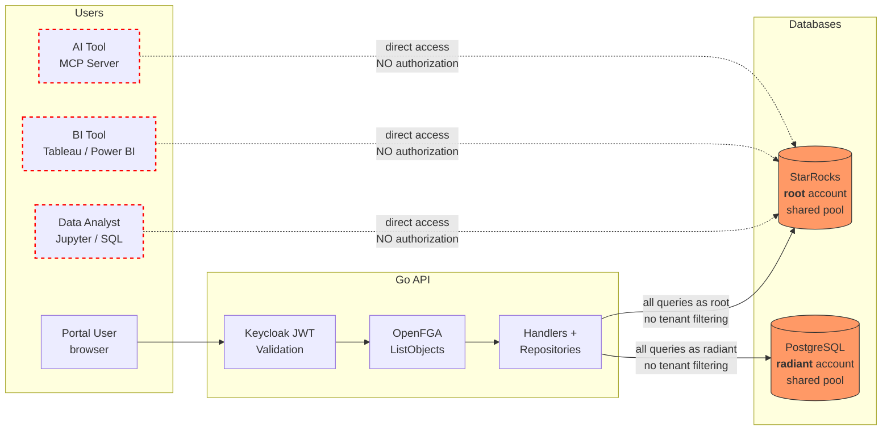
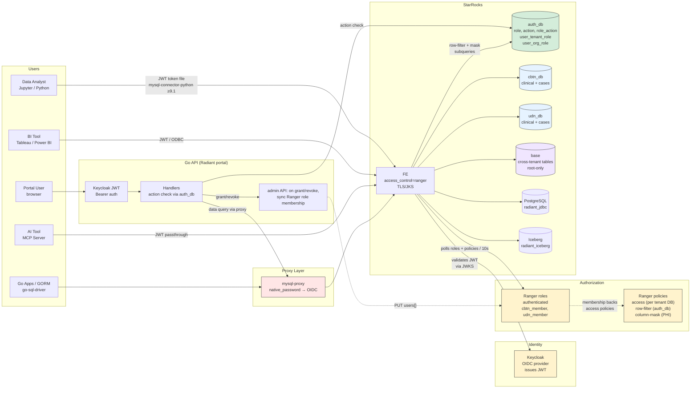
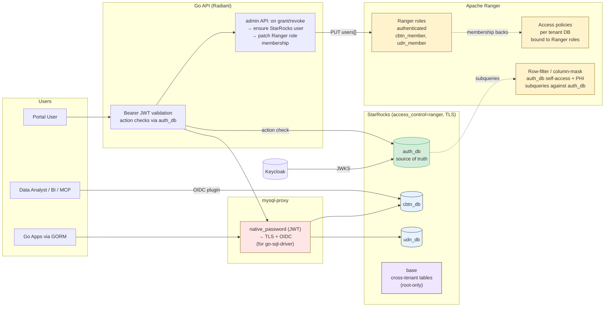
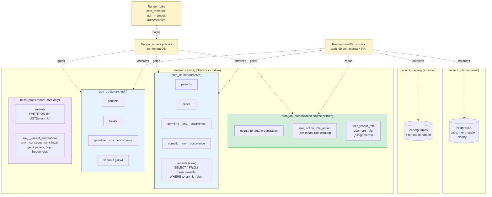

# ADR: Security & Multi-Tenancy Architecture for Radiant Portal

- **Status:** Proposed
- **Date:** 2026-04-28
- **Authors:** Architecture Team
- **Stakeholders:** Security reviewers, compliance officers, platform engineers
- **POC note:** This proposal is informed by a working POC at [`docs/adr/ranger-poc/`](./ranger-poc/README.md), which validates the recommended architecture end-to-end. Each tenant has its own StarRocks database (`cbtn_db`, `udn_db`, …); database visibility is gated by Ranger access policies bound to per-tenant **Ranger roles** (`cbtn_member`, `udn_member`) — `SHOW DATABASES` naturally hides tenants the user doesn't belong to. `auth_db` remains the single source of truth: the admin API maintains Ranger user records and role membership inline with each grant/revoke. Cross-tenant tables (`base.*`) are root-only and exposed to tenant users via `SECURITY NONE` views. PHI access is action-driven: domain roles (geneticist, bioinformatician, …) carry explicit actions (`can_read_pii`, `can_create_case`, …) which Ranger column-mask subqueries read from `auth_db`. Several earlier shapes were explored before settling on this one; only the recommendation and a brief description of the closest alternative (view-based + per-user JWT) are documented here. See [POC validation summary](#poc-validation-summary) for what the POC proved.

---

## Table of Contents

1. [Problem Statement](#1-problem-statement)
2. [Decision Drivers](#2-decision-drivers)
3. [Solution](#3-solution)
   - [Recommended Architecture — Ranger + `auth_db`](#recommended-architecture--ranger--auth_db-poc-validated)
   - [Alternative Solutions](#alternative-solutions)
4. [Proposed Schema Organization](#4-proposed-schema-organization)
5. [Authorization Model (`auth_db`)](#5-authorization-model-auth_db)
6. [Recommendation](#6-recommendation)
7. [Migration Strategy](#7-migration-strategy)
8. [POC-validated details](#poc-validated-details)
   - [TLS requirement for OIDC](#tls-requirement-for-oidc)
   - [MySQL proxy for Go clients](#mysql-proxy-for-go-clients)
   - [REST API tenant routing — path prefix](#rest-api-tenant-routing--path-prefix)
   - [Admin tooling — Radiant portal](#admin-tooling--radiant-portal)
   - [Wildcard `*` for org_id](#wildcard--for-org_id)
   - [POC validation summary](#poc-validation-summary)

---

## 1. Problem Statement

Radiant Portal is a medical/genomic data platform serving clinical and research users. The current architecture has **no multi-tenancy** and relies on a **single layer of authorization** at the Go API level. This is insufficient for a platform handling sensitive health data across multiple organizations.

### Current Architecture



> **Red paths = unprotected.** Direct StarRocks access bypasses all authorization. The Go API is the only enforcement point, and even it does not filter by project (the `allowed` context key is computed but never consumed by repositories).

### Current State

| Aspect | Current Implementation | Risk |
|--------|----------------------|------|
| **StarRocks connection** | Single shared pool (`root` account, 100 max connections) via `backend/internal/database/starrocks.go` | All queries run as a single privileged user; no per-user audit trail in StarRocks |
| **PostgreSQL connection** | Single shared pool (`radiant` account, 100 max connections) via `backend/internal/database/postgres.go` | Same as above |
| **Authorization** | Keycloak RBAC or OpenFGA at Go middleware level (`backend/internal/authorization/`) | Single point of enforcement; bypasses all protection for now |
| **Project-level filtering** | OpenFGA `ListObjects` computes allowed projects, stores in Gin context key `"allowed"` (`openfga.go:117`) -- **but no handler or repository ever reads this value** | Authorization is computed but not enforced at the data layer |
| **Row-level security** | None | Any authenticated user can potentially access any patient/case data |
| **Column masking** | None | No differentiation between identified and de-identified access |
| **Multi-tenancy** | None; single flat namespace | No data isolation between organizations |
| **Audit trail** | Request logging (ginglog) + PostgreSQL history tables for interpretations | No StarRocks query attribution to individual users |

### What Must Change

The platform must support 10--50 tenants (hospitals, research institutions, jurisdictions) sharing a single StarRocks cluster, with:

- **Strict tenant isolation** -- a user sees data from one tenant at a time, with no cross-tenant leakage
- **Group-level access within tenants** -- identified (full PII), de-identified (masked), or no access per group
- **Individual audit trails** -- who queried what, traceable to individual users
- **Defense-in-depth** -- authorization enforced at multiple layers, not just the API
- **Direct StarRocks access for analysts and tools** -- enforcement must work for all access paths, not just the Go API

### Direct StarRocks Access Requirement

**The Go API is not the only access path to StarRocks.** Users will also query StarRocks directly through:

| Access Path | Users | Use Case |
|-------------|-------|----------|
| **Jupyter notebooks** | Data analysts, bioinformaticians | Ad-hoc genomic analysis, cohort queries, statistical exploration |
| **SQL clients** (DBeaver, DataGrip, etc.) | Data analysts, DBAs | Direct SQL queries, data exploration, debugging |
| **BI tools** (Power BI, Tableau) | Analysts, managers, researchers | Dashboards, reports, visualizations |
| **AI tools / MCP servers** | AI agents, copilots | Automated data retrieval, natural language queries via Model Context Protocol |
| **Go API backend** | Portal users (via browser) | Standard portal usage (case browsing, variant interpretation, etc.) |

**This is a critical architectural constraint.** Any option that relies solely on the Go API layer for authorization leaves direct-access users completely unprotected. Tenant isolation, group-level access control, and PII masking must be enforced **at the StarRocks level** for these access paths -- the Go API cannot intercept or filter their queries.


### Target Architecture (Ranger + `auth_db`)



> **Single source of truth**: `auth_db` tables in StarRocks hold the authorization model. Each tenant has its own database (`cbtn_db`, `udn_db`, …); database visibility is enforced by Ranger access policies bound to **Ranger roles** (`cbtn_member`, `udn_member`) — `SHOW DATABASES` naturally hides the wrong tenant. The admin API maintains Ranger role membership as a derived projection of `auth_db.user_tenant_role` / `user_org_role` on every grant or revoke. Cross-tenant tables (e.g., `base.variants`) live in a `base` database with **no Ranger access policy** — only root or admin services account reaches them directly; tenant users go through per-tenant `SECURITY NONE` views. Ranger row-filter and column-mask still drive PHI access via `auth_db` subqueries. Go clients reach StarRocks through `mysql-proxy` (cleartext JWT → TLS + OIDC).

---

## 2. Decision Drivers

### 2.1 Compliance (Critical)

Radiant Portal handles **protected health information (PHI)**. Applicable regulations include:

- **HIPAA-equivalent requirements** -- even outside the US, many partner institutions require HIPAA-aligned controls: minimum necessary access, access logging, breach notification
- **Research ethics board requirements** -- de-identified access for approved researchers, identified access only for treating clinicians

A compliance review will ask: *"If your application layer has a bug, what prevents cross-tenant data exposure?"* With the current architecture, the answer is: nothing.

### 2.2 Auditability

- Every data access must be traceable to an individual user
- Audit logs must be tamper-resistant (not modifiable by the application)
- Write operations on clinical data (interpretations, case assignments) already have PostgreSQL history tables; **read access to genomic data has no audit trail**

### 2.3 Operational Complexity

The team is mid-size. The chosen architecture must be:

- Operable without a dedicated security/infrastructure team
- Deployable on existing infrastructure (Kubernetes, Docker Compose, ECS)
- Maintainable as tenant count grows (no O(n) manual configuration per tenant)

### 2.4 Performance

- StarRocks OLAP queries on occurrence tables (germline SNV, somatic SNV, CNV) are the core user-facing workload
- Current connection pool (100 max, 10 idle) handles production load well
- Any per-request connection establishment adds 10--50ms latency (TCP + auth handshake)
- Partition pruning on the `part` column is critical for query performance on occurrence tables

### 2.5 Multiple Access Paths (Critical)

StarRocks will be accessed directly by data analysts (Jupyter, SQL clients), BI tools (Power BI, Tableau), and AI tools (MCP servers). These access paths bypass the Go API entirely. Authorization enforced only in the Go application layer provides **zero protection** for direct-access users.

This driver **eliminates API-only enforcement as a viable final state** and makes StarRocks-level enforcement (views, DB RBAC, or Ranger) a hard requirement. The architecture must ensure that a data analyst connecting via Jupyter sees exactly the same tenant-scoped, access-level-appropriate data as a portal user -- without relying on the Go API to filter it.

### 2.6 Developer Experience

- 61 repository files, 43 handler files -- scope of code changes matters
- The handler-to-repository pattern has **no service layer** -- handlers call repositories directly
- Repositories store `db *gorm.DB` as a struct field, set once at startup -- changing this to per-request injection is a significant refactor

---

## 3. Solution

### StarRocks 3.5 Capabilities & Constraints

These are hard constraints that apply across all options:

| Capability | StarRocks 3.5 Support | Implication |
|---|---|---|
| JWT authentication | Per-connection via Security Integration + JWKS | Requires abandoning shared pool for per-user identity |
| OAuth 2.0 / OIDC | Authorization Code flow supported | Can authenticate via Keycloak |
| Row-level security (RLS) | Not native -- **requires Apache Ranger** | No built-in row filtering; Ranger is the only path |
| Column masking | Not native -- **requires Apache Ranger** | No built-in column redaction |
| Column-level RBAC | Native since 3.2 (`GRANT SELECT (col) ON table TO user`) | Can restrict which columns a user/role can SELECT |
| OpenFGA integration | Not supported | Ranger is the only external authz option for StarRocks |
| Per-query JWT passthrough | Not supported -- JWT is per-connection only | Cannot change identity mid-connection |
| Catalog/DB-level privileges | Full support (`GRANT ... ON DATABASE/TABLE`) | Can isolate access by database |
| Views | Full support; optimizer pushes predicates through views | Views can enforce row filtering without Ranger |
| Resource group isolation | CPU/memory partitioning per resource group | Can prevent one tenant from starving others |
| Hierarchy | Catalog > Database > Table (no schema concept) | Cannot use PostgreSQL-style schemas within a database |
| **Colocation groups** | StarRocks 2.5.4+ supports colocation groups across **different databases** ([docs](https://docs.starrocks.io/docs/using_starrocks/Colocate_join/)). Tables must share the same `colocate_with` property, bucket count, replica count, and bucket-key types | Colocate JOINs (local, shuffle-free) require co-located tables; the legacy "same database" restriction no longer applies |
| Iceberg catalog support | Native read support via external catalog | Iceberg tables can be queried alongside native tables; JOINs use shuffle (not colocate) |

**Key implication -- colocation groups:** The current StarRocks schema uses colocation to enable colocate JOINs (local, shuffle-free) between tables distributed by `locus_id` — e.g., `germline__snv__occurrence JOIN snv__variant JOIN snv__consequence JOIN clinvar`. Tables in a colocation group must share the same `colocate_with` property, bucket count, replica count, and bucket-key types. **As of StarRocks 2.5.4, colocation groups can span multiple databases**, so the per-tenant database split (`cbtn_db`, `udn_db`) does not block colocation. Tables that need to participate in cross-tenant colocation (shared reference data; partitioned wide tables) can live in the `base` database; tenant users reach them through `SECURITY NONE` views in their tenant DB. Tenant-only tables (`patients`, `cases`, …) live directly in the tenant DB, where colocation is local to that DB. Row-filter and column-mask policies on individual tables do not affect colocation — the POC confirmed this.

**Key references:**
- [StarRocks Security Integration (JWT)](https://docs.starrocks.io/docs/administration/Authentication/#json-web-token-jwt-based-authentication)
- [StarRocks Column-Level Privileges](https://docs.starrocks.io/docs/administration/privilege_item/#column)
- [StarRocks Apache Ranger Integration](https://docs.starrocks.io/docs/administration/ranger_plugin/)
- [StarRocks Resource Groups](https://docs.starrocks.io/docs/administration/management/resource_management/resource_group/)
- [StarRocks Colocate Join](https://docs.starrocks.io/docs/using_starrocks/Colocate_join/)

---

### Recommended Architecture -- Ranger + `auth_db` (POC-validated)

**Summary:** Deploy Apache Ranger to enforce database visibility, row-filtering, and column masking at the StarRocks level. **Authorization data (roles, actions, assignments) lives in StarRocks `auth_db` tables, not in Ranger or OpenFGA.** Each tenant has its own StarRocks database (`cbtn_db`, `udn_db`, …); per-tenant **Ranger roles** (`cbtn_member`, `udn_member`) back the access policies that gate those databases. Ranger row-filter and column-mask still drive auth_db self-access and PHI access via SQL subqueries. Every access path — Go API, Jupyter, BI, MCP — is enforced identically. This is the POC-validated architecture ([`docs/adr/ranger-poc/`](./ranger-poc/README.md)).



> **Strongest enforcement + visible isolation**. The POC validated three layered Ranger constructs — access policies bound to per-tenant Ranger roles for DB visibility, row-filter for auth_db self-access, and column-mask for PHI — totalling roughly a dozen policies that are static (independent of user count). The admin API maintains Ranger role membership and StarRocks user records as a side-effect of grant/revoke; `auth_db` remains the single source of truth.

#### `auth_db`: Authorization as Data

A dedicated database in StarRocks holds the entire authorization model:

| Table | Purpose |
|-------|---------|
| `auth_db.tenant` | Tenant catalog (e.g. `cbtn`, `udn`) |
| `auth_db.organization` | Orgs within tenants (e.g. `chop`, `bch`, `nih-udn`) |
| `auth_db.users` | Identity registry |
| `auth_db.role(tenant_id, role_id, ...)` | **Per-tenant** role catalog (geneticist, bioinformatician, tenant_admin, ...) |
| `auth_db.action(action_id, ...)` | Global action catalog (can_read_pii, can_create_case, ...) |
| `auth_db.role_action(tenant_id, role_id, action_id)` | Role → action mapping (per tenant) |
| `auth_db.user_tenant_role(username, tenant_id, role_id)` | Tenant-scoped role assignments |
| `auth_db.user_org_role(username, tenant_id, org_id, role_id)` | Org-scoped role assignments; `org_id = '*'` means all orgs in tenant |

Granting and revoking happens through the admin API:
- `auth_db.user_tenant_role` / `user_org_role` rows are inserted or deleted (the source-of-truth write).
- The admin API mirrors that change in Ranger as a side-effect — `CREATE USER IF NOT EXISTS` on StarRocks, register the user in Ranger, and add/remove them from `<tenant>_member` and `authenticated` Ranger roles. This Ranger membership is purely a derived projection of `auth_db` and can be rebuilt at any time by re-walking the auth_db assignment tables.

The auth_db subqueries used by row-filter and column-mask policies execute on every query (Ranger plugin polls policies every ~10s, but the subqueries themselves run live), so role-action and PHI changes take effect immediately.

See [Section 5 (Authorization Model)](#5-authorization-model-auth_db) for the full schema, domain roles, and action catalog.

#### Tenant Isolation — Per-Tenant Databases + Ranger Roles

Each tenant has its own StarRocks database (`cbtn_db`, `udn_db`, …). Visibility is enforced at the **database** level: a user who isn't a member of a tenant doesn't see that tenant's database in `SHOW DATABASES`, and any cross-database query is denied at the engine level by Ranger — not via row-filter trickery on a shared table.

The mechanism is per-tenant **Ranger roles** + access policies:

| Ranger role  | Granted SELECT on | Membership |
|--------------|--------------------|-----------|
| `authenticated` | `auth_db.*`           | every user with any tenant assignment |
| `cbtn_member`   | `cbtn_db.*`           | every user with any role at `cbtn`     |
| `udn_member`    | `udn_db.*`            | every user with any role at `udn`      |

Each access policy resembles:

```json
{
  "policyType": 0,
  "name": "sr_select_cbtn",
  "service": "starrocks",
  "resources": {
    "catalog":  { "values": ["default_catalog"] },
    "database": { "values": ["cbtn_db"] },
    "table":    { "values": ["*"] },
    "column":   { "values": ["*"] }
  },
  "policyItems": [{
    "roles": ["cbtn_member"],
    "accesses": [{ "type": "select", "isAllowed": true }]
  }]
}
```

End users get **SELECT only** — writes never run as the authenticated user. ETL is performed by a service account, and API write paths (e.g. case creation) target PostgreSQL rather than StarRocks. The few StarRocks writes that do happen in the POC (seeding, case-create test endpoint) run as root, which Ranger bypasses.

> **Why Ranger roles, not StarRocks native `GRANT … TO ROLE`?** With `access_control = ranger`, Ranger is the *sole* authority — its plugin throws `AccessDeniedException` when no policy matches and never falls through to native StarRocks RBAC ([`RangerAccessController.hasPermission`](https://github.com/StarRocks/starrocks/blob/main/fe/fe-core/src/main/java/com/starrocks/authorization/ranger/RangerAccessController.java)). Native GRANT therefore cannot be combined with Ranger row-filter / column-mask. Ranger roles deliver the same end-user behavior — `SHOW DATABASES` hides the wrong tenant, cross-DB queries are denied at the engine — through Ranger's own role primitive.

**Membership maintenance — a derived projection of `auth_db`.** The admin API performs three idempotent side-effects after every `auth_db.user_tenant_role` / `user_org_role` insert:

1. `CREATE USER IF NOT EXISTS '<u>' IDENTIFIED WITH authentication_jwt …` on StarRocks.
2. `POST /service/xusers/secure/users` to register the user in Ranger (required before any role membership change).
3. `PUT /service/roles/roles/{id}` to add the user to Ranger roles `authenticated` and `<tenant>_member`.

On revoke: the API checks whether the user has any remaining row in `user_tenant_role` ∪ `user_org_role` for that tenant; if not, it removes them from `<tenant>_member`. `auth_db` remains the single source of truth — Ranger role membership is computable from auth_db at any point, and re-running a grant is a no-op self-heal if Ranger drifted.

A `root` exemption is built into the Ranger plugin (no user stubs needed for root). The seed Ranger roles are created once by the init script with the initial membership read from auth_db.

#### PII Masking — Action-Driven, Not Role-Tier-Driven

Rather than two tiers (identified/deidentified groups), PII access is controlled by an explicit **action** `can_read_pii` mapped to roles in `auth_db.role_action`. A user who holds any role with `can_read_pii` at an org sees that org's PHI unmasked; otherwise it is masked.

PHI columns (`mrn`, `first_name`, `date_of_birth`) use a CUSTOM mask expression that checks, via subquery, whether the user has `can_read_pii` at the row's `org_id`. The expression handles both specific-org assignments and the `*` wildcard (all orgs in tenant) via `UNION`:

```sql
CASE WHEN org_id IN (
  -- specific-org assignments with can_read_pii
  SELECT uor.org_id FROM auth_db.user_org_role uor
  JOIN auth_db.role_action ra
    ON ra.tenant_id = uor.tenant_id AND ra.role_id = uor.role_id
  WHERE uor.username = <current_user>
    AND ra.action_id = 'can_read_pii'
    AND uor.org_id != '*'
  UNION
  -- wildcard assignments expanded to all orgs in tenant
  SELECT o.org_id FROM auth_db.organization o
  JOIN auth_db.user_org_role uor
    ON uor.tenant_id = o.tenant_id AND uor.org_id = '*'
  JOIN auth_db.role_action ra
    ON ra.tenant_id = uor.tenant_id AND ra.role_id = uor.role_id
  WHERE uor.username = <current_user>
    AND ra.action_id = 'can_read_pii'
) THEN {col} ELSE '***' END
```

Tenant roles (`tenant_owner`, `tenant_admin`, `researcher`) **never** grant `can_read_pii` — PII access is strictly org-scoped. A tenant owner who manages the tenant but has no org-level role sees PHI masked.

#### Connection Model & Access Paths

- **Go API (Radiant portal):** Bearer JWT end-to-end. The JWT is forwarded through `mysql-proxy` to StarRocks, which validates it against Keycloak's JWKS. Every query runs as the authenticated user — Ranger evaluates the user's Ranger-role membership (for DB visibility) and `current_user()` (for auth_db row-filter and column-mask subqueries) — producing per-user audit attribution without a GORM refactor (no per-request DB instance needed; the proxy fans out to a per-JWT backend connection).
- **Python analysts:** `mysql-connector-python ≥ 9.1.0` supports the `authentication_openid_connect_client` plugin natively.
- **BI tools:** JDBC/ODBC connection with JWT as password, or a gateway if the tool lacks OIDC support.
- **MCP servers / AI tools:** forward the user's JWT to StarRocks; queries are attributed to the user.
- **Go clients using `go-sql-driver/mysql`:** cannot speak the OIDC plugin; they go through `mysql-proxy` which translates `mysql_clear_password` (JWT as cleartext password) to TLS + OIDC. See [MySQL proxy for Go clients](#mysql-proxy-for-go-clients).
- **StarRocks must have TLS enabled** — the OIDC client plugin refuses to transmit the JWT over a cleartext channel. See [TLS requirement for OIDC](#tls-requirement-for-oidc).

**Policy evaluation overhead:** The StarRocks Ranger plugin caches policies locally (poll interval default 10s), so Ranger evaluation does not add a network round-trip per query. The only per-query cost is the subquery against `auth_db` tables (small, primary-key lookups — typically <5 ms).

#### Audit Trail

| Layer | Attribution | Coverage |
|-------|------------|----------|
| Application log | User from JWT | All HTTP requests to Go API |
| StarRocks audit log | Individual user (every access path) | All queries — portal, Jupyter, BI, MCP |
| Ranger audit log | Individual user + policy applied | All access decisions, including denials |
| PostgreSQL history tables | `created_by` / `updated_by` | Portal write operations |

**Per-user attribution in StarRocks** is available for every access path because every query runs under the user's JWT-authenticated identity. The portal's Bearer JWT is forwarded to StarRocks via the proxy, so portal queries are attributed to `alice` (not to a shared `svc_cbtn` pool account). Ranger audit logs additionally record which policy made the decision, supporting compliance reviews.

#### Direct StarRocks Access

Ranger policies enforce row-filter and column masking regardless of query origin. Every access path is equally protected:

- **Data analysts (Jupyter / DBeaver):** JWT-authenticated connection; `SHOW DATABASES` returns only the tenants they belong to, and column masks apply on the data they can read.
- **BI tools (Tableau / Power BI):** JWT-authenticated (native OIDC where supported, or via gateway). Dashboards reflect only authorized data without BI-layer configuration.
- **AI tools (MCP):** JWT passthrough from the user's session; the AI agent cannot see data the user is not authorized for.

#### Operational Complexity

| Component | Change Required | Ongoing Burden |
|-----------|----------------|----------------|
| Apache Ranger | Deploy Ranger + Ranger PG; create tenant access policies + Ranger roles | Version upgrades; policies stay static, roles grow only with tenants |
| StarRocks Ranger plugin | Bundled in StarRocks 3.5; enable `access_control = ranger` | None |
| StarRocks | Per-tenant database DDL on tenant onboarding; JWT users auto-created on first grant; TLS keystore; Ranger service registration | Per-tenant DDL for new tenants (one-time) |
| `auth_db` | Create schema, seed domain roles/actions | Admin UI (Radiant portal) handles all CRUD |
| Keycloak | Realm + client + users | Identity provider standard ops |
| mysql-proxy | Small Go binary (~400 LOC) | Single process; deploy alongside StarRocks |

The POC's actual footprint is :
- **~12 static Ranger policies + 1 access policy per tenant DB + 1 Ranger role per tenant** (no per-user policies).
- **No external sync daemon** — `auth_db` is the source of truth and the admin API patches Ranger membership inline with each grant/revoke.
- **Admin UI replaces manual Ranger administration** for day-to-day ops.

#### Compliance Posture

| Criterion | Assessment |
|-----------|------------|
| Defense-in-depth | **Strong** — Ranger enforcement is independent of API code |
| Principle of least privilege | **Fully satisfied** — row-filter + column masking per user |
| Blast radius of a bug | **Minimal** — API bugs cannot grant extra data; Ranger is the authoritative gate |
| Audit independence | **Best** — StarRocks audit log + Ranger audit log, per-user across all paths |
| Direct access support | **Full** — analysts, BI, MCP all subject to the same policies as the portal |

#### Migration Path (POC-validated)

1. Deploy Ranger (Ranger Admin + Ranger PG) 
2. Create `auth_db` schema; seed domain roles and actions; migrate existing users into `auth_db` 
3. Register Ranger service; create per-tenant Ranger roles + access policies; apply auth_db row-filter and PHI column-mask policies; enable `access_control = ranger` in Starrocks
4. Build and deploy `mysql-proxy` for Go API + `go-sql-driver` clients 
5. Update Go API: action checks via `auth_db`; Bearer JWT forwarded to StarRocks via proxy 
6. Radiant admin UI (tenant switcher, role CRUD, user assignments) 


#### Portal-Specific Action Authorization

Although Ranger doesn't directly cover portal actions (interpret, upload, approve, invite), they are governed by the **same** `auth_db` source of truth. The Go API evaluates action permissions by running the equivalent subquery against `auth_db.role_action` (same query shape Ranger uses). No sync, no dual systems:

```go
// Pseudo-code: handler checks can_create_case at the target org
hasAction := authDB.QueryRow(`
  SELECT 1 FROM user_org_role uor
  JOIN role_action ra ON ra.tenant_id=uor.tenant_id AND ra.role_id=uor.role_id
  WHERE uor.username = ? AND uor.tenant_id = ? AND (uor.org_id = ? OR uor.org_id = '*')
    AND ra.action_id = 'can_create_case'
  LIMIT 1
`, user, tenant, org)
```

---

### Alternative Solutions

#### Views + per-user JWT (brief)

**Idea:** instead of Apache Ranger, achieve tenant isolation and PII control entirely with **StarRocks views** layered over the base tables. Each tenant gets a per-tenant view database that filters by `tenant_id`; per-tenant identified/de-identified view databases enforce PHI access. All connections (portal and direct) are per-user JWT.

**Why it's a real alternative:**
- Same end-state for direct access (Jupyter, BI, MCP go through views; per-user audit comes from JWT).
- No Apache Ranger / Ranger-PG dependency — pure StarRocks DDL.

**Why the Ranger + `auth_db` approach is preferred:**
- View-based RLS is **less expressive** than Ranger row-filter and column-mask. Ranger lets us write a static auth_db row-filter and per-column mask whose expressions subquery `auth_db`; the view-based design needs one view per (tenant × variant of access) and DDL changes whenever roles or PII rules change. (The recommended architecture does use views in one narrow place — to expose per-tenant slices of cross-tenant `base` tables — but those are static and gated by Ranger access policies, not the masking layer.)
- **PII masking through views requires per-group identified / de-identified databases**. Database proliferation grows with `tenants × groups`; each tenant onboarding is a multi-DDL operation.

## 4. Proposed Schema Organization

This section describes StarRocks and PostgreSQL schema changes for the recommended architecture (Ranger + `auth_db`). The authorization model itself is in [Section 5](#5-authorization-model-auth_db).

### StarRocks Database Hierarchy



Key changes from the current schema:

- **New database `auth_db`** holds roles, actions, assignments (see [Section 5](#5-authorization-model-auth_db)).
- **One database per tenant** (`cbtn_db`, `udn_db`, …). Tenant-scoped tables (patients, cases, occurrences, exomiser, …) live in the tenant DB — **no `tenant_id` column on the base tables**, isolation comes from the database boundary itself. Ranger access policies bound to per-tenant Ranger roles control visibility; `SHOW DATABASES` returns only the tenants the user belongs to.
- **`base` database for cross-tenant tables.** Tables that are physically co-located across tenants (shared reference data; partitioned wide tables that benefit from a single colocation group) live in `base`. There is **no Ranger access policy on `base`**, so Ranger denies any non-root SELECT. Tenant users reach `base` tables only through per-tenant **`SECURITY NONE` views** in `cbtn_db` / `udn_db` (default StarRocks view security mode); the view bypasses the underlying-table privilege check while exposing only the tenant's slice.
- **Shared reference tables stay in `base`** so that colocation groups on `HASH(locus_id)` (required for fast `occurrence JOIN variant JOIN consequence JOIN clinvar`) are preserved. As of StarRocks 2.5.4, colocation groups can span databases — but `base` keeps the layout simple.

### StarRocks Schema

#### Per-tenant databases

Each tenant gets its own database holding the tenant's clinical and operational tables. No `tenant_id` column on the base tables — isolation comes from the database boundary, enforced by Ranger access policies bound to Ranger roles (see below). `org_id VARCHAR(50) NOT NULL` is kept on tables that expose PHI, since column-mask subqueries key on it.

```sql
CREATE DATABASE cbtn_db;
CREATE TABLE cbtn_db.patients (id INT, first_name VARCHAR, …, org_id VARCHAR);
CREATE TABLE cbtn_db.cases    (case_id INT, patient_id INT, …, org_id VARCHAR);
CREATE TABLE cbtn_db.germline__snv__occurrence (…, org_id VARCHAR);
-- per-tenant view over the cross-tenant base table:
CREATE VIEW cbtn_db.variants AS
  SELECT id, patient_id, gene_symbol, classification
  FROM base.variants WHERE tenant_id = 'cbtn';

CREATE DATABASE udn_db;
-- same shape; udn_db.variants filters tenant_id = 'udn'
```

Tenant onboarding is a one-time DDL step: create the tenant database, create its tables, create a Ranger role `<tenant>_member`, and create a Ranger access policy `sr_select_<tenant>` granting that role SELECT on `<tenant>_db.*`.

#### Cross-tenant `base` tables (root-only) + per-tenant views

For datasets that benefit from a single physical store (e.g. a `variants` table partitioned by tenant for cross-tenant analytics, or shared reference tables in a colocation group), use the `base` database with **no Ranger access policy** — Ranger's plugin denies non-root by default ([source](https://github.com/StarRocks/starrocks/blob/main/fe/fe-core/src/main/java/com/starrocks/authorization/ranger/RangerAccessController.java)). Expose each tenant's slice via a view in the tenant DB:

```sql
CREATE TABLE base.variants (
    id INT NOT NULL, tenant_id VARCHAR(50) NOT NULL, …
) PRIMARY KEY (id, tenant_id)
PARTITION BY LIST (tenant_id) (
    PARTITION p_cbtn VALUES IN ('cbtn'),
    PARTITION p_udn  VALUES IN ('udn')
)
DISTRIBUTED BY HASH(id);

-- Default StarRocks view mode is SECURITY NONE: the view bypasses the
-- access check on base.variants. Only SELECT on the view itself is
-- required — and that's covered by sr_select_cbtn (role cbtn_member).
CREATE VIEW cbtn_db.variants AS
  SELECT id, patient_id, gene_symbol, classification
  FROM base.variants WHERE tenant_id = 'cbtn';
```

This lets root run cross-tenant analytics directly on `base.*`, while tenant users see exactly one tenant's rows, with the tenant_id column not exposed.

#### Ranger policies

| Policy | Type | Resource | Subjects | Notes |
|--------|------|----------|----------|-------|
| `sr_select_auth` | access | `auth_db.*` | role `authenticated` | Everyone with any tenant assignment |
| `sr_select_<tenant>` | access | `<tenant>_db.*` | role `<tenant>_member` | One per tenant DB; **SELECT only** — ETL runs as a service account, API writes go to PostgreSQL, and POC seeding runs as root |
| _(no policy)_ | — | `base.*` | — | Absent ⇒ Ranger denies all non-root |
| `sr_rowfilter_user_tenant_role` | row-filter | `auth_db.user_tenant_role` | `{USER}` | `username = current_user()` |
| `sr_rowfilter_user_org_role` | row-filter | `auth_db.user_org_role` | `{USER}` | `username = current_user()` |
| `sr_rowfilter_users` | row-filter | `auth_db.users` | `{USER}` | `username = current_user()` |
| `sr_mask_mrn`, `sr_mask_first_name`, `sr_mask_dob`, … | column-mask | PHI columns in each tenant DB | `{USER}` | `can_read_pii` subquery against `auth_db` |

A baseline production deployment is roughly: 1 access policy on `auth_db` + 1 access policy per tenant DB + 3 auth_db row-filter policies + N column masks (one per PHI column, multi-valued database resource covering all tenant DBs). Tenant scoping at the row level (the previous `tenant_id IN (…)` row-filter) is no longer needed — the database boundary handles it.


---

## 5. Authorization Model (`auth_db`)

**Authorization is data, not a separate service.** The POC validated that a small set of tables is simpler, faster to query, and more auditable than an external authorization service (e.g. OpenFGA) for this domain. Ranger row-filter and column-mask expressions read these tables via SQL subqueries on every query. Permissions take effect on the next policy-cache poll (default ~10 s) with zero custom sync infrastructure.

> **Production vs. POC.** In production, `auth_db` will be a **PostgreSQL database federated into StarRocks via the JDBC catalog** (`radiant_jdbc`). Authorization is a transactional/operational concern — small row count, frequent INSERT/UPDATE/DELETE from the admin API, ACID semantics — which fits PostgreSQL and matches where the rest of Radiant's transactional state already lives. The federated catalog lets Ranger row-filter and column-mask subqueries continue to address `auth_db.*` from inside StarRocks, while the admin API writes go directly to PostgreSQL. **For POC simplicity, `auth_db` is implemented as native StarRocks Primary Key tables** in the same cluster — same schema, same subquery shape, same source-of-truth role; only the storage engine differs. Migrating from POC to production is a one-time copy + JDBC-catalog registration step; no policy expressions or admin-API code paths change.

This section documents the schema, the domain role model, the action catalog, and the assignment rules.

### 5.1 Schema

All tables are **StarRocks Primary Key tables** in database `auth_db` (POC) — equivalent PostgreSQL tables in production, federated via `radiant_jdbc.auth_db`. Distribute by the leading key.

```sql
-- Identity / structure
CREATE TABLE auth_db.users (
    username    VARCHAR(100) PRIMARY KEY,
    created_at  DATETIME,
    disabled_at DATETIME NULL
);

CREATE TABLE auth_db.tenant (
    tenant_id   VARCHAR(50) PRIMARY KEY,
    tenant_name VARCHAR(200)
);

CREATE TABLE auth_db.organization (
    org_id    VARCHAR(50) PRIMARY KEY,
    tenant_id VARCHAR(50),
    org_name  VARCHAR(200)
);

-- Role catalog (per tenant — tenants define their own roles)
CREATE TABLE auth_db.role (
    tenant_id   VARCHAR(50),
    role_id     VARCHAR(50),
    role_name   VARCHAR(200),
    scope       VARCHAR(10),   -- 'org' or 'tenant'
    description VARCHAR(500),
    PRIMARY KEY (tenant_id, role_id)
);

-- Action catalog (global — actions are immutable across tenants)
CREATE TABLE auth_db.action (
    action_id   VARCHAR(50) PRIMARY KEY,
    scope       VARCHAR(10),   -- 'org' or 'tenant'
    description VARCHAR(500)
);

-- Role → Action mapping (per tenant)
CREATE TABLE auth_db.role_action (
    tenant_id VARCHAR(50),
    role_id   VARCHAR(50),
    action_id VARCHAR(50),
    PRIMARY KEY (tenant_id, role_id, action_id)
);

-- Tenant-scoped role assignments
CREATE TABLE auth_db.user_tenant_role (
    username   VARCHAR(100),
    tenant_id  VARCHAR(50),
    role_id    VARCHAR(50),
    granted_at DATETIME,
    granted_by VARCHAR(100),
    PRIMARY KEY (username, tenant_id, role_id)
);

-- Org-scoped role assignments
-- org_id = '*' means "all organizations in this tenant"
CREATE TABLE auth_db.user_org_role (
    username   VARCHAR(100),
    tenant_id  VARCHAR(50),
    org_id     VARCHAR(50),   -- specific org_id or '*'
    role_id    VARCHAR(50),
    granted_at DATETIME,
    granted_by VARCHAR(100),
    PRIMARY KEY (username, tenant_id, org_id, role_id)
);
```

### 5.2 Domain Roles (Example for CBTN)

Roles are **domain concepts** (job titles), not access tiers. Tenants define their own roles with their own action mappings. CBTN and UDN may name roles differently (e.g. CBTN uses `submitter`, UDN uses `clinical_coordinator`).

**Org-scoped roles** — assigned per organization via `user_org_role`:

| Role | Grants |
|------|--------|
| `geneticist` | `can_read_pii`, `can_create_case`, `can_edit_case`, `can_assign_case`, `can_interpret_variant`, `can_comment_variant`, `can_generate_report`, `can_download_file` |
| `bioinformatician` | `can_read_pii`, `can_create_case`, `can_edit_case`, `can_generate_report`, `can_download_file` |
| `submitter` | `can_create_case`, `can_edit_case` |
| `data_analyst` | `can_read_pii` (read-only PHI) |

**Tenant-scoped roles** — assigned per tenant via `user_tenant_role`:

| Role | Grants |
|------|--------|
| `researcher` | `can_search_case`, `can_view_kb` |
| `tenant_admin` | `can_search_case`, `can_view_kb`, `can_manage_project`, `can_invite_user`, `can_manage_codesystem`, `can_manage_genepanel`, `can_manage_org` |
| `tenant_owner` | all `tenant_admin` actions **+** `can_delete_org` |

**Important rule:** **tenant-scoped roles never grant `can_read_pii`.** A `tenant_owner` can manage the tenant but sees PHI masked unless they additionally hold an org-level role with `can_read_pii`. This is a deliberate separation of "administrative authority over a tenant" from "permission to see patient identifiers".

### 5.3 Action Catalog

Actions are global and immutable across tenants. The catalog is seeded once; tenants map actions to their roles via `role_action`.

**Org-scoped actions** — enforced against a specific org:

| Action | Enforced by | Purpose |
|--------|-------------|---------|
| `can_read_pii` | **Ranger column mask** | Reveal PHI columns (`mrn`, `first_name`, `last_name`, `date_of_birth`) for rows in this org |
| `can_create_case` | Go API | Create a case |
| `can_edit_case` | Go API | Edit a case |
| `can_delete_case` | Go API | Delete a case |
| `can_assign_case` | Go API | Assign a case to a user |
| `can_interpret_variant` | Go API | Interpret a variant |
| `can_comment_variant` | Go API | Comment on a variant |
| `can_generate_report` | Go API | Generate a report |
| `can_download_file` | Go API | Download a file |

**Tenant-scoped actions** — enforced against a tenant:

| Action | Enforced by | Purpose |
|--------|-------------|---------|
| `can_search_case` | Go API | Search/view cases across the tenant |
| `can_view_kb` | Go API | View knowledge base |
| `can_manage_project` | Go API | Create/manage projects |
| `can_invite_user` | Go API | Invite users into the tenant |
| `can_manage_codesystem` | Go API | Manage code systems |
| `can_manage_genepanel` | Go API | Manage gene panels |
| `can_manage_org` | Go API | Create/manage organizations |
| `can_delete_org` | Go API | Delete organizations |

### 5.4 The `*` Wildcard for `org_id`

`user_org_role.org_id = '*'` means *the user holds this role at every organization in `tenant_id`*. A common use case: a tenant-wide geneticist who can interpret variants for any site.

```sql
-- Jane is a geneticist at every org in CBTN
INSERT INTO auth_db.user_org_role (username, tenant_id, org_id, role_id, granted_by)
VALUES ('jane', 'cbtn', '*', 'geneticist', 'admin1');
```

Ranger row-filter and column-mask expressions expand `*` via `UNION` with `auth_db.organization`:

```sql
-- Expand *-assignments into all orgs of the tenant
SELECT o.org_id FROM auth_db.organization o
JOIN auth_db.user_org_role uor
  ON uor.tenant_id = o.tenant_id AND uor.org_id = '*'
WHERE uor.username = <current_user>
```

### 5.5 Example Assignments

```sql
-- Jane: tenant member of CBTN, geneticist at every CBTN org
INSERT INTO auth_db.user_tenant_role VALUES ('jane', 'cbtn', 'researcher', NOW(), 'admin1');
INSERT INTO auth_db.user_org_role     VALUES ('jane', 'cbtn', '*', 'geneticist', NOW(), 'admin1');

-- Alice: geneticist only at CHOP
INSERT INTO auth_db.user_tenant_role VALUES ('alice', 'cbtn', 'researcher', NOW(), 'admin1');
INSERT INTO auth_db.user_org_role     VALUES ('alice', 'cbtn', 'chop', 'geneticist', NOW(), 'admin1');

-- Bob: tenant_owner of CBTN; he administrates the tenant but sees PHI masked
INSERT INTO auth_db.user_tenant_role VALUES ('bob', 'cbtn', 'tenant_owner', NOW(), 'admin1');

-- Carol: tenant-member of both CBTN and UDN; bioinformatician at CHOP
INSERT INTO auth_db.user_tenant_role VALUES ('carol', 'cbtn', 'researcher', NOW(), 'admin1');
INSERT INTO auth_db.user_tenant_role VALUES ('carol', 'udn',  'researcher', NOW(), 'admin1');
INSERT INTO auth_db.user_org_role     VALUES ('carol', 'cbtn', 'chop', 'bioinformatician', NOW(), 'admin1');

-- Dan: researcher-only (no org role, no PII access anywhere)
INSERT INTO auth_db.user_tenant_role VALUES ('dan', 'cbtn', 'researcher', NOW(), 'admin1');

-- admin1: tenant_admin on both CBTN and UDN
INSERT INTO auth_db.user_tenant_role VALUES ('admin1', 'cbtn', 'tenant_admin', NOW(), 'root');
INSERT INTO auth_db.user_tenant_role VALUES ('admin1', 'udn',  'tenant_admin', NOW(), 'root');
```

Resulting PHI visibility (row visible + PHI column unmasked):

| Patient row | Jane (geneticist `*`) | Alice (geneticist chop) | Bob (tenant_owner) | Carol (bioinf chop) | Dan (researcher) |
|-------------|-----|-------|-----|-------|-----|
| **CHOP** (cbtn) | Full | Full | Masked | Full | Masked |
| **BCH** (cbtn) | Full | Masked | Masked | Masked | Masked |
| **NIH-UDN** (udn) | Invisible | Invisible | Invisible | Masked | Invisible |

### 5.6 Auth-Table Isolation

Users can read `auth_db.role`, `auth_db.action`, `auth_db.role_action` (needed so Ranger subqueries work), but **only their own rows** of `user_tenant_role`, `user_org_role`, and `users`. This prevents one user from enumerating others' permissions. Achieved via row-filter policies on those three tables:

```json
{
  "policyType": 2, "name": "sr_rowfilter_user_tenant_role",
  "service": "starrocks",
  "resources": {
    "catalog":  { "values": ["default_catalog"] },
    "database": { "values": ["auth_db"] },
    "table":    { "values": ["user_tenant_role"] }
  },
  "rowFilterPolicyItems": [
    { "users": ["root"],    "rowFilterInfo": { "filterExpr": "1=1" } },
    { "users": ["{USER}"],  "rowFilterInfo": { "filterExpr": "username = replace(substring_index(current_user(), '@', 1), char(39), '')" } }
  ]
}
```

### 5.7 Active Tenant Selection

Because a user can belong to multiple tenants (e.g. Carol in CBTN + UDN, admin1 in both), the caller must communicate the **active tenant** on every request. The POC uses a **path prefix** — `/api/{tenant}/patients`, `/api/{tenant}/admin/roles` — rather than a header or JWT claim. See [REST API tenant routing — path prefix](#rest-api-tenant-routing--path-prefix) for the rationale and industry precedent (Atlassian Connect, GitHub, Twilio).

For direct StarRocks access (Jupyter, BI, MCP), the client issues SQL against a specific table; the row-filter automatically restricts rows to tenants the user belongs to. No "active tenant" concept is needed — the user simply sees everything they are authorized to see across all their tenants in a single query.

---

## 6. POC-validated details

This section collects findings from the POC ([`docs/adr/ranger-poc/`](./ranger-poc/README.md)) that are too operational to sit inside the main options discussion but are required to reproduce the recommended architecture.

### TLS requirement for OIDC

The StarRocks `authentication_openid_connect_client` plugin refuses to transmit the JWT over a cleartext TCP connection. **TLS is mandatory.** The POC configures StarRocks FE with a JKS keystore:

```properties
# fe.conf additions
access_control = ranger
ssl_keystore_location = /data/deploy/starrocks/fe/conf/starrocks-keystore.jks
ssl_keystore_password = changeit
ssl_key_password      = changeit
```

Keystore generation (one-time):

```bash
openssl req -x509 -newkey rsa:2048 -keyout starrocks-key.pem \
  -out starrocks-cert.pem -days 365 -nodes -subj '/CN=starrocks'
openssl pkcs12 -export -in starrocks-cert.pem -inkey starrocks-key.pem \
  -out starrocks.p12 -name starrocks -password pass:changeit
keytool -importkeystore -srckeystore starrocks.p12 -srcstoretype PKCS12 \
  -srcstorepass changeit -destkeystore starrocks-keystore.jks \
  -deststoretype JKS -deststorepass changeit -noprompt
```

Clients must connect with TLS (`ssl_disabled=false` in `mysql-connector-python`; matching flags on the Go proxy's backend dial — see below). In production, replace the self-signed certificate with a trusted cert.

### MySQL proxy for Go clients

**Problem:** `go-sql-driver/mysql` does not implement the `authentication_openid_connect_client` MySQL auth plugin. Any Go service using GORM or the standard `database/sql` can't authenticate directly to a JWT-only StarRocks user.

**Solution:** A small (~400 LOC) Go TCP-level proxy (`proxy/main.go`) sits between Go clients and StarRocks:

1. Client opens a plain TCP connection to the proxy.
2. Proxy advertises `mysql_clear_password` in its handshake, so the client sends the raw JWT as a cleartext password.
3. Proxy dials StarRocks, upgrades to TLS, and sends a JWT-authenticated handshake.
4. When StarRocks issues an AuthSwitchRequest to `authentication_openid_connect_client`, the proxy responds with the OIDC payload: **capability flag `0x01` + length-encoded JWT bytes**. (Sending the raw JWT alone fails silently — the leading flag byte is required by the plugin.)
5. After authentication succeeds, the proxy becomes a transparent bidirectional byte copier.

Because the JWT crosses the client↔proxy hop in cleartext, deploy the proxy on the same host (or a trusted network) as the Go service, and restrict StarRocks's `mysql_clear_password`-advertising port to that host.

**Alternatives considered:**
- **Python clients:** Use `mysql-connector-python ≥ 9.1.0` natively. No proxy required.
- **Upstream the plugin into `go-sql-driver`:** Feasible but out of scope for this POC.
- **Use `authentication_jwt` (StarRocks-specific plugin):** Behaves similarly; tested and works, but `authentication_openid_connect_client` is the MySQL-protocol standard and is what mainstream clients (MySQL Shell, BI tools) implement.

### REST API tenant routing — path prefix

The Radiant REST API uses a **path prefix** for tenant context: `/api/{tenant}/patients`, `/api/{tenant}/admin/roles`, etc. Global endpoints (not tenant-scoped) remain at the root: `/auth/me`, `/auth/my-tenants`, `/admin/my-tenants`, `/health`.

#### Options considered

| Approach | Example | Verdict |
|----------|---------|---------|
| **Path prefix** | `/cbtn/patients` | ✅ Chosen |
| HTTP header | `X-Tenant: cbtn` then `/patients` | ❌ Rejected |
| Subdomain | `cbtn.api.radiant.example/patients` | ❌ Impractical (DNS/TLS per tenant) |
| Query param | `/patients?tenant=cbtn` | ❌ Not idiomatic |
| JWT claim | Tenant in token | ❌ Multi-tenant users would need multiple tokens |

#### Why path prefix

| Criterion | Path `/{tenant}/…` | Header `X-Tenant` |
|-----------|-------------------|-------------------|
| Visible in logs / tracing | ✅ Immediate | ❌ Needs log configuration |
| Cacheable (CDN, HTTP cache) | ✅ Cache key is the URL | ❌ Requires `Vary: X-Tenant` |
| Bookmarkable / shareable | ✅ | ❌ |
| CORS complexity | ✅ None | ❌ Preflight for custom header |
| REST semantics | ✅ Tenant is a resource container | ⚠️ Headers are metadata, not resources |
| OpenAPI / Swagger | ✅ Tenant as path param is standard | ⚠️ Global header applies everywhere |

#### Industry precedent

- **Atlassian Cloud** — subdomain for direct site access (`acme.atlassian.net`); **path prefix** for Connect apps and cross-site APIs (`api.atlassian.com/ex/jira/{cloudId}/…`). Does not use a tenant header.
- **GitHub** — `/orgs/{org}/…`, `/repos/{owner}/{repo}/…`.
- **Twilio** — `/Accounts/{AccountSid}/…`.
- **Shopify**, **Salesforce** — subdomain.

Subdomain isn't practical for a developer/POC environment (DNS, certificates, wildcard TLS). Path prefix matches Atlassian's fallback pattern and GitHub/Twilio's choice for their REST APIs.

### Admin tooling — Radiant portal

`admin-ui/` is a Vite + React 19 + Tailwind + keycloak-js SPA served by Nginx. It is the admin tooling for tenant/role/user management referenced in §6.

**Pages:**
- **Patients** — tenant-filtered patient list with Ranger masking applied live.
- **Admin** — visible only when the active tenant is in `/admin/my-tenants`. Two tabs:
  - **Users** — per-user cards showing tenant + org role assignments; grant/revoke via `auth_db.*` inserts/deletes.
  - **Roles** — list of tenant-scoped and org-scoped roles with their action chips. Create/edit/delete roles; check/uncheck actions in a form that writes to `auth_db.role` + `auth_db.role_action`.

**Tenant switcher behavior:**
- Patients page: lists **all** tenants the user belongs to (from `/auth/my-tenants`).
- Admin tab: visible only when the active tenant is in the intersection with `/admin/my-tenants` (i.e. user has `can_manage_org` at that tenant).

**Auth flow:**
- keycloak-js redirect-based login against the same realm as StarRocks.
- Bearer JWT attached to every API call.
- Admin API endpoints require `tenant_admin` or `tenant_owner` at the target tenant.

### Wildcard `*` for `org_id`

`user_org_role.org_id = '*'` assigns a role at **every organization in `tenant_id`**. Typical use case: a tenant-wide geneticist.

```sql
INSERT INTO auth_db.user_org_role (username, tenant_id, org_id, role_id, granted_by)
VALUES ('jane', 'cbtn', '*', 'geneticist', 'admin1');
```

Ranger expressions that walk org-level assignments `UNION` a specific-org query with a wildcard-expanded query:

```sql
-- Orgs where the user has can_read_pii at a specific org
SELECT uor.org_id FROM auth_db.user_org_role uor
JOIN auth_db.role_action ra
  ON ra.tenant_id = uor.tenant_id AND ra.role_id = uor.role_id
WHERE uor.username = <current_user>
  AND ra.action_id = 'can_read_pii'
  AND uor.org_id != '*'
UNION
-- Wildcard * expanded to every org in the tenant
SELECT o.org_id FROM auth_db.organization o
JOIN auth_db.user_org_role uor
  ON uor.tenant_id = o.tenant_id AND uor.org_id = '*'
JOIN auth_db.role_action ra
  ON ra.tenant_id = uor.tenant_id AND ra.role_id = uor.role_id
WHERE uor.username = <current_user>
  AND ra.action_id = 'can_read_pii'
```

The Go API uses the same pattern (`OR uor.org_id = '*'` in action checks).

---

## Appendix A: Glossary

| Term | Definition |
|------|-----------|
| **Tenant** | Top-level organizational boundary. A hospital, research institution, or jurisdiction. A user belongs to one or more tenants but operates in one at a time. |
| **Group** | A subdivision within a tenant (e.g., a department, cohort, research project cluster). The unit of data access control. |
| **Identified access** | User can see full patient-identifiable data: names, health card numbers, dates of birth. |
| **De-identified access** | User can see patient data with PII fields masked or redacted. |
| **PII fields** | `patient.first_name`, `patient.last_name`, `patient.jhn`, `patient.date_of_birth`, `patient.submitter_patient_id` |
| **Active tenant** | The tenant context a user is currently operating in. Sent via `X-Active-Tenant` HTTP header (portal) or selected database (direct access). |
| **Direct access** | Querying StarRocks directly (not through the Go API) via SQL clients, Jupyter notebooks, BI tools (Power BI, Tableau), or AI tools (MCP servers). |
| **MCP** | Model Context Protocol -- a standard for AI agents to interact with external tools and data sources. MCP servers can query StarRocks on behalf of users. |
| **Service account** | A StarRocks user used by the Go API to execute queries on behalf of portal users. Per-tenant, not per-user. (e.g., `svc_cbtn`) |
| **Direct-access user** | A StarRocks user authenticated via JWT for direct queries. Per-user, fully attributed in audit logs. (e.g., `analyst_bob`) |

## Appendix B: StarRocks 3.5 Documentation References

- [Authentication overview](https://docs.starrocks.io/docs/administration/Authentication/)
- [JWT-based authentication](https://docs.starrocks.io/docs/administration/Authentication/#json-web-token-jwt-based-authentication)
- [Privilege system](https://docs.starrocks.io/docs/administration/privilege_overview/)
- [Column-level privileges](https://docs.starrocks.io/docs/administration/privilege_item/#column)
- [Apache Ranger integration](https://docs.starrocks.io/docs/administration/ranger_plugin/)
- [Resource groups](https://docs.starrocks.io/docs/administration/management/resource_management/resource_group/)
- [CREATE VIEW](https://docs.starrocks.io/docs/sql-reference/sql-statements/view/CREATE_VIEW/)
- [External JDBC catalog](https://docs.starrocks.io/docs/data_source/catalog/jdbc_catalog/)

## Appendix C: Current Codebase References

| File | Relevance to This ADR |
|------|----------------------|
| `backend/internal/database/starrocks.go` | Single shared pool; must change for per-tenant pools |
| `backend/internal/database/postgres.go` | Single shared pool; tenant table migrations |
| `backend/internal/authorization/openfga.go` | `AllowedContextKey` computed but unused; dual-mode authorizer |
| `backend/scripts/init-openfga/model.fga` | Current model; needs tenant/group types |
| `backend/cmd/api/main.go` | Route setup, middleware chain, repository wiring |
| `backend/internal/repository/cases.go` | `project_id` in model but not filtered |
| `backend/internal/repository/snv_occurrences.go` | Core occurrence query builder |
| `backend/internal/repository/germline_snv_occurrences.go` | Germline SNV queries needing tenant scope |
| `backend/internal/repository/somatic_snv_occurrences.go` | Somatic SNV queries needing tenant scope |
| `backend/internal/repository/germline_cnv_occurrences.go` | CNV queries needing tenant scope |
| `backend/internal/utils/repositories.go` | JOIN helpers with hardcoded FederationName |
| `backend/internal/types/table_field.go` | Table struct; shared tables need db-qualified names |
| `backend/internal/server/middlewares.go` | RequireRole middleware; needs tenant middleware addition |
| `backend/scripts/init-sql/init_starrocks.sql` | Current DDL; must be refactored for base/shared/view DBs |
| `backend/scripts/init-sql/migrations/000001_init.up.sql` | PostgreSQL schema; add tenant tables |
