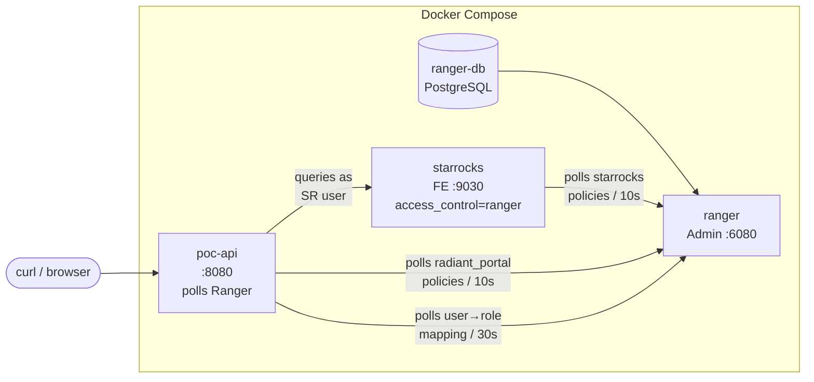
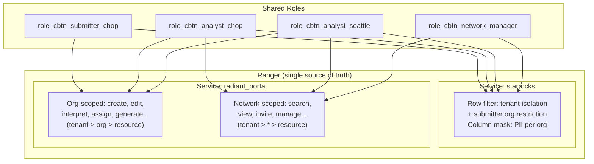
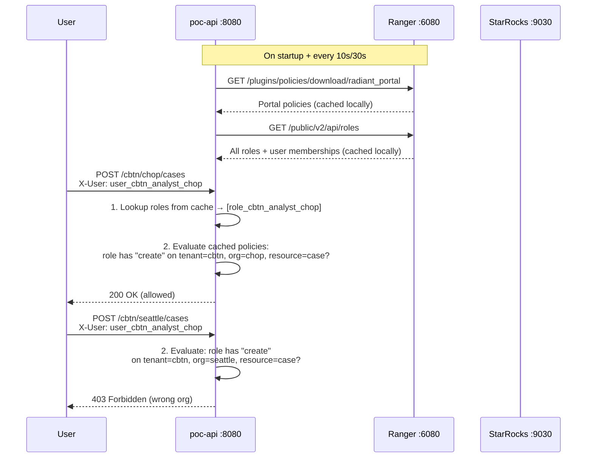

# StarRocks + Apache Ranger POC

Proof-of-concept for using Apache Ranger as a **single source of truth** for both data access (StarRocks row-filtering + column masking) and portal action authorization (org-scoped and network-scoped).

Related ADR: [../multi-tenancy-security.md](../multi-tenancy-security.md) (Option B -- Ranger Full Push-Down).

## Architecture



| Container | Image | Port | Purpose |
|-----------|-------|------|---------|
| `ranger-db` | `apache/ranger-db:2.7.0` | - | PostgreSQL for Ranger metadata |
| `ranger` | `apache/ranger:2.7.0` | 6080 | Ranger Admin UI + policy REST API |
| `starrocks` | `starrocks/allin1-ubuntu:3.5.0` | 9030, 8030 | StarRocks with `access_control = ranger` |
| `poc-api` | Built from `./api` | 8080 | Go API evaluating Ranger portal policies |

## Two Ranger Services, One Set of Roles



### Service: `starrocks`

Controls **data access** -- which rows a user sees, which columns are masked. Enforced by the StarRocks FE Ranger plugin.

### Service: `radiant_portal`

Controls **portal actions** -- who can create cases, interpret variants, invite users, etc. Enforced by the POC Go API which polls and evaluates policies locally.

Resource hierarchy: **`tenant > organization > resource`**

- **Org-scoped** actions (create case, interpret variant, assign, generate report): policy specifies the exact organization (e.g., `chop`). A CHOP analyst cannot write at Seattle.
- **Network-scoped** actions (search cases, view KB, invite users): policy uses `organization = *`. Any analyst in the tenant can search.

## POC API

The Go API in `./api/` demonstrates how an application can use Ranger as its authorization backend without any Ranger Java library:



**Key design:**
- **Roles are NOT hardcoded** -- fetched from Ranger via `GET /service/public/v2/api/roles` (single call, all roles + members)
- **Policies are NOT hardcoded** -- downloaded from Ranger every 10s, evaluated locally (~50 lines of Go)
- **Tenant and organization come from the URL path** -- not from user metadata
- Only StarRocks credentials are hardcoded (in production: Keycloak JWT)

### URL Pattern

```
/{tenant}/{organization}/{resource-path}
```

| Example | Scope | Action |
|---------|-------|--------|
| `GET /cbtn/*/cases` | Network | Search cases across CBTN |
| `POST /cbtn/chop/cases` | Org | Create case at CHOP |
| `GET /cbtn/chop/cases/1/interpret` | Org | Interpret variant (CHOP case) |
| `POST /cbtn/chop/reports/generate` | Org | Generate report (CHOP case) |
| `POST /cbtn/*/users/invite` | Network | Invite user to CBTN |

Use `*` as the organization for network-scoped actions.

### How Policies Are Evaluated

The API downloads the full `radiant_portal` policy set from Ranger every 10s. On each request it checks:

> Does any of the user's roles have the required **access type** on the required **tenant + organization + resource**?

This is a simple in-memory lookup over the cached policy JSON -- no network call per request.

## How StarRocks Communicates with Ranger

StarRocks FE embeds a Ranger plugin that polls Ranger Admin for the `starrocks` service policies:

- Downloads the **entire policy set** and evaluates locally per query
- **Unauthenticated** in this POC; production would add basic auth in `ranger-starrocks-security.xml`
- If Ranger is down, StarRocks uses **last cached policies**

## Quick Start

```bash
cd docs/adr/ranger-poc
docker compose up -d --build

# Watch init container
docker compose logs -f init
```

Wait until it prints "All Ranger roles and policies created!" (~2-3 minutes).

## User & Role Management

**Naming convention:**
- `user_*` -- users (exist in both StarRocks and Ranger)
- `role_*` -- roles (exist only in Ranger, shared across both services)

| System | What | Why |
|--------|------|-----|
| **StarRocks** | `CREATE USER ... IDENTIFIED BY '...'` | Authentication |
| **Ranger** | User stub via `POST /xusers/secure/users` | Ranger needs the name to assign it to a role |
| **Ranger** | Roles via `POST /public/v2/api/roles` | Policies reference roles. Users inherit permissions via membership. |

### Test Users

| User | Password | Role | Persona |
|------|----------|------|---------|
| `user_cbtn_submitter_chop` | `submitterpass` | `role_cbtn_submitter_chop` | Submitter at CHOP |
| `user_cbtn_analyst_chop` | `analystchoppass` | `role_cbtn_analyst_chop` | Analyst at CHOP |
| `user_cbtn_analyst_seattle` | `analystseattlepass` | `role_cbtn_analyst_seattle` | Analyst at Seattle |
| `user_cbtn_network_manager` | `networkmanagerpass` | `role_cbtn_network_manager` | Network manager for CBTN |

## Permissions Matrix

From the [Notion Role & Security doc](https://www.notion.so/ferlab/Role-and-Security-33eb0fcecb3d8080b746ef12aa3dccfc):

| Action | Scope | submitter | analyst | network_manager |
|--------|-------|-----------|---------|-----------------|
| Create/edit/delete case | org | Y | Y | - |
| Search/view cases | network | - | Y | - |
| Interpret variant | org | - | Y | - |
| Assign case | org | - | Y | - |
| Generate report | org | - | Y | - |
| Download file | org | - | Y | - |
| Knowledge base search | network | - | Y | - |
| Create projects | network | - | - | Y |
| Invite users | network | - | - | Y |
| Manage code systems/gene panels | network | - | - | Y |

**Org-scoped** = action restricted to the user's organization.
**Network-scoped** = action available across the entire tenant.

## Data Model

| id | first_name | mrn | date_of_birth | tenant | organization |
|----|-----------|-----|---------------|--------|-------------|
| 1-3 | Alice, Bob, Charlie | MRN-000001..3 | various | cbtn | chop |
| 4-5 | Diana, Eve | MRN-000004..5 | various | cbtn | seattle |
| 6-7 | Frank, Grace | MRN-000006..7 | various | udp | nih |
| 8-9 | Hank, Ivy | MRN-000008..9 | various | udp | duke |

## StarRocks Data Policies

| Policy | Type | What it does |
|--------|------|-------------|
| `sr_select_patients` | Access (0) | Grants SELECT to all roles |
| `sr_rowfilter_patients` | Row-filter (2) | Submitter: `tenant='cbtn' AND organization='chop'`; Analysts/NM: `tenant='cbtn'` |
| `sr_mask_mrn` | Masking (1) | CHOP analyst: chop=full, others=`***`. Seattle analyst: seattle=full, others=`***` |
| `sr_mask_dob` | Masking (1) | Same pattern for date_of_birth (year-only for other orgs) |

## Verify

### Portal action authorization

```bash
# CHOP analyst creates case at CHOP → 200 (org matches)
curl -s -H "X-User: user_cbtn_analyst_chop" -X POST http://localhost:8080/cbtn/chop/cases | jq

# CHOP analyst creates case at SEATTLE → 403 (wrong org)
curl -s -H "X-User: user_cbtn_analyst_chop" -X POST http://localhost:8080/cbtn/seattle/cases | jq

# Seattle analyst creates case at SEATTLE → 200
curl -s -H "X-User: user_cbtn_analyst_seattle" -X POST http://localhost:8080/cbtn/seattle/cases | jq

# CHOP analyst interprets at CHOP → 200
curl -s -H "X-User: user_cbtn_analyst_chop" http://localhost:8080/cbtn/chop/cases/1/interpret | jq

# CHOP analyst interprets at SEATTLE → 403 (wrong org)
curl -s -H "X-User: user_cbtn_analyst_chop" http://localhost:8080/cbtn/seattle/cases/1/interpret | jq

# Submitter creates case at CHOP → 200
curl -s -H "X-User: user_cbtn_submitter_chop" -X POST http://localhost:8080/cbtn/chop/cases | jq

# Submitter creates case at SEATTLE → 403 (wrong org)
curl -s -H "X-User: user_cbtn_submitter_chop" -X POST http://localhost:8080/cbtn/seattle/cases | jq

# Analyst searches across network → 200 + data
curl -s -H "X-User: user_cbtn_analyst_chop" http://localhost:8080/cbtn/*/cases | jq

# Submitter searches → 403 (submitters can't search)
curl -s -H "X-User: user_cbtn_submitter_chop" http://localhost:8080/cbtn/*/cases | jq

# Network manager invites → 200
curl -s -H "X-User: user_cbtn_network_manager" -X POST http://localhost:8080/cbtn/*/users/invite | jq

# Analyst invites → 403
curl -s -H "X-User: user_cbtn_analyst_chop" -X POST http://localhost:8080/cbtn/*/users/invite | jq
```

### StarRocks data enforcement

```bash
# Direct StarRocks: analyst at CHOP sees all CBTN, PII masked for seattle
mysql -h127.0.0.1 -P9030 -uuser_cbtn_analyst_chop -panalystchoppass \
  -e 'SELECT id, first_name, mrn, date_of_birth, organization FROM poc_db.patients ORDER BY id;'

# Submitter sees only CHOP rows (row-filter restricts to their org)
mysql -h127.0.0.1 -P9030 -uuser_cbtn_submitter_chop -psubmitterpass \
  -e 'SELECT id, first_name, mrn, date_of_birth, organization FROM poc_db.patients ORDER BY id;'
```

## Adding a New User

### 1. Create in StarRocks

```sql
mysql -h127.0.0.1 -P9030 -uroot -e "CREATE USER user_new IDENTIFIED BY 'newpass';"
```

### 2. Create stub in Ranger

```bash
curl -u admin:rangerR0cks! -X POST -H "Content-Type: application/json" \
  http://localhost:6080/service/xusers/secure/users \
  -d '{"name":"user_new","password":"Passw0rd!","userRoleList":["ROLE_USER"],"firstName":"user_new","userSource":0}'
```

### 3. Add to a Ranger role

```bash
ROLE=$(curl -s -u admin:rangerR0cks! http://localhost:6080/service/public/v2/api/roles/name/role_cbtn_analyst_chop)
ROLE_ID=$(echo "$ROLE" | python3 -c 'import sys,json; print(json.load(sys.stdin)["id"])')
echo "$ROLE" | python3 -c "
import sys, json
role = json.load(sys.stdin)
role['users'].append({'name': 'user_new', 'isAdmin': False})
json.dump(role, sys.stdout)
" | curl -s -u admin:rangerR0cks! -X PUT -H "Content-Type: application/json" \
  "http://localhost:6080/service/public/v2/api/roles/${ROLE_ID}" -d @-
```

No policy edit needed. The user inherits all permissions (data + portal actions) from the role.

## Key Findings

1. **Custom Ranger service definitions work** -- `radiant_portal` with `tenant > organization > resource` hierarchy enforces org-scoped portal actions
2. **Same roles across both services** -- one role controls StarRocks data access AND portal action permissions
3. **Org-scoped enforcement via Ranger** -- a CHOP analyst cannot create cases or interpret variants at Seattle
4. **Network-scoped actions use `organization = *`** in policies
5. **User-to-role mapping fetched from Ranger** -- single API call, no hardcoded roles in the Go API
6. **Policies fetched from Ranger** -- evaluated locally in ~50 lines of Go
7. **Ranger as single source of truth** -- no OpenFGA, no hardcoded permission maps
8. **Ranger roles work, groups do NOT** for StarRocks row-filter enforcement
9. **Conditional column masking works** -- `CUSTOM` + `CASE WHEN` for per-org PII masking
10. **Cannot bypass row filters** -- even with explicit WHERE clauses

## Ranger Admin UI

- URL: http://localhost:6080
- Credentials: `admin` / `rangerR0cks!`
- Two services visible: `starrocks` and `radiant_portal`

## Cleanup

```bash
docker compose down -v
```
