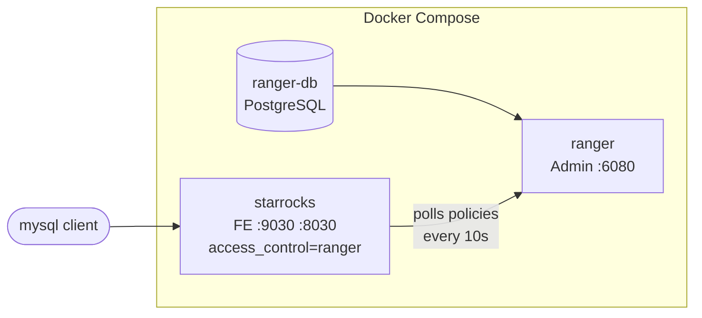
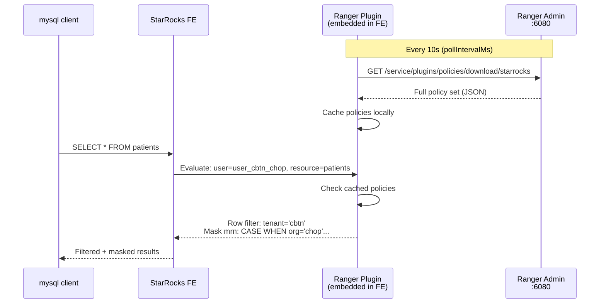
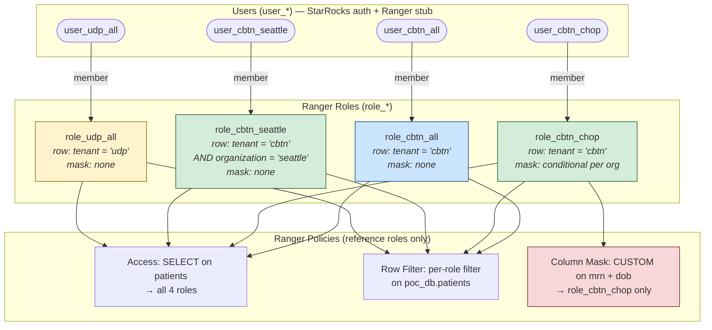

# StarRocks + Apache Ranger POC

Proof-of-concept for testing Apache Ranger row-level filtering and conditional column masking on StarRocks 3.5.

Related ADR: [../multi-tenancy-security.md](../multi-tenancy-security.md) (Option B -- Ranger Full Push-Down).

## Architecture



| Container | Image | Port | Purpose |
|-----------|-------|------|---------|
| `ranger-db` | `apache/ranger-db:2.7.0` | - | PostgreSQL for Ranger metadata |
| `ranger` | `apache/ranger:2.7.0` | 6080 | Ranger Admin UI + policy REST API |
| `starrocks` | `starrocks/allin1-ubuntu:3.5.0` | 9030, 8030, 8040 | StarRocks with `access_control = ranger` |

## How StarRocks Communicates with Ranger

StarRocks FE embeds a **Ranger plugin** that polls Ranger Admin for policies. Configuration is in `ranger-conf/ranger-starrocks-security.xml`, mounted into the FE conf directory.



**Key points:**
- The plugin downloads the **entire policy set** and evaluates locally -- no per-query call to Ranger Admin
- The poll endpoint (`/service/plugins/policies/download/{serviceName}`) is **unauthenticated by default** in this POC
- In production, add authentication to `ranger-starrocks-security.xml`:
  ```xml
  <property>
      <name>ranger.plugin.starrocks.policy.rest.client.auth.type</name>
      <value>basic</value>
  </property>
  <property>
      <name>ranger.plugin.starrocks.policy.rest.client.auth.username</name>
      <value>admin</value>
  </property>
  <property>
      <name>ranger.plugin.starrocks.policy.rest.client.auth.password</name>
      <value>rangerR0cks!</value>
  </property>
  ```
  Or use Kerberos/SSL for production-grade security.
- If Ranger Admin is down, StarRocks continues using the **last cached policies** -- no outage

## Init Container

One init container (`init`) runs after startup:
1. Registers StarRocks service definition in Ranger
2. Creates user stubs (`user_*`) in Ranger
3. Creates Ranger roles (`role_*`) and assigns users to them
4. Creates `poc_db`, `patients` table, sample data, and StarRocks users
5. Creates access, row-filter, and column masking policies referencing roles

## Quick Start

```bash
cd docs/adr/ranger-poc
docker compose up -d

# Watch init container
docker compose logs -f init
```

Wait until it prints "All Ranger roles and policies created!" (takes ~2-3 minutes total). Then wait ~15 seconds for StarRocks to sync the policies.

## User & Role Management

**Naming convention:**
- `user_*` -- users (exist in both StarRocks and Ranger)
- `role_*` -- roles (exist only in Ranger)

**Users exist in both systems** for different purposes:

| System | What | Why |
|--------|------|-----|
| **StarRocks** | `CREATE USER user_cbtn_chop IDENTIFIED BY '...'` | Authentication -- the user logs in here |
| **Ranger** | User stub via `POST /xusers/secure/users` | Ranger needs the name to assign it to a role |

**Roles exist only in Ranger.** Policies reference roles, not users. Users inherit permissions through role membership. To onboard a new user, just add them to an existing role -- no policy edit needed.



## Data Model

| id | first_name | mrn | date_of_birth | tenant | organization |
|----|-----------|-----|---------------|--------|-------------|
| 1 | Alice | MRN-000001 | 1992-03-15 | cbtn | chop |
| 2 | Bob | MRN-000002 | 1988-07-22 | cbtn | chop |
| 3 | Charlie | MRN-000003 | 2001-11-08 | cbtn | chop |
| 4 | Diana | MRN-000004 | 1995-01-30 | cbtn | seattle |
| 5 | Eve | MRN-000005 | 1999-06-12 | cbtn | seattle |
| 6 | Frank | MRN-000006 | 2003-09-25 | udp | nih |
| 7 | Grace | MRN-000007 | 1990-12-03 | udp | nih |
| 8 | Hank | MRN-000008 | 2005-04-17 | udp | duke |
| 9 | Ivy | MRN-000009 | 1997-08-29 | udp | duke |

## Policies

### Access policy (policyType=0)

Grants `SELECT` on `poc_db.patients` to all 4 roles.

### Row-filter policy (policyType=2)

One policy, multiple filter items per role:

| Role | Filter Expression | Rows Visible |
|------|-------------------|--------------|
| `role_cbtn_all` | `tenant = 'cbtn'` | 5 (all CBTN) |
| `role_cbtn_chop` | `tenant = 'cbtn'` | 5 (all CBTN -- masking handles per-org PII) |
| `role_cbtn_seattle` | `tenant = 'cbtn' AND organization = 'seattle'` | 2 (Seattle only) |
| `role_udp_all` | `tenant = 'udp'` | 4 (all UDP) |

### Column masking policies (policyType=1)

One policy per column, using CUSTOM `CASE WHEN` for per-organization conditional masking. Applied only to `role_cbtn_chop`:

| Column | Mask Expression | chop rows | seattle rows |
|--------|----------------|-----------|-------------|
| `mrn` | `CASE WHEN organization = 'chop' THEN {col} ELSE '***' END` | `MRN-000001` | `***` |
| `date_of_birth` | `CASE WHEN organization = 'chop' THEN {col} ELSE date_trunc('year', {col}) END` | `1992-03-15` | `1995-01-01` |

## Test Users & Expected Results

| User | Password | Role | Rows | mrn (chop) | mrn (seattle) | dob (chop) | dob (seattle) |
|------|----------|------|------|-----------|--------------|-----------|--------------|
| `root` | *(none)* | admin | 9 | full | full | full | full |
| `user_cbtn_all` | `cbtnallpass` | `role_cbtn_all` | 5 | full | full | full | full |
| `user_cbtn_chop` | `cbtnchoppass` | `role_cbtn_chop` | 5 | full | `***` | full | year only |
| `user_cbtn_seattle` | `cbtnseattlepass` | `role_cbtn_seattle` | 2 | full | full | full | full |
| `user_udp_all` | `udpallpass` | `role_udp_all` | 4 | full | n/a | full | n/a |

## Verify

```bash
# root -- all 9 rows, no masking
mysql -h127.0.0.1 -P9030 -uroot \
  -e 'SELECT id, first_name, mrn, date_of_birth, tenant, organization FROM poc_db.patients ORDER BY id;'

# user_cbtn_all -- 5 rows (all CBTN), no masking
mysql -h127.0.0.1 -P9030 -uuser_cbtn_all -pcbtnallpass \
  -e 'SELECT id, first_name, mrn, date_of_birth, tenant, organization FROM poc_db.patients ORDER BY id;'

# user_cbtn_chop -- 5 rows (all CBTN), chop=unmasked, seattle=masked
mysql -h127.0.0.1 -P9030 -uuser_cbtn_chop -pcbtnchoppass \
  -e 'SELECT id, first_name, mrn, date_of_birth, tenant, organization FROM poc_db.patients ORDER BY id;'

# user_cbtn_seattle -- 2 rows (Seattle only), no masking
mysql -h127.0.0.1 -P9030 -uuser_cbtn_seattle -pcbtnseattlepass \
  -e 'SELECT id, first_name, mrn, date_of_birth, tenant, organization FROM poc_db.patients ORDER BY id;'

# user_udp_all -- 4 rows (all UDP), no masking
mysql -h127.0.0.1 -P9030 -uuser_udp_all -pudpallpass \
  -e 'SELECT id, first_name, mrn, date_of_birth, tenant, organization FROM poc_db.patients ORDER BY id;'
```

**Expected output for `user_cbtn_chop` (conditional masking):**
```
id  first_name  mrn         date_of_birth  tenant  organization
1   Alice       MRN-000001  1992-03-15     cbtn    chop          <-- unmasked
2   Bob         MRN-000002  1988-07-22     cbtn    chop          <-- unmasked
3   Charlie     MRN-000003  2001-11-08     cbtn    chop          <-- unmasked
4   Diana       ***         1995-01-01     cbtn    seattle       <-- masked
5   Eve         ***         1999-01-01     cbtn    seattle       <-- masked
```

## Adding a New User

### 1. Create user in StarRocks (authentication)

```sql
mysql -h127.0.0.1 -P9030 -uroot -e "CREATE USER user_new IDENTIFIED BY 'newpass';"
```

### 2. Create user stub in Ranger

```bash
curl -u admin:rangerR0cks! -X POST \
  -H "Content-Type: application/json" \
  http://localhost:6080/service/xusers/secure/users \
  -d '{"name":"user_new","password":"Passw0rd!","userRoleList":["ROLE_USER"],"firstName":"user_new","userSource":0}'
```

### 3. Add user to an existing Ranger role

```bash
# Get the role, add the user, PUT it back
ROLE=$(curl -s -u admin:rangerR0cks! http://localhost:6080/service/public/v2/api/roles/name/role_cbtn_all)
ROLE_ID=$(echo "$ROLE" | python3 -c 'import sys,json; print(json.load(sys.stdin)["id"])')

echo "$ROLE" | python3 -c "
import sys, json
role = json.load(sys.stdin)
role['users'].append({'name': 'user_new', 'isAdmin': False})
json.dump(role, sys.stdout)
" | curl -s -u admin:rangerR0cks! -X PUT \
  -H "Content-Type: application/json" \
  "http://localhost:6080/service/public/v2/api/roles/${ROLE_ID}" -d @-
```

No policy edit needed. `user_new` inherits all permissions from `role_cbtn_all`.

## Row-Filter Assignment Types

| Assignment Type | Works with StarRocks? | Notes |
|----------------|----------------------|-------|
| **Per-role** | **Yes** | Recommended. Policies reference roles; users inherit via membership. |
| **Per-user** | **Yes** | Works but doesn't scale -- policy must be edited per user. |
| **Per-group** | **No** | StarRocks Ranger plugin does not resolve group membership. |

## Column Masking Types

| Mask Type | Effect | Example |
|-----------|--------|---------|
| `MASK` | Redact: uppercase->X, lowercase->x, digits->0 | `MRN-000001` -> `XXX-000000` |
| `MASK_NULL` | Replace with NULL | `MRN-000001` -> `NULL` |
| `MASK_HASH` | SHA-256 hash | `MRN-000001` -> `a3f2b8c9...` |
| `MASK_DATE_SHOW_YEAR` | Truncate to Jan 1 of that year | `1992-03-15` -> `1992-01-01` |
| `MASK_NONE` | No masking (whitelist from otherwise masked column) | `MRN-000001` -> `MRN-000001` |
| `CUSTOM` | Any SQL expression. `{col}` = column placeholder. | `CASE WHEN org = 'x' THEN {col} ELSE '***' END` |

## Key Findings

1. **Row-level filtering works** on StarRocks 3.5 with Ranger 2.7 -- verified with JOINs, CTEs, subqueries, window functions, aggregates
2. **Conditional column masking works** -- `CUSTOM` mask with `CASE WHEN` enables per-row masking based on any column (e.g., organization)
3. **Row filter + column masking stack** -- both apply simultaneously
4. **One row-filter policy per table** -- multiple filter items (one per role) in a single policy
5. **Ranger roles work, groups do NOT** -- StarRocks plugin resolves role membership but not group membership
6. **Policies reference roles, not users** -- users are assigned to roles; onboarding requires no policy edit
7. **Multi-table row-filter policies work** -- list multiple tables if they share the same filter column
8. **Users must exist in both systems** -- StarRocks (`user_*`) for auth, Ranger (stubs) for role assignment
9. **Cannot bypass row filters** -- explicit `WHERE tenant = 'udp'` by a CBTN user returns 0 rows
10. **Policy sync takes ~10-15s** -- configurable via `pollIntervalMs` in `ranger-starrocks-security.xml`

## Ranger Admin UI

- URL: http://localhost:6080
- Credentials: `admin` / `rangerR0cks!`
- Tabs: "Access" (policyType=0), "Masking" (policyType=1), "Row Level Filter" (policyType=2)

## Troubleshooting

**Policies not taking effect:**
- Wait 10-15 seconds for StarRocks to poll Ranger
- Check FE config: `docker compose exec starrocks cat /data/deploy/starrocks/fe/conf/fe.conf | grep access_control`
- Check FE logs: `docker compose logs starrocks | grep -i ranger`

**Init container failed:**
```bash
docker compose logs init
docker compose up -d init
```

## Cleanup

```bash
docker compose down -v
```
