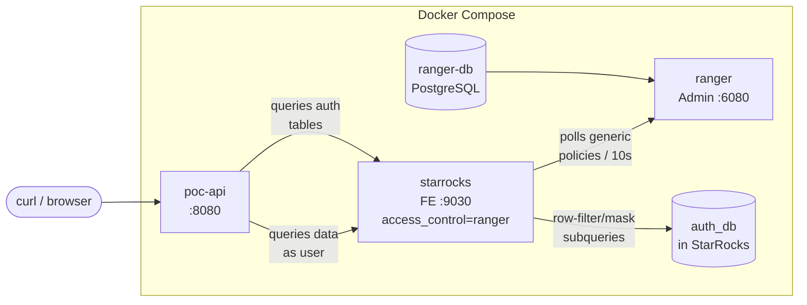

# StarRocks + Apache Ranger POC (Auth Tables)

Proof-of-concept where the **authorization model lives in StarRocks tables** and **Ranger enforces data access** via generic, subquery-based policies. Adding or removing a user's role is a simple `INSERT`/`DELETE` in `auth_db` -- no Ranger policy changes needed.

Related ADR: [../multi-tenancy-security.md](../multi-tenancy-security.md)

## Architecture



| Container | Image | Port | Purpose |
|-----------|-------|------|---------|
| `ranger-db` | `apache/ranger-db:2.7.0` | - | PostgreSQL for Ranger metadata |
| `ranger` | `apache/ranger:2.7.0` | 6080 | Ranger Admin UI + policy REST API |
| `starrocks` | `starrocks/allin1-ubuntu:3.5.0` | 9030, 8030 | StarRocks with `access_control = ranger` |
| `poc-api` | Built from `./api` | 8080 | Go API (queries auth tables, no Ranger polling) |

## How It Works

### Authorization Model (auth_db)

The source of truth for "who can do what" lives in StarRocks tables:

```
auth_db.users              - identity registry
auth_db.tenant             - tenant definitions
auth_db.organization       - organizations within tenants
auth_db.user_tenant_role   - tenant-scoped role assignments
auth_db.user_org_role      - organization-scoped role assignments
```

### Role Hierarchy

**Org chain** (scoped to one organization):
```
org_member   - read PHI for this org
org_editor   - + create/edit/delete operational data at this org
org_admin    - + manage users at this org
org_owner    - + manage org_admins
```

**Tenant chain** (scoped to all organizations in a tenant):
```
tenant_member  - read de-identified data across all orgs (PHI masked)
tenant_admin   - + PHI unmasked everywhere + write anywhere + manage orgs
tenant_owner   - + delete orgs + manage tenant_admins
```

Any org role implies `tenant_member` in the containing tenant.

### Data Access (Ranger + auth_db subqueries)

Ranger holds ~11 **generic** policies (not per-user). All policies reference a single `role_authenticated` Ranger role containing all users. The policies use `IN(SELECT ...)` subqueries against auth tables:

**Access policies** (policyType=0):

| Policy | Database | Permissions |
|--------|----------|-------------|
| `sr_select_auth` | auth_db | SELECT |
| `sr_select_clinical` | poc_db | SELECT |
| `sr_access_operational` | operational_db | SELECT, INSERT |

**Row-filter policies** (policyType=2) -- auth table isolation:

| Policy | Table | Filter |
|--------|-------|--------|
| `sr_rowfilter_user_tenant_role` | auth_db.user_tenant_role | `username = current_user()` |
| `sr_rowfilter_user_org_role` | auth_db.user_org_role | `username = current_user()` |
| `sr_rowfilter_users` | auth_db.users | `username = current_user()` |

Users can only see their own rows in auth tables. `auth_db.tenant` and `auth_db.organization` are reference data with no row filter.

**Row-filter policies** (policyType=2) -- data tenant isolation:

| Policy | Table | Filter |
|--------|-------|--------|
| `sr_rowfilter_patients` | poc_db.patients | `tenant_id IN (SELECT tenant_id FROM auth_db.user_tenant_role WHERE username=...)` |
| `sr_rowfilter_cases` | operational_db.cases | Same tenant isolation |

**Column masking policies** (policyType=1):

| Policy | Column | Mask expression |
|--------|--------|----------------|
| `sr_mask_mrn` | mrn | `CASE WHEN org_id IN (SELECT org_id FROM user_org_role WHERE ...) OR tenant_id IN (SELECT ... WHERE role IN ('tenant_admin','tenant_owner')) THEN col ELSE '***'` |
| `sr_mask_first_name` | first_name | Same pattern |
| `sr_mask_dob` | date_of_birth | Same pattern, masked to year-only |

**Note**: Ranger groups do NOT work with StarRocks Ranger plugin (role membership is resolved, group membership is not). All generic policies use a single `role_authenticated` Ranger role.

### Portal Action Authorization (Go API + auth_db)

The Go API queries auth tables directly for authorization. No Ranger portal service needed.

```
Permission matrix (hardcoded in Go API):
  org_editor+ at org       - create/edit/delete case, interpret variant, generate report, download file
  tenant_member+ at tenant - search/view cases, search/view kb
  tenant_admin+ at tenant  - all org_editor actions at ANY org + manage projects/users/etc.
```

## Test Users

| User | Password | Tenant Roles | Org Roles |
|------|----------|-------------|-----------|
| `jane` | `janepass` | tenant_member(cbtn) | org_member(chop), org_member(bch) |
| `alice` | `alicepass` | tenant_member(cbtn) | org_member(chop) |
| `bob` | `bobpass` | tenant_owner(cbtn) | _(none, implied by tenant_owner)_ |
| `carol` | `carolpass` | tenant_member(cbtn), tenant_member(udn) | org_member(chop) |
| `dan` | `danpass` | tenant_member(cbtn) | _(none)_ |

## Expected Test Matrix

| Patient row | Jane | Alice | Bob | Carol | Dan |
|-------------|------|-------|-----|-------|-----|
| **CHOP** (cbtn) | Full | Full | Full | Full | Masked |
| **BCH** (cbtn) | Full | Masked | Full | Masked | Masked |
| **NIH-UDN** (udn) | Invisible | Invisible | Invisible | Masked | Invisible |

- **Full** = row visible, PHI (first_name, mrn, date_of_birth) unmasked
- **Masked** = row visible, PHI replaced with `***` / year-only date
- **Invisible** = row not returned (user has no tenant role)

## Data Model

### Clinical: `poc_db.patients` (read-only for humans)

| id | first_name | mrn | date_of_birth | tenant_id | org_id |
|----|-----------|-----|---------------|-----------|--------|
| 1-3 | Patient_A..C | MRN-CHOP-001..003 | various | cbtn | chop |
| 4-5 | Patient_D..E | MRN-BCH-001..002 | various | cbtn | bch |
| 6-7 | Patient_F..G | MRN-NIH-001..002 | various | udn | nih-udn |

### Operational: `operational_db.cases` (writable by humans with roles)

| case_id | case_name | tenant_id | org_id |
|---------|-----------|-----------|--------|
| 1-2 | Case-CHOP-001..002 | cbtn | chop |
| 3 | Case-BCH-001 | cbtn | bch |
| 4 | Case-NIH-001 | udn | nih-udn |

## Quick Start

```bash
cd docs/adr/ranger-poc
docker compose up -d --build

# Watch init container
docker compose logs -f init
```

Wait until it prints "Auth-Tables POC initialization complete!" (~2-3 minutes).

## POC API Endpoints

| Method | Path | Description |
|--------|------|-------------|
| GET | `/health` | Health check |
| GET | `/auth/me` | User's roles from auth tables |
| GET | `/{tenant}/patients` | Read patients (Ranger row-filter + masking) |
| GET | `/{tenant}/cases` | Read cases (Ranger row-filter) |
| POST | `/{tenant}/{org}/cases` | Create case (write scope enforced) |
| POST | `/admin/grant-org-role` | Grant org role (INSERT into auth_db) |
| POST | `/admin/revoke-org-role` | Revoke org role (DELETE from auth_db) |

All endpoints (except `/health`, `/auth/me`, `/admin/*`) require `X-User` header.

## Verify

### 1. Full test matrix (direct StarRocks)

```bash
# Jane: org_member at ALL cbtn orgs -> CBTN visible, ALL PHI unmasked
mysql -h127.0.0.1 -P9030 -ujane -pjanepass \
  -e 'SELECT id, first_name, mrn, date_of_birth, org_id FROM poc_db.patients ORDER BY id;'
# -> 5 CBTN rows, all PHI visible

# Alice: org_member at CHOP only -> CBTN visible, CHOP full, BCH masked
mysql -h127.0.0.1 -P9030 -ualice -palicepass \
  -e 'SELECT id, first_name, mrn, date_of_birth, org_id FROM poc_db.patients ORDER BY id;'
# -> 5 CBTN rows. ids 1-3 (chop): full PHI. ids 4-5 (bch): ***, year-only

# Bob: tenant_owner(cbtn) -> CBTN visible, ALL PHI unmasked
mysql -h127.0.0.1 -P9030 -ubob -pbobpass \
  -e 'SELECT id, first_name, mrn, date_of_birth, org_id FROM poc_db.patients ORDER BY id;'
# -> 5 CBTN rows, all PHI visible

# Carol: tenant_member(cbtn+udn), org_member(chop) -> 7 rows, CHOP full, rest masked
mysql -h127.0.0.1 -P9030 -ucarol -pcarolpass \
  -e 'SELECT id, first_name, mrn, date_of_birth, org_id FROM poc_db.patients ORDER BY id;'
# -> 7 rows. ids 1-3 (chop): full. ids 4-5 (bch): masked. ids 6-7 (nih-udn): masked

# Dan: tenant_member(cbtn), no org roles -> CBTN visible, ALL PHI masked
mysql -h127.0.0.1 -P9030 -udan -pdanpass \
  -e 'SELECT id, first_name, mrn, date_of_birth, org_id FROM poc_db.patients ORDER BY id;'
# -> 5 CBTN rows, all PHI masked
```

### 2. Write scope via API

```bash
# Jane (org_member at chop) cannot write (org_member < org_editor)
curl -s -X POST -H 'X-User: jane' -H 'Content-Type: application/json' \
  http://localhost:8080/cbtn/chop/cases -d '{"case_name":"New Case","patient_id":1}' | jq
# -> 403

# Bob (tenant_owner) can write anywhere in CBTN
curl -s -X POST -H 'X-User: bob' -H 'Content-Type: application/json' \
  http://localhost:8080/cbtn/bch/cases -d '{"case_name":"Admin Case","patient_id":4}' | jq
# -> 200
```

### 3. Dynamic role change (THE KEY DEMO)

```bash
# BEFORE: Dan sees all PHI masked
mysql -h127.0.0.1 -P9030 -udan -pdanpass \
  -e 'SELECT id, first_name, mrn, org_id FROM poc_db.patients ORDER BY id;'
# -> all ***

# Admin grants org_member at chop (just an INSERT!)
curl -s -X POST -H 'Content-Type: application/json' \
  http://localhost:8080/admin/grant-org-role \
  -d '{"username":"dan","org_id":"chop","role":"org_member"}' | jq

# AFTER: CHOP PHI now unmasked! (no Ranger change happened)
mysql -h127.0.0.1 -P9030 -udan -pdanpass \
  -e 'SELECT id, first_name, mrn, org_id FROM poc_db.patients ORDER BY id;'
# -> chop rows (1-3) show real PHI, bch rows (4-5) still masked

# Revoke the role
curl -s -X POST -H 'Content-Type: application/json' \
  http://localhost:8080/admin/revoke-org-role \
  -d '{"username":"dan","org_id":"chop","role":"org_member"}' | jq

# Back to all masked
mysql -h127.0.0.1 -P9030 -udan -pdanpass \
  -e 'SELECT id, first_name, mrn, org_id FROM poc_db.patients ORDER BY id;'
# -> all ***
```

### 4. Auth table isolation

Users can only see their own rows in auth tables. They cannot discover other users' roles or org memberships.

```bash
# Dan sees only his own tenant role
mysql -h127.0.0.1 -P9030 -udan -pdanpass \
  -e 'SELECT * FROM auth_db.user_tenant_role;'
# -> 1 row: dan / cbtn / tenant_member

# Dan sees no org roles (he has none)
mysql -h127.0.0.1 -P9030 -udan -pdanpass \
  -e 'SELECT * FROM auth_db.user_org_role;'
# -> empty

# Dan sees only his own user record
mysql -h127.0.0.1 -P9030 -udan -pdanpass \
  -e 'SELECT * FROM auth_db.users;'
# -> 1 row: dan

# Carol sees her 2 tenant roles (cbtn + udn) and 1 org role (chop)
mysql -h127.0.0.1 -P9030 -ucarol -pcarolpass \
  -e 'SELECT * FROM auth_db.user_tenant_role; SELECT * FROM auth_db.user_org_role;'

# Reference data (tenants, orgs) is visible to all — not sensitive
mysql -h127.0.0.1 -P9030 -udan -pdanpass \
  -e 'SELECT * FROM auth_db.tenant; SELECT * FROM auth_db.organization;'
```

### 5. API role inspection

```bash
curl -s -H 'X-User: carol' http://localhost:8080/auth/me | jq
curl -s -H 'X-User: carol' http://localhost:8080/cbtn/patients | jq
```

## Adding a New User

3 steps needed. No Ranger **policy** changes, but the user must be added to the `role_authenticated` Ranger role.

### 1. Create in StarRocks

```sql
mysql -h127.0.0.1 -P9030 -uroot -e "CREATE USER user_new IDENTIFIED BY 'newpass';"
```

### 2. Register in Ranger + add to role_authenticated

```bash
# Create user stub
curl -u admin:rangerR0cks! -X POST -H "Content-Type: application/json" \
  http://localhost:6080/service/xusers/secure/users \
  -d '{"name":"user_new","password":"Passw0rd!","userRoleList":["ROLE_USER"],"firstName":"user_new","userSource":0}'

# Add to role_authenticated (fetch current role, append user, PUT back)
ROLE=$(curl -s -u admin:rangerR0cks! http://localhost:6080/service/public/v2/api/roles/name/role_authenticated)
ROLE_ID=$(echo "$ROLE" | python3 -c 'import sys,json; print(json.load(sys.stdin)["id"])')
echo "$ROLE" | python3 -c "
import sys, json
role = json.load(sys.stdin)
role['users'].append({'name': 'user_new', 'isAdmin': False})
json.dump(role, sys.stdout)
" | curl -s -u admin:rangerR0cks! -X PUT -H "Content-Type: application/json" \
  "http://localhost:6080/service/public/v2/api/roles/${ROLE_ID}" -d @-
```

### 3. Insert into auth tables

```sql
mysql -h127.0.0.1 -P9030 -uroot -e "
  INSERT INTO auth_db.users (username) VALUES ('user_new');
  INSERT INTO auth_db.user_tenant_role (username, tenant_id, role, granted_by)
    VALUES ('user_new', 'cbtn', 'tenant_member', 'admin');
  INSERT INTO auth_db.user_org_role (username, org_id, role, granted_by)
    VALUES ('user_new', 'chop', 'org_member', 'admin');
"
```

The user immediately has access -- Ranger subqueries pick up the new rows. Subsequent role changes (grant/revoke org roles) only require auth table updates.

## Key Findings

1. **Auth tables as source of truth** -- role assignments live in StarRocks, not Ranger roles/groups
2. **Auth tables are isolated** -- row-filter policies on `user_tenant_role`, `user_org_role`, and `users` ensure each user can only see their own rows; reference tables (`tenant`, `organization`) remain fully readable
3. **Generic Ranger policies** -- ~11 policies using `IN(SELECT FROM auth_db.*)` subqueries replace ~12+ per-role policies
3. **Dynamic role changes** -- INSERT/DELETE in auth tables takes effect immediately, no Ranger admin action needed
4. **Subquery-based row filtering** -- tenant isolation via `tenant_id IN (SELECT ... FROM auth_db.user_tenant_role)`
5. **Subquery-based column masking** -- PHI visibility based on org role or tenant_admin/owner status
6. **Use `IN` not `EXISTS` for correlated masking** -- `EXISTS` subqueries in mask expressions cause column ambiguity; `IN` avoids it
7. **Go API without Ranger dependency** -- no polling, no policy cache; queries auth tables directly
8. **Three table classifications** -- clinical (read-only), operational (writable), authorization (admin-only)
9. **`current_user()` in subqueries** -- StarRocks returns `'user'@'%'`; cleaned via `replace(substring_index(current_user(), '@', 1), char(39), '')`
10. **Ranger groups don't work with StarRocks** -- use a `role_authenticated` Ranger role containing all users

## Ranger Admin UI

- URL: http://localhost:6080
- Credentials: `admin` / `rangerR0cks!`
- One service visible: `starrocks` (no portal service)

## Cleanup

```bash
docker compose down -v
```
