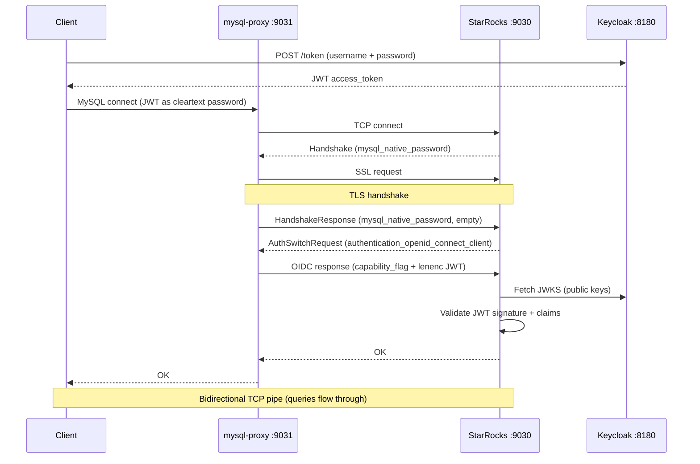

# StarRocks + Apache Ranger + Keycloak POC

Proof-of-concept for multi-tenant data access with:
- **RBAC model in StarRocks tables** (roles, actions, role-action mappings)
- **Data access enforcement via Apache Ranger** (generic subquery-based policies)
- **JWT authentication via Keycloak** (OIDC)
- **MySQL proxy** translating cleartext JWT to TLS+OIDC for Go/BI clients

## Architecture


| Container | Image | Port | Purpose |
|-----------|-------|------|---------|
| `keycloak` | `quay.io/keycloak/keycloak:24.0` | 8180 | OIDC provider (JWT issuer) |
| `ranger-db` | `apache/ranger-db:2.7.0` | - | PostgreSQL for Ranger |
| `ranger` | `apache/ranger:2.7.0` | 6080 | Ranger Admin UI + policies |
| `starrocks` | `starrocks/allin1-ubuntu:3.5.0` | 9030 | StarRocks with TLS + Ranger + JWT auth |
| `mysql-proxy` | Built from `./proxy` | 9031 | JWT auth translation proxy |
| `poc-api` | Built from `./api` | 8080 | Go API (Bearer JWT) |

## Authentication Flow



## Authorization Model (RBAC)

### Tables

```
auth_db.role            - role catalog (geneticist, researcher, tenant_admin, ...)
auth_db.action          - action catalog (can_read_pii, can_create_case, ...)
auth_db.role_action     - role → action mappings
auth_db.user_tenant_role - user → role at tenant scope
auth_db.user_org_role    - user → role at org scope (org_id='*' = all orgs in tenant)
auth_db.users           - identity registry
auth_db.tenant          - tenant definitions
auth_db.organization    - organizations within tenants
```

### Roles

**Org-scoped** (assigned per organization):

| Role | Actions |
|------|---------|
| `geneticist` | can_read_pii, can_create_case, can_edit_case, can_assign_case, can_interpret_variant, can_comment_variant, can_generate_report, can_download_file |
| `bioinformatician` | can_read_pii, can_create_case, can_edit_case, can_generate_report, can_download_file |
| `submitter` | can_create_case, can_edit_case |
| `data_analyst` | can_read_pii |

**Tenant-scoped** (assigned per tenant):

| Role | Actions |
|------|---------|
| `researcher` | can_search_case, can_view_kb |
| `tenant_admin` | can_search_case, can_view_kb, can_manage_project, can_invite_user, can_manage_codesystem, can_manage_genepanel, can_manage_org |
| `tenant_owner` | _(all tenant_admin actions)_ + can_delete_org |

**Tenant roles do NOT grant PII access.** A tenant_owner manages the tenant but sees PHI masked unless they also have an org-level role with `can_read_pii`.

### Actions

| Action | Scope | Enforced by |
|--------|-------|-------------|
| `can_read_pii` | org | Ranger (masking subquery) |
| `can_create_case` | org | API |
| `can_edit_case` | org | API |
| `can_delete_case` | org | API |
| `can_assign_case` | org | API |
| `can_interpret_variant` | org | API |
| `can_comment_variant` | org | API |
| `can_generate_report` | org | API |
| `can_download_file` | org | API |
| `can_search_case` | tenant | API |
| `can_view_kb` | tenant | API |
| `can_manage_project` | tenant | API |
| `can_invite_user` | tenant | API |
| `can_manage_codesystem` | tenant | API |
| `can_manage_genepanel` | tenant | API |
| `can_manage_org` | tenant | API |
| `can_delete_org` | tenant | API |

### Wildcard `*` for org_id

A user can be assigned a role at all organizations in a tenant:

```sql
INSERT INTO auth_db.user_org_role (username, tenant_id, org_id, role_id, granted_by)
VALUES ('jane', 'cbtn', '*', 'geneticist', 'admin');
-- Jane is a geneticist at ALL orgs in CBTN
```

The Ranger masking subquery expands `*` via UNION with the organization table.

### Ranger Policies

All policies use `"users": ["{USER}"]` — no Ranger user stubs or roles needed.

**Row-filter** (tenant isolation):
```sql
tenant_id IN (
  SELECT tenant_id FROM auth_db.user_tenant_role WHERE username = current_user()
  UNION
  SELECT tenant_id FROM auth_db.user_org_role WHERE username = current_user()
)
```

**Column masking** (PII via `can_read_pii` action):
```sql
CASE WHEN org_id IN (
  -- Specific org assignments with can_read_pii
  SELECT uor.org_id FROM user_org_role uor
  JOIN role_action ra ON ra.role_id = uor.role_id
  WHERE uor.username = current_user() AND ra.action_id = 'can_read_pii' AND uor.org_id != '*'
  UNION
  -- Wildcard: expand * to all orgs in tenant
  SELECT o.org_id FROM organization o
  JOIN user_org_role uor ON uor.tenant_id = o.tenant_id AND uor.org_id = '*'
  JOIN role_action ra ON ra.role_id = uor.role_id
  WHERE uor.username = current_user() AND ra.action_id = 'can_read_pii'
) THEN col ELSE '***' END
```

## Test Users

| User | Password | Tenant Role | Org Role | Meaning |
|------|----------|------------|----------|---------|
| `jane` | `janepass` | researcher(cbtn) | geneticist(cbtn, *) | Geneticist at all CBTN orgs |
| `alice` | `alicepass` | researcher(cbtn) | geneticist(cbtn, chop) | Geneticist at CHOP only |
| `bob` | `bobpass` | tenant_owner(cbtn) | — | Manages tenant, no PII |
| `carol` | `carolpass` | researcher(cbtn), researcher(udn) | bioinformatician(cbtn, chop) | Bioinformatician at CHOP |
| `dan` | `danpass` | researcher(cbtn) | — | Researcher only, no PII |

## Expected Test Matrix

| Patient row | Jane (geneticist *) | Alice (geneticist chop) | Bob (tenant_owner) | Carol (bioinf chop) | Dan (researcher) |
|-------------|-----|-------|-----|-------|-----|
| **CHOP** (cbtn) | Full | Full | Masked | Full | Masked |
| **BCH** (cbtn) | Full | Masked | Masked | Masked | Masked |
| **NIH-UDN** (udn) | Invisible | Invisible | Invisible | Masked | Invisible |

- **Full** = row visible, PHI unmasked (user has `can_read_pii` at this org)
- **Masked** = row visible, PHI = `***` / year-only date (no `can_read_pii` at this org)
- **Invisible** = row not returned (user has no tenant role)

## Prerequisites

- Docker and Docker Compose
- MySQL client (`mysql` CLI) with `--enable-cleartext-plugin` support
- `curl` and `jq` for API and token tests

## Quick Start

```bash
cd docs/adr/ranger-poc
docker compose up -d --build

# Watch init (~3 min: Ranger + Keycloak + StarRocks setup)
docker compose logs -f init
```

The TLS keystore (`starrocks-conf/starrocks-keystore.jks`) is already committed. No generation step needed.

Wait for "Auth-Tables POC initialization complete!", then wait ~15s for Ranger policy sync.

### Stop / Restart

```bash
docker compose down -v          # stop + remove volumes
docker compose up -d --build    # fresh start
```

## Verify

### 1. Get a JWT token from Keycloak

```bash
TOKEN=$(curl -s -X POST http://localhost:8180/realms/starrocks/protocol/openid-connect/token \
  -d "client_id=starrocks&username=jane&password=janepass&grant_type=password" | jq -r '.access_token')
```

### 2. Connect via proxy with JWT

```bash
# Jane: geneticist at * (all CBTN orgs) → all CBTN PHI unmasked
mysql -h127.0.0.1 -P9031 -ujane -p"${TOKEN}" --enable-cleartext-plugin \
  -e 'SELECT id, first_name, mrn, date_of_birth, org_id FROM poc_db.patients ORDER BY id;'

# Bob: tenant_owner (no PII) → all CBTN rows masked
TOKEN_BOB=$(curl -s -X POST http://localhost:8180/realms/starrocks/protocol/openid-connect/token \
  -d "client_id=starrocks&username=bob&password=bobpass&grant_type=password" | jq -r '.access_token')
mysql -h127.0.0.1 -P9031 -ubob -p"${TOKEN_BOB}" --enable-cleartext-plugin \
  -e 'SELECT id, first_name, mrn, date_of_birth, org_id FROM poc_db.patients ORDER BY id;'
```

### 3. Connect directly with Python (no proxy needed)

Python `mysql-connector-python >= 9.1.0` supports the OIDC plugin natively:

```python
import mysql.connector

conn = mysql.connector.connect(
    host='127.0.0.1', port=9030, user='jane',
    auth_plugin='authentication_openid_connect_client',
    openid_token_file='/path/to/jwt_token.txt',
    ssl_disabled=False, ssl_verify_cert=False,
)
```

### 4. API with Bearer JWT

```bash
TOKEN=$(curl -s -X POST http://localhost:8180/realms/starrocks/protocol/openid-connect/token \
  -d "client_id=starrocks&username=alice&password=alicepass&grant_type=password" | jq -r '.access_token')

# Alice's roles
curl -s -H "Authorization: Bearer ${TOKEN}" http://localhost:8080/auth/me | jq

# Alice creates case at CHOP (geneticist has can_create_case)
curl -s -X POST -H "Authorization: Bearer ${TOKEN}" -H "Content-Type: application/json" \
  http://localhost:8080/cbtn/chop/cases -d '{"case_name":"New Case","patient_id":1}' | jq
```

### 5. Dynamic role change

```bash
TOKEN_DAN=$(curl -s -X POST http://localhost:8180/realms/starrocks/protocol/openid-connect/token \
  -d "client_id=starrocks&username=dan&password=danpass&grant_type=password" | jq -r '.access_token')

# BEFORE: Dan sees all PHI masked (researcher, no can_read_pii)
mysql -h127.0.0.1 -P9031 -udan -p"${TOKEN_DAN}" --enable-cleartext-plugin \
  -e 'SELECT id, first_name, mrn, org_id FROM poc_db.patients ORDER BY id;'

# Grant data_analyst at CHOP (data_analyst has can_read_pii)
curl -s -X POST -H 'Content-Type: application/json' \
  http://localhost:8080/admin/grant-org-role \
  -d '{"username":"dan","tenant_id":"cbtn","org_id":"chop","role_id":"data_analyst"}' | jq

# AFTER: CHOP PHI unmasked, BCH still masked
mysql -h127.0.0.1 -P9031 -udan -p"${TOKEN_DAN}" --enable-cleartext-plugin \
  -e 'SELECT id, first_name, mrn, org_id FROM poc_db.patients ORDER BY id;'

# Revoke
curl -s -X POST -H 'Content-Type: application/json' \
  http://localhost:8080/admin/revoke-org-role \
  -d '{"username":"dan","tenant_id":"cbtn","org_id":"chop","role_id":"data_analyst"}' | jq
```

## Adding a New User

Only 2 steps. No Ranger changes needed.

### 1. Create StarRocks user (+ Keycloak user for JWT auth)

```sql
mysql -h127.0.0.1 -P9030 -uroot -e "
  CREATE USER new_user IDENTIFIED WITH authentication_jwt AS '{...}';
"
```

### 2. Insert into auth_db

```sql
mysql -h127.0.0.1 -P9030 -uroot -e "
  INSERT INTO auth_db.users (username) VALUES ('new_user');
  INSERT INTO auth_db.user_tenant_role (username, tenant_id, role_id, granted_by)
    VALUES ('new_user', 'cbtn', 'researcher', 'admin');
  INSERT INTO auth_db.user_org_role (username, tenant_id, org_id, role_id, granted_by)
    VALUES ('new_user', 'cbtn', 'chop', 'geneticist', 'admin');
"
```

Subsequent role changes only require auth_db updates.

## POC API Endpoints

| Method | Path | Auth | Description |
|--------|------|------|-------------|
| GET | `/health` | none | Health check |
| GET | `/auth/me` | Bearer JWT | User's roles from auth tables |
| GET | `/{tenant}/patients` | Bearer JWT | Read patients (Ranger row-filter + masking) |
| GET | `/{tenant}/cases` | Bearer JWT | Read cases (Ranger row-filter) |
| POST | `/{tenant}/{org}/cases` | Bearer JWT | Create case (checks `can_create_case` action) |
| POST | `/admin/grant-org-role` | none | Grant org role |
| POST | `/admin/revoke-org-role` | none | Revoke org role |

## Key Findings

1. **RBAC with action-based permissions** — roles define capabilities (geneticist → can_read_pii), not access levels
2. **PII access is org-scoped only** — tenant roles (even tenant_owner) never grant PII; `can_read_pii` must come from an org-level role
3. **`*` wildcard** — `org_id='*'` in user_org_role means all orgs in the tenant; expanded via UNION in Ranger subqueries
4. **`{USER}` wildcard** — all Ranger policies match any authenticated user; no Ranger user stubs or roles needed
5. **Auth tables are isolated** — row-filter policies ensure users see only their own role assignments
6. **Dynamic role changes** — INSERT/DELETE in auth tables takes effect immediately
7. **Use `IN` not `EXISTS` for masking subqueries** — `EXISTS` causes column ambiguity in mask expressions
8. **JWT auth requires TLS** — StarRocks needs JKS keystore for the OIDC plugin
9. **OIDC auth response format** — requires `0x01` capability flag + lenenc JWT
10. **Go clients need a proxy** — `go-sql-driver/mysql` doesn't support `authentication_openid_connect_client`; Python `mysql-connector-python >= 9.1.0` supports it natively

## Admin UIs

| Service | URL | Credentials |
|---------|-----|-------------|
| Ranger Admin | http://localhost:6080 | `admin` / `rangerR0cks!` |
| Keycloak Admin | http://localhost:8180 | `admin` / `admin` |

## Cleanup

```bash
docker compose down -v
```
