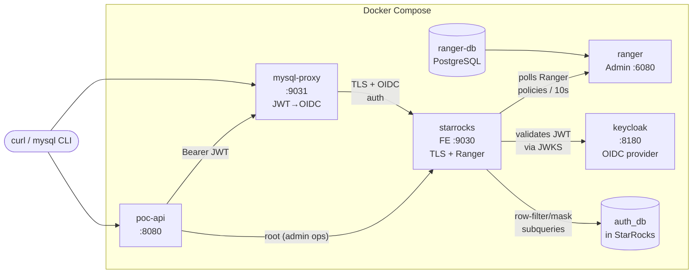
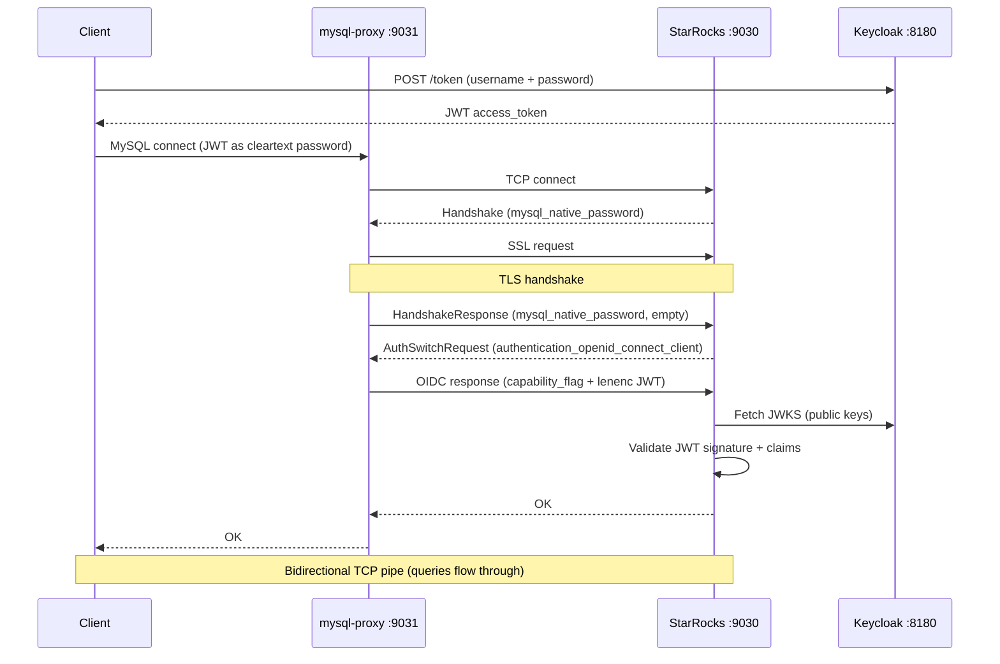

# StarRocks + Apache Ranger + Keycloak POC

Proof-of-concept for multi-tenant data access with:
- **RBAC model in StarRocks tables** (roles, actions, role-action mappings) — `auth_db` is the source of truth.
- **Database visibility via Ranger roles** — per-tenant Ranger access policies (`sr_select_cbtn`, `sr_select_udn`) gate `cbtn_db` / `udn_db`. `SHOW DATABASES` naturally hides the wrong tenant.
- **Row-filter + column-mask via Ranger** — auth_db self-access row-filter, and PII column masking on data tables (subqueries against `auth_db`).
- **JWT authentication via Keycloak** (OIDC).
- **Admin API auto-syncs Ranger** — every grant/revoke creates the StarRocks user, the Ranger user, and updates Ranger role membership.
- **MySQL proxy** translating cleartext JWT to TLS+OIDC for Go/BI clients.

## Architecture



| Container | Image | Port | Purpose |
|-----------|-------|------|---------|
| `keycloak` | `quay.io/keycloak/keycloak:24.0` | 8180 | OIDC provider (JWT issuer) |
| `ranger-db` | `apache/ranger-db:2.7.0` | - | PostgreSQL for Ranger |
| `ranger` | `apache/ranger:2.7.0` | 6080 | Ranger Admin UI + policies |
| `starrocks` | `starrocks/allin1-ubuntu:3.5.0` | 9030 | StarRocks with TLS + Ranger + JWT auth |
| `mysql-proxy` | Built from `./proxy` | 9031 | JWT auth translation proxy |
| `poc-api` | Built from `./api` | 8080 | Go API (Bearer JWT) |

## Authentication Flow



## Authorization Model (RBAC)

### Tables

```
auth_db.role            - role catalog (geneticist, researcher, tenant_admin, ...)
auth_db.action          - action catalog (can_read_pii, can_create_case, ...)
auth_db.role_action     - role → action mappings
auth_db.user_tenant_role - user → role at tenant scope
auth_db.user_org_role    - user → role at org scope (org_id='*' = all orgs in tenant)
auth_db.users           - identity registry
auth_db.tenant          - tenant definitions
auth_db.organization    - organizations within tenants
```

### Roles

**Org-scoped** (assigned per organization):

| Role | Actions |
|------|---------|
| `geneticist` | can_read_pii, can_create_case, can_edit_case, can_assign_case, can_interpret_variant, can_comment_variant, can_generate_report, can_download_file |
| `bioinformatician` | can_read_pii, can_create_case, can_edit_case, can_generate_report, can_download_file |
| `submitter` | can_create_case, can_edit_case |
| `data_analyst` | can_read_pii |

**Tenant-scoped** (assigned per tenant):

| Role | Actions |
|------|---------|
| `researcher` | can_search_case, can_view_kb |
| `tenant_admin` | can_search_case, can_view_kb, can_manage_project, can_invite_user, can_manage_codesystem, can_manage_genepanel, can_manage_org |
| `tenant_owner` | _(all tenant_admin actions)_ + can_delete_org |

**Tenant roles do NOT grant PII access.** A tenant_owner manages the tenant but sees PHI masked unless they also have an org-level role with `can_read_pii`.

### Actions

| Action | Scope | Enforced by |
|--------|-------|-------------|
| `can_read_pii` | org | Ranger (masking subquery) |
| `can_create_case` | org | API |
| `can_edit_case` | org | API |
| `can_delete_case` | org | API |
| `can_assign_case` | org | API |
| `can_interpret_variant` | org | API |
| `can_comment_variant` | org | API |
| `can_generate_report` | org | API |
| `can_download_file` | org | API |
| `can_search_case` | tenant | API |
| `can_view_kb` | tenant | API |
| `can_manage_project` | tenant | API |
| `can_invite_user` | tenant | API |
| `can_manage_codesystem` | tenant | API |
| `can_manage_genepanel` | tenant | API |
| `can_manage_org` | tenant | API |
| `can_delete_org` | tenant | API |

### Wildcard `*` for org_id

A user can be assigned a role at all organizations in a tenant:

```sql
INSERT INTO auth_db.user_org_role (username, tenant_id, org_id, role_id, granted_by)
VALUES ('jane', 'cbtn', '*', 'geneticist', 'admin');
-- Jane is a geneticist at ALL orgs in CBTN
```

The Ranger masking subquery expands `*` via UNION with the organization table.

### Ranger Policies

Three layers, each with a distinct shape:

**Database visibility (access policies bound to Ranger roles)** — one per tenant DB:
- `sr_select_auth` → role `authenticated`, SELECT on `auth_db.*`
- `sr_select_cbtn` → role `cbtn_member`, SELECT+INSERT on `cbtn_db.*`
- `sr_select_udn`  → role `udn_member`,  SELECT+INSERT on `udn_db.*`

A user not in `cbtn_member` sees no `cbtn_db` in `SHOW DATABASES` and `SELECT FROM cbtn_db.*` is denied at the engine level. Ranger role membership is maintained by the admin API; auth_db is the source of truth.

**Row-filter** (auth_db self-access — kept for `auth_db.users`, `user_tenant_role`, `user_org_role`):
```sql
username = current_user()
```

Tenant-level row-filtering on data tables is no longer needed: per-tenant DBs combined with the access policies above mean a non-member never reaches the table.

**Column masking** (PII via `can_read_pii` action) — applied to `cbtn_db.patients` AND `udn_db.patients`:
```sql
CASE WHEN org_id IN (
  -- Specific org assignments with can_read_pii
  SELECT uor.org_id FROM user_org_role uor
  JOIN role_action ra ON ra.role_id = uor.role_id
  WHERE uor.username = current_user() AND ra.action_id = 'can_read_pii' AND uor.org_id != '*'
  UNION
  -- Wildcard: expand * to all orgs in tenant
  SELECT o.org_id FROM organization o
  JOIN user_org_role uor ON uor.tenant_id = o.tenant_id AND uor.org_id = '*'
  JOIN role_action ra ON ra.role_id = uor.role_id
  WHERE uor.username = current_user() AND ra.action_id = 'can_read_pii'
) THEN col ELSE '***' END
```

## Test Users

| User | Password | Tenant Role | Org Role | Meaning |
|------|----------|------------|----------|---------|
| `jane` | `janepass` | researcher(cbtn) | geneticist(cbtn, *) | Geneticist at all CBTN orgs |
| `alice` | `alicepass` | researcher(cbtn) | geneticist(cbtn, chop) | Geneticist at CHOP only |
| `bob` | `bobpass` | tenant_owner(cbtn) | — | Manages tenant, no PII |
| `carol` | `carolpass` | researcher(cbtn), researcher(udn) | bioinformatician(cbtn, chop) | Bioinformatician at CHOP |
| `dan` | `danpass` | researcher(cbtn) | — | Researcher only, no PII |

## Expected Test Matrix

| Patient row | Jane (geneticist *) | Alice (geneticist chop) | Bob (tenant_owner) | Carol (bioinf chop) | Dan (researcher) |
|-------------|-----|-------|-----|-------|-----|
| **CHOP** (cbtn_db) | Full | Full | Masked | Full | Masked |
| **BCH** (cbtn_db)  | Full | Masked | Masked | Masked | Masked |
| **NIH-UDN** (udn_db) | DB hidden | DB hidden | DB hidden | Masked | DB hidden |

- **Full** = row visible, PHI unmasked (user has `can_read_pii` at this org).
- **Masked** = row visible, PHI = `***` / year-only date (no `can_read_pii` at this org).
- **DB hidden** = the tenant's database does not appear in `SHOW DATABASES`; cross-DB queries are denied at the engine level (Ranger access policy).

## Prerequisites

- Docker and Docker Compose
- MySQL client (`mysql` CLI) with `--enable-cleartext-plugin` support
- `curl` and `jq` for API and token tests

## Quick Start

```bash
cd docs/adr/ranger-poc
docker compose up -d --build

# Watch init (~3 min: Ranger + Keycloak + StarRocks setup)
docker compose logs -f init
```

The TLS keystore (`starrocks-conf/starrocks-keystore.jks`) is already committed. No generation step needed.

Wait for "Auth-Tables POC initialization complete!", then wait ~15s for Ranger policy sync.

### Stop / Restart

```bash
docker compose down -v          # stop + remove volumes
docker compose up -d --build    # fresh start
```

## Verify

### 1. Get a JWT token from Keycloak

```bash
TOKEN=$(curl -s -X POST http://localhost:8180/realms/starrocks/protocol/openid-connect/token \
  -d "client_id=starrocks&username=jane&password=janepass&grant_type=password" | jq -r '.access_token')
```

### 2. Connect via proxy with JWT

```bash
# Jane: geneticist at * (all CBTN orgs) → all CBTN PHI unmasked, udn_db hidden
mysql -h127.0.0.1 -P9031 -ujane -p"${TOKEN}" --enable-cleartext-plugin \
  -e 'SHOW DATABASES; SELECT id, first_name, mrn, date_of_birth, org_id FROM cbtn_db.patients ORDER BY id;'

# Cross-tenant denial: jane → udn_db is rejected at the engine level
mysql -h127.0.0.1 -P9031 -ujane -p"${TOKEN}" --enable-cleartext-plugin \
  -e 'SELECT * FROM udn_db.patients;'   # ERROR: Access denied

# Bob: tenant_owner (no PII) → all CBTN rows masked
TOKEN_BOB=$(curl -s -X POST http://localhost:8180/realms/starrocks/protocol/openid-connect/token \
  -d "client_id=starrocks&username=bob&password=bobpass&grant_type=password" | jq -r '.access_token')
mysql -h127.0.0.1 -P9031 -ubob -p"${TOKEN_BOB}" --enable-cleartext-plugin \
  -e 'SELECT id, first_name, mrn, date_of_birth, org_id FROM cbtn_db.patients ORDER BY id;'
```

### 3. Connect directly with Python (no proxy needed)

Python `mysql-connector-python >= 9.1.0` supports the OIDC plugin natively:

```python
import mysql.connector

conn = mysql.connector.connect(
    host='127.0.0.1', port=9030, user='jane',
    auth_plugin='authentication_openid_connect_client',
    openid_token_file='/path/to/jwt_token.txt',
    ssl_disabled=False, ssl_verify_cert=False,
)
```

### 4. API with Bearer JWT

```bash
TOKEN=$(curl -s -X POST http://localhost:8180/realms/starrocks/protocol/openid-connect/token \
  -d "client_id=starrocks&username=alice&password=alicepass&grant_type=password" | jq -r '.access_token')

# Alice's roles
curl -s -H "Authorization: Bearer ${TOKEN}" http://localhost:8080/auth/me | jq

# Alice creates case at CHOP (geneticist has can_create_case)
curl -s -X POST -H "Authorization: Bearer ${TOKEN}" -H "Content-Type: application/json" \
  http://localhost:8080/cbtn/chop/cases -d '{"case_name":"New Case","patient_id":1}' | jq
```

### 5. Dynamic role change

```bash
TOKEN_DAN=$(curl -s -X POST http://localhost:8180/realms/starrocks/protocol/openid-connect/token \
  -d "client_id=starrocks&username=dan&password=danpass&grant_type=password" | jq -r '.access_token')

# BEFORE: Dan sees all PHI masked (researcher, no can_read_pii)
mysql -h127.0.0.1 -P9031 -udan -p"${TOKEN_DAN}" --enable-cleartext-plugin \
  -e 'SELECT id, first_name, mrn, org_id FROM cbtn_db.patients ORDER BY id;'

# Grant data_analyst at CHOP (data_analyst has can_read_pii)
curl -s -X POST -H 'Content-Type: application/json' \
  http://localhost:8080/admin/grant-org-role \
  -d '{"username":"dan","tenant_id":"cbtn","org_id":"chop","role_id":"data_analyst"}' | jq

# AFTER: CHOP PHI unmasked, BCH still masked
mysql -h127.0.0.1 -P9031 -udan -p"${TOKEN_DAN}" --enable-cleartext-plugin \
  -e 'SELECT id, first_name, mrn, org_id FROM cbtn_db.patients ORDER BY id;'

# Revoke
curl -s -X POST -H 'Content-Type: application/json' \
  http://localhost:8080/admin/revoke-org-role \
  -d '{"username":"dan","tenant_id":"cbtn","org_id":"chop","role_id":"data_analyst"}' | jq
```

## Adding a New User

A new user appears in three places: **Keycloak** (so they can authenticate and get a JWT), **StarRocks** (so the JWT user identity is recognised), and **Ranger** (so they can be added to a tenant role). Only the first must be done out-of-band — the other two are auto-handled by the admin API on first grant.

### 1. Create the user in Keycloak (one-time, via realm admin)

```bash
docker exec keycloak /opt/keycloak/bin/kcadm.sh config credentials \
  --server http://localhost:8080 --realm master --user admin --password admin
docker exec keycloak /opt/keycloak/bin/kcadm.sh create users -r starrocks \
  -s username=eve -s enabled=true -s emailVerified=true
docker exec keycloak /opt/keycloak/bin/kcadm.sh set-password -r starrocks \
  --username eve --new-password evepass
```

### 2. Grant a role via the admin API (auto-creates StarRocks + Ranger user)

```bash
ADMIN_TOKEN=$(curl -s -X POST http://localhost:8180/realms/starrocks/protocol/openid-connect/token \
  -d "client_id=starrocks&username=admin1&password=admin1pass&grant_type=password" | jq -r '.access_token')

curl -s -X POST -H "Authorization: Bearer ${ADMIN_TOKEN}" -H "Content-Type: application/json" \
  http://localhost:8080/cbtn/admin/grant-tenant-role \
  -d '{"username":"eve","role_id":"researcher"}'
```

The admin API runs three side-effects after the auth_db INSERT:
1. `CREATE USER IF NOT EXISTS 'eve' IDENTIFIED WITH authentication_jwt …` on StarRocks.
2. Creates the Ranger user record (idempotent).
3. Adds `eve` to Ranger roles `authenticated` and `cbtn_member`.

After ~10s (Ranger policy poll), `eve` can connect via the proxy and `SHOW DATABASES` returns `auth_db, cbtn_db` (UDN hidden).

Revoke is symmetric — when the last role at a tenant is removed, the admin API removes `eve` from `<tenant>_member`. Subsequent role changes within a tenant only touch auth_db.

## Design Decision: Tenant in REST API Path Prefix

The REST API uses **path prefix** for tenant context: `/{tenant}/patients`, `/{tenant}/admin/roles`, etc. Global endpoints (not tenant-scoped) live at the root: `/auth/me`, `/auth/my-tenants`, `/health`.

### Options considered

| Approach | Example | Verdict |
|----------|---------|---------|
| **Path prefix** | `/cbtn/patients` | ✅ Chosen |
| **HTTP header** | `X-Tenant: cbtn` then `/patients` | ❌ Rejected |
| **Subdomain** | `cbtn.api.radiant.example/patients` | ❌ Impractical for POC (DNS, TLS) |
| **Query param** | `/patients?tenant=cbtn` | ❌ Not idiomatic (query is for filtering) |
| **JWT claim** | Tenant encoded in token | ❌ Rejected by user (multi-tenant users would need multiple tokens) |

### Why path prefix

| Criterion | Path `/{tenant}/...` | Header `X-Tenant` |
|-----------|---------------------|-------------------|
| Visible in logs/monitoring | ✅ Immediate | ❌ Requires log config to include header |
| Cacheable (CDN, HTTP cache) | ✅ Cache key is the URL | ❌ Requires `Vary: X-Tenant` |
| Bookmarkable / shareable | ✅ | ❌ Can't share a link to a specific tenant |
| CORS complexity | ✅ None | ❌ Preflight for custom header |
| REST semantics | ✅ Tenant IS a resource container | ⚠️ Headers are for metadata, not resources |
| OpenAPI/Swagger docs | ✅ Tenant as path param is standard | ⚠️ Global header applies to all endpoints |

### Industry precedent

- **Atlassian Cloud**: subdomain for site access (`acme.atlassian.net`), **path prefix** for Connect apps and cross-site APIs (`api.atlassian.com/ex/jira/{cloudId}/rest/...`). They do **not** use a tenant header.
- **GitHub**: `/orgs/{org}/...`, `/repos/{owner}/{repo}/...`
- **Twilio**: `/Accounts/{AccountSid}/...`
- **Shopify**, **Salesforce**: subdomain

Subdomain isn't practical for a localhost POC (DNS, certificates). Path prefix matches Atlassian's fallback pattern when subdomain isn't available — and it's the same approach GitHub and Twilio use for their REST APIs.

### Trade-offs accepted

- **URLs change when switching tenants** — intentional; makes the tenant scope explicit and bookmarkable.
- **Every tenant-scoped endpoint needs the prefix** — one-time cost, avoids runtime ambiguity.
- **The MySQL proxy path doesn't use this** — correct; proxy clients go through StarRocks + Ranger row-filter, which enforces tenant via `auth_db.user_tenant_role`. The REST path prefix only applies to endpoints consumed by the portal UI and end-user tools.

## POC API Endpoints

| Method | Path | Auth | Description |
|--------|------|------|-------------|
| GET | `/health` | none | Health check |
| GET | `/auth/me` | Bearer JWT | User's roles from auth tables |
| GET | `/{tenant}/patients` | Bearer JWT | Read patients (Ranger row-filter + masking) |
| GET | `/{tenant}/cases` | Bearer JWT | Read cases (Ranger row-filter) |
| POST | `/{tenant}/{org}/cases` | Bearer JWT | Create case (checks `can_create_case` action) |
| POST | `/admin/grant-org-role` | none | Grant org role |
| POST | `/admin/revoke-org-role` | none | Revoke org role |

## Key Findings

1. **RBAC with action-based permissions** — roles define capabilities (geneticist → can_read_pii), not access levels.
2. **PII access is org-scoped only** — tenant roles (even tenant_owner) never grant PII; `can_read_pii` must come from an org-level role.
3. **`*` wildcard for org_id** — `org_id='*'` in user_org_role means all orgs in the tenant; expanded via UNION in Ranger column-mask subqueries.
4. **DB visibility via Ranger roles** — `access_control = ranger` makes Ranger the sole authority in StarRocks (no native-RBAC fallback). Per-tenant access policies bound to Ranger roles `cbtn_member` / `udn_member` give the same end behavior native `GRANT SELECT ON DATABASE` would: `SHOW DATABASES` hides what the user can't access, and cross-DB queries are denied at the engine level (no row-filter trickery).
5. **Auth tables are isolated** — row-filter policies on `auth_db.users` / `user_tenant_role` / `user_org_role` ensure users see only their own assignments.
6. **Admin API drives Ranger sync** — every grant/revoke in the API auto-creates the StarRocks user, registers the Ranger user, and patches Ranger role membership. `auth_db` remains the single source of truth; Ranger role membership is a derived projection.
7. **Dynamic role changes** — INSERT/DELETE in auth tables + Ranger membership update take effect within ~10s (Ranger policy poll interval).
8. **Ranger requires user records before role membership** — adding an unknown user to a Ranger role fails with HTTP 400; init and the admin API both call `POST /service/xusers/secure/users` first.
9. **JWT auth requires TLS** — StarRocks needs JKS keystore for the OIDC plugin.
10. **OIDC auth response format** — requires `0x01` capability flag + lenenc JWT.
11. **Go clients need a proxy** — `go-sql-driver/mysql` doesn't support `authentication_openid_connect_client`; Python `mysql-connector-python >= 9.1.0` supports it natively.

## Admin UIs

| Service | URL | Credentials |
|---------|-----|-------------|
| Ranger Admin | http://localhost:6080 | `admin` / `rangerR0cks!` |
| Keycloak Admin | http://localhost:8180 | `admin` / `admin` |

## Cleanup

```bash
docker compose down -v
```
