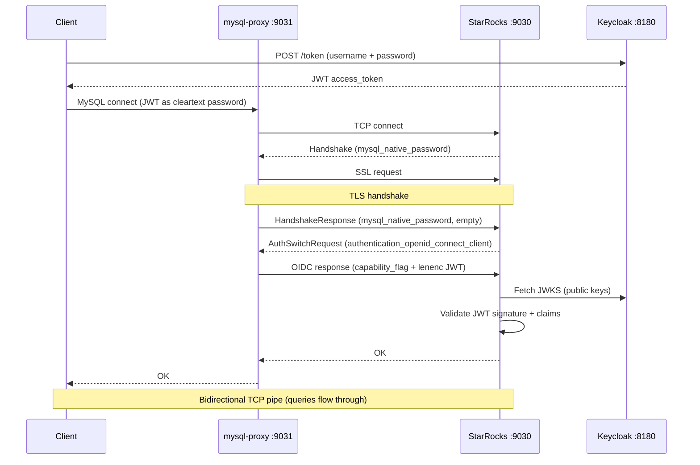

# StarRocks + Apache Ranger + Keycloak POC

Proof-of-concept for multi-tenant data access with:
- **Authorization model in StarRocks tables** (auth_db)
- **Data access enforcement via Apache Ranger** (generic subquery-based policies)
- **JWT authentication via Keycloak** (OIDC)
- **MySQL proxy** translating cleartext JWT to TLS+OIDC for Go/BI clients

## Architecture


| Container | Image | Port | Purpose |
|-----------|-------|------|---------|
| `keycloak` | `quay.io/keycloak/keycloak:24.0` | 8180 | OIDC provider (JWT issuer) |
| `ranger-db` | `apache/ranger-db:2.7.0` | - | PostgreSQL for Ranger |
| `ranger` | `apache/ranger:2.7.0` | 6080 | Ranger Admin UI + policies |
| `starrocks` | `starrocks/allin1-ubuntu:3.5.0` | 9030 | StarRocks with TLS + Ranger + JWT auth |
| `mysql-proxy` | Built from `./proxy` | 9031 | JWT auth translation proxy |
| `poc-api` | Built from `./api` | 8080 | Go API (Bearer JWT) |

## Authentication Flow



**Key insight**: The `authentication_openid_connect_client` plugin requires:
1. A TLS connection (StarRocks needs SSL enabled via JKS keystore)
2. A 1-byte capability flag (`0x01`) prepended before the lenenc-encoded JWT in the auth response

## How It Works

### Authorization Model (auth_db)

The source of truth for "who can do what" lives in StarRocks tables:

```
auth_db.users              - identity registry
auth_db.tenant             - tenant definitions (cbtn, udn)
auth_db.organization       - organizations within tenants (chop, bch, nih-udn)
auth_db.user_tenant_role   - tenant-scoped role assignments
auth_db.user_org_role      - organization-scoped role assignments
```

### Role Hierarchy

**Org chain** (scoped to one organization):
```
org_member  - read PHI for this org
org_editor  - + write operational data at this org
org_admin   - + manage users at this org
org_owner   - + manage org_admins
```

**Tenant chain** (scoped to all organizations in a tenant):
```
tenant_member  - read de-identified data across all orgs (PHI masked)
tenant_admin   - + PHI unmasked everywhere + write anywhere + manage orgs
tenant_owner   - + delete orgs + manage tenant_admins
```

### Data Access (Ranger + auth_db subqueries)

Ranger holds ~11 **generic** policies. All reference a single `role_authenticated` Ranger role.

**Access policies**: grant SELECT/INSERT on auth_db, poc_db, operational_db

**Row-filter policies** (auth table isolation):

| Table | Filter |
|-------|--------|
| `auth_db.user_tenant_role` | `username = current_user()` |
| `auth_db.user_org_role` | `username = current_user()` |
| `auth_db.users` | `username = current_user()` |

**Row-filter policies** (data tenant isolation):

| Table | Filter |
|-------|--------|
| `poc_db.patients` | `tenant_id IN (SELECT tenant_id FROM auth_db.user_tenant_role WHERE username=...)` |
| `operational_db.cases` | Same |

**Column masking** (PHI visibility):

| Column | Expression |
|--------|-----------|
| mrn, first_name | `CASE WHEN org_id IN (SELECT ... FROM user_org_role) OR tenant_id IN (SELECT ... WHERE role IN ('tenant_admin','tenant_owner')) THEN col ELSE '***'` |
| date_of_birth | Same, masked to year-only |

## Test Users

| User | Password | Tenant Roles | Org Roles |
|------|----------|-------------|-----------|
| `jane` | `janepass` | tenant_member(cbtn) | org_member(chop), org_member(bch) |
| `alice` | `alicepass` | tenant_member(cbtn) | org_member(chop) |
| `bob` | `bobpass` | tenant_owner(cbtn) | _(implied)_ |
| `carol` | `carolpass` | tenant_member(cbtn), tenant_member(udn) | org_member(chop) |
| `dan` | `danpass` | tenant_member(cbtn) | _(none)_ |

## Expected Test Matrix

| Patient row | Jane | Alice | Bob | Carol | Dan |
|-------------|------|-------|-----|-------|-----|
| **CHOP** (cbtn) | Full | Full | Full | Full | Masked |
| **BCH** (cbtn) | Full | Masked | Full | Masked | Masked |
| **NIH-UDN** (udn) | Invisible | Invisible | Invisible | Masked | Invisible |

- **Full** = row visible, PHI unmasked
- **Masked** = row visible, PHI = `***` / year-only date
- **Invisible** = row not returned

## Prerequisites

- Docker and Docker Compose
- MySQL client (`mysql` CLI) with `--enable-cleartext-plugin` support
- `curl` and `jq` for API and token tests

## Quick Start

```bash
cd docs/adr/ranger-poc

# Generate TLS keystore for StarRocks (one-time)
# If starrocks-conf/starrocks-keystore.jks already exists, skip this step
openssl req -x509 -newkey rsa:2048 -keyout starrocks-conf/starrocks-key.pem \
  -out starrocks-conf/starrocks-cert.pem -days 365 -nodes -subj '/CN=starrocks'
openssl pkcs12 -export -in starrocks-conf/starrocks-cert.pem \
  -inkey starrocks-conf/starrocks-key.pem -out starrocks-conf/starrocks.p12 \
  -name starrocks -password pass:changeit
keytool -importkeystore -srckeystore starrocks-conf/starrocks.p12 \
  -srcstoretype PKCS12 -srcstorepass changeit \
  -destkeystore starrocks-conf/starrocks-keystore.jks \
  -deststoretype JKS -deststorepass changeit -noprompt

# Start all containers
docker compose up -d --build

# Watch init (~3 min: Ranger + Keycloak + StarRocks setup)
docker compose logs -f init
```

Wait for "Auth-Tables POC initialization complete!", then wait ~15s for Ranger policy sync.

### Stop / Restart

```bash
docker compose down -v          # stop + remove volumes
docker compose up -d --build    # fresh start
```

## Verify

### 1. Get a JWT token from Keycloak

```bash
TOKEN=$(curl -s -X POST http://localhost:8180/realms/starrocks/protocol/openid-connect/token \
  -d "client_id=starrocks&username=jane&password=janepass&grant_type=password" | jq -r '.access_token')
echo "Token: ${#TOKEN} bytes"
```

### 2. Connect via proxy with JWT

```bash
# Jane: org_member at CHOP + BCH → all CBTN PHI unmasked
mysql -h127.0.0.1 -P9031 -ujane -p"${TOKEN}" --enable-cleartext-plugin \
  -e 'SELECT id, first_name, mrn, date_of_birth, org_id FROM poc_db.patients ORDER BY id;'

# Alice: org_member at CHOP only → CHOP full, BCH masked
TOKEN_ALICE=$(curl -s -X POST http://localhost:8180/realms/starrocks/protocol/openid-connect/token \
  -d "client_id=starrocks&username=alice&password=alicepass&grant_type=password" | jq -r '.access_token')
mysql -h127.0.0.1 -P9031 -ualice -p"${TOKEN_ALICE}" --enable-cleartext-plugin \
  -e 'SELECT id, first_name, mrn, date_of_birth, org_id FROM poc_db.patients ORDER BY id;'

# Dan: tenant_member only → all PHI masked
TOKEN_DAN=$(curl -s -X POST http://localhost:8180/realms/starrocks/protocol/openid-connect/token \
  -d "client_id=starrocks&username=dan&password=danpass&grant_type=password" | jq -r '.access_token')
mysql -h127.0.0.1 -P9031 -udan -p"${TOKEN_DAN}" --enable-cleartext-plugin \
  -e 'SELECT id, first_name, mrn, date_of_birth, org_id FROM poc_db.patients ORDER BY id;'
```

### 3. Connect directly with Python (no proxy needed)

Python `mysql-connector-python >= 9.1.0` supports the OIDC plugin natively:

```python
import mysql.connector, tempfile, os

conn = mysql.connector.connect(
    host='127.0.0.1', port=9030, user='jane',
    auth_plugin='authentication_openid_connect_client',
    openid_token_file='/path/to/jwt_token.txt',  # file containing JWT
    ssl_disabled=False, ssl_verify_cert=False,
)
```

### 4. API with Bearer JWT

```bash
TOKEN=$(curl -s -X POST http://localhost:8180/realms/starrocks/protocol/openid-connect/token \
  -d "client_id=starrocks&username=carol&password=carolpass&grant_type=password" | jq -r '.access_token')

# Carol's roles
curl -s -H "Authorization: Bearer ${TOKEN}" http://localhost:8080/auth/me | jq

# Carol reads patients (7 rows: CBTN + UDN, CHOP full, rest masked)
curl -s -H "Authorization: Bearer ${TOKEN}" http://localhost:8080/cbtn/patients | jq
```

### 5. Auth table isolation

```bash
TOKEN_DAN=$(curl -s -X POST http://localhost:8180/realms/starrocks/protocol/openid-connect/token \
  -d "client_id=starrocks&username=dan&password=danpass&grant_type=password" | jq -r '.access_token')

# Dan can only see his own roles
mysql -h127.0.0.1 -P9031 -udan -p"${TOKEN_DAN}" --enable-cleartext-plugin \
  -e 'SELECT * FROM auth_db.user_tenant_role;'
# → 1 row: dan / cbtn / tenant_member
```

### 6. Dynamic role change

```bash
# BEFORE: Dan sees all PHI masked
mysql -h127.0.0.1 -P9031 -udan -p"${TOKEN_DAN}" --enable-cleartext-plugin \
  -e 'SELECT id, first_name, mrn, org_id FROM poc_db.patients ORDER BY id;'

# Grant org_member at CHOP (just an INSERT — no Ranger change)
curl -s -X POST -H 'Content-Type: application/json' \
  http://localhost:8080/admin/grant-org-role \
  -d '{"username":"dan","org_id":"chop","role":"org_member"}' | jq

# AFTER: CHOP PHI unmasked
mysql -h127.0.0.1 -P9031 -udan -p"${TOKEN_DAN}" --enable-cleartext-plugin \
  -e 'SELECT id, first_name, mrn, org_id FROM poc_db.patients ORDER BY id;'

# Revoke
curl -s -X POST -H 'Content-Type: application/json' \
  http://localhost:8080/admin/revoke-org-role \
  -d '{"username":"dan","org_id":"chop","role":"org_member"}' | jq
```

## POC API Endpoints

| Method | Path | Auth | Description |
|--------|------|------|-------------|
| GET | `/health` | none | Health check |
| GET | `/auth/me` | Bearer JWT | User's roles from auth tables |
| GET | `/{tenant}/patients` | Bearer JWT | Read patients (Ranger row-filter + masking) |
| GET | `/{tenant}/cases` | Bearer JWT | Read cases (Ranger row-filter) |
| POST | `/{tenant}/{org}/cases` | Bearer JWT | Create case (write scope enforced) |
| POST | `/admin/grant-org-role` | none | Grant org role (INSERT into auth_db) |
| POST | `/admin/revoke-org-role` | none | Revoke org role (DELETE from auth_db) |

## Key Findings

1. **Auth tables as source of truth** — role assignments live in StarRocks, not Ranger
2. **Auth tables are isolated** — row-filter policies ensure users see only their own rows
3. **Generic Ranger policies** — ~11 policies using `IN(SELECT FROM auth_db.*)` subqueries
4. **Dynamic role changes** — INSERT/DELETE in auth tables takes effect immediately
5. **Use `IN` not `EXISTS` for masking subqueries** — `EXISTS` causes column ambiguity in mask expressions
6. **JWT auth requires TLS** — StarRocks needs JKS keystore for the OIDC plugin to work
7. **OIDC auth response format** — requires `0x01` capability flag + lenenc JWT (not raw bytes)
8. **Ranger groups don't work with StarRocks** — use a `role_authenticated` role instead
9. **`current_user()` returns `'user'@'%'`** — cleaned via `replace(substring_index(current_user(), '@', 1), char(39), '')`
10. **Go clients need a proxy** — `go-sql-driver/mysql` doesn't support `authentication_openid_connect_client`; Python `mysql-connector-python >= 9.1.0` supports it natively

## Admin UIs

| Service | URL | Credentials |
|---------|-----|-------------|
| Ranger Admin | http://localhost:6080 | `admin` / `rangerR0cks!` |
| Keycloak Admin | http://localhost:8180 | `admin` / `admin` |

## Cleanup

```bash
docker compose down -v
```
