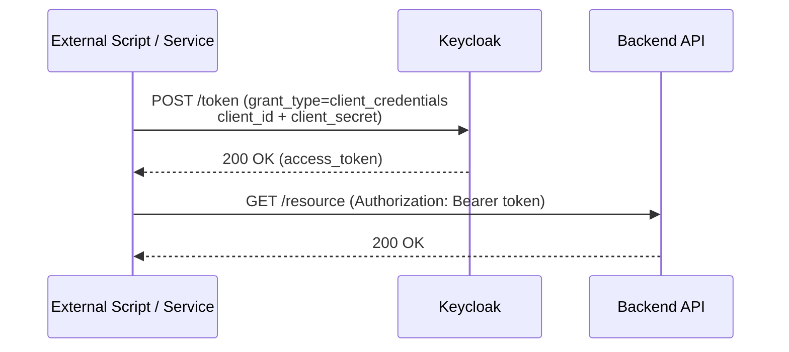

import Tabs from '@theme/Tabs';
import TabItem from '@theme/TabItem';

# Authentication

## Overview of Authentication Flow

To access protected resources via the API, clients must authenticate using OAuth 2.0 to obtain a JWT (JSON Web Token). The typical flow involves requesting a token from the authorization server and including it in API requests.

Most commonly, the **Client Credentials Grant** is used for machine-to-machine authentication. The client sends its credentials to the token endpoint and receives a JWT token in response.

In the future, support for the **Device Authorization Flow** will be added to facilitate user authentication on devices with limited input capabilities.

## Authentication Methods

### Authenticate with Client Credentials

This method uses the Client Credentials grant for machine-to-machine authentication. The client authenticates using its own credentials and receives a JWT token.
Note that token obtained with this method will expired after a certain period (e.g., 5 minutes) and needs to be refreshed by requesting a new token.

Here's a sequence diagram illustrating the flow:


Here are code examples in different languages to obtain a JWT token using the Client Credentials grant:
<Tabs groupId="languages">
<TabItem value="bash" label="Bash + cURL">
```bash
curl -X POST \
  -H "Content-Type: application/x-www-form-urlencoded" \
  -d "client_id=<CLIENT_ID>" \
  -d "client_secret=<CLIENT_SECRET>" \
  -d "grant_type=client_credentials" \
  https://<AUTH_SERVER>/realms/<REALM>/protocol/openid-connect/token
```
</TabItem>
<TabItem value="python" label="Python + requests">
```python
import requests

token_url = "https://<AUTH_SERVER>/realms/<REALM>/protocol/openid-connect/token"
data = {
    "client_id": "<CLIENT_ID>",
    "client_secret": "<CLIENT_SECRET>",
    "grant_type": "client_credentials"
}
response = requests.post(token_url, data=data)
token = response.json()["access_token"]
print("JWT Token:", token)
expires_in = response.json()["expires_in"]
print("Expires in:", expires_in, "seconds")
```
</TabItem>
</Tabs>

#### Required Endpoints and Parameters

- **Token Endpoint**: `https://<AUTH_SERVER>/realms/<REALM>/protocol/openid-connect/token`
- **HTTP Method**: POST
- **Required Parameters:**
  - `client_id`: The client application's identifier
  - `client_secret`: The client application's secret
  - `grant_type`: Usually `client_credentials`
  - `scope`: (optional) Requested scopes

### Authenticate with Device Flow (not yet supported)

Device Flow is designed for devices with limited input capabilities. It allows users to authenticate on a separate device. This flow is not yet supported in this API, but it should be implemented in the future for interactive users.

## Token Usage and Security Best Practices

- Include the JWT token in the `Authorization` header for API requests:
  - `Authorization: Bearer <JWT_TOKEN>`
- Keep your `client_secret` secure and never expose it in public repositories.
- Store tokens securely and avoid logging sensitive information.
- Regularly rotate credentials and tokens.
- Validate token expiration and handle refresh if needed.
