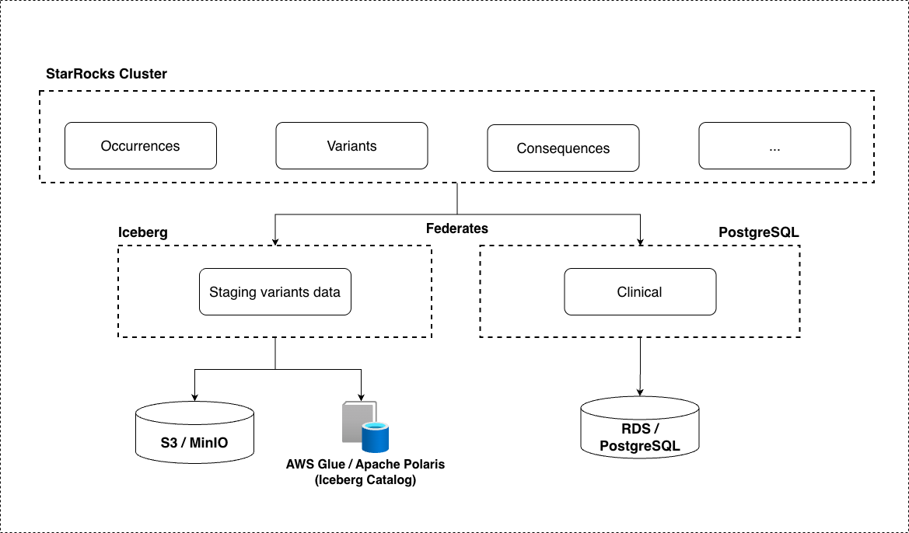
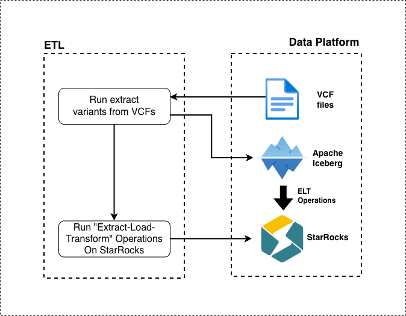

# Architecture Overview

## System Components

The diagram below provides a high-level view of the **Radiant** system and its core architectural components:

## Data Architecture

### Clinical Data Ingestion

Clinical data, such as case records, can be managed directly via the **Case Creation API**.  
This allows users to self-serve and register new cases or update existing ones.

All clinical data is persisted in **PostgreSQL**.

:::info
For details about the case creation workflow, refer to the [Case Creation](#case-creation) section below.
:::

### Variant Data Ingestion

Variant data is processed using an **ETL pipeline** that extracts genomic information from **VCF files** and loads it into **Apache Iceberg**.

Data is then imported into **StarRocks** using a "Extract-Load-Transform" (ELT) model that runs import queries, pulling records from the federated Iceberg catalog.

**StarRocks** operates in **shared-data mode**, with data stored in an **S3-compatible object storage** backend.

## Case Creation

Case creation is managed by two main components — an **API service** that receives requests, and an **asynchronous worker** that processes them in the background:

Example payloads and API usage samples are available here:  
[https://github.com/radiant-network/radiant-portal/tree/main/backend/examples](https://github.com/radiant-network/radiant-portal/tree/main/backend/examples)

:::note
All case creation operations are asynchronous to ensure smoother handling of high-volume data submissions.
:::

## Repositories

All official Radiant repositories are hosted in the [Radiant-Network GitHub Organization](https://github.com/radiant-network).

| Repository | Description | Link |
|-------------|--------------|------|
| **Architecture (ADRs)** | Architecture Decision Records and design documentation | [architecture](https://github.com/radiant-network/architecture) |
| **Portal** | Main web portal and backend API services | [radiant-portal](https://github.com/radiant-network/radiant-portal) |
| **ETL Pipeline** | Data extraction, transformation, and loading logic | [radiant-portal-pipeline](https://github.com/radiant-network/radiant-portal-pipeline) |
| **Sandbox Environment** | Local development and testing environment | [radiant-portal-sandbox](https://github.com/radiant-network/radiant-portal-sandbox) |
| **Python Client Examples** | API client scripts and usage examples | [radiant-python-client-example](https://github.com/radiant-network/radiant-python-client-example) |
| **StarRocks Deployment** | StarRocks cluster configuration and deployment scripts | [star-rocks](https://github.com/radiant-network/star-rocks) |
| **Terraform Deployments** | Infrastructure automation and cloud deployment definitions | [radiant-portal-deployment](https://github.com/radiant-network/radiant-portal-deployment) |

---
