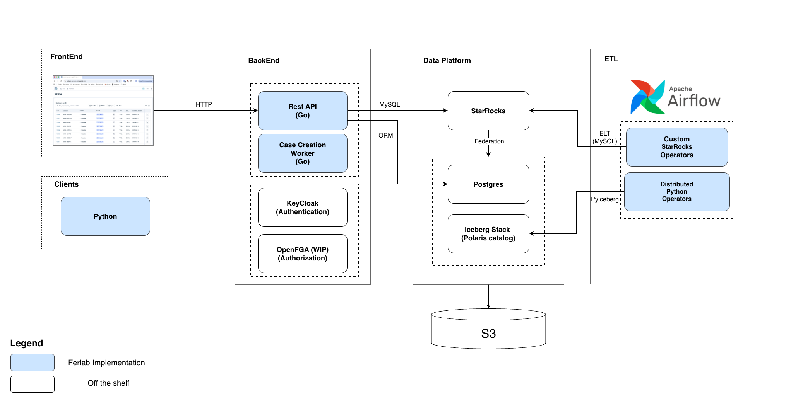
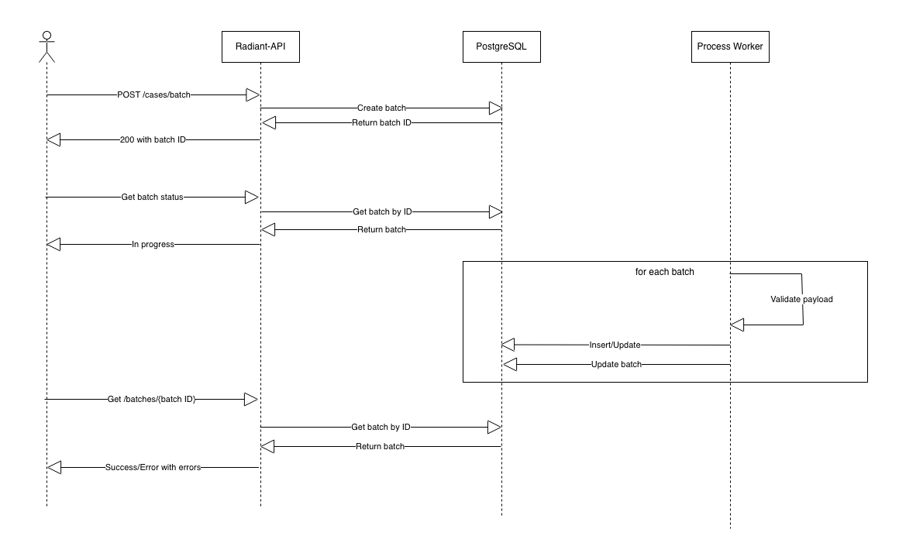

# Architecture Overview

## System Components

The following diagram provides a high-level overview of the main components of the Radiant system:

## Data Architecture

### Ingestion of Clinical Data

Using the Case Creation API, users can self-serve to manage their clinical data (cases, etc...).

Clinical data is stored in PostgreSQL. 

(See the [Case Creation](#case-creation) section for more details).
 
### Ingestion of Variants Data
  
Variants are ingested through an ETL process that extracts genomic data from the VCF files and insert it into Iceberg.

Then, import queries are executed in StarRocks which inserts the data from the federated Iceberg catalog.

StarRocks is used in shared-data mode with data backed into an S3 object store.

## Case Creation

Case creation is currently handled by the API and an asynchronous worker:

Payload creation examples are available here: https://github.com/radiant-network/radiant-portal/tree/main/backend/examples

## Repositories

All repositories are listed in the [Radiant-Network GitHub Organization](https://github.com/radiant-network).

- Architecture (ADRs): https://github.com/radiant-network/architecture
- Portal: https://github.com/radiant-network/radiant-portal
- ETL: https://github.com/radiant-network/radiant-portal-pipeline
- Sandbox: https://github.com/radiant-network/radiant-portal-sandbox
- Case creation Python client examples: https://github.com/radiant-network/radiant-python-client-example
- StarRocks deployment: https://github.com/radiant-network/star-rocks
- Terraform deployments: https://github.com/radiant-network/radiant-portal-deployment
