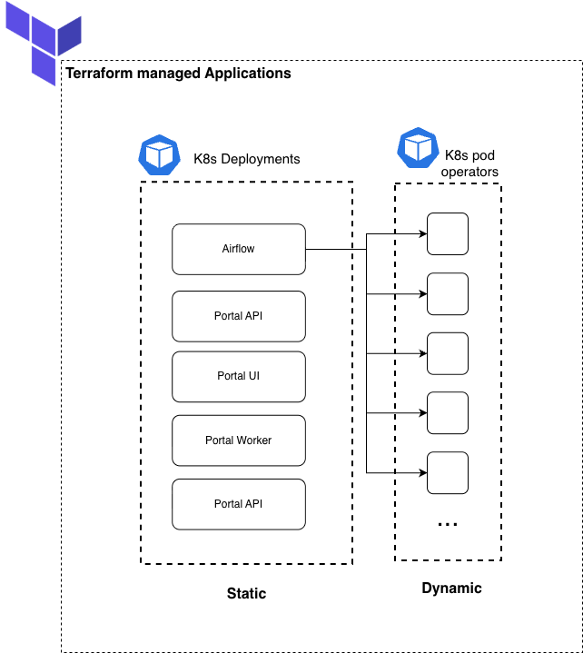
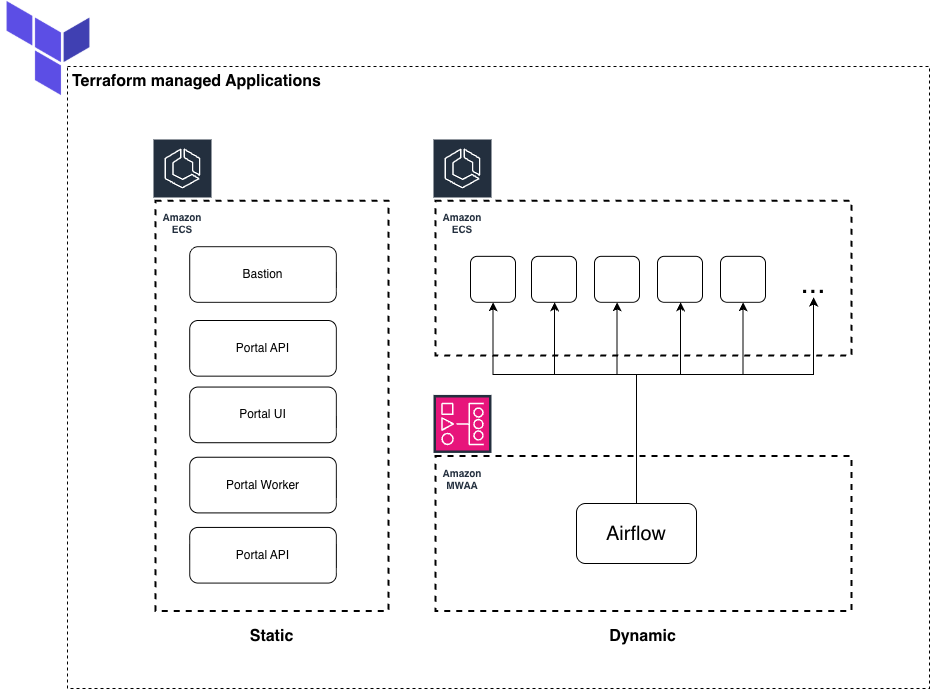

# How To

## Current Deployments

The Radiant network currently runs two main deployments:

- **CQDG QA** – Managed by **Ferlab**
- **AWS** – Managed by **CHOP**

## CQDG QA (Ferlab Managed)

Repositories:
- **Apps Deployment:** [Ferlab CQDG Pre-Prod Environment (Airflow Config)](https://github.com/Ferlab-Ste-Justine/cqdg-pre-prod-kubernetes-environments/blob/main/qa-etl/fluxcd/airflow.yml)

### Parallelization via Custom Airflow Operator

The CQDG QA environment leverages **KubernetesPodOperators** within **Apache Airflow** to parallelize specific workloads.  
This allows different jobs to run as individual Kubernetes pods, improving scalability and pipeline efficiency.

:::note
Parallel task execution is especially beneficial for VCF extraction. 

A pod will be launched for each VCF file, allowing multiple files to be processed simultaneously, which significantly reduces overall processing time.
:::

## AWS (CHOP Managed)

Repositories:
- **Terraform StarRocks Module:** [radiant-network/terraform-aws-starrocks-s3](https://github.com/radiant-network/terraform-aws-starrocks-s3)
- **StarRocks Deployment:** [radiant-network/star-rocks](https://github.com/radiant-network/star-rocks)
- **Apps Deployment:** [radiant-network/radiant-portal-deployment](https://github.com/radiant-network/radiant-portal-deployment)

### Parallelization via Custom Airflow Operator

In the AWS environment, **Amazon MWAA (Managed Workflows for Apache Airflow)** orchestrates workloads using a custom **Radiant-Airflow Operator**.

:::info
Tasks that benefit from parallel execution (e.g. VCF extraction) are deployed as **ECS fargate tasks**.

This behavior is similar to the `KubernetesPodOperators` used in CQDG environment.
:::

## Accessing Applications on AWS

To access applications deployed in the AWS environment, users have two secure connection options:

- **VPN Connection** – Connect directly to the private network where the services are hosted.
- **Bastion Host (SSH Tunnel)** – Create an SSH-based tunnel through the bastion host to reach specific internal endpoints.

:::info
Use the method best suited for your workflow:
- The **VPN** connection is ideal for interactive tools such as the Airflow UI.
- The **SSH tunnel** via Bastion is commonly used to connect to backend services like the **StarRocks FE node** for data exploration.
:::

