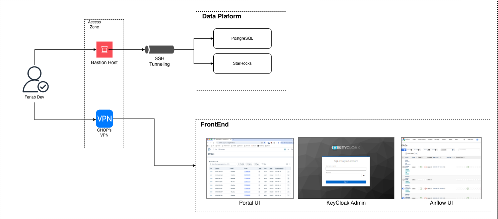

# How TO

## Current deployments

We currently have two deployments:

- CQDG QA (Ferlab managed)
- AWS (CHOP managed)

### CQDG QA (Ferlab managed)

Repositories:
- Apps deployment: https://github.com/Ferlab-Ste-Justine/cqdg-pre-prod-kubernetes-environments/blob/main/qa-etl/fluxcd/airflow.yml

**Parallelization using a Custom Airflow Operator**:

We use Kubernetes pod operators to parallelize certain operations. 

### AWS (CHOP managed)

Repositories:
- StarRocks module: https://github.com/radiant-network/terraform-aws-starrocks-s3
- StarRocks deployment: https://github.com/radiant-network/star-rocks
- Apps deployment: https://github.com/radiant-network/radiant-portal-deployment

**Parallelization using a Custom Airflow Operator**:

MWAA will deploy instances of a custom Radiant-Airflow operator as ECS tasks for certain operations that need to run in parallel.

(Similar to a Kubernetes Pod Operator)

#### Accessing applications on AWS

To access applications in the AWS environment, users have 2 main options:

- Using a VPN connection that allows connecting to the private network where the applications are deployed. 
- Using a Bastion host to create an SSH tunnel to access the applications.

Depending on the use case, one option may be more suitable than the other. 

For example, data exploration in StarRocks is done through tunneling a connection to the StarRocks FE node through the Bastion host, while Airflow UI is more easily accessed through the VPN connection.

