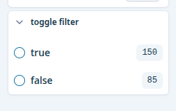

# boolean-facet

Single-select facet rendered as a `RadioGroup`. Used for `FilterTypes.BOOLEAN` aggregations.



## Config

```json
{
  key: 'toggle filter',
  translation_key: 'toggle filter',
  type: FilterTypes.BOOLEAN,
}
```

## Props

```typescript
type BooleanFacetProps = {
  field: AggregationConfig;
};
```
