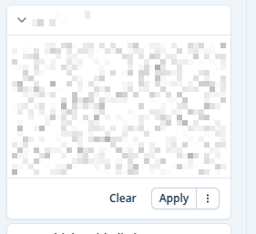

# facet-container

Factory component used by [facet-list](facet-list.md). Create the right facets based on `field.type`.

Three exports:
- `FacetContainer` - default, used by [facet-list](facet-list.md) (with accordion shell)
- `AccordionContainer` - accordion shell only, takes children
- `FacetComponent` - used by [query-pill-container](../pills/query-pill-container.md) for in-query edition

:::info`[search-facet` and [upload-id-facet](upload-id-facet.md) are directly are handled by [facet-list](facet-list.md).]

:::



## Props

```typescript
interface FacetContainerProps {
  field: AggregationConfig;
  isOpen: boolean;
  searchHandler?: (_e: React.MouseEvent<SVGElement, MouseEvent>) => void;
}
```

## Behavior

- Title comes from `common.filters.labels.<translation_key>` (fallback: `field.key`).
- If `common.filters.labels.<translation_key>_tooltip` exists, the title is wrapped with a tooltip.
- Accordion content is force-mounted for fields already opened once, so internal state is preserved on collapse/re-expand.
