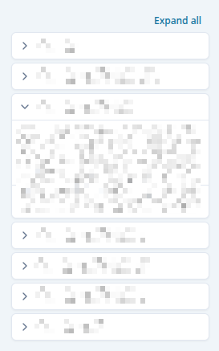

# facet-list

Sidebar panel that renders all the facets from `aggregations` config object
- [search-facet](search-facet.md) - `FilterTypes.SEARCH_BY`
- [upload-id-facet](upload-id-facet.md) - `FilterTypes.UPLOAD_LIST`
- [multiselect-facet](multiselect-facet.md) - `FilterTypes.MULTIPLE`
- [numerical-facet](numerical-facet.md) - `FilterTypes.NUMERICAL`
- [boolean-facet](boolean-facet.md) - `FilterTypes.BOOLEAN`

When `groupKey` is provided, only the matching group from `aggregations` is displayed. When `groupKey` is `null`/`undefined`, items from every group are flattened together.



## Props

```typescript
interface FacetListProps {
  groupKey?: string | null;
  aggregations: AggregationConfig;
}
```

- `groupKey`: key of the currently selected [sidebar-group](sidebar-group.md). `null` resets the expanded list.
- `aggregations`: full `AggregationConfig` coming from `application-config`. The component filters by `groupKey` itself.

