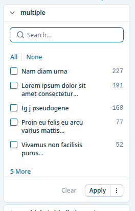
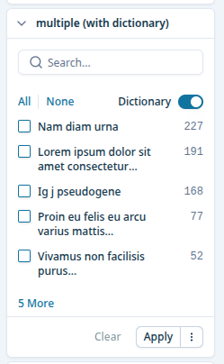

# multiselect-facet

Multi-select facet rendered as a list of checkboxes. Used for `FilterTypes.MULTIPLE` aggregations.

- Search input filters aggregates (matches `key` or translated `label`)
- Optional `withDictionary` switch — state persisted in `localStorage` via [facet-storage](libs/facet-storage.md)

# Config
## Default

```json
{
  key: 'multiple',
  translation_key: 'multiple',
  type: FilterTypes.MULTIPLE,
}
```



## withDictionary

```json
{
  key: 'multiple (with dictionary)',
  translation_key: 'multiple (with dictionary)',
  type: FilterTypes.MULTIPLE,
  withDictionary: true,
}
```


