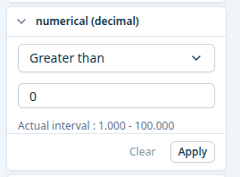
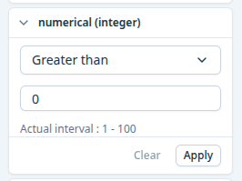

# numerical-facet

Numerical facet with operator. Used for `FilterTypes.NUMERICAL` aggregations.
- Operators: `GreaterThan`, `LessThan`, `Between`, `GreaterThanOrEqualTo`, `LessThanOrEqualTo`, `In`
- Min/max precedence: `config.min/max` → `statistics.min/max` from API
- Actual interval is displayed below the inputs when min/max are resolved

:::warning[`noDataInputOption` and `rangeTypes` (unit selector) exist in the config type but are not currently rendered by the component.]

:::

# Config
## Decimal

```json
{
  key: 'numerical (decimal)',
  translation_key: 'numerical (decimal)',
  type: FilterTypes.NUMERICAL,
  defaults: {
    min: 0,
    max: 100,
    defaultOperator: RangeOperators.LessThan,
    defaultMin: 0,
    defaultMax: 100,
  },
}
```



## Integer

```json
{
  key: 'numerical (integer)',
  translation_key: 'numerical (integer)',
  type: FilterTypes.NUMERICAL,
  defaults: {
    min: 0,
    max: 100,
    defaultOperator: RangeOperators.LessThan,
    defaultMin: 0,
    defaultMax: 100,
  },
}
```


