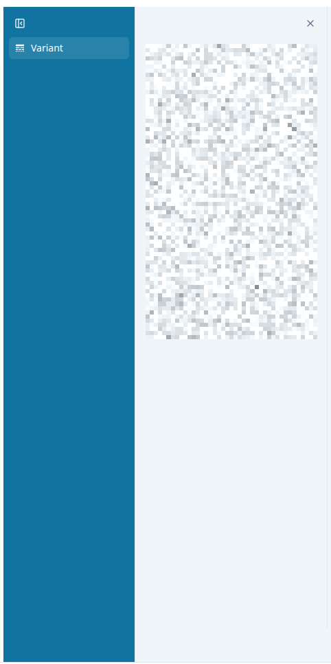

# sidebar-group

Sidebar (open/close)
Create `AggregationGroup` (variant, gene etc.)



## Props

```typescript
interface SidebarGroupsProps {
  onItemSelect?: (itemId: string | null) => void;
  selectedItemId?: string | null;
  aggregationGroups: AggregationConfig;
}
```
