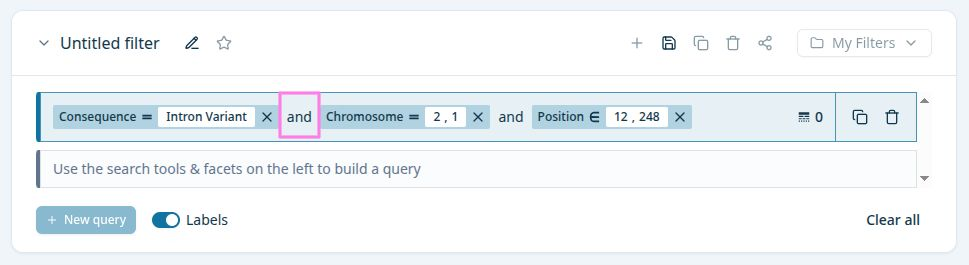

# combiner-operator

Manage `and` / `or` operator for a query. When toggled, all operators are updated with the new value.



## Props

```typescript
type CombineOperatorProps = {
  sqon: ISyntheticSqon;
};
```
