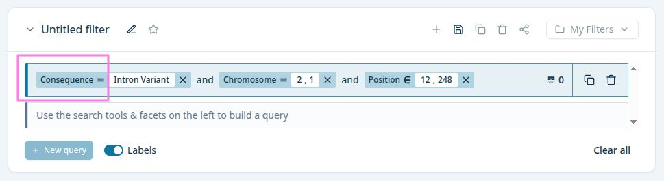
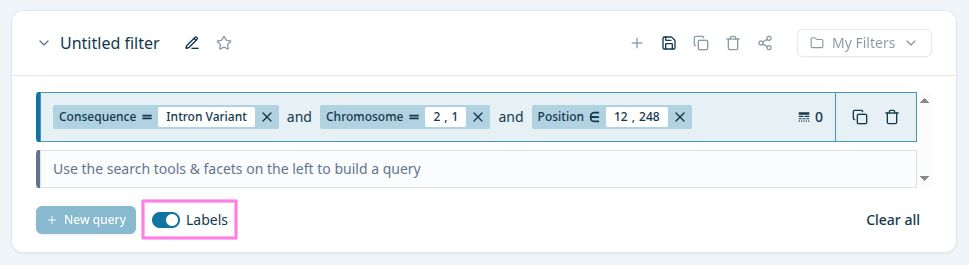
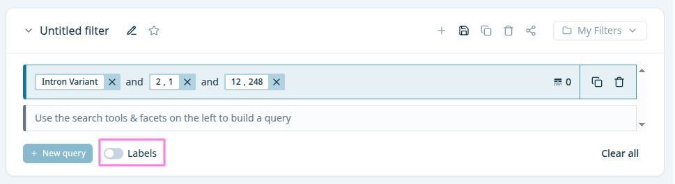

# label-operator

Label of a query-pill. 

- Use `translation_key` to display the correct label
- Use [operator](operator.md) to display the correct mathematical symbol
- Can be toggle on/off by the `Labels` switch

## Labels switch is toggled on/off

