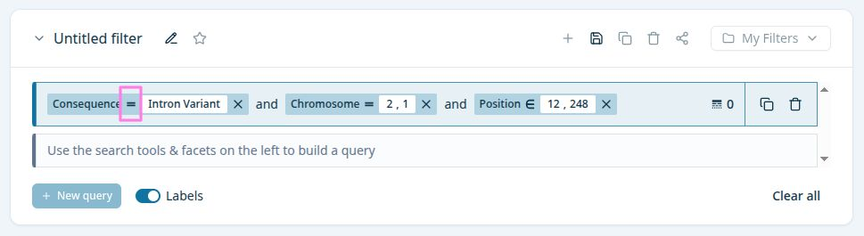

# operator

Factory that returns the icon matching a [SqonOpEnum](../type/SqonOpEnum.api.md) (`>`, `<`, `>=`, `<=`, `between`, `not-in`, fallback `=`).



## Props

```typescript
type OperatorQueryPillProps = {
  size?: number;
  type?: SqonOpEnum | (string & {});
  className?: string;
};
```
