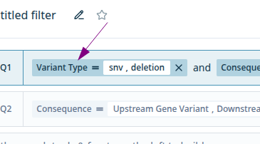

# query-pill-container

Visual wrapper for any query pill. Highlight when the parent query is selected and manage query pill deletions.



## Props

```typescript
type QueryPillContainerProps = React.HTMLAttributes<HTMLDivElement> & {
  onRemovePill: () => void;
};
```
