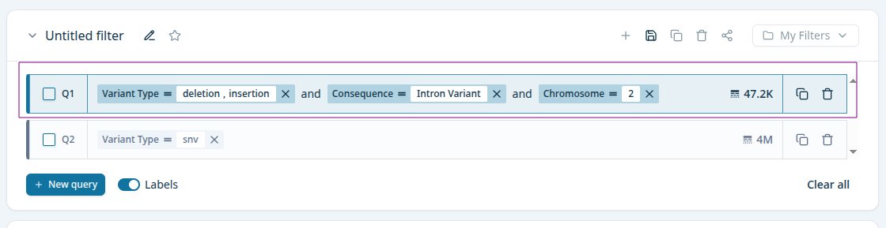

# query-bar

- Factory for [multiselect-query-pill](pills/multiselect-query-pill.md), [numerical-query-pill](pills/numerical-query-pill.md) and [boolean-query-pill](pills/boolean-query-pill.md)
- Active or inactive state, 
- Dispatch an action to update result of 
	- `Table`
	- [boolean-facet](facets/boolean-facet.md)
	- [numerical-facet](facets/numerical-facet.md)
	- [multiselect-facet](facets/multiselect-facet.md)
- Get total count from api
- Dispatch an action to copy a query
- Dispatch an action to delete a query
- Dispatch an action to selected a query

