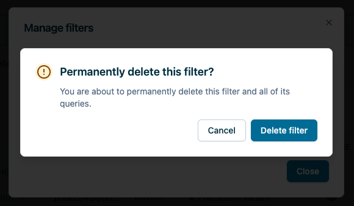

# filter-delete-modal

Confirmation alert opened by [query-builder-saved-filters](query-builder-saved-filters.md) (`DeleteFilterButton`) before deleting the selected saved filter. On confirm: `savedFiltersApi.deleteSavedFilter` then `DELETE` action on [use-saved-filters](use-saved-filters.md) and `REMOVE_ALL_QUERIES` on [use-query-builder](../hooks/use-query-builder.md).

