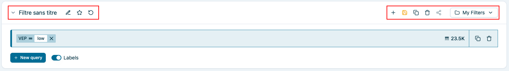
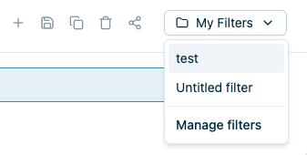

# query-builder-saved-filters

Left side :

- Filter name
- Filter name update / create filter
	- if on create save new filter name already exists click name edition => create filter
	- Existing filter => update name
- Discard unsaved changes
	- hide if no changes
	- if changes reload original selected filter

Right side :

- New filter 
	- No filter loaded => disabled
	- Filter loaded no change => create empty query bar
	- Filter loaded with changes => confirmation modal
- Save existing filter
	- No facet => disabled
	- Facet new filter => create filter
	- Facet existing filter with changes => yellow update filter
- Duplicate filter
	- No filter loaded => disabled
	- Filter loaded => copy QB content in a new QB without filter save
- Delete filter
	- No filter loaded => disabled
	- Filter loaded => confirmation modal
- Filter list / Manage list
	- List all existing filters
	- Manage filter action

TODO 
- favorite filter
- share filter