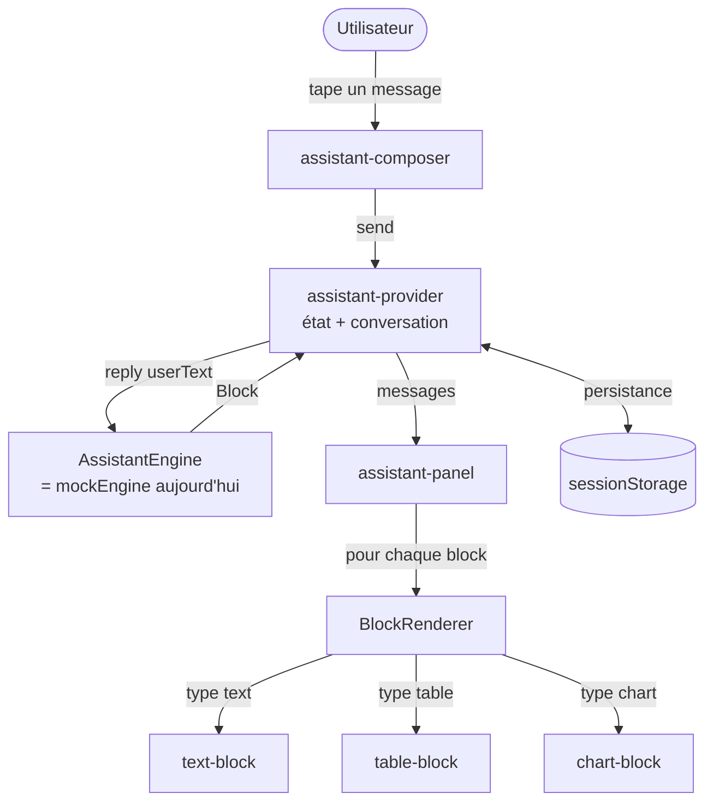
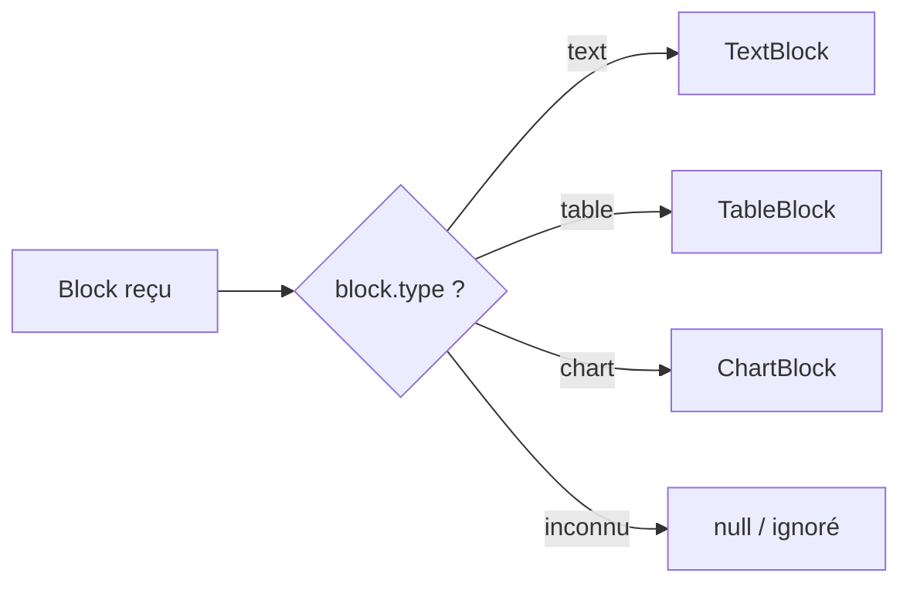
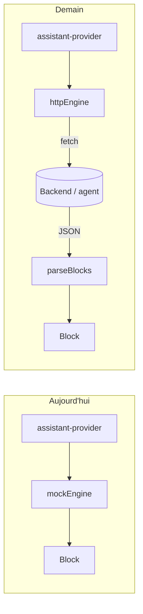

# Assistant — documentation technique (POC SJRA-1740)

> **Statut : preuve de concept (POC) _front-only_.** Toute la logique de réponse
> est **mockée** (aucun appel réseau, aucun LLM). Le backend et le vrai agent
> viendront plus tard : on ne connaît pas encore le format exact qu'il renverra.
> Ce document explique **comment le POC est construit** (section 1) et **comment
> brancher le vrai agent ou reconstruire le POC** (section 2).

---

## Section 1 — Architecture

### 1.1 L'idée générale : « generative UI »

Un assistant classique répond en **texte**. Ici, on veut mieux : selon la
question, l'assistant peut répondre par un **tableau** (liste de variants), un
**graphique** (répartition par classification ACMG), ou du **texte** — voire une
combinaison des trois dans une même réponse.

Pour ça, l'assistant ne renvoie pas une chaîne de caractères, mais une **liste de
« blocks » typés**. Chaque block porte un `type` (`text`, `table`, `chart`) et les
données nécessaires à son affichage. L'UI lit cette liste et, pour chaque block,
choisit le bon composant à afficher. C'est ce qu'on appelle la *generative UI* :
c'est la **réponse elle-même** qui décrit l'interface à générer.

### 1.2 Les pistes suivies & décisions clés

| Décision | Pourquoi |
|---|---|
| **Blocks typés** plutôt que markdown brut | Un tableau ou un graphique interactif ne se rend pas bien en markdown. Des types explicites permettent d'utiliser nos vrais composants (shadcn Table, charts) et de garder l'affichage sous contrôle. |
| **Union discriminée** (`type: 'text' \| 'table' \| 'chart'`) | Le compilateur TypeScript garantit qu'on gère tous les cas dans le `BlockRenderer`, et on ajoute un type sans casser les autres. |
| **Un _seam_ `AssistantEngine`** entre l'UI et le « cerveau » | L'UI ne parle jamais directement à un modèle. Elle parle à une interface. Aujourd'hui l'implémentation est un mock ; demain ce sera un `HttpEngine` — **sans toucher à l'UI**. |
| **Couche d'adaptation `wire.ts`** (voir §1.6) | Le back ne renverra pas nos `Block` directement : il renverra du JSON. On isole la traduction JSON → `Block` en un seul endroit. |

### 1.3 Vue d'ensemble du flux



Point important : **le sens des dépendances**. L'UI dépend de l'`AssistantEngine`
(une interface), pas d'une implémentation concrète. C'est ce qui rend le mock
remplaçable par un vrai back sans rien changer en aval.

### 1.4 Les pièces, une par une

| Fichier | Rôle |
|---|---|
| `src/types.ts` | Le modèle de données : `Block` (union `text`/`table`/`chart`) et `Message`. Le cœur du contrat interne. |
| `src/assistant-provider.tsx` | L'état global (React Context) : panneau ouvert/fermé, conversation, `send()`, indicateur « en train de répondre », `reset()`. Appelle l'engine. Persiste dans `sessionStorage`. |
| `src/engine/engine.ts` | L'interface `AssistantEngine` — le _seam_. Ne présume rien de la source de la réponse. |
| `src/engine/mock-engine.ts` | L'implémentation actuelle : reconnaît quelques intentions autour du cas démo 1024 et renvoie les blocks correspondants. Simule une latence. |
| `src/engine/mocks/case-1024.ts` | Les données mockées (résumé patient, table de variants, données du graphique). |
| `src/engine/wire.ts` | **Code dormant** (pas encore importé) : le contrat de _format d'échange_ (schémas Zod) et la factory `parseBlocks()`. Voir §1.6 et §2. |
| `src/blocks/block-renderer.tsx` | Le « routeur » : `switch` sur `block.type` → le bon composant. |
| `src/blocks/text-block.tsx`, `table-block.tsx`, `chart-block.tsx` | Le rendu concret de chaque type de block. |
| `src/assistant-panel.tsx` | Le panneau latéral (Sheet) : en-tête, conversation scrollable, indicateur de saisie, composer. |
| `src/assistant-composer.tsx` | La zone de saisie (Entrée = envoyer, Maj+Entrée = nouvelle ligne). |
| `src/typing-dots.tsx` | L'indicateur « … » pendant que l'assistant répond. |

### 1.5 Le modèle de données

Tout tourne autour de deux types (`src/types.ts`) :

- **`Message`** = `{ id, role: 'user' | 'assistant', blocks: Block[] }`. Un message
  (utilisateur ou assistant) est **toujours** une liste de blocks. Un message
  utilisateur est simplement un seul block `text`.
- **`Block`** = l'un des types différenciés par le champ `type` (_discriminated union_) `TextBlock | TableBlock | ChartBlock`.

Le `BlockRenderer` exploite le champ discriminant `type` :



Ajouter un type de block = ajouter une branche à ce `switch` (voir §2.4). Le reste
de l'UI reste intact.

### 1.6 Le _seam_ et le format d'échange

L'interface `AssistantEngine` n'a qu'une méthode :

```ts
reply(userText: string): Promise<Block[]>
```

Aujourd'hui, `mockEngine` **fabrique** directement des `Block[]`. Demain, le back
renverra du **JSON** dans un format à lui (le _format d'échange_, « wire format »).
Ce JSON n'est **pas** un `Block[]` : il faut le **traduire**.

C'est le rôle de `src/engine/wire.ts` :

- il décrit le contrat attendu avec des **schémas Zod** (validation à l'exécution) ;
- `parseBlocks(json)` **valide** le JSON et le **mappe** vers nos `Block` internes ;
- une réponse malformée ne casse jamais le chat (bloc invalide ignoré, enveloppe
  invalide → bloc texte de repli).

> **Terminologie.** « format d'échange » (= _wire format_) = la donnée **telle que
> le back l'envoie** (brute, pas encore de confiance). « modèle de domaine » = nos
> types `Block` internes, propres, que l'UI connaît. `parseBlocks` est le traducteur
> entre les deux, et la seule frontière où le format du back a le droit d'exister.

---

## Section 2 — Guide d'intégration

Cette section décrit **comment passer du mock au vrai agent**, et comment
reconstruire le POC au besoin.

### 2.1 Brancher le vrai backend

Une seule pièce est à écrire : une implémentation `HttpEngine` de
`AssistantEngine`. L'UI n'a **pas** à changer.

```ts
// src/engine/http-engine.ts (à créer le jour venu)
import { type AssistantEngine } from './engine';
import { parseBlocks } from './wire';

export const httpEngine: AssistantEngine = {
  async reply(userText) {
    const res = await fetch('/api/assistant/reply', {
      method: 'POST',
      headers: { 'Content-Type': 'application/json' },
      body: JSON.stringify({ message: userText }),
    });
    const json = await res.json();
    return parseBlocks(json); // JSON brut → Block[] sûrs
  },
};
```

Puis, dans `assistant-provider.tsx`, remplacer l'import :

```diff
- import { mockEngine } from './engine/mock-engine';
+ import { httpEngine } from './engine/http-engine';
```

…et utiliser `httpEngine.reply(...)` à la place de `mockEngine.reply(...)`. C'est
tout. Le mock peut rester dans le repo (utile pour les tests et Storybook).



### 2.2 Le contrat à discuter avec l'équipe back

Le fichier `wire.ts` **est** le contrat : les schémas Zod y décrivent exactement le
JSON attendu pour le moment (à faire évoluer).

Idée sur **comment** le back peut produire ce JSON :

- **Utiliser le _structured output_ / _tool-calling_** du LLM : on impose un
  **JSON Schema** (équivalent aux schémas de `wire.ts`) et l'API garantit une
  sortie conforme.
- **Double validation** : le back valide avant d'envoyer, **et** le front revalide
  à la réception via `parseBlocks` (on ne fait jamais confiance au réseau).

Point à réfléchir avec le back : **qui décide de la visualisation ?** Est-ce le back
qui dit « affiche un chart barres » (`wire.ts` reste mince), ou le back envoie de la
donnée sémantique et c'est le front qui choisit l'affichage (`wire.ts` s'épaissit) ?

### 2.3 Comment mapper les blocks (`parseBlocks`)

Le mapping vit **entièrement** dans `wire.ts` :

1. `parseBlocks(json)` parse l'**enveloppe** (`{ blocks: [...] }`).
2. Chaque élément est validé individuellement par `wireBlock.safeParse` (union
   discriminée sur `type`).
3. `toBlock(wire)` convertit un block validé vers notre `Block` interne — mapping
   **explicite champ par champ**.
4. Dégradation gracieuse : block invalide ou type inconnu → **ignoré** ; enveloppe
   invalide → un bloc texte de repli.

**Si le format du back diverge du nôtre** (noms de champs différents, structure
imbriquée…), c'est **ici et seulement ici** qu'on adapte : on ajuste les schémas
`wire*` et la fonction `toBlock`. L'UI ne bouge pas.

### 2.4 Ajouter un nouveau type de block

Exemple : ajouter un block `image`. Cinq étapes, toujours dans le même ordre :

1. **`src/types.ts`** — déclarer le type et l'ajouter à l'union `Block` :
   ```ts
   export type ImageBlock = { type: 'image'; url: string; alt?: string };
   export type Block = TextBlock | TableBlock | ChartBlock | ImageBlock;
   ```
2. **`src/blocks/image-block.tsx`** — créer le composant de rendu.
3. **`src/blocks/block-renderer.tsx`** — ajouter la branche `case 'image':`.
4. **`src/engine/wire.ts`** — ajouter le schéma `wireImageBlock`, l'inclure dans le
   `discriminatedUnion`, et gérer le `case 'image'` dans `toBlock`.
5. **`src/engine/mock-engine.ts`** — (optionnel) renvoyer un block `image` pour une
   intention, afin de tester sans back ou pour le Storybook.

### 2.5 Reconstruire le POC de zéro

Si le code était perdu, ordre de reconstruction (chaque étape s'appuie sur la
précédente) :

1. **`types.ts`** — `Block` et `Message`. Le socle.
2. **`engine/engine.ts`** — l'interface `AssistantEngine` + le helper `wait`.
3. **`engine/mocks/case-1024.ts`** — les données de démo (résumé patient, table de
   variants, données de chart).
4. **`engine/mock-engine.ts`** — l'implémentation mock (reconnaissance d'intentions
   → blocks).
5. **`blocks/text-block.tsx`, `table-block.tsx`, `chart-block.tsx`** — le rendu de
   chaque type (shadcn Table pour la table, charts pour le graphique).
6. **`blocks/block-renderer.tsx`** — le `switch` sur `type`.
7. **`assistant-provider.tsx`** — Context : état, `send()` (appelle l'engine),
   persistance `sessionStorage`, `reset()`.
8. **`assistant-composer.tsx`** — la zone de saisie.
9. **`typing-dots.tsx`** — l'indicateur de réponse.
10. **`assistant-panel.tsx`** — le Sheet qui assemble tout.
11. **`App.tsx` / `main.tsx`** — le point d'entrée qui monte le provider + panel.
12. **`engine/wire.ts`** — le contrat de format d'échange + `parseBlocks` (pour la
    future intégration back).

### 2.6 Limites connues / TODO

- **Pas de streaming.** `reply()` renvoie la réponse d'un coup
  (`Promise<Block[]>`). Si le back stream les événements de _tool-calling_, le seam
  devra évoluer (ex. `AsyncIterable<Block>`), et l'indicateur « … » du panel pourra
  afficher des étapes détaillées (« Recherche des variants… »).
- **Mock scripté.** `mockEngine` ne reconnaît que quelques intentions autour du cas
  1024 (mots-clés). Ce n'est pas de la vraie compréhension.
- **Valeurs de table en `string`.** `TableBlock.rows` suppose des valeurs texte. Si
  le back renvoie des nombres bruts, adapter dans `toBlock`.
- **`wire.ts` est dormant.** Écrit pour figer le contrat et guider l'intégration ;
  pas encore importé tant qu'aucun `HttpEngine` n'existe.
- **Persistance simple.** La conversation vit en `sessionStorage` (survit à un
  refresh, effacée au logout via `reset()`), sans historique multi-conversations.
