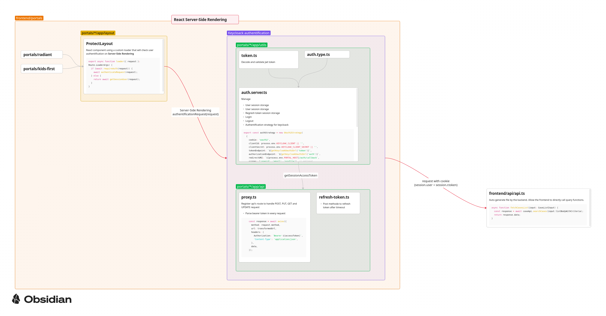

# Authentification

## Code architecture



## Proxy API

### The proxy API is to be used by apps

##### Adding a GET request endpoint

```typescript
/**
 * loader func handles GET requests
 */
export async function loader({ request }: Route.LoaderArgs) {
  return new Response(JSON.stringify({ success: true }), {
    status: 200,
    headers: {
      "Content-Type": "application/json",
    },
  });
}
```

##### Adding a PUT, PATCH, POST or DELETE endpoint

```typescript
/**
 * action func handles everything else
 */
export function action({ request }: Route.ActionArgs) {
  switch (request.method) {
    case "PUT":
      return Response.json({
        message: "PUT",
      });
    case "PATCH":
      return Response.json({
        message: "PATCH",
      });
    case "POST":
      return Response.json({
        message: "POST",
      });
    case "DELETE":
      return Response.json({
        message: "DELETE",
      });
  }
}
```

#### Making the endpoint avaiable

In order to make the endpoint available, you need to add it to the `routes.ts` file in the prefix api route list `prefix("api", [...])`

see: `/frontend/portals/radiant/app/routes.ts`
