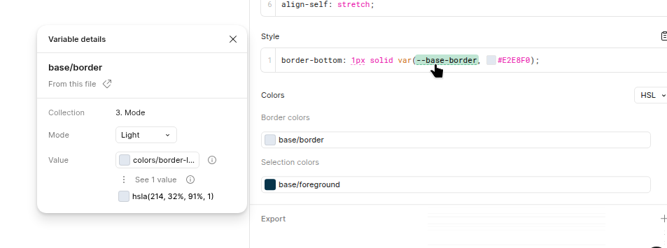

# Theme
## Figma
### Ready for development workflow
Figma has a [ready for development](https://www.figma.com/design/Y0l9SoMCYlTQZxce3NzZiK/shadcn_ui-kit-for-Figma---Pro-Blocks---New-York---January-2025?node-id=580-9181&p=f&ready-for-dev=1&m=dev) section (left side) where all the `Ready for dev` components are displayed. 

`Ready for dev` state means that the component can be added to Radiant.

When a new component is added to `Ready for dev`:
- The UI kit uses a basic component that has never been used => Use [shadcn cli](./shadcn.md) to create the component.
- The component is custom to our needs and will be used across multiple pages => Create a new components inside `components/base`
- The UI kit is a composition of multiples components and will be used across project => Create a new components inside `components/feature`
- The UI kit is a new page => Create a [Page Application](./create-an-application.md)
- The UI kit uses a unique feature specific to a Page Application => Create a new components inside `apps/%page_applications%/components/feature`. See [Create Application documentation](./create-an-application.md)

When the component has been coded
- Create a new entry in storybook to display the new component
- Wait for the storybook build to success
- Go to [Radiant's storybook](https://radiant-network.github.io/radiant-portal/) to see if your component is visible
- Go to Figma and use the button `Mark as completed`
- Change your Jira task to QA
- Inside the Jira, tag the UI/UX designer to validate the final result (you can also send a slack message just to be sure). 

### Figma's variables vs tailwind

All Figma variables should match tailwind spacing. If a variable's name is `--spacing-2` it matches `-2` suffix in tailwind.

e.g.
Figma
```css
display: flex;
align-items: center;
gap: var(--spacing-2, 8px);
``` 

Tailwind
```typescript
<div className="flex items-center gap-2">
```


## Shadcn/Tailwind stacks

With our multi portals and multi page application workflows, 3 styles sheet are loaded into the page.

1. `frontdend/themes/commons/css`
2. `frontend/themes/%portal%/main.css` where `%portal%` can be radiant, kid-first etc.
3. `frontend/themes/%portal%/apps/%page-application%/src/App.module.css` where `%page-application%` can be variant-entity, case-exploration etc.


### Adding a new css variables

1. Set Figma to display the HSL value of the color. You can double click on the variable name (in the style box) to display to display a popup with the HSL value.

2. Copy both **light** and **dark** value.
3. Add the new HSL values to `frontend/themes/common.css`. 
```css
:root {
  --base-border: 214, 32%, 91%;
}
.dark {
  --base-border: 217, 33%, 17%;
}
```

4. Use `frontend/themes/tailwind.base.config.js` to setup the new variable. It will create a `border-border` class.

```javascript
...
      borderColor: ({ theme }) => ({
        ...theme('colors'),
        DEFAULT: theme('colors.border'),
        border: 'hsl(var(--base-border))', 
      }),
...
```

5. You can now use the new css class for tailwind
```typescript
<div className="border-border"/>
```


#### How to override a global class
Since our project use multiple styles, the best way to override a native tailwind behavior, we needs to override directly in `portals/%portal%/app/app.css` where %portals% can be radiant, kids-first etc.

```css
/* portals/radiant/app/app.css */
@import 'tailwindcss';
@config "../tailwind.config.js";
/* Will override border-color with our custom border-border class */
@layer base {
  *,
  ::after,
  ::before,
  ::backdrop,
  ::file-selector-button {
    @apply border-border;
  }
}
```

