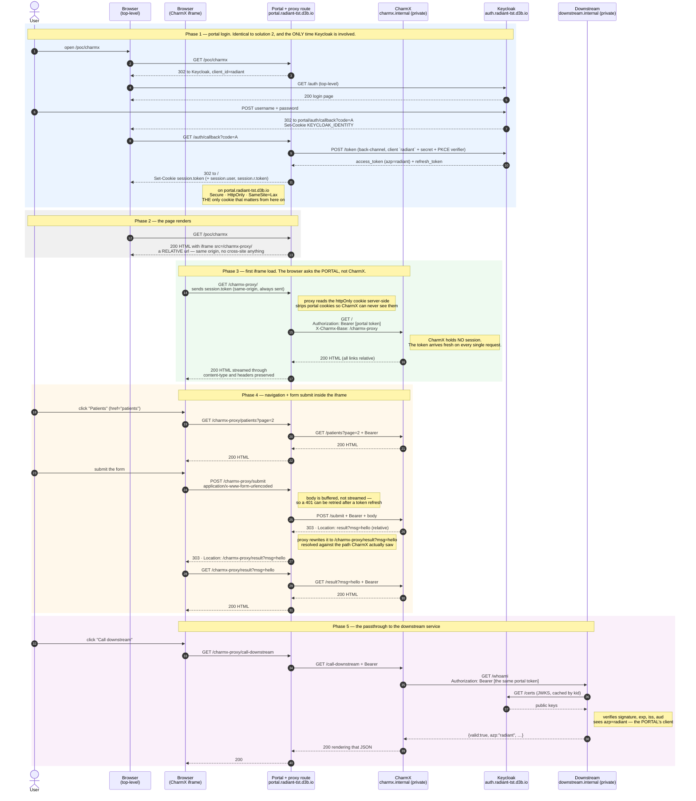
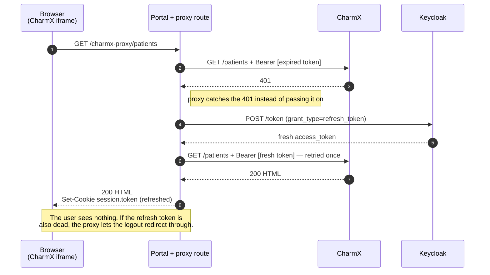

# Solution 1 — server proxy: full sequence

Same hypothetical deployment as [SOLUTION-2-FLOW.md](SOLUTION-2-FLOW.md), with one big difference:

| Role       | Host                                                             |
| ---------- | ---------------------------------------------------------------- |
| Portal     | `https://portal.radiant-tst.d3b.io`                              |
| Keycloak   | `https://auth.radiant-tst.d3b.io`                                |
| CharmX     | `http://charmx.internal:8091` — **never reached by the browser** |
| Downstream | `http://downstream.internal:8092` — likewise                     |

The browser only ever talks to the portal and to Keycloak. CharmX is reached exclusively
server-to-server, so it does not need a public hostname, a TLS certificate, a Keycloak client, or a
DNS entry your users can resolve. Everything the browser sees lives at
`https://portal.radiant-tst.d3b.io/charmx-proxy/*` — the portal's own origin.

That single fact removes every cookie problem in solution 2: there is no cross-site request anywhere,
so `SameSite`, third-party blocking and CHIPS never enter the picture.

## Sequence

## Token expiry inside the iframe

Access tokens live 5 minutes (`accessTokenLifespan` in our realm). A user leaving the tab open will
outlive one. Iframe navigations do **not** go through the client-side axios 401 interceptor in
`frontend/utils/axios.ts` — that only wraps XHR from the portal's own React code — so the proxy has
to handle it:

**Caveat in this POC:** CharmX does not validate the bearer token in proxy mode — it only decodes it
for display — so it never actually answers 401 on an expired token. The expiry surfaces one hop
later, at the downstream service, which does verify `exp`. The refresh-and-retry above is therefore
implemented and correct but dormant here. A real CharmX that validates its input would trigger it.

## Security note: CharmX must not be publicly reachable

In proxy mode CharmX trusts the `Authorization` header it is handed. In this POC it does not verify
the signature — the downstream does that. So if CharmX were exposed on the public internet, anyone
could call it directly with a forged or borrowed token.

Two acceptable postures, pick one:

1. **Keep CharmX private** (the diagram above). Only the portal can reach it. Simplest, and the
   reason this deployment needs no public CharmX hostname at all.
2. **Have CharmX verify the JWT itself** against Keycloak's JWKS — the same check
   `src/downstream/server.ts` already implements. Required if CharmX is reachable by anything other
   than the portal.

Doing neither is the failure mode to avoid.

## Cookies involved

| Cookie                                               | Set by   | Domain           | Sent to                                                                               |
| ---------------------------------------------------- | -------- | ---------------- | ------------------------------------------------------------------------------------- |
| `KEYCLOAK_IDENTITY` / `KEYCLOAK_SESSION`             | Keycloak | `auth.…d3b.io`   | Keycloak only, during Phase 1                                                         |
| `session.user` / `session.token` / `session.r.token` | Portal   | `portal.…d3b.io` | The portal — including every `/charmx-proxy/*` request, because it is the same origin |

That is the whole list. **CharmX gets no cookie and needs none**, and nothing in this flow is ever a
third-party cookie. Compare with solution 2, which depends on four cookies across three origins.

One wrinkle: if CharmX itself sets a cookie, the proxy passes the `Set-Cookie` through and it lands
on `portal.radiant-tst.d3b.io` scoped to `/charmx-proxy`. A name collision with a portal cookie would
be silent, so namespace CharmX's cookies if it uses any. The proxy already strips the portal's own
session cookies on the way out, so CharmX can never read or replay them.

## One token, one client

|                 | Portal + CharmX + downstream            |
| --------------- | --------------------------------------- |
| Keycloak client | `radiant`                               |
| `azp`           | `radiant`                               |
| `aud`           | `radiant`, `account`                    |
| Obtained at     | Phase 1, when the user typed a password |

There is only ever one token. CharmX has no Keycloak identity of its own — it acts entirely on the
portal's. That is the main functional trade against solution 2: the downstream cannot distinguish
"the portal called me" from "CharmX called me", so it cannot authorize them differently. If you need
CharmX to have distinct permissions, either add a token-exchange step or use solution 2.

## What each host must be configured with

- **Portal** — `CHARMX_HOST=http://charmx.internal:8091` (server-side only, never sent to the
  browser). No `CHARMX_PUBLIC_URL` is needed for this solution.
- **CharmX** — must emit **relative** URLs. The proxy rewrites `Location` headers but never rewrites
  HTML bodies, so an absolute `href="/patients"` escapes the mount and 404s on the portal. No
  Keycloak client, no redirect URIs, no `frame-ancestors` needed.
- **Keycloak** — nothing at all. No second client, no extra redirect URIs.

## Still open in this shape

- **Uploads.** Request bodies are buffered so a 401 can be retried. Fine for HTML and forms, wrong
  for large file uploads — those would need a streaming variant that forfeits the retry.
- **WebSockets / SSE** are not proxied.
- **Latency and bandwidth.** Every byte CharmX serves transits the portal's Node process.
