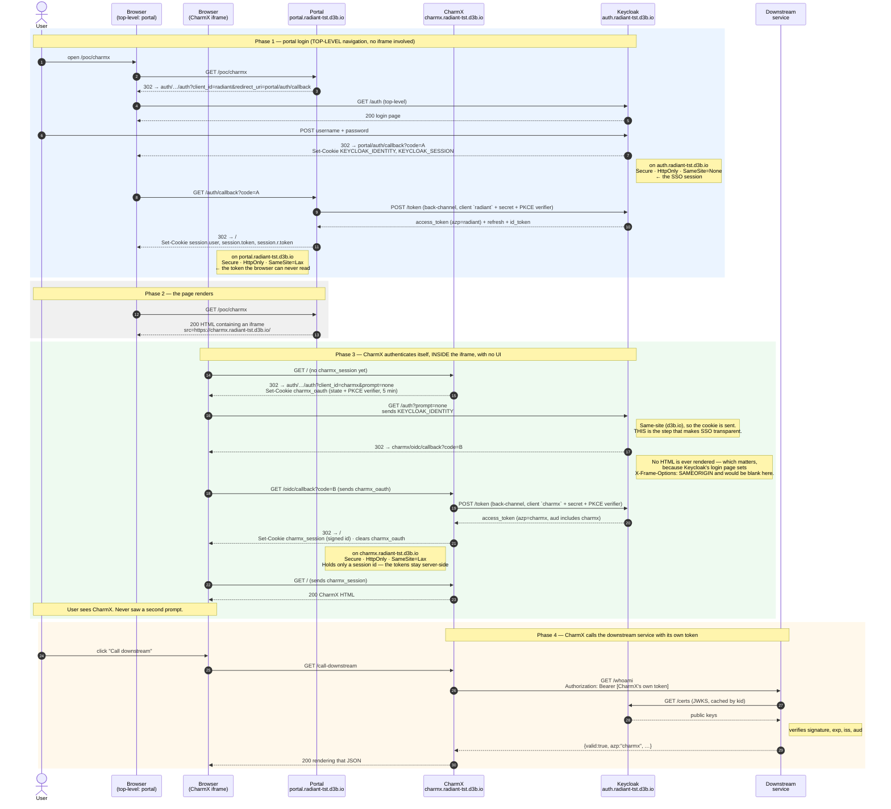
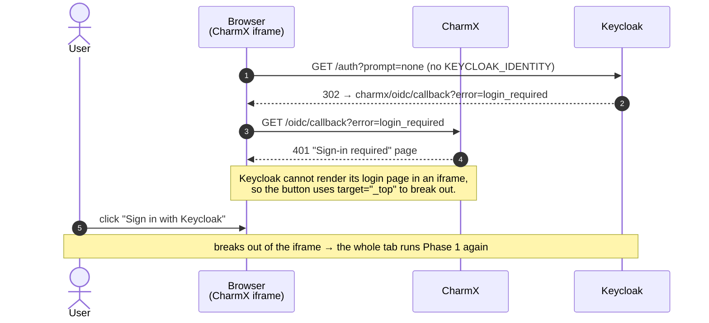

# Solution 2 — direct iframe + silent SSO: full sequence

Hypothetical deployment, all three hosts under the same registrable domain (`d3b.io`):

| Role     | Host                                |
| -------- | ----------------------------------- |
| Portal   | `https://portal.radiant-tst.d3b.io` |
| CharmX   | `https://charmx.radiant-tst.d3b.io` |
| Keycloak | `https://auth.radiant-tst.d3b.io`   |

Because all three share the eTLD+1 `d3b.io`, every cookie below is **same-site**. Nothing is a
third-party cookie, so no `SameSite=None` and no CHIPS are required — plain `Lax` works and no
browser blocks anything. This is the deployment shape to aim for.

## Sequence

## The one branch that is not transparent

Step 3 assumes the browser already has a Keycloak SSO session. If it does not — a private window, or
the SSO session expired — `prompt=none` cannot show a login form, so Keycloak returns an error
instead:

In the portal this branch is rare: you only reach `/poc/charmx` after the portal itself logged you
in, which is what created the Keycloak session in the first place. It shows up mainly when CharmX is
opened directly, or after the SSO session (`ssoSessionIdleTimeout`, 30 min in our realm) lapses while
the portal page stays open.

## Cookies involved, and who owns them

| Cookie                                               | Set by   | Domain           | Flags                                   | Read at                                                           |
| ---------------------------------------------------- | -------- | ---------------- | --------------------------------------- | ----------------------------------------------------------------- |
| `KEYCLOAK_IDENTITY` / `KEYCLOAK_SESSION`             | Keycloak | `auth.…d3b.io`   | `Secure; HttpOnly; SameSite=None`       | Phase 3 step 3 — the SSO session that makes `prompt=none` succeed |
| `session.user` / `session.token` / `session.r.token` | Portal   | `portal.…d3b.io` | `Secure; HttpOnly; SameSite=Lax`        | Portal requests only. **Not** used by solution 2 at all           |
| `charmx_oauth`                                       | CharmX   | `charmx.…d3b.io` | `Secure; HttpOnly; SameSite=Lax`, 5 min | The callback, to validate `state` and hold the PKCE verifier      |
| `charmx_session`                                     | CharmX   | `charmx.…d3b.io` | `Secure; HttpOnly; SameSite=Lax`        | Every CharmX request afterwards                                   |

Note the portal's session cookies play **no part** in solution 2 — CharmX never sees the portal's
token. That is the structural difference from solution 1, where the portal's token _is_ the only
token and CharmX has no Keycloak identity of its own.

## Two tokens, two clients

|                 | Portal                          | CharmX                          |
| --------------- | ------------------------------- | ------------------------------- |
| Keycloak client | `radiant`                       | `charmx`                        |
| `azp`           | `radiant`                       | `charmx`                        |
| `aud`           | `radiant`, `account`            | `charmx`, `radiant`, `account`  |
| Obtained at     | Phase 1 (user typed a password) | Phase 3 (silent, `prompt=none`) |

Same user, same `sub` — two independently issued tokens. The downstream service can therefore
authorize CharmX as a first-class client instead of having it impersonate the portal.

## What each host must be configured with

- **Keycloak** — the `charmx` client needs `redirectUris: ["https://charmx.radiant-tst.d3b.io/*"]`
  and `webOrigins: ["https://charmx.radiant-tst.d3b.io"]`. Our local definition in
  `backend/scripts/init-keycloak/cqdg.json` hardcodes `localhost:8091`; that has to change per
  environment. Leave the realm's `browserSecurityHeaders` alone — relaxing `frame-ancestors` so the
  login page renders in-frame would be a clickjacking regression.
- **CharmX** — must send `Content-Security-Policy: frame-ancestors https://portal.radiant-tst.d3b.io`
  or the browser refuses to frame it. Set `PORTAL_ORIGIN` accordingly.
- **Portal** — `CHARMX_PUBLIC_URL=https://charmx.radiant-tst.d3b.io` for the iframe `src`.
- **HTTPS everywhere.** Keycloak's SSO cookies are `Secure`, and `localhost` is the browser's only
  exemption from that rule.

## Still open in this shape

- **Logout is not coordinated.** Signing out of the portal ends the portal's session and the Keycloak
  SSO session, but CharmX's own `charmx_session` survives until it expires. Closing that needs
  Keycloak back-channel logout registered on the `charmx` client.
- **CharmX's session store is in-memory** in this POC, so it does not survive a restart and will not
  work across replicas. Redis or an encrypted split cookie for anything real.
